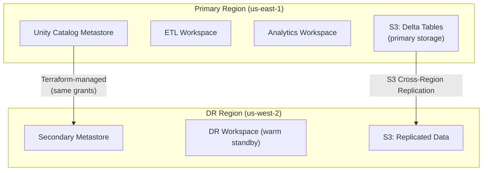

# Lakehouse Architecture — Senior-Level Deep Dive

## Enterprise Lakehouse Design

### Multi-Region Architecture



The primary region handles all workloads while S3 CRR keeps the DR region synchronized. On failover, the secondary workspace activates with the replicated data.

---

## Cost Optimization Architecture

```python
# Enterprise lakehouse cost model
class LakehouseCostModel:
    """Model and optimize lakehouse costs by workload tier."""
    
    def calculate_monthly_cost(self, config: dict) -> dict:
        storage_cost = config["data_tb"] * 23  # $23/TB/month (S3 Standard)
        
        # Compute: different tiers for different workloads
        etl_cost = (
            config["etl_dbus_per_hour"] * 
            config["etl_hours_per_day"] * 30 * 
            0.15  # Jobs compute DBU rate
        )
        
        analytics_cost = (
            config["sql_warehouse_size"] *  # DBUs
            config["sql_hours_per_day"] * 30 *
            0.22  # SQL compute DBU rate
        )
        
        ml_cost = (
            config["ml_gpu_hours_per_day"] * 30 *
            3.50  # GPU instance + DBU
        )
        
        return {
            "storage": storage_cost,
            "etl_compute": etl_cost,
            "analytics_compute": analytics_cost,
            "ml_compute": ml_cost,
            "total": storage_cost + etl_cost + analytics_cost + ml_cost,
        }

# Example: mid-size company
cost = LakehouseCostModel().calculate_monthly_cost({
    "data_tb": 50,              # 50 TB total data
    "etl_dbus_per_hour": 20,    # 20 DBU/hr for ETL clusters
    "etl_hours_per_day": 6,     # ETL runs 6 hours/day
    "sql_warehouse_size": 8,    # Medium SQL warehouse
    "sql_hours_per_day": 10,    # BI queries 10 hours/day
    "ml_gpu_hours_per_day": 4,  # ML training 4 hours/day
})
# storage: $1,150, etl: $540, analytics: $528, ml: $420
# Total: ~$2,638/month

# OPTIMIZATION LEVERS:
optimization_strategies = {
    "storage": [
        "Archive old data to S3 Glacier ($4/TB vs $23/TB)",
        "VACUUM to remove old Delta versions",
        "Partition pruning to avoid reading unused data",
    ],
    "etl_compute": [
        "Use Jobs compute (not all-purpose): 60% cheaper",
        "Spot/preemptible instances: 60-70% savings",
        "Right-size clusters (most are over-provisioned)",
        "Schedule during off-peak (avoid contention)",
    ],
    "analytics_compute": [
        "Serverless SQL (auto-scales, pay-per-query)",
        "Auto-stop SQL warehouse (idle timeout = 10 min)",
        "Materialized views for repeated queries",
        "Result caching (avoid re-computation)",
    ],
    "ml_compute": [
        "Spot instances for training (checkpointed, resumable)",
        "GPU sharing (multiple experiments per GPU)",
        "Feature store (avoid recomputing features)",
    ],
}
```

---

## Data Mesh on the Lakehouse

```sql
-- Domain-oriented ownership with cross-domain consumption

-- Each domain owns a catalog:
-- domain_sales (owned by sales data team)
-- domain_marketing (owned by marketing data team)
-- domain_finance (owned by finance data team)

-- Each domain has full medallion internally:
CREATE SCHEMA domain_sales.bronze;   -- Raw ingestion
CREATE SCHEMA domain_sales.silver;   -- Business entities
CREATE SCHEMA domain_sales.gold;     -- Domain-specific aggregates

-- Cross-domain data products published to shared catalog:
CREATE CATALOG data_products;
CREATE SCHEMA data_products.sales;

-- Sales team publishes "order metrics" as a data product:
CREATE TABLE data_products.sales.daily_order_metrics AS
SELECT order_date, region, COUNT(*) as orders, SUM(amount) as revenue
FROM domain_sales.gold.order_summary
GROUP BY order_date, region;

-- Data product contract (SLA, schema, freshness):
COMMENT ON TABLE data_products.sales.daily_order_metrics IS 
'Data Product: Daily Order Metrics. SLA: updated by 6 AM UTC. Owner: sales-data-team@company.com';

-- Other domains consume data products (read-only):
GRANT SELECT ON SCHEMA data_products.sales TO `marketing-analytics-team`;
GRANT SELECT ON SCHEMA data_products.sales TO `finance-team`;

-- Lineage tracks: domain_sales.bronze → domain_sales.silver → domain_sales.gold → data_products.sales
```

---

## Lakehouse vs Modern Data Stack

| Aspect | Lakehouse (Databricks) | Modern Data Stack (Snowflake + dbt + Fivetran) |
|--------|----------------------|----------------------------------------------|
| Storage cost | $23/TB/month (S3) | $40/TB/month (Snowflake compressed) |
| Compute model | DBU-based (cluster time) | Credit-based (warehouse time) |
| ML support | Native (MLflow, Feature Store) | External (export to Sagemaker) |
| Streaming | Native (Structured Streaming) | Limited (Snowpipe, Dynamic Tables) |
| Open format | Yes (Delta Lake, open source) | Proprietary (FDN) |
| Governance | Unity Catalog | Snowflake Access Control |
| Vendor lock-in | Lower (open formats, portable) | Higher (proprietary format) |
| BI performance | Good (Photon, SQL Warehouse) | Excellent (purpose-built for SQL) |
| Best for | ML-heavy, streaming, complex ETL | SQL-centric analytics, simplicity |

---

## Incremental Processing Patterns

### Change Data Feed (CDF)

```sql
-- Enable Change Data Feed on silver table
ALTER TABLE production.silver.orders SET TBLPROPERTIES (
    'delta.enableChangeDataFeed' = 'true'
);

-- Downstream gold tables read ONLY changes (not full table)
-- This makes gold refreshes incremental (fast, cheap)
SELECT * FROM table_changes('production.silver.orders', 2)
WHERE _change_type IN ('insert', 'update_postimage');
-- Returns only rows that changed since version 2

-- Pattern: Gold table reads changes from silver, applies them
MERGE INTO production.gold.customer_lifetime_value t
USING (
    SELECT customer_id, SUM(amount) as new_spend
    FROM table_changes('production.silver.orders', @last_version)
    WHERE _change_type IN ('insert', 'update_postimage')
    GROUP BY customer_id
) s ON t.customer_id = s.customer_id
WHEN MATCHED THEN UPDATE SET total_spend = t.total_spend + s.new_spend
WHEN NOT MATCHED THEN INSERT (customer_id, total_spend) VALUES (s.customer_id, s.new_spend);
```

### Incremental Materialized Views

```sql
-- Databricks materialized views: auto-refresh incrementally
CREATE MATERIALIZED VIEW production.gold.hourly_metrics AS
SELECT 
    DATE_TRUNC('hour', event_time) AS hour,
    event_type,
    COUNT(*) AS event_count
FROM production.silver.events
GROUP BY DATE_TRUNC('hour', event_time), event_type;

-- Refresh only processes new data (not full recompute):
REFRESH MATERIALIZED VIEW production.gold.hourly_metrics;
-- Uses Delta's change tracking to identify new rows and incrementally update
```

---

## Testing the Lakehouse

```python
# Integration testing for lakehouse pipelines

def test_bronze_to_silver():
    """Validate bronze → silver transformation produces correct results."""
    
    # Setup: write test data to bronze
    test_data = [
        {"order_id": "1", "amount": "99.50", "customer_id": "C1", "order_date": "2024-01-15"},
        {"order_id": "2", "amount": "invalid", "customer_id": "C2", "order_date": "2024-01-15"},  # Bad
        {"order_id": "1", "amount": "99.50", "customer_id": "C1", "order_date": "2024-01-15"},  # Duplicate
        {"order_id": None, "amount": "50.00", "customer_id": "C3", "order_date": "2024-01-15"},  # Null ID
    ]
    spark.createDataFrame(test_data).write.mode("overwrite").saveAsTable("test.bronze.orders")
    
    # Run transformation
    bronze_to_silver_orders(source="test.bronze.orders", target="test.silver.orders")
    
    # Assert
    result = spark.table("test.silver.orders")
    assert result.count() == 1  # Only valid, deduplicated row
    assert result.filter("order_id = 1").count() == 1  # Deduped
    assert result.filter("amount = 99.50").count() == 1  # Correctly typed
    
    # Cleanup
    spark.sql("DROP TABLE IF EXISTS test.bronze.orders")
    spark.sql("DROP TABLE IF EXISTS test.silver.orders")

def test_silver_to_gold():
    """Validate aggregation logic produces correct totals."""
    # ... similar pattern
```

---

## Interview Tips

> **Tip 1:** "Design a lakehouse for a company with 500 data users" — Unity Catalog for governance (catalogs per environment, schemas per domain). Medallion architecture (bronze/silver/gold). Separate compute: Jobs clusters for ETL (scheduled, spot), SQL Warehouses for BI (serverless, auto-scale), ML clusters for training (GPU). Cost optimization: spot instances, auto-stop, right-sizing.

> **Tip 2:** "Lakehouse vs Snowflake — which would you choose?" — Depends on workload mix. Lakehouse wins for: ML-heavy orgs (native MLflow, direct data access), streaming (Structured Streaming), complex ETL (PySpark), and cost-sensitive large data (cheap S3). Snowflake wins for: SQL-centric teams, simpler ops, excellent BI query performance. Many companies use both (lakehouse for engineering, Snowflake for analytics).

> **Tip 3:** "How do you implement incremental processing?" — Delta Change Data Feed (CDF): enables downstream tables to read ONLY changed rows from upstream. Pattern: enable CDF on silver tables, gold tables MERGE only the changes. Result: gold refresh goes from "recompute 1B rows" to "process 100K changed rows" — 1000x faster. Alternative: watermark-based filtering on _loaded_at timestamp.

## ⚡ Cheat Sheet

**Medallion layers**
| Layer | Format | Owner | Consumers |
|---|---|---|---|
| Bronze | Delta (raw) | DE team | Silver jobs only |
| Silver | Delta (cleaned) | DE team | Gold jobs, ML, analysts |
| Gold | Delta (aggregated) | Domain teams | BI, dashboards, APIs |

**Unity Catalog hierarchy**
```
metastore (1 per region per account)
  └── catalog (prod / dev / staging)
        └── schema (bronze / silver / gold / domain)
              └── table / view / function / volume
```

**Key Unity Catalog features**
- Column masking: `CREATE FUNCTION mask_email(e STRING) ... ; ALTER TABLE t ALTER COLUMN email SET MASK mask_email`
- Row filters: `ALTER TABLE t SET ROW FILTER filter_fn ON (col)`
- Lineage: auto-captured for Spark/SQL; requires OpenLineage for external pipelines
- External locations: `CREATE EXTERNAL LOCATION` → maps cloud path to UC-managed credential

**Delta performance**
- File size target: 128 MB–1 GB; OPTIMIZE compacts; Predictive Optimization auto-runs
- ZORDER: reorder within files for better data skipping (1–3 cols max)
- Liquid clustering: replaces static partitioning; auto-rebalances without ZORDER

**Photon engine**
- On: vectorized C++ operators for scan/filter/join/agg in SQL and DataFrame
- Off: Python UDFs, RDD operations, pandas UDFs (non-arrow)
- 2–3× faster for SQL-heavy workloads; no extra cost (same DBU)

**Decision rules**
- Managed vs external: managed → Databricks owns lifecycle (drop table = drop data); external → you own storage
- Streaming vs batch: <5 min latency → DLT continuous; >5 min → triggered DLT or Workflows
- DLT vs Workflows: DLT for transform pipelines with DQ; Workflows for orchestrating diverse tasks
