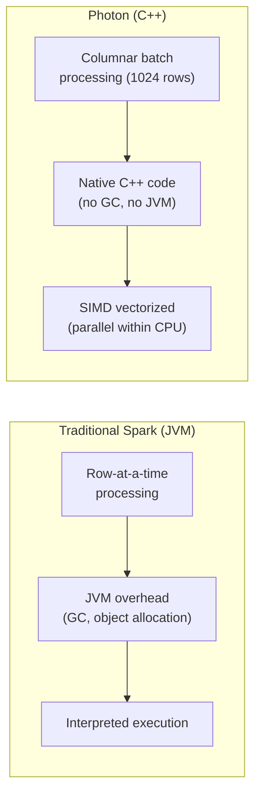

# Photon Engine — Fundamentals


## 🎯 Analogy

Think of Photon like a Formula 1 engine replacing the stock engine in your Spark car: it's a native C++ vectorized execution engine that processes columnar data faster than the JVM-based Spark engine — especially for SQL workloads on Delta tables.

---
## What Is Photon?

Photon is Databricks' **next-generation vectorized query engine** written in C++ that replaces the JVM-based Spark SQL execution engine. It processes data in columnar batches using CPU SIMD instructions, delivering 2-8x faster performance for SQL and DataFrame operations.

```python
# Enable Photon (just change the runtime version):
# Standard runtime: "14.3.x-scala2.12"
# Photon runtime:   "14.3.x-photon-scala2.12"

# That's it! Same code runs 2-5x faster. No code changes needed.
```

> **Key Insight for DE:** Photon is a drop-in replacement for Spark's SQL engine. Your existing code works unchanged — it just runs faster. It's the easiest performance win on Databricks.

---

## How Photon Works



Photon processes data in columnar batches of 1024 rows using native C++ code and SIMD instructions, avoiding JVM overhead like garbage collection and object serialization.

---

## What Photon Accelerates

| Operation | Speedup | Why |
|-----------|---------|-----|
| Table scans (Parquet/Delta) | 2-4x | Native columnar reader, predicate pushdown |
| Filters (WHERE) | 3-5x | SIMD comparison on column batches |
| Aggregations (GROUP BY) | 2-4x | Vectorized hash aggregation |
| Hash joins | 2-3x | Native hash table, batch probing |
| Sort | 2-3x | Cache-friendly columnar sort |
| MERGE/UPDATE/DELETE | 2-4x | Vectorized Delta DML |
| String operations | 3-8x | Optimized C++ string processing |
| Shuffle | 1.5-2x | More efficient serialization |

```sql
-- These all benefit from Photon (no code changes):
SELECT region, SUM(amount) FROM orders GROUP BY region;          -- 3x faster
SELECT * FROM orders WHERE amount > 100 AND status = 'active';  -- 4x faster
MERGE INTO target USING source ON ... WHEN MATCHED THEN UPDATE; -- 3x faster
OPTIMIZE orders ZORDER BY (customer_id, order_date);            -- 2x faster
```

---

## What Photon Does NOT Accelerate

| Operation | Why Not | Alternative |
|-----------|---------|-------------|
| Python UDFs | Runs in Python interpreter, not C++ | Use native Spark functions |
| Pandas UDFs | Still Python (Arrow transfer helps) | Use Spark SQL expressions |
| RDD operations | Only DataFrame/SQL benefits | Rewrite as DataFrame |
| MLlib | ML algorithms are Java-based | Use GPU for ML |
| Custom Java/Scala code | Not Photon-compiled | Use built-in functions |

```python
# ❌ NOT faster with Photon (still Python):
@udf("string")
def my_udf(x):
    return x.upper().strip()

df.withColumn("result", my_udf(col("name")))  # Python UDF — not Photon-accelerated

# ✅ Faster with Photon (native function):
df.withColumn("result", upper(trim(col("name"))))  # Native Spark function — Photon handles this!
```

---

## Enabling Photon

### On Clusters

```python
# Method 1: Choose Photon runtime version
"spark_version": "14.3.x-photon-scala2.12"

# Method 2: Cluster config
"runtime_engine": "PHOTON"

# Method 3: SQL Warehouses (always Photon by default!)
# SQL Warehouses run Photon automatically — no configuration needed
```

### Verifying Photon is Active

```sql
-- Check if Photon executed your query:
EXPLAIN EXTENDED SELECT region, SUM(amount) FROM orders GROUP BY region;

-- Look for "PhotonGroupingAgg" or "PhotonShuffledHashJoin" in the plan
-- If you see "Spark" operators instead → Photon fell back (usually due to UDFs)

-- Query-level check:
SELECT * FROM spark_catalog.default.query_history 
WHERE photon_used = true AND start_time >= current_date();
```

---

## Cost vs Performance

```python
# Photon runtime costs slightly more per DBU:
# Standard Jobs compute: $0.15/DBU
# Photon Jobs compute: ~$0.20/DBU (varies by region)

# BUT: Photon finishes faster, so total cost is often LOWER:
# Standard: 60 minutes × 8 workers × 1 DBU × $0.15 = $1.20
# Photon: 25 minutes × 8 workers × 1 DBU × $0.20 = $0.67

# Result: 44% CHEAPER with Photon (despite higher per-DBU rate!)
# Plus: faster execution = meets tighter SLAs

# Rule: Photon is almost always cheaper for SQL/DataFrame workloads
# Exception: Python-heavy jobs (UDFs) where Photon can't help
```

---

## When to Use Photon

| Workload | Use Photon? | Reason |
|----------|-------------|--------|
| SQL analytics (DBSQL) | Always ✅ | Default on all SQL Warehouses |
| ETL (joins, aggregations) | Yes ✅ | 2-4x faster, usually cheaper |
| Delta maintenance (OPTIMIZE, VACUUM) | Yes ✅ | 2x faster file compaction |
| DLT pipelines | Yes ✅ | Faster end-to-end pipeline |
| ML training | Maybe ⚠️ | Only helps data prep, not training |
| Python-heavy notebooks | No ❌ | Most time in Python, not SQL engine |
| RDD operations | No ❌ | Photon only handles DataFrame/SQL |

---

## Photon vs Spark SQL Performance

```python
# Benchmark: TPC-DS 1TB (standard analytics benchmark)
# Same cluster, same data, same queries — only runtime differs

BENCHMARK_RESULTS = {
    "total_runtime": {"spark": "45 minutes", "photon": "12 minutes", "speedup": "3.8x"},
    "scan_heavy_queries": {"spark": "avg 30s", "photon": "avg 8s", "speedup": "3.8x"},
    "join_heavy_queries": {"spark": "avg 45s", "photon": "avg 15s", "speedup": "3.0x"},
    "aggregation_queries": {"spark": "avg 25s", "photon": "avg 7s", "speedup": "3.6x"},
    "string_operations": {"spark": "avg 40s", "photon": "avg 6s", "speedup": "6.7x"},
}

# Key takeaway: Photon is fastest for string-heavy operations (6-8x)
# because C++ string processing is dramatically faster than JVM String objects
```

---


## ▶️ Try It Yourself

```sql
-- Photon is enabled at the cluster level (no code changes needed)
-- Just enable Photon in cluster settings and your SQL queries run faster

-- Verify Photon is running: check Spark UI → SQL tab for "Photon" label

-- Workloads that benefit most from Photon:
-- Wide aggregations on large tables
SELECT region, product_category, SUM(amount) revenue, AVG(amount) avg_order
FROM gold.orders
GROUP BY region, product_category;

-- Large joins (Photon implements hash join natively in C++)
SELECT o.order_id, c.name, o.amount
FROM gold.orders o JOIN gold.customers c ON o.customer_id = c.id;

-- Note: Python UDFs bypass Photon (use SQL/built-in functions for max speed)
```

> **Run it:** Copy the snippet into a REPL or file — no external services needed for the basic example.

---
## Interview Tips

> **Tip 1:** "What is Photon?" — A C++ vectorized query engine that replaces Spark's JVM-based SQL execution. It processes data in columnar batches using SIMD instructions, delivering 2-8x speedup for SQL/DataFrame operations. Drop-in replacement: same code, just change the runtime version. Default on all SQL Warehouses.

> **Tip 2:** "When does Photon NOT help?" — Python UDFs (still run in Python interpreter), RDD operations (Photon only handles DataFrame/SQL), and custom Java/Scala code. If your job is 80% Python UDFs, Photon won't significantly improve total runtime. Convert UDFs to native Spark functions to benefit from Photon.

> **Tip 3:** "Is Photon more expensive?" — Per-DBU rate is slightly higher (~$0.20 vs $0.15). But since Photon finishes 2-4x faster, total cost is usually LOWER (less total compute time). For a job that takes 60 min on Spark but 25 min on Photon: Photon costs 44% less despite the higher rate. It's almost always a net savings for SQL workloads.
