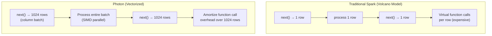

# Photon Engine — Senior-Level Deep Dive

## Photon Architecture Internals

### Vectorized Execution Model



Traditional Spark processes one row at a time with virtual function calls per row. Photon processes 1024 rows at once in columnar batches, amortizing overhead and enabling SIMD parallelism within a single CPU instruction.

### SIMD (Single Instruction, Multiple Data)

```python
# Conceptual: how Photon evaluates "WHERE amount > 100" on 1024 rows:

# Traditional Spark (row-at-a-time):
# for row in rows:
#     if row.amount > 100:
#         emit(row)
# Each comparison: 1 CPU instruction per row (1024 instructions total)

# Photon (SIMD vectorized):
# Load 8 amount values into SIMD register (AVX-256)
# Compare all 8 simultaneously with single instruction
# 1024 rows / 8 per instruction = 128 instructions total (8x fewer!)

# Real-world impact: for simple predicates, Photon achieves near-memory-bandwidth speed
# The CPU is no longer the bottleneck — I/O bandwidth becomes the limit
```

---

## Photon vs Whole-Stage Code Generation

```python
# Spark already has code generation (WholeStageCodeGen):
# - Compiles query plan to Java bytecode at runtime
# - Eliminates virtual dispatch between operators
# - Good: 5-10x faster than interpreted execution

# Photon goes further:
# - Pre-compiled C++ (not JIT-compiled Java)
# - SIMD instructions (not available in JVM)
# - No GC (manual memory management)
# - Cache-friendly memory layout (columnar)
# - Native Parquet/Delta reader (bypasses JVM deserialization)

# Comparison:
# | Aspect | WholeStageCodeGen | Photon |
# |--------|-------------------|--------|
# | Language | JVM bytecode | Native C++ |
# | Memory | JVM heap (GC) | Off-heap (manual) |
# | SIMD | No | Yes (AVX-256/512) |
# | Startup | JIT warmup needed | Pre-compiled |
# | String ops | JVM String objects | Raw byte arrays |
# | Data format | Row-oriented | Columnar batches |
```

---

## Photon Performance Characteristics

### Where Photon Excels Most

```python
# 1. SCAN-HEAVY workloads (I/O bound → Photon's native reader wins)
# Reading 1TB of Parquet: Photon's C++ reader vs Spark's Java reader
# Photon reads columns directly into native memory (zero-copy where possible)
# No Java object allocation per row → no GC pressure from scan

# 2. STRING-HEAVY workloads (biggest Photon advantage: 6-8x)
# JVM String: immutable objects, UTF-16 encoding, GC pressure
# Photon: raw UTF-8 bytes, zero-copy operations, in-place modification
# Operations like LOWER, TRIM, SUBSTRING, REGEXP: all native C++

# 3. HASH OPERATIONS (hash joins, hash aggregations)
# Photon's hash table: open addressing, SIMD probing, cache-line aligned
# JVM hash table: chained, pointer-heavy, GC-unfriendly
# Result: 2-3x faster for large hash joins

# 4. SORT operations
# Photon: radix sort on columnar data (cache-friendly, SIMD-parallel)
# Spark: TimSort on row objects (pointer-chasing, GC pressure)
# Result: 2-3x faster for ORDER BY and sort-merge operations
```

### Performance Anti-Patterns (Where Photon Can't Help)

```python
# Anti-pattern 1: Python UDFs everywhere
df = df.withColumn("parsed", my_python_udf(col("raw")))  # Stays in Python!
# Fix: rewrite with native functions
df = df.withColumn("parsed", regexp_extract(col("raw"), pattern, 1))

# Anti-pattern 2: collect() to driver for processing
data = df.collect()  # All data to driver (Python)
result = [process(row) for row in data]  # Processing in Python
# Fix: keep processing in Spark (distributed, Photon-accelerated)
df = df.withColumn("result", native_transform(col("input")))

# Anti-pattern 3: Iterative processing with temporary views
for i in range(100):
    df = df.withColumn(f"col_{i}", expr(f"col_{i-1} + 1"))
# Long lineage → can't vectorize entire chain efficiently
# Fix: use SQL expressions or limit lineage depth with checkpoint
```

---

## Photon and Delta Lake Integration

```python
# Photon has a specialized Delta Lake reader (not generic Parquet reader):
# 1. Reads Delta transaction log natively (C++ JSON parsing)
# 2. Applies data skipping using column stats (native comparison)
# 3. Reads only needed columns from Parquet (column pruning in C++)
# 4. Applies row-level filters during scan (predicate pushdown in C++)
# 5. Handles deletion vectors natively (Delta 3.0+ feature)

# Delta-specific Photon optimizations:
# - Merge-on-Read: deletion vectors processed during scan (no rewrite needed)
# - Optimize Write: coalesces small files during write phase
# - Z-ORDER sort: uses Photon's fast sort for clustering

# Configuration (usually auto-tuned):
spark.conf.set("spark.databricks.photon.scan.enabled", "true")   # Photon scan
spark.conf.set("spark.databricks.photon.sort.enabled", "true")   # Photon sort
spark.conf.set("spark.databricks.photon.join.enabled", "true")   # Photon join
spark.conf.set("spark.databricks.photon.agg.enabled", "true")    # Photon agg
# All are true by default on Photon runtime — no manual configuration needed
```

---

## Benchmarking Photon

```python
class PhotonBenchmark:
    """Systematic comparison: Photon vs Standard Spark."""
    
    def run_benchmark(self, queries: list[str], table: str) -> dict:
        results = []
        
        for query in queries:
            # Warm up (first run may be slower due to caching)
            spark.sql(query).collect()
            
            # Benchmark (average of 3 runs)
            times = []
            for _ in range(3):
                start = time.time()
                spark.sql(query).collect()
                times.append(time.time() - start)
            
            avg_time = sum(times) / len(times)
            results.append({
                "query": query[:80],
                "avg_seconds": avg_time,
                "photon_operators": self._count_photon_operators(query),
            })
        
        return results
    
    def _count_photon_operators(self, query: str) -> int:
        """Count how many operators used Photon (vs Spark fallback)."""
        plan = spark.sql(f"EXPLAIN EXTENDED {query}").collect()[0][0]
        return plan.count("Photon")

# Benchmark categories:
BENCHMARK_QUERIES = {
    "scan_filter": "SELECT * FROM orders WHERE amount > 100 AND order_date = '2024-03-15'",
    "aggregation": "SELECT region, SUM(amount), COUNT(*) FROM orders GROUP BY region",
    "join_small": "SELECT o.*, c.name FROM orders o JOIN customers c ON o.customer_id = c.customer_id",
    "join_large": "SELECT * FROM events e JOIN sessions s ON e.session_id = s.session_id",
    "string_ops": "SELECT LOWER(TRIM(url)), REGEXP_EXTRACT(url, '//([^/]+)/', 1) FROM events",
    "window": "SELECT *, ROW_NUMBER() OVER (PARTITION BY customer_id ORDER BY order_date DESC) FROM orders",
    "merge": "MERGE INTO target USING source ON target.id = source.id WHEN MATCHED THEN UPDATE SET *",
}
```

---

## Production Considerations

### When NOT to Use Photon

```python
# 1. Budget-constrained small jobs (<5 min runtime)
# Photon DBU premium isn't worth it for trivial jobs
# The speedup doesn't save much absolute time on short jobs

# 2. Python-heavy ML notebooks
# If 90% of time is in scikit-learn/pandas/TensorFlow → Photon adds nothing
# Use standard ML runtime (saves the Photon DBU premium)

# 3. Streaming with very small batches
# Micro-batches processing 100 rows: Photon overhead > benefit
# Only helps when batches are large enough to vectorize (>1000 rows)

# RULE: Use Photon when your job spends >50% of time in SQL/DataFrame operations
# This is true for: ETL, SQL analytics, Delta maintenance, DLT pipelines
# Not true for: ML training, Python data science notebooks, RDD-heavy legacy code
```

### Photon + Cluster Sizing

```python
# Photon uses CPU more efficiently → may need FEWER workers!
# Standard: 16 workers to process 1TB in 60 min
# Photon: 8 workers to process 1TB in 35 min (same total, fewer workers)

# Recommendation: when switching to Photon, REDUCE cluster size
# Start at 60% of previous worker count → benchmark → adjust
# Often: half the workers, same or better performance

# Memory: Photon uses off-heap → reduce spark.executor.memory slightly
# Increase spark.executor.memoryOverhead to accommodate Photon's off-heap usage
```

---

## Interview Tips

> **Tip 1:** "Explain Photon's architecture" — Vectorized C++ query engine processing columnar batches of 1024 rows. Uses SIMD instructions for parallel evaluation within a single CPU instruction. No JVM/GC overhead. Native Parquet/Delta reader bypasses Java deserialization. Pre-compiled (no JIT warmup). Off-heap memory management (no GC pauses). Together: 2-8x faster than Spark's WholeStageCodeGen.

> **Tip 2:** "What's the relationship between Photon, AQE, and code generation?" — Three complementary layers: (1) AQE optimizes the PLAN at runtime (join type, partition count, skew handling), (2) WholeStageCodeGen fuses operators into compiled Java code (reduces virtual dispatch), (3) Photon replaces the generated code with native C++ vectorized execution (faster than JVM can achieve). All three work together — AQE picks the plan, Photon executes it.

> **Tip 3:** "When would you NOT use Photon?" — Python-heavy workloads (ML training, pandas operations) where Spark SQL isn't the bottleneck. Very short jobs (<5 min) where the DBU premium isn't offset by speedup. And legacy RDD code that doesn't go through the SQL engine. For these: standard runtime is cheaper. For everything else (ETL, SQL, DLT, Delta maintenance): Photon is almost always the better choice.

## ⚡ Cheat Sheet

**What Photon accelerates**
- ✅ Vectorized: SELECT, WHERE, GROUP BY, JOIN (hash/sort-merge), ORDER BY, window functions, Delta scans
- ❌ Not vectorized: Python UDFs, pandas UDFs (use Arrow-based for partial benefit), RDD API, complex type mutations

**Enabling Photon**
- All-purpose cluster: `spark.databricks.photon.enabled true` (default on Photon-enabled instance types)
- SQL warehouses: always on (Pro and Serverless warehouses)
- Instance types: requires `photon`-tagged instances (e.g., `i3.xlarge` on AWS, `Standard_L8s` on Azure)

**Performance characteristics**
- 2–3× faster for SQL aggregations and scans vs standard Spark
- 10× faster for MERGE INTO with large datasets
- Near-linear scaling with vectorized batch size (default 8K rows/batch)
- Cache-friendly: columnar in-memory format aligns with CPU cache lines

**Query profile signals**
- Good: `PhotonGroupingAgg`, `PhotonHashJoin`, `PhotonFilter` operators
- Spill: `PhotonHashJoin` → `sort merge join` in profile = memory pressure → increase executor memory
- Fallback: `HashAggregate` (non-Photon) = Python UDF or unsupported operation in path

**Cost–performance tradeoff**
- Photon clusters same DBU rate as standard DBR — only faster = lower wall-clock time = lower cost per query
- Choose Photon when: SQL-heavy workloads, large scans, concurrent BI queries
- Avoid when: Python-heavy ML pipelines (no benefit; pay for Photon-capable instance overhead)

**Key tuning**
- `spark.databricks.photon.allDataTypesEnabled true` — enables Photon for complex types (DBR 12+)
- Delta caching + Photon: orthogonal — Delta cache serves data off SSD; Photon processes it fast
- AQE + Photon: fully compatible; AQE coalesces shuffle partitions, Photon vectorizes each task
