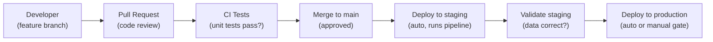

# Databricks Repos and CI/CD — Fundamentals


## 🎯 Analogy

Think of Databricks Repos like a Git checkout inside Databricks: your notebooks are versioned files in GitHub/GitLab, and CI/CD pipelines run `databricks repos update` to pull the latest code before running jobs — same workflow as software engineering.

---
## What Are Databricks Repos?

Databricks Repos lets you **sync Git repositories directly into your workspace**. Notebooks, Python files, and configs are version-controlled with standard Git workflows (branches, PRs, merges).

```
Your Git Repository (GitHub/GitLab/Azure DevOps)
├── pipelines/
│   ├── ingest_orders.py
│   ├── transform_orders.py
│   └── validate_quality.py
├── tests/
│   └── test_transforms.py
├── terraform/
│   └── jobs.tf
└── requirements.txt

↕ Synced to Databricks Workspace via Repos
/Repos/production/my-project/
├── pipelines/
│   ├── ingest_orders.py      ← Run as notebook
│   ├── transform_orders.py
│   └── validate_quality.py
├── tests/
│   └── test_transforms.py
└── requirements.txt
```

> **Key Insight for DE:** Repos replaces the old pattern of manually editing notebooks in the workspace. Your code lives in Git (source of truth), Databricks Repos syncs it to the workspace for execution.

---

## Setting Up Repos

### Connect a Repository

```python
# Via UI: Workspace → Repos → Add Repo → paste Git URL
# Via CLI:
# databricks repos create --url https://github.com/company/data-pipelines --path /Repos/production/data-pipelines

# Via API:
import requests
response = requests.post(
    f"{DATABRICKS_HOST}/api/2.0/repos",
    headers={"Authorization": f"Bearer {TOKEN}"},
    json={
        "url": "https://github.com/company/data-pipelines",
        "provider": "github",
        "path": "/Repos/production/data-pipelines",
    }
)
```

### Branch Management

```python
# Switch branches:
# databricks repos update /Repos/staging/data-pipelines --branch feature/new-etl

# Via API:
requests.patch(
    f"{DATABRICKS_HOST}/api/2.0/repos/{repo_id}",
    json={"branch": "main"}
)

# Typical setup:
# /Repos/production/data-pipelines → main branch (production code)
# /Repos/staging/data-pipelines → main branch (staging validation)
# /Repos/dev-username/data-pipelines → feature/xyz branch (development)
```

---

## Repo Structure for Data Engineering

```
data-pipelines/
├── src/
│   ├── bronze/
│   │   ├── ingest_orders.py
│   │   └── ingest_events.py
│   ├── silver/
│   │   ├── transform_orders.py
│   │   └── transform_events.py
│   └── gold/
│       └── aggregate_revenue.py
├── lib/
│   ├── common.py          # Shared utilities
│   └── quality_checks.py  # Reusable quality functions
├── tests/
│   ├── test_transforms.py
│   └── test_quality.py
├── terraform/
│   ├── main.tf
│   └── jobs.tf
├── .github/workflows/
│   └── ci_cd.yml
├── requirements.txt
└── README.md
```

### Importing Shared Code

```python
# In a notebook/file, import from other files in the repo:

# src/silver/transform_orders.py
from lib.common import get_spark_session, log_metrics
from lib.quality_checks import check_nulls, check_row_count

spark = get_spark_session()

def transform_orders():
    df = spark.table("production.bronze.orders")
    # ... transformation logic ...
    check_nulls(df, ["order_id", "customer_id"])
    return df

# This works because Repos adds the repo root to Python path!
```

---

## Git Workflow for Data Engineering



Standard Git workflow: develop on branches, PR for review + CI, merge deploys to staging then production.

---

## Development Workflow

```python
# Day-to-day development pattern:

# 1. Create feature branch
# git checkout -b feature/add-new-table

# 2. Develop in Databricks (using your personal Repos folder)
# /Repos/your-name/data-pipelines → synced to your feature branch
# Edit notebooks/files directly in Databricks UI
# OR: edit locally, push to Git, pull in Databricks

# 3. Test locally (in your dev notebook)
# Run against development catalog:
spark.conf.set("target_catalog", "development")

# 4. Commit and push
# databricks repos get-status /Repos/your-name/data-pipelines
# → shows changed files
# Commit via UI: Repos → your-repo → Git dialog → commit + push

# 5. Create PR (in GitHub/GitLab)
# CI runs unit tests automatically
# Reviewer approves code

# 6. Merge → auto-deploys to staging → validates → deploys to production
```

---

## Running Notebooks from Repos

```python
# Workflows can reference notebooks from Repos:
{
    "task_key": "ingest",
    "notebook_task": {
        "notebook_path": "/Repos/production/data-pipelines/src/bronze/ingest_orders",
        # This always runs the `main` branch version (production code)
    }
}

# For staging validation:
{
    "task_key": "staging_test",
    "notebook_task": {
        "notebook_path": "/Repos/staging/data-pipelines/src/bronze/ingest_orders",
        # Same code, different repo path (staging branch)
    }
}
```

---

## Environment Management

```python
# Same code, different environments (via parameters or config):

# In your pipeline notebook:
environment = dbutils.widgets.get("environment")  # "development", "staging", "production"

config = {
    "development": {"catalog": "development", "source": "s3://dev-data/"},
    "staging": {"catalog": "staging", "source": "s3://staging-data/"},
    "production": {"catalog": "production", "source": "s3://prod-data/"},
}

target_catalog = config[environment]["catalog"]
source_path = config[environment]["source"]

# Production job passes: environment=production
# Staging job passes: environment=staging
# You test with: environment=development
```

---

## Git Providers Supported

| Provider | Supported | Notes |
|----------|-----------|-------|
| GitHub | ✅ | GitHub.com + Enterprise |
| GitLab | ✅ | GitLab.com + Self-hosted |
| Azure DevOps | ✅ | Azure Repos |
| Bitbucket | ✅ | Cloud + Server |
| AWS CodeCommit | ✅ | Via HTTPS |

---


## ▶️ Try It Yourself

```yaml
# .github/workflows/deploy_databricks.yml
name: Deploy to Databricks
on:
  push:
    branches: [main]

jobs:
  deploy:
    runs-on: ubuntu-latest
    steps:
      - uses: actions/checkout@v4

      - name: Setup Databricks CLI
        run: pip install databricks-cli

      - name: Update Databricks Repo (pull latest code)
        env:
          DATABRICKS_HOST: ${{ secrets.DATABRICKS_HOST }}
          DATABRICKS_TOKEN: ${{ secrets.DATABRICKS_TOKEN }}
        run: |
          databricks repos update --path /Repos/prod/de-pipelines --branch main

      - name: Run dbt models on Databricks SQL
        run: |
          dbt run --profiles-dir . --target prod --select tag:daily
```

> **Run it:** Copy the snippet into a REPL or file — no external services needed for the basic example.

---
## Interview Tips

> **Tip 1:** "How do you version-control Databricks notebooks?" — Use Databricks Repos: sync a Git repository into the workspace. Code lives in Git (branches, PRs, merges), Repos syncs it for execution. Workflows reference notebook paths under /Repos/production/. Same Git workflow as any software project.

> **Tip 2:** "How do you manage dev/staging/production environments?" — Three Repos folders pointing to the same Git repo: /Repos/dev (feature branch), /Repos/staging (main branch, validation), /Repos/production (main branch, live). Same code with different parameters (catalog name, source paths). CI/CD auto-updates staging and production on merge.

> **Tip 3:** "Can you import Python modules across notebooks in Repos?" — Yes! Repos adds the repository root to the Python path. You can have shared library files (lib/common.py) and import them from any notebook in the repo. This enables code reuse without %run magic or wheel packages.
