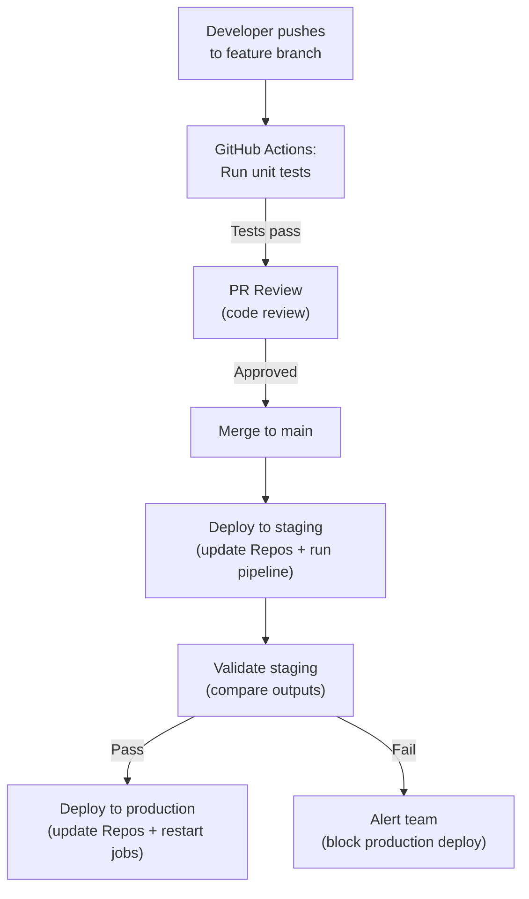

# Databricks Repos and CI/CD — Intermediate

## CI/CD Pipeline Architecture



This CI/CD flow ensures every code change is tested, validated in staging, and only reaches production after passing quality gates.

---

## GitHub Actions for Databricks

```yaml
# .github/workflows/ci_cd.yml
name: Databricks CI/CD Pipeline
on:
  pull_request:
    branches: [main]
  push:
    branches: [main]

env:
  DATABRICKS_HOST: ${{ secrets.DATABRICKS_HOST }}
  DATABRICKS_TOKEN: ${{ secrets.DATABRICKS_TOKEN }}

jobs:
  # Job 1: Unit tests (no cluster needed)
  unit-tests:
    runs-on: ubuntu-latest
    steps:
      - uses: actions/checkout@v4
      - uses: actions/setup-python@v5
        with:
          python-version: '3.11'
      - run: pip install -r requirements-dev.txt
      - run: pytest tests/ -v --tb=short
  
  # Job 2: Deploy and validate in staging (on PR merge)
  deploy-staging:
    if: github.event_name == 'push' && github.ref == 'refs/heads/main'
    needs: unit-tests
    runs-on: ubuntu-latest
    steps:
      - uses: actions/checkout@v4
      
      - name: Install Databricks CLI
        run: pip install databricks-cli
      
      - name: Update staging Repos
        run: |
          databricks repos update \
            --path /Repos/staging/data-pipelines \
            --branch main
      
      - name: Run staging pipeline
        run: |
          RUN_ID=$(databricks jobs run-now --job-id ${{ vars.STAGING_JOB_ID }} \
            --notebook-params '{"environment":"staging"}' | jq -r '.run_id')
          
          # Wait for completion
          databricks runs get --run-id $RUN_ID --wait
      
      - name: Validate staging results
        run: python scripts/validate_staging.py
  
  # Job 3: Deploy to production (after staging passes)
  deploy-production:
    needs: deploy-staging
    runs-on: ubuntu-latest
    environment: production  # Requires manual approval in GitHub
    steps:
      - name: Update production Repos
        run: |
          databricks repos update \
            --path /Repos/production/data-pipelines \
            --branch main
      
      - name: Notify team
        run: |
          curl -X POST ${{ secrets.SLACK_WEBHOOK }} \
            -d '{"text":"Production deployment complete: data-pipelines"}'
```

---

## Testing Strategies

### Unit Tests (Local, No Cluster)

```python
# tests/test_transforms.py
# Test business logic WITHOUT Spark (fast, runs in CI)

import pytest
from unittest.mock import MagicMock, patch
from src.silver.transform_orders import clean_amount, classify_order

def test_clean_amount():
    """Test amount cleaning logic."""
    assert clean_amount("$1,234.56") == 1234.56
    assert clean_amount("1234") == 1234.0
    assert clean_amount("N/A") is None
    assert clean_amount("") is None

def test_classify_order():
    """Test order classification."""
    assert classify_order(5000) == "high_value"
    assert classify_order(500) == "medium_value"
    assert classify_order(50) == "low_value"
    assert classify_order(0) == "zero"

# For PySpark testing (requires local Spark):
@pytest.fixture(scope="session")
def spark():
    from pyspark.sql import SparkSession
    return SparkSession.builder.master("local[2]").getOrCreate()

def test_transform_logic(spark):
    """Test transformation with actual Spark (local mode)."""
    input_data = [
        {"order_id": 1, "amount": "100.50", "status": "active"},
        {"order_id": 2, "amount": "invalid", "status": "active"},
        {"order_id": None, "amount": "50.00", "status": "active"},
    ]
    
    input_df = spark.createDataFrame(input_data)
    result = apply_silver_transform(input_df)  # Your transform function
    
    assert result.count() == 1  # Only valid row
    assert result.collect()[0]["amount"] == 100.50
```

### Integration Tests (On Databricks)

```python
# scripts/validate_staging.py
"""Run after staging pipeline to validate outputs."""

from databricks import sql

def validate_staging():
    conn = sql.connect(server_hostname=DBSQL_HOST, http_path=WAREHOUSE_PATH, access_token=TOKEN)
    cursor = conn.cursor()
    
    # Check 1: Row count is reasonable
    cursor.execute("SELECT COUNT(*) FROM staging.silver.orders WHERE _loaded_at >= current_date()")
    count = cursor.fetchone()[0]
    assert count > 0, "No data in staging silver table!"
    assert count < 10_000_000, f"Unexpected row count: {count} (too many — possible duplication)"
    
    # Check 2: No unexpected nulls
    cursor.execute("""
        SELECT SUM(CASE WHEN order_id IS NULL THEN 1 ELSE 0 END) * 100.0 / COUNT(*)
        FROM staging.silver.orders WHERE _loaded_at >= current_date()
    """)
    null_rate = cursor.fetchone()[0]
    assert null_rate < 1.0, f"Null rate {null_rate}% exceeds 1% threshold"
    
    # Check 3: Schema matches production
    cursor.execute("DESCRIBE staging.silver.orders")
    staging_schema = set(row[0] for row in cursor.fetchall())
    cursor.execute("DESCRIBE production.silver.orders")
    prod_schema = set(row[0] for row in cursor.fetchall())
    
    missing = prod_schema - staging_schema
    assert not missing, f"Staging missing columns: {missing}"
    
    print("✓ All staging validations passed!")
    conn.close()

if __name__ == "__main__":
    validate_staging()
```

---

## Deployment Patterns

### Pattern 1: Repo-Based Deployment (Simplest)

```python
# Production jobs reference /Repos/production/... paths
# Deployment = update the Repos to latest main branch

# In CI/CD:
databricks repos update --path /Repos/production/data-pipelines --branch main
# That's it! Next job run uses the updated code automatically.

# Pros: Simple, no artifact building, instant deployment
# Cons: All jobs share the same code version (can't version individual jobs)
```

### Pattern 2: Wheel/Package Deployment

```python
# Build a Python wheel, deploy to DBFS/Unity Catalog Volumes
# Jobs reference the wheel (versioned, immutable)

# In CI/CD:
# 1. Build wheel
#    python -m build → dist/data_pipelines-1.2.3-py3-none-any.whl

# 2. Upload to Volumes
#    databricks fs cp dist/*.whl /Volumes/production/packages/

# 3. Job references specific wheel version
{
    "libraries": [{"whl": "/Volumes/production/packages/data_pipelines-1.2.3-py3-none-any.whl"}],
    "task": {"python_wheel_task": {"package_name": "data_pipelines", "entry_point": "main"}}
}

# Pros: Versioned (can pin to specific version), rollback by changing version
# Cons: More complex (build step, version management)
```

### Pattern 3: Terraform-Managed Deployment

```hcl
# terraform/jobs.tf — deploy jobs + code together
resource "databricks_job" "daily_etl" {
  name = "daily_etl"
  
  task {
    task_key = "ingest"
    notebook_task {
      notebook_path = "/Repos/production/data-pipelines/src/bronze/ingest_orders"
    }
  }
  
  # Terraform manages both the job config AND triggers Repos update
}

# In CI: terraform apply updates job config + Repos simultaneously
# Atomic: if Terraform fails mid-deploy, it rolls back everything
```

---

## Branch Strategy for Data Engineering

```python
BRANCH_STRATEGY = {
    "main": {
        "purpose": "Production-ready code",
        "deployment": "Auto-deploys to /Repos/production/ on merge",
        "protection": "Requires: PR approval + CI pass + staging validation",
    },
    "feature/*": {
        "purpose": "Active development",
        "deployment": "Developer's personal /Repos/username/ folder",
        "lifecycle": "Created from main, merged back via PR, deleted after",
    },
    "hotfix/*": {
        "purpose": "Emergency production fixes",
        "deployment": "Fast-track: skip staging, deploy directly (with approval)",
        "lifecycle": "Created from main, merged + deployed within hours",
    },
}

# The key principle: main branch = production state
# If main is broken → production is broken
# Protect main: require tests + staging validation before merge
```

---

## Secrets and Configuration Management

```python
# DON'T store secrets in Git! Use Databricks Secrets:

# Setup (one-time):
# databricks secrets create-scope --scope production
# databricks secrets put --scope production --key db-password

# In notebooks:
password = dbutils.secrets.get(scope="production", key="db-password")
# Value is NEVER visible in logs (redacted automatically)

# For configuration (non-secret):
# Option 1: Databricks widgets (job parameters)
environment = dbutils.widgets.get("environment")

# Option 2: Config file in the repo
import json
config = json.load(open("config/production.json"))

# Option 3: Environment variables (set in cluster config)
import os
api_endpoint = os.environ.get("API_ENDPOINT")
```

---

## Interview Tips

> **Tip 1:** "How do you do CI/CD for Databricks?" — Code in Git (repos), CI runs unit tests on every PR (GitHub Actions/Azure Pipelines), merge to main triggers: update staging Repos → run staging pipeline → validate outputs → update production Repos. Infrastructure managed by Terraform. Same code, different environments via parameters.

> **Tip 2:** "How do you test data pipelines?" — Three levels: (1) Unit tests (pytest, local Spark, test business logic functions), (2) Integration tests (run in staging, validate row counts, schema, quality), (3) Data validation (compare staging output checksums with expected). Unit tests run in CI (seconds); integration tests run on Databricks (minutes).

> **Tip 3:** "Repos vs Wheel packages for deployment?" — Repos: simplest (just update branch, next run uses new code), good for most teams. Wheels: versioned artifacts (pin to specific version, explicit rollback), good for shared libraries or when you need strict version control. Start with Repos; upgrade to wheels if you need version pinning.
