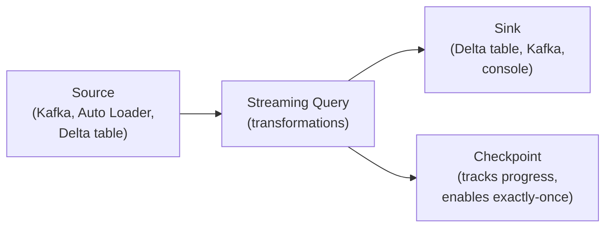

# Structured Streaming on Databricks — Fundamentals


## 🎯 Analogy

Think of Databricks structured streaming like a continuous dbt run: micro-batch or continuous mode, checkpointing saves progress so restarts never re-process, and Delta as a sink gives ACID landing with exactly-once semantics.

---
## What Is Structured Streaming?

Structured Streaming is Spark's stream processing engine that treats streaming data as a continuously appending table. On Databricks, it integrates natively with Delta Lake for exactly-once, fault-tolerant stream processing.

```python
# Batch processing: read ALL data → process → write (finite)
df = spark.read.format("json").load("s3://data/")  # Reads everything at once

# Stream processing: read NEW data continuously → process → write (infinite)
df = spark.readStream.format("json").load("s3://data/")  # Reads only new data as it arrives
# Same API! Just readStream instead of read
```

> **Key Insight for DE:** On Databricks, streaming and batch use the same Delta tables. A streaming job writes to the same table that batch jobs and SQL queries read from — unified lakehouse architecture.

---

## Core Concepts



The streaming query continuously reads from a source, applies transformations, and writes to a sink. The checkpoint tracks progress for fault tolerance and exactly-once guarantees.

---

## Sources (Where Data Comes From)

| Source | Format | Use Case |
|--------|--------|----------|
| **Auto Loader** | `cloudFiles` | File ingestion from S3/ADLS |
| **Kafka** | `kafka` | Event streams, CDC |
| **Delta Table** | `delta` (readStream) | Table-to-table streaming (downstream of another stream) |
| **Kinesis** | `kinesis` | AWS event streams |
| **Event Hubs** | `eventhubs` | Azure event streams |
| **Rate Source** | `rate` | Testing (generates fake data) |

```python
# Auto Loader source (most common on Databricks)
df = (spark.readStream
    .format("cloudFiles")
    .option("cloudFiles.format", "json")
    .load("s3://bucket/landing/")
)

# Kafka source
df = (spark.readStream
    .format("kafka")
    .option("kafka.bootstrap.servers", "broker:9092")
    .option("subscribe", "events-topic")
    .load()
)

# Delta table as source (read changes from another table)
df = spark.readStream.table("production.bronze.orders")
```

---

## Sinks (Where Data Goes)

```python
# Delta table sink (most common on Databricks)
(df.writeStream
    .format("delta")
    .option("checkpointLocation", "/checkpoints/my-stream/")
    .toTable("production.silver.events")
)

# Short form (same as above):
(df.writeStream
    .option("checkpointLocation", "/checkpoints/my-stream/")
    .toTable("production.silver.events")
)

# Kafka sink (write back to Kafka)
(df.writeStream
    .format("kafka")
    .option("kafka.bootstrap.servers", "broker:9092")
    .option("topic", "processed-events")
    .option("checkpointLocation", "/checkpoints/kafka-sink/")
    .start()
)
```

---

## Trigger Modes

| Trigger | Behavior | Latency | Cost |
|---------|----------|---------|------|
| `processingTime="10 seconds"` | Micro-batch every 10s | ~10s | Medium (continuous) |
| `availableNow=True` | Process all available, then stop | Minutes | Low (batch-style) |
| `once=True` (deprecated) | Process one batch, stop | Minutes | Lowest |
| Default (no trigger) | Micro-batch as fast as possible | Sub-second | Highest |

```python
# Near-real-time (continuous cluster, micro-batches every 10 seconds)
(df.writeStream
    .trigger(processingTime="10 seconds")
    .option("checkpointLocation", "/checkpoints/stream/")
    .toTable("production.silver.events")
)

# Batch-style (process available data, then stop — for Workflows)
(df.writeStream
    .trigger(availableNow=True)
    .option("checkpointLocation", "/checkpoints/stream/")
    .toTable("production.silver.events")
)
# Job starts → processes all new data → exits
# Schedule with Databricks Workflow (every 15 min)
```

---

## Transformations

Streaming DataFrames support most of the same operations as batch:

```python
from pyspark.sql.functions import col, from_json, to_timestamp, current_timestamp

# Parse Kafka value (JSON → structured columns)
schema = "event_id STRING, user_id STRING, event_type STRING, amount DOUBLE, event_ts STRING"

parsed = (df
    .selectExpr("CAST(value AS STRING) as json_str")
    .select(from_json(col("json_str"), schema).alias("data"))
    .select("data.*")
    .withColumn("event_timestamp", to_timestamp(col("event_ts")))
    .withColumn("_ingested_at", current_timestamp())
)

# Filter
filtered = parsed.filter(col("event_type") == "purchase")

# Add computed columns
enriched = filtered.withColumn("amount_usd", col("amount") * 1.0)

# Write to Delta
(enriched.writeStream
    .option("checkpointLocation", "/checkpoints/purchases/")
    .trigger(processingTime="30 seconds")
    .toTable("production.silver.purchases")
)
```

### Operations NOT Supported in Streaming

```python
# These require seeing ALL data (not possible with infinite stream):
# ❌ df.count()  — use watermark + window instead
# ❌ df.distinct()  — use dropDuplicatesWithinWatermark()
# ❌ df.sort()  — use window-based sorting
# ❌ Multiple aggregations without watermark

# ✅ Works: filter, select, withColumn, join (with watermark), groupBy (with watermark)
```

---

## Checkpoints and Exactly-Once

```python
# The checkpoint stores:
# 1. Which data has been read (offsets/file positions)
# 2. Current streaming state (for stateful ops like aggregations)
# 3. Committed batch IDs (for exactly-once)

(df.writeStream
    .option("checkpointLocation", "/checkpoints/my-stream/")  # CRITICAL!
    .toTable("target_table")
)

# RULES:
# 1. NEVER share checkpoints between different streams
# 2. NEVER delete a checkpoint (you'll reprocess everything!)
# 3. NEVER change the checkpoint path for an existing stream
# 4. Checkpoint = source of truth for stream position (sacred!)

# Recovery: if job crashes and restarts with same checkpoint → resumes exactly where it left off
# Exactly-once: checkpoint only advances after Delta commit succeeds (atomic)
```

---

## Reading from Delta Tables (Table-to-Table Streaming)

```python
# Read from one Delta table as a stream (process new rows as they arrive)
bronze_stream = spark.readStream.table("production.bronze.orders")

# Transform
silver_stream = (bronze_stream
    .filter(col("order_id").isNotNull())
    .withColumn("amount", col("amount").cast("decimal(10,2)"))
)

# Write to another Delta table
(silver_stream.writeStream
    .option("checkpointLocation", "/checkpoints/silver-orders/")
    .trigger(availableNow=True)
    .toTable("production.silver.orders")
)

# This is the "streaming medallion" pattern:
# Bronze (Auto Loader writes) → Silver (streaming read + transform) → Gold (streaming aggregate)
# Each layer is a separate streaming query with its own checkpoint
```

---

## Output Modes

| Mode | Behavior | Use Case |
|------|----------|----------|
| `append` (default) | Only new rows written | Most ETL, non-aggregation |
| `complete` | Entire result rewritten each batch | Aggregations (small result set) |
| `update` | Only changed rows written | Aggregations with watermark |

```python
# Append mode (default): each micro-batch appends new rows
(df.writeStream
    .outputMode("append")  # Only new rows go to target
    .toTable("silver.events")
)

# Complete mode: rewrites entire result table each batch
(df.groupBy("event_type").count()
    .writeStream
    .outputMode("complete")  # Full result every time
    .toTable("gold.event_counts")
)

# Update mode: only rows that changed since last batch
(df.groupBy(window("event_time", "5 minutes"), "event_type").count()
    .writeStream
    .outputMode("update")  # Only new/changed windows
    .toTable("gold.windowed_counts")
)
```

---

## Simple End-to-End Example

```python
from pyspark.sql.functions import *

# Ingest JSON files → clean → write to Delta
raw = (spark.readStream
    .format("cloudFiles")
    .option("cloudFiles.format", "json")
    .option("cloudFiles.inferColumnTypes", "true")
    .load("s3://lake/landing/events/")
)

cleaned = (raw
    .filter(col("event_id").isNotNull())
    .withColumn("event_time", to_timestamp(col("event_ts")))
    .withColumn("_ingested_at", current_timestamp())
    .select("event_id", "user_id", "event_type", "event_time", "amount", "_ingested_at")
)

query = (cleaned.writeStream
    .option("checkpointLocation", "/checkpoints/events/")
    .trigger(availableNow=True)  # Process available, then stop
    .toTable("production.silver.events")
)

query.awaitTermination()
print(f"Processed: {query.lastProgress}")
```

---


## ▶️ Try It Yourself

```python
from pyspark.sql import SparkSession
from pyspark.sql.functions import from_json, col
from pyspark.sql.types import StructType, StringType, DoubleType

spark = SparkSession.builder.master("local[*]").appName("streaming").getOrCreate()

schema = StructType()     .add("order_id", StringType())     .add("amount", DoubleType())     .add("region", StringType())

# Read from Kafka (or use rate source for local demo)
stream = spark.readStream.format("rate").option("rowsPerSecond", 10).load()

query = (
    stream.writeStream
    .format("delta")
    .option("checkpointLocation", "/tmp/checkpoint/orders")
    .outputMode("append")
    .start("/tmp/delta/orders_stream")
)

import time; time.sleep(10); query.stop()
print("Streaming wrote to Delta with checkpointing")
```

> **Run it:** Copy the snippet into a REPL or file — no external services needed for the basic example.

---
## Interview Tips

> **Tip 1:** "What is Structured Streaming on Databricks?" — Spark's stream processing engine that treats data as a continuously appending table. On Databricks, it integrates with Auto Loader (file ingestion), Kafka (event streams), and Delta Lake (exactly-once writes). Same DataFrame API as batch — just `readStream` instead of `read`.

> **Tip 2:** "availableNow vs processingTime trigger?" — `availableNow=True`: processes all available data then stops (batch-style, schedule via Workflow). `processingTime="10s"`: runs continuously, micro-batch every 10 seconds (real-time, always-on cluster). Use availableNow for cost efficiency (cluster stops between runs); processingTime for low-latency requirements.

> **Tip 3:** "How does exactly-once work?" — Checkpoint tracks which data has been processed. If the job crashes mid-batch: Delta's transactional write means partial data is rolled back, checkpoint doesn't advance. On restart: re-reads from last committed position and re-processes the batch. Result: each record written exactly once regardless of failures.
