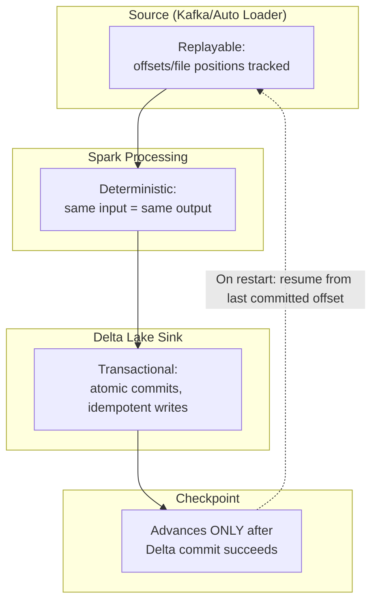

# Structured Streaming on Databricks — Senior-Level Deep Dive

## Exactly-Once End-to-End Semantics

### How Databricks Achieves Exactly-Once



The three pillars of exactly-once: replayable source (can re-read from a position), deterministic processing (same input → same output), and transactional sink (Delta commits atomically). The checkpoint only advances after a successful commit.

```python
# What happens on failure:
# 1. Micro-batch reads offsets 100-200 from Kafka
# 2. Processes data, starts writing to Delta
# 3. JOB CRASHES mid-write!
# 4. Delta: incomplete write is rolled back (transaction aborted)
# 5. Checkpoint: still at offset 100 (didn't advance since commit failed)
# 6. On restart: re-reads offsets 100-200, re-processes, writes again
# 7. Delta: commit succeeds
# 8. Checkpoint: advances to offset 200
# RESULT: Each record written EXACTLY once, despite the crash
```

---

## State Management Deep Dive

### RocksDB State Backend

```python
# Default state backend: in-memory HashMap
# Problem: GC pressure for large state (>1 GB), OOM risk

# Production recommendation: RocksDB state backend
spark.conf.set(
    "spark.sql.streaming.stateStore.providerClass",
    "com.databricks.sql.streaming.state.RocksDBStateStoreProvider"
)

# RocksDB advantages:
# - State lives on local SSD (not JVM heap)
# - No GC pressure (off-heap storage)
# - Handles millions of keys (scalable)
# - Incremental checkpointing (faster recovery)
# - Built-in compression (less disk usage)

# State sizing calculation:
# Dedup with 1M unique keys × 100 bytes per key = 100 MB state
# Windowed aggregation with 100K windows × 200 bytes = 20 MB state
# Stream-stream join state: (left_window + right_window) × key_size
```

### State TTL (Time-To-Live)

```python
# Automatically expire old state entries (prevent unbounded growth)
spark.conf.set("spark.sql.streaming.statefulOperator.stateRebalancing.enabled", "true")

# For aggregations: watermark defines state TTL
# For dedup: watermark defines how long to remember seen keys
# For joins: time constraints define state TTL for each side

# Monitor state size:
# Spark UI → Structured Streaming → "State Operator" → numKeysTotal, memoryUsedBytes
# Alert if state grows beyond expected bounds
```

---

## Production Streaming Architecture

```python
# Multi-stream production architecture on Databricks

class StreamingPlatform:
    """Manages multiple streaming queries with monitoring and alerting."""
    
    def __init__(self):
        self.streams = {}
    
    def start_stream(self, name: str, config: dict):
        """Start a managed streaming query."""
        source_df = self._create_source(config)
        transformed_df = self._apply_transforms(source_df, config)
        
        query = (transformed_df.writeStream
            .queryName(name)
            .option("checkpointLocation", f"/checkpoints/{name}/")
            .trigger(processingTime=config.get("trigger", "30 seconds"))
            .toTable(config["target_table"])
        )
        
        self.streams[name] = query
        return query
    
    def monitor_all(self) -> dict:
        """Check health of all streams."""
        status = {}
        for name, query in self.streams.items():
            if not query.isActive:
                status[name] = "STOPPED"
                self._alert(f"Stream {name} has stopped!")
            else:
                progress = query.lastProgress
                if progress and progress.get("batchDuration", 0) > 60000:
                    status[name] = "FALLING_BEHIND"
                    self._alert(f"Stream {name} batch >60s — falling behind!")
                else:
                    status[name] = "HEALTHY"
        return status
    
    def graceful_shutdown(self):
        """Stop all streams gracefully (finish current batch)."""
        for name, query in self.streams.items():
            query.stop()
            query.awaitTermination()

# Production deployment:
# - Each stream runs on a dedicated long-running job cluster
# - Streams restart automatically on failure (Workflow retry)
# - Monitoring checks health every 5 minutes
# - Alert if any stream stops or falls behind
```

---

## Optimizing Streaming Throughput

### Batch Size Tuning

```python
# Control how much data each micro-batch processes:

# For Kafka:
spark.readStream.format("kafka") \
    .option("maxOffsetsPerTrigger", "100000")  # Max 100K messages per batch
    # Too low: many small batches (overhead)
    # Too high: large batches (latency, memory pressure)
    # Optimal: batch completes within trigger interval

# For Auto Loader:
spark.readStream.format("cloudFiles") \
    .option("cloudFiles.maxFilesPerTrigger", "1000")  # Max 1000 files per batch
    .option("cloudFiles.maxBytesPerTrigger", "10g")   # Max 10 GB per batch

# For Delta source:
spark.readStream.table("source") \
    .option("maxFilesPerTrigger", "100")  # Max 100 Delta files per batch
```

### Partition and Parallelism

```python
# Kafka: partitions determine parallelism
# 6 Kafka partitions → 6 parallel readers → need 6+ cores
# Rule: Kafka partitions >= Spark task slots for that stream

# Shuffle partitions for streaming aggregations:
spark.conf.set("spark.sql.shuffle.partitions", "auto")
# Databricks auto-tunes based on cluster size and data volume

# For large-state operations: ensure enough executors for state distribution
# Each state store partition maps to a Spark task
# More partitions = more parallelism but more state store overhead
```

---

## Change Data Feed (Streaming from Delta Changes)

```python
# Read ONLY the changes (inserts, updates, deletes) from a Delta table
# More efficient than reading the full table each time

changes = (spark.readStream
    .option("readChangeFeed", "true")        # Enable CDF reading
    .option("startingVersion", 10)           # Start from version 10
    .table("production.silver.customers")
)

# changes DataFrame has extra columns:
# _change_type: "insert", "update_preimage", "update_postimage", "delete"
# _commit_version: Delta version number
# _commit_timestamp: when the change happened

# Use case: propagate changes downstream (incremental gold refresh)
(changes
    .filter(col("_change_type").isin("insert", "update_postimage"))
    .select("customer_id", "name", "email", "region")  # Drop CDF metadata
    .writeStream
    .foreachBatch(lambda df, id: merge_into_gold(df))
    .option("checkpointLocation", "/checkpoints/gold-customers/")
    .trigger(processingTime="5 minutes")
    .start()
)
```

---

## Handling Backpressure

```python
# Problem: source produces data faster than stream can process
# Symptoms: increasing batch duration, growing consumer lag

# Solution 1: Limit input rate (backpressure at source)
spark.readStream.format("kafka") \
    .option("maxOffsetsPerTrigger", "50000")  # Cap per-batch volume
# Kafka consumer lag increases, but stream doesn't OOM

# Solution 2: Scale the cluster (increase processing capacity)
# More workers = more parallelism = faster processing per batch

# Solution 3: Optimize the processing (reduce per-record cost)
# - Avoid Python UDFs (use native Spark functions)
# - Broadcast small tables in joins
# - Reduce shuffle operations (pre-partition data)

# Monitoring backpressure:
# - Spark UI: "inputRowsPerSecond" vs "processedRowsPerSecond"
# - If input > processed consistently → falling behind
# - Kafka consumer lag (via kafka.consumer.lag metric)
# - Delta streaming: files pending (checkpoint vs current version)
```

---

## Exactly-Once with External Systems

```python
# Challenge: writing to both Delta AND an external system (API, DB)
# Delta provides exactly-once, but the external system might not

def write_with_external(batch_df, batch_id):
    """foreachBatch with external system write (best-effort dedup)."""
    
    # Write to Delta (exactly-once via checkpoint)
    batch_df.write.mode("append").saveAsTable("production.silver.events")
    
    # Write to external API (at-least-once — may duplicate on retry)
    for row in batch_df.select("event_id", "data").collect():
        try:
            api_client.send(row.event_id, row.data)
        except Exception:
            # Log and continue — don't fail the batch for external issues
            log_error(f"Failed to send event {row.event_id} to API")
    
    # Idempotency key: if external system supports it, use event_id for dedup
    # Many APIs accept an idempotency key — duplicates are ignored

# Alternative: Transactional outbox pattern
# Write to a Delta "outbox" table → separate process reads outbox → sends to API → deletes from outbox
```

---

## Interview Tips

> **Tip 1:** "How do you handle exactly-once with external systems?" — Delta Lake provides exactly-once within the lakehouse (checkpoint + transactional writes). For external systems (APIs, databases): use foreachBatch with idempotency keys (external system deduplicates), or the transactional outbox pattern (write to Delta outbox table, separate process sends to external system with retry/dedup).

> **Tip 2:** "RocksDB vs default state backend?" — Default (HashMap): state in JVM heap, simple, fast for small state (<100 MB). RocksDB: state on local SSD, off-heap, handles millions of keys, incremental checkpointing. Use RocksDB for production with: dedup on high-cardinality keys, long watermarks, or stream-stream joins. It's the standard choice for any stateful streaming beyond development.

> **Tip 3:** "How do you handle backpressure in streaming?" — Three layers: (1) Limit input rate (maxOffsetsPerTrigger/maxFilesPerTrigger) — prevents OOM but increases lag, (2) Scale compute (more workers for parallel processing) — reduces lag, (3) Optimize processing (native functions, broadcast joins, avoid UDFs) — more throughput per worker. Monitor: input rate vs processing rate — if input consistently exceeds processing, you need more compute or optimization.

## ⚡ Cheat Sheet

**Source characteristics**
| Source | Ordering | Replay | Offset type |
|---|---|---|---|
| Kafka | Per-partition | Yes | offset per partition |
| Delta table | Commit order | Yes | `_delta_log` version |
| Auto Loader | Arrival order | Yes | file list checkpoint |
| Rate | Synthetic | N/A | rows/sec |

**Trigger modes**
```python
trigger(processingTime="10 seconds")  # micro-batch every 10s
trigger(availableNow=True)            # process all backlog, stop
trigger(continuous="1 second")        # experimental; row-level latency
# No trigger = default micro-batch (as fast as possible)
```

**Watermarks and late data**
```python
.withWatermark("event_time", "10 minutes")  # discard events >10min late
.groupBy(window("event_time", "5 minutes"))  # tumbling window
# Watermark = max(event_time seen) - threshold
# Stateful ops REQUIRE watermark to bound state size
```

**Output modes**
- `append`: only new rows; requires watermark for aggregations
- `complete`: all result rows each trigger; only for aggregations; watch for memory growth
- `update`: only changed rows; most common for stateful aggregations

**Checkpointing**
- Location: cloud storage (S3/ADLS/GCS); never local; unique per stream
- Contains: source offsets + state store + schema info
- Never share between streams; delete only to restart from scratch

**Stateful processing sizes**
- RocksDB state store (default since DBR 8): spills to disk; handles TB-scale state
- In-memory state: bounded by executor memory; use only for small state
- `mapGroupsWithState` / `flatMapGroupsWithState`: arbitrary stateful logic per key

**Exactly-once**
- Kafka source + Delta sink: exactly-once (Delta ACID + Kafka offset tracking)
- Non-idempotent sinks: at-least-once; make sink idempotent or use `foreachBatch`
