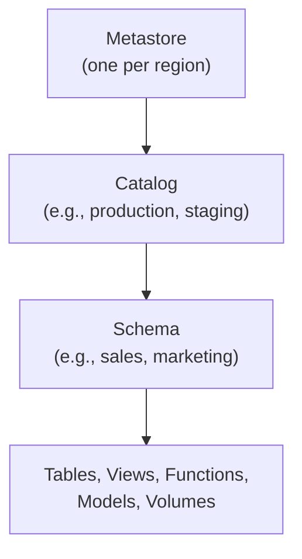

# Unity Catalog — Fundamentals


## 🎯 Analogy

Think of Unity Catalog like a central passport authority for Databricks: one governance layer across all workspaces — tables, volumes, models, and functions all have a three-part name (catalog.schema.table) and permissions managed in one place.

---
## What Is Unity Catalog?

Unity Catalog is Databricks' **unified governance solution** for all data and AI assets. It provides a single place to manage access control, auditing, lineage, and discovery across all workspaces, clouds, and data formats.

```sql
-- Before Unity Catalog: each workspace had its own isolated metastore
-- Access control was fragmented, no cross-workspace visibility

-- With Unity Catalog: one governance layer for everything
GRANT SELECT ON TABLE catalog.schema.customers TO `data-analysts@company.com`;
-- This works across ALL workspaces connected to the metastore
```

> **Key Insight for DE:** Unity Catalog is like AWS Lake Formation for Databricks — centralized permissions, data discovery, and lineage in one place. It's the governance layer you manage as a data engineer.

---

## Three-Level Namespace

Unity Catalog organizes data in a three-level hierarchy:



This hierarchy provides the full namespace for any data asset: `catalog.schema.table`.

```sql
-- Full three-level reference
SELECT * FROM production.sales.orders;

-- Equivalent to:
-- Catalog: production
-- Schema: sales
-- Table: orders

-- You can have multiple catalogs for different environments
SELECT * FROM staging.sales.orders;   -- Staging data
SELECT * FROM production.sales.orders; -- Production data
```

### Hierarchy Components

| Level | What It Is | Example | Manages |
|-------|-----------|---------|---------|
| Metastore | Top-level container (1 per region) | aws-us-east-1-metastore | All catalogs in a region |
| Catalog | Logical grouping (like a database) | production, staging, dev | Schemas within an environment |
| Schema | Collection of objects (like a schema) | sales, marketing, raw | Tables, views, functions |
| Table/View | The actual data | orders, customers | Rows and columns |

---

## Key Concepts

### Securables (What You Protect)

Everything in Unity Catalog is a "securable" — an object you can grant/deny access to:

- **Catalogs** — top-level containers
- **Schemas** — groups of tables
- **Tables** — Delta tables (managed or external)
- **Views** — SQL views
- **Volumes** — file storage (for unstructured data)
- **Functions** — UDFs
- **Models** — ML models (MLflow registered models)
- **External Locations** — cloud storage paths
- **Storage Credentials** — cloud access keys

### Principals (Who Gets Access)

- **Users** — individual Databricks accounts
- **Groups** — collections of users (synced from identity provider)
- **Service Principals** — for automated pipelines/applications

---

## Granting Permissions

```sql
-- Grant read access to a table
GRANT SELECT ON TABLE production.sales.orders TO `data-analysts`;

-- Grant all privileges on a schema
GRANT ALL PRIVILEGES ON SCHEMA production.sales TO `data-engineers`;

-- Grant usage on catalog (required to see it)
GRANT USE CATALOG ON CATALOG production TO `all-employees`;
GRANT USE SCHEMA ON SCHEMA production.sales TO `data-analysts`;

-- Revoke access
REVOKE SELECT ON TABLE production.sales.customers FROM `interns`;

-- View current grants
SHOW GRANTS ON TABLE production.sales.orders;
```

### Permission Inheritance

Permissions flow downward through the hierarchy:

```sql
-- Granting SELECT on a SCHEMA grants SELECT on ALL current AND future tables in it
GRANT SELECT ON SCHEMA production.sales TO `reporting-team`;
-- The reporting-team can now read ALL tables in production.sales
-- Including any new tables created later!

-- To grant on catalog level (all schemas, all tables):
GRANT SELECT ON CATALOG production TO `auditors`;
```

---

## Managed vs External Tables

| Aspect | Managed Table | External Table |
|--------|--------------|----------------|
| Storage | Unity Catalog manages location | You specify cloud storage path |
| DROP behavior | Data is deleted | Only metadata removed, data stays |
| When to use | Default choice | When data is shared with non-Databricks tools |
| Access control | Fully governed by UC | UC controls metadata, cloud IAM controls files |

```sql
-- Managed table (UC controls storage location)
CREATE TABLE production.sales.orders (
    order_id BIGINT,
    customer_id BIGINT,
    amount DECIMAL(10,2),
    order_date DATE
);

-- External table (you control storage)
CREATE TABLE production.raw.events
LOCATION 's3://my-bucket/raw/events/'
AS SELECT * FROM parquet.`s3://my-bucket/raw/events/`;
```

---

## External Locations and Storage Credentials

To access cloud storage, Unity Catalog needs:

```sql
-- Step 1: Create a storage credential (wraps cloud IAM role/service principal)
CREATE STORAGE CREDENTIAL my_aws_credential
WITH (
    AWS_IAM_ROLE = 'arn:aws:iam::123456789:role/unity-catalog-access'
);

-- Step 2: Create external location (maps a cloud path to the credential)
CREATE EXTERNAL LOCATION my_data_lake
URL 's3://company-data-lake/production/'
WITH (STORAGE CREDENTIAL my_aws_credential);

-- Step 3: Grant access to the external location
GRANT READ FILES ON EXTERNAL LOCATION my_data_lake TO `data-engineers`;

-- Now data engineers can read files from s3://company-data-lake/production/
```

---

## Data Lineage

Unity Catalog automatically tracks data lineage — which tables feed into which:

```sql
-- When you run:
CREATE TABLE production.analytics.daily_revenue AS
SELECT order_date, SUM(amount) as revenue
FROM production.sales.orders
GROUP BY order_date;

-- Unity Catalog automatically records:
-- production.sales.orders → production.analytics.daily_revenue
-- This lineage is visible in the UI: Catalog Explorer → Table → Lineage tab
```

**What lineage shows:**
- Upstream tables (where data comes from)
- Downstream tables (what depends on this table)
- Column-level lineage (which columns flow where)
- Notebooks/jobs that create or modify the table

---

## Audit Logging

Every access and permission change is logged:

```sql
-- Query audit logs (stored in system tables)
SELECT
    event_time,
    user_identity.email,
    action_name,
    request_params.full_name_arg AS table_accessed
FROM system.access.audit
WHERE action_name IN ('getTable', 'commandSubmit')
    AND event_date >= current_date() - 7
ORDER BY event_time DESC;
```

---


## ▶️ Try It Yourself

```sql
-- Unity Catalog three-level namespace: catalog.schema.table
CREATE CATALOG IF NOT EXISTS prod;
CREATE SCHEMA IF NOT EXISTS prod.gold;

-- Create a managed table (data stored in Unity Catalog's managed location)
CREATE TABLE IF NOT EXISTS prod.gold.orders (
    order_id BIGINT,
    amount DECIMAL(12,2),
    region STRING
)
USING DELTA;

-- Grant column-level access
GRANT SELECT ON TABLE prod.gold.orders TO `analyst-group`;
REVOKE SELECT ON TABLE prod.gold.orders FROM `intern-group`;

-- Row-level security via row filter
CREATE ROW ACCESS POLICY orders_region_policy
    AS (region STRING) RETURNS BOOLEAN
    RETURN is_member('us-team') AND region = 'US' OR is_account_admin();
```

> **Run it:** Copy the snippet into a REPL or file — no external services needed for the basic example.

---
## Interview Tips

> **Tip 1:** "What is Unity Catalog?" — A centralized governance layer for Databricks that provides: unified access control (GRANT/REVOKE across all workspaces), automatic data lineage, audit logging, and data discovery. It uses a three-level namespace: catalog.schema.table.

> **Tip 2:** "Managed vs External tables?" — Managed: Unity Catalog owns the storage, DROP deletes data. External: you own the storage (S3/ADLS), DROP only removes metadata. Use managed for internal analytics tables; external for data shared with other tools or when you need to control the storage lifecycle.

> **Tip 3:** "How does permission inheritance work?" — Permissions cascade downward: GRANT on catalog → applies to all schemas and tables within. GRANT on schema → applies to all current AND future tables. This means you can grant a team access to an entire schema and any new tables automatically inherit the permission.
