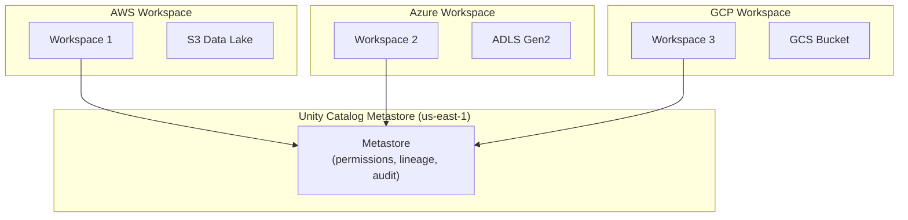

# Unity Catalog — Senior-Level Deep Dive

## Migration from Hive Metastore to Unity Catalog

Most organizations have existing workspaces with Hive metastore tables that need migration:

```python
# Migration approach: use the UCX (Unity Catalog Migration) tool
# or manual migration with SYNC command

# Step 1: Assess current state
# List all Hive metastore tables
tables_to_migrate = spark.sql("""
    SELECT database, tableName, tableType, location
    FROM hive_metastore.information_schema.tables
""").collect()

# Step 2: Create target catalog and schemas
spark.sql("CREATE CATALOG IF NOT EXISTS production")
spark.sql("CREATE SCHEMA IF NOT EXISTS production.sales")

# Step 3: Migrate tables (SYNC creates a UC reference to existing data)
# For managed tables:
spark.sql("""
    CREATE TABLE production.sales.orders
    AS SELECT * FROM hive_metastore.sales.orders
""")

# For external tables (just register, no data movement):
spark.sql("""
    CREATE TABLE production.sales.events
    LOCATION 's3://existing-bucket/events/'
""")

# Step 4: Upgrade permissions
# Old: cluster-level ACLs → New: UC GRANT statements
spark.sql("GRANT SELECT ON TABLE production.sales.orders TO `data-analysts`")

# Step 5: Update all notebooks/jobs to use new three-level namespace
# Old: SELECT * FROM sales.orders
# New: SELECT * FROM production.sales.orders
```

### Migration Challenges

| Challenge | Solution |
|-----------|----------|
| Hundreds of tables | Use UCX automated assessment + batch migration scripts |
| Existing cluster ACLs | Map old ACLs to UC groups + grants (not 1:1) |
| Hive SerDe tables | Convert to Delta format during migration |
| Cross-workspace refs | UC namespaces are consistent across workspaces |
| Breaking notebooks | Set `spark.sql.defaultCatalog = production` as bridge |

---

## Multi-Cloud Governance Architecture

Unity Catalog works across AWS, Azure, and GCP:



All workspaces share the same metastore, so permissions and lineage are consistent regardless of which cloud the data sits on.

```sql
-- Same table accessible from any workspace connected to the metastore
-- AWS workspace:
SELECT * FROM production.sales.orders;  -- Reads from S3

-- Azure workspace (if data is on ADLS):
SELECT * FROM production.marketing.campaigns;  -- Reads from ADLS

-- Cross-cloud Delta Sharing for data in different clouds
CREATE SHARE cross_cloud_share;
ALTER SHARE cross_cloud_share ADD TABLE production.sales.orders;
-- Recipients on other clouds access via the open sharing protocol
```

---

## Compliance and Regulatory Patterns

### GDPR Right-to-Erasure

```sql
-- Pattern: Find and delete user's data across all tables
-- Step 1: Use lineage to find all tables containing user data
-- System tables show which tables have columns derived from customers.email

-- Step 2: Delete from all downstream tables
DELETE FROM production.sales.orders WHERE customer_id = 12345;
DELETE FROM production.analytics.user_profiles WHERE user_id = 12345;
DELETE FROM production.ml.training_data WHERE user_id = 12345;

-- Step 3: Vacuum to physically remove (Delta Lake)
VACUUM production.sales.orders RETAIN 0 HOURS;  -- Requires disabling safety check

-- Step 4: Audit log proves deletion
SELECT * FROM system.access.audit
WHERE request_params.full_name_arg LIKE '%orders%'
  AND action_name = 'deleteData'
  AND event_date = current_date();
```

### SOC 2 / HIPAA Access Patterns

```sql
-- Principle of least privilege: minimal grants
-- No direct table grants — all through views with row filters

CREATE VIEW production.healthcare.patient_records_restricted AS
SELECT patient_id, diagnosis_code, treatment_date
       -- PII columns excluded from this view!
FROM production.healthcare.patient_records;

GRANT SELECT ON VIEW production.healthcare.patient_records_restricted TO `care-team`;
-- Audit: who accessed what, when (system.access.audit)
```

---

## Advanced Access Control Patterns

### Attribute-Based Access Control (ABAC)

```sql
-- Dynamic access based on user attributes (not just group membership)
CREATE FUNCTION production.security.department_filter(dept_col STRING)
RETURN (
    dept_col = (SELECT department FROM production.hr.employee_directory 
                WHERE email = CURRENT_USER())
);

ALTER TABLE production.hr.salary_data
SET ROW FILTER production.security.department_filter ON (department);
-- Each manager only sees their own department's salaries
```

### Time-Based Access

```sql
-- Temporary elevated access (break-glass pattern)
-- Grant: data engineer needs prod access for incident investigation
GRANT SELECT ON CATALOG production TO `on-call-engineer@company.com`;
-- Expires: use automation to revoke after 4 hours
-- (Databricks doesn't have native TTL grants — use external automation)
```

---

## Performance Considerations

```sql
-- Unity Catalog adds a permissions check per query
-- Overhead: ~50-100ms per query (negligible for batch, noticeable for high-frequency)

-- Optimize permission checks:
-- 1. Cache: UC caches grants for ~60 seconds
-- 2. Group-based grants are faster than per-user grants
-- 3. Avoid deeply nested functions in row filters (adds latency per row)

-- Monitor permission check latency:
SELECT action_name, percentile(response_time_ms, 0.99) as p99_ms
FROM system.access.audit
WHERE event_date = current_date()
GROUP BY action_name;
```

---

## System Tables for Governance

```sql
-- Billing: track compute costs by team
SELECT workspace_id, sku_name, usage_unit, SUM(usage_quantity) as total
FROM system.billing.usage
WHERE usage_date >= '2024-01-01'
GROUP BY workspace_id, sku_name, usage_unit;

-- Lineage: find all downstream dependents of a table
SELECT * FROM system.access.table_lineage
WHERE source_table_full_name = 'production.sales.orders';

-- Access patterns: who queries what most
SELECT request_params.full_name_arg as table_name, 
       user_identity.email,
       COUNT(*) as query_count
FROM system.access.audit
WHERE action_name = 'commandSubmit'
  AND event_date >= current_date() - 30
GROUP BY 1, 2
ORDER BY query_count DESC;
```

---

## Interview Tips

> **Tip 1:** "How would you migrate 500 tables from Hive metastore to Unity Catalog?" — Use the UCX assessment tool to inventory all tables and their dependencies. Migrate in phases: (1) create UC catalogs/schemas mirroring Hive databases, (2) external tables: register existing paths (no data movement), (3) managed tables: CTAS to new UC-managed locations, (4) migrate permissions from cluster ACLs to UC grants, (5) update jobs/notebooks to use three-level names. Set `spark.sql.defaultCatalog` as a bridge during transition.

> **Tip 2:** "How do you handle multi-cloud data governance?" — Unity Catalog metastore spans workspaces across clouds. Create storage credentials per cloud (IAM role for AWS, service principal for Azure). External locations point to the respective cloud storage. Same permission grants apply regardless of which workspace/cloud the user is on. For data that lives in different clouds: use Delta Sharing for cross-cloud access.

> **Tip 3:** "How do you implement GDPR deletion in a lakehouse?" — Use UC lineage to find all tables containing user data (column-level lineage traces PII columns). Delete from all tables using Delta DELETE statements. Run VACUUM to physically remove old versions. Audit logs prove compliance (who deleted, when, from which tables). Challenge: Delta time travel retains old data until VACUUM — must VACUUM with 0 retention for true erasure.
