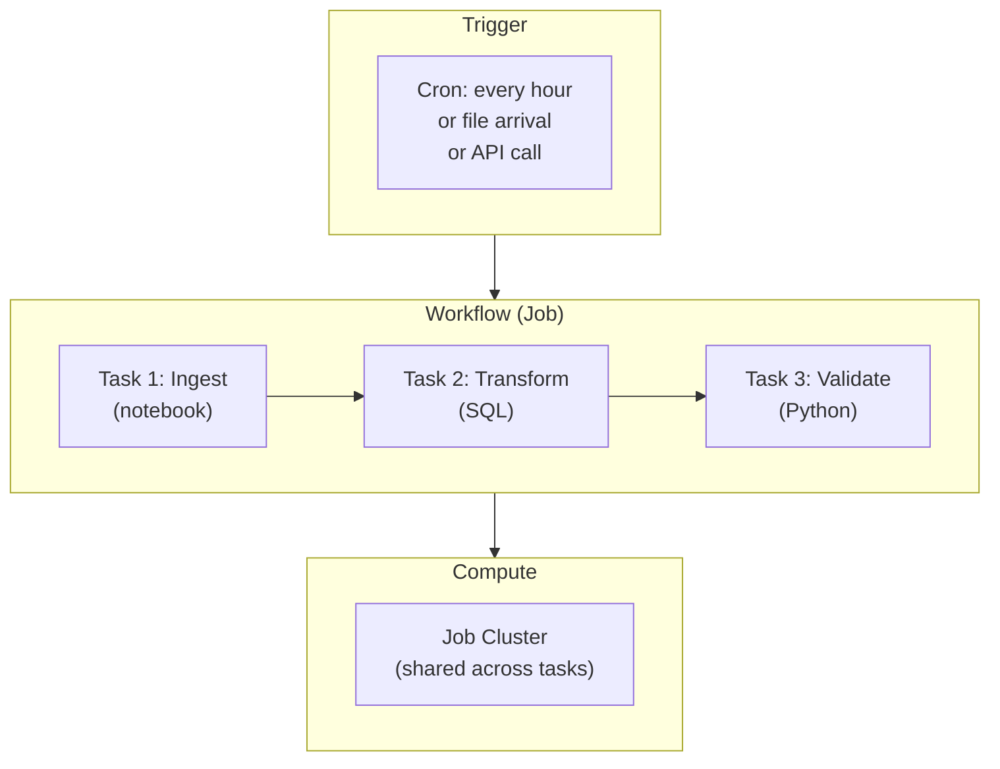

# Databricks Workflows & Jobs — Fundamentals


## 🎯 Analogy

Think of Databricks Workflows like Airflow inside Databricks: you define a DAG of tasks (notebook, Python, dbt, Delta Live Tables), set dependencies, schedule the run, and Databricks handles retries and notifications.

---
## What Are Databricks Workflows?

Databricks Workflows is the **native orchestration service** for scheduling and managing data pipelines on Databricks. It replaces external schedulers (Airflow, Cron) for Databricks-native workloads.

```python
# A Workflow = a Job with one or more Tasks
# Tasks can be: notebooks, Python scripts, SQL queries, DLT pipelines, JARs

# Example: Daily ETL workflow
# Task 1: Ingest (Auto Loader notebook)
# Task 2: Transform (SQL notebook) — depends on Task 1
# Task 3: Quality check (Python notebook) — depends on Task 2
# Task 4: Notify (if quality passes) — depends on Task 3
```

> **Key Insight for DE:** Workflows is Databricks' answer to "how do I schedule my notebooks?" It's simpler than Airflow for Databricks-only pipelines, with native integration for clusters, Unity Catalog, and DLT.

---

## Core Concepts

The following diagram shows the relationship between workflows, tasks, and clusters:



A Workflow is triggered on a schedule, executes tasks in dependency order on a compute cluster, and terminates when complete.

---

## Task Types

| Task Type | What It Runs | Best For |
|-----------|-------------|----------|
| Notebook | Databricks notebook (Python/SQL/Scala/R) | ETL logic, transformations |
| Python script | .py file from Repos or DBFS | Reusable Python modules |
| SQL | SQL query or file | Simple transformations, DDL |
| DLT pipeline | Delta Live Tables pipeline | Managed ETL pipelines |
| JAR | Java/Scala JAR | Legacy Spark applications |
| dbt | dbt task | dbt transformations |
| Run Job | Triggers another workflow | Workflow composition |

---

## Creating a Simple Workflow

### Via UI
1. Workspace → Workflows → Create Job
2. Add Task → Select notebook/script
3. Configure cluster (or use shared job cluster)
4. Add schedule (cron expression)
5. Save and run

### Via API/CLI

```python
import requests

# Create a job via Databricks REST API
job_config = {
    "name": "daily_etl_pipeline",
    "tasks": [
        {
            "task_key": "ingest",
            "notebook_task": {
                "notebook_path": "/Repos/main/pipelines/ingest_orders"
            },
            "job_cluster_key": "etl_cluster",
        },
        {
            "task_key": "transform",
            "depends_on": [{"task_key": "ingest"}],
            "notebook_task": {
                "notebook_path": "/Repos/main/pipelines/transform_orders"
            },
            "job_cluster_key": "etl_cluster",
        },
        {
            "task_key": "validate",
            "depends_on": [{"task_key": "transform"}],
            "notebook_task": {
                "notebook_path": "/Repos/main/pipelines/validate_quality"
            },
            "job_cluster_key": "etl_cluster",
        },
    ],
    "job_clusters": [
        {
            "job_cluster_key": "etl_cluster",
            "new_cluster": {
                "spark_version": "14.3.x-scala2.12",
                "node_type_id": "i3.xlarge",
                "autoscale": {"min_workers": 2, "max_workers": 8},
                "aws_attributes": {"availability": "SPOT_WITH_FALLBACK"},
            }
        }
    ],
    "schedule": {
        "quartz_cron_expression": "0 0 * * * ?",  # Every hour
        "timezone_id": "UTC",
    },
    "email_notifications": {
        "on_failure": ["data-team@company.com"],
    },
}

response = requests.post(
    f"{DATABRICKS_HOST}/api/2.1/jobs/create",
    headers={"Authorization": f"Bearer {TOKEN}"},
    json=job_config,
)
print(f"Job ID: {response.json()['job_id']}")
```

---

## Task Dependencies

Tasks can run in parallel or sequentially based on dependencies:

```python
# Linear: A → B → C (sequential)
tasks = [
    {"task_key": "ingest"},
    {"task_key": "transform", "depends_on": [{"task_key": "ingest"}]},
    {"task_key": "report", "depends_on": [{"task_key": "transform"}]},
]

# Fan-out: A → B, A → C (parallel after A)
tasks = [
    {"task_key": "ingest"},
    {"task_key": "transform_orders", "depends_on": [{"task_key": "ingest"}]},
    {"task_key": "transform_events", "depends_on": [{"task_key": "ingest"}]},
]

# Fan-in: B + C → D (wait for both)
tasks = [
    {"task_key": "ingest"},
    {"task_key": "transform_orders", "depends_on": [{"task_key": "ingest"}]},
    {"task_key": "transform_events", "depends_on": [{"task_key": "ingest"}]},
    {"task_key": "join_and_report", "depends_on": [
        {"task_key": "transform_orders"},
        {"task_key": "transform_events"},
    ]},
]
```

---

## Scheduling Options

### Cron Expressions

```python
# Every hour at minute 0
"0 0 * * * ?"

# Every day at 6 AM UTC
"0 0 6 * * ?"

# Every 15 minutes
"0 */15 * * * ?"

# Weekdays at 8 AM
"0 0 8 ? * MON-FRI"

# First day of month at midnight
"0 0 0 1 * ?"
```

### Trigger Types

| Trigger | Behavior | Use Case |
|---------|----------|----------|
| Scheduled (cron) | Runs at fixed times | Daily/hourly batch ETL |
| Continuous | Re-runs immediately after completion | Near-real-time processing |
| File arrival | Triggers when new files appear in a path | Event-driven ingestion |
| Manual/API | Triggered by user or external system | On-demand, CI/CD |

---

## Task Values (Passing Data Between Tasks)

```python
# Task 1: Compute a value and pass it downstream
# In notebook "ingest_orders":
row_count = df.count()
dbutils.jobs.taskValues.set(key="rows_ingested", value=row_count)
dbutils.jobs.taskValues.set(key="source_date", value="2024-03-15")

# Task 2: Read the value from Task 1
# In notebook "validate_quality":
rows = dbutils.jobs.taskValues.get(taskKey="ingest", key="rows_ingested")
source_date = dbutils.jobs.taskValues.get(taskKey="ingest", key="source_date")

if rows == 0:
    raise Exception(f"No data ingested for {source_date}!")
print(f"Validating {rows} rows from {source_date}")
```

---

## Cluster Configuration

### Job Clusters vs All-Purpose Clusters

| Aspect | Job Cluster | All-Purpose Cluster |
|--------|------------|-------------------|
| Lifecycle | Created for job, terminated after | Always running |
| Cost | 60% cheaper (Jobs compute pricing) | Full price |
| Use case | Production pipelines | Interactive development |
| Auto-termination | Immediate after job | Configurable idle timeout |

```python
# Job cluster (recommended for production):
"job_clusters": [{
    "job_cluster_key": "etl_cluster",
    "new_cluster": {
        "spark_version": "14.3.x-scala2.12",
        "node_type_id": "i3.xlarge",
        "num_workers": 4,
        "aws_attributes": {
            "availability": "SPOT_WITH_FALLBACK",  # Spot = 70% cheaper
            "zone_id": "auto",
        },
    }
}]

# Shared cluster (multiple tasks share one cluster — saves startup time):
# task_key: "ingest" → job_cluster_key: "shared_cluster"
# task_key: "transform" → job_cluster_key: "shared_cluster"
# Both tasks use the same cluster (no restart between tasks)
```

---

## Error Handling and Retries

```python
# Task-level retry
{
    "task_key": "ingest",
    "notebook_task": {"notebook_path": "/pipelines/ingest"},
    "retry_on_timeout": True,
    "max_retries": 3,
    "min_retry_interval_millis": 30000,  # 30 seconds between retries
}

# Conditional tasks (run only if upstream fails)
{
    "task_key": "alert_on_failure",
    "depends_on": [{"task_key": "ingest", "outcome": "task_failure"}],
    "notebook_task": {"notebook_path": "/pipelines/send_alert"},
}
```

---

## Notifications

```python
"email_notifications": {
    "on_start": ["team@company.com"],
    "on_success": [],
    "on_failure": ["team@company.com", "oncall@company.com"],
    "on_duration_warning_threshold_exceeded": ["team@company.com"],
},
"notification_settings": {
    "no_alert_for_skipped_runs": True,
    "no_alert_for_canceled_runs": True,
},
"health": {
    "rules": [
        {"metric": "RUN_DURATION_SECONDS", "op": "GREATER_THAN", "value": 3600}
    ]
}
# Alert if job takes longer than 1 hour (SLA breach)
```

---


## ▶️ Try It Yourself

```python
import requests
import os

DATABRICKS_HOST = os.environ.get("DATABRICKS_HOST", "https://adb-xxx.azuredatabricks.net")
TOKEN = os.environ.get("DATABRICKS_TOKEN", "dapi...")

# Create a multi-task workflow job
job_def = {
    "name": "orders-etl-pipeline",
    "tasks": [
        {
            "task_key": "ingest",
            "notebook_task": {
                "notebook_path": "/pipelines/01_ingest_orders",
                "base_parameters": {"date": "2024-01-15"},
            },
        },
        {
            "task_key": "transform",
            "depends_on": [{"task_key": "ingest"}],
            "notebook_task": {"notebook_path": "/pipelines/02_transform_orders"},
        },
    ],
    "schedule": {"quartz_cron_expression": "0 0 6 * * ?", "timezone_id": "UTC"},
}

resp = requests.post(
    f"{DATABRICKS_HOST}/api/2.1/jobs/create",
    headers={"Authorization": f"Bearer {TOKEN}"},
    json=job_def,
)
print("Job created:", resp.json().get("job_id"))
```

> **Run it:** Copy the snippet into a REPL or file — no external services needed for the basic example.

---
## Interview Tips

> **Tip 1:** "What are Databricks Workflows?" — The native orchestration service for scheduling and running data pipelines. Jobs contain tasks (notebooks, SQL, DLT, Python scripts) with dependencies. Tasks execute on job clusters (cheaper than all-purpose). Supports cron scheduling, file-arrival triggers, and API triggers.

> **Tip 2:** "Job clusters vs all-purpose clusters?" — Job clusters are created for the job and terminated after (60% cheaper, Jobs compute pricing). All-purpose clusters stay running (for interactive work). Always use job clusters for production pipelines — significant cost savings with no performance difference.

> **Tip 3:** "How do you pass data between tasks?" — `dbutils.jobs.taskValues.set(key, value)` in the upstream task, `dbutils.jobs.taskValues.get(taskKey, key)` in the downstream task. Use for: row counts, dates, status flags, file paths. Not for large data — just metadata. For large data: write to a Delta table and read in the next task.
