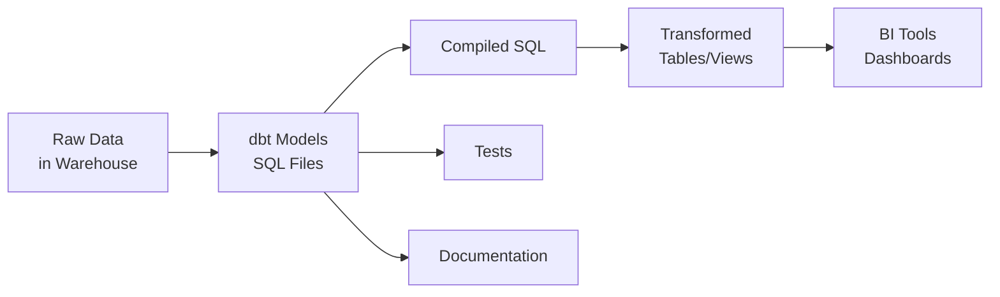
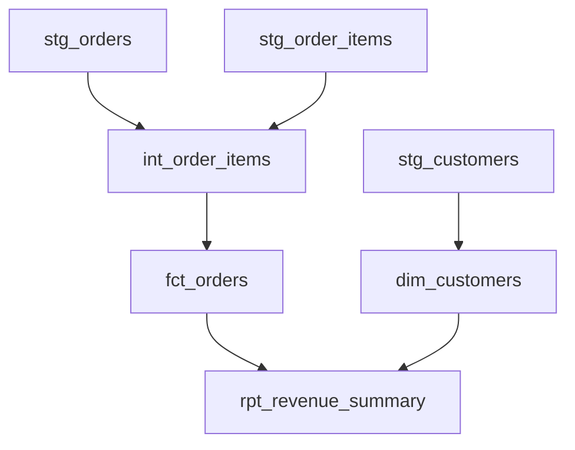

# dbt Fundamentals


## 🎯 Analogy

Think of dbt like version-controlled SQL with a test suite built in. Instead of running raw SQL scripts manually, you define models as SELECT statements and dbt handles materializing them, testing them, and documenting them.

---
## What Is dbt?

dbt (data build tool) is an open-source transformation framework that enables analytics engineers to transform data in their warehouse using SQL. It brings software engineering best practices — version control, testing, documentation, and modularity — to data transformation.



## Core Concept: ELT not ETL

dbt sits in the **T** of ELT (Extract, Load, Transform):
- **Extract**: Fivetran, Airbyte, Stitch pull data into the warehouse
- **Load**: Raw data lands in staging tables
- **Transform**: dbt transforms raw → clean → business-ready

```
Raw Layer (source)  →  Staging Layer (stg_)  →  Marts (dim_, fct_)
```

## dbt Project Structure

```
my_dbt_project/
├── dbt_project.yml          # Project configuration
├── profiles.yml             # Warehouse connections (not in repo)
├── models/
│   ├── staging/             # Light cleaning of raw sources
│   │   └── stg_orders.sql
│   ├── intermediate/        # Business logic joins
│   │   └── int_order_items.sql
│   └── marts/               # Final consumption models
│       ├── core/
│       │   ├── dim_customers.sql
│       │   └── fct_orders.sql
│       └── finance/
├── tests/                   # Custom test SQL
├── macros/                  # Reusable Jinja functions
├── seeds/                   # CSV reference data
├── snapshots/               # SCD Type 2 tracking
├── analyses/                # Ad-hoc SQL (not materialized)
└── docs/                    # Documentation files
```

## dbt_project.yml

```yaml
name: 'my_project'
version: '1.0.0'
config-version: 2

profile: 'my_profile'

model-paths: ["models"]
test-paths: ["tests"]
seed-paths: ["seeds"]
macro-paths: ["macros"]
snapshot-paths: ["snapshots"]

models:
  my_project:
    staging:
      +materialized: view       # All staging models → views
      +schema: staging
    marts:
      +materialized: table      # All mart models → tables
      core:
        +tags: ['core']
```

## profiles.yml

Stores warehouse credentials (kept outside version control):

```yaml
my_profile:
  target: dev
  outputs:
    dev:
      type: snowflake
      account: xy12345.us-east-1
      user: "{{ env_var('DBT_USER') }}"
      password: "{{ env_var('DBT_PASSWORD') }}"
      role: TRANSFORMER
      database: DEV_DB
      warehouse: COMPUTE_WH
      schema: dbt_yourname
      threads: 4

    prod:
      type: snowflake
      account: xy12345.us-east-1
      user: "{{ env_var('DBT_USER') }}"
      password: "{{ env_var('DBT_PASSWORD') }}"
      role: TRANSFORMER
      database: PROD_DB
      warehouse: COMPUTE_WH
      schema: analytics
      threads: 8
```

## Key CLI Commands

| Command | What It Does |
|---|---|
| `dbt run` | Compile and run all models |
| `dbt test` | Execute all tests |
| `dbt docs generate` | Build documentation site |
| `dbt docs serve` | Serve docs locally |
| `dbt compile` | Compile SQL without running |
| `dbt seed` | Load CSV files into warehouse |
| `dbt snapshot` | Run snapshots |
| `dbt debug` | Test connection |
| `dbt deps` | Install packages from hub.getdbt.com |

## Selector Syntax

```bash
# Run specific model
dbt run --select stg_orders

# Run model + all downstream models
dbt run --select stg_orders+

# Run model + all upstream models
dbt run --select +fct_orders

# Run all models in a folder
dbt run --select staging.*

# Run by tag
dbt run --select tag:core

# Exclude a model
dbt run --exclude stg_legacy_table
```

## How dbt Compiles SQL

dbt uses **Jinja templating** to generate SQL at runtime:

```sql
-- models/staging/stg_orders.sql
SELECT
    order_id,
    customer_id,
    order_date,
    total_amount,
    status
FROM {{ source('raw', 'orders') }}
WHERE order_date >= '2020-01-01'
```

Compiled to:
```sql
SELECT
    order_id,
    customer_id,
    order_date,
    total_amount,
    status
FROM raw.public.orders
WHERE order_date >= '2020-01-01'
```

## The ref() Function

The `ref()` function is dbt's most important concept — it creates dependencies between models:

```sql
-- models/marts/fct_orders.sql
SELECT
    o.order_id,
    o.order_date,
    c.customer_name,
    o.total_amount
FROM {{ ref('stg_orders') }} o
JOIN {{ ref('dim_customers') }} c
    ON o.customer_id = c.customer_id
```

dbt automatically:
1. Resolves `ref()` to the correct database/schema/table name
2. Builds a **DAG** of model dependencies
3. Runs models in correct order

## DAG (Directed Acyclic Graph)

dbt builds a dependency graph ensuring models run in the right order:



## Summary

| Concept | Purpose |
|---|---|
| `ref()` | Reference other models, build DAG |
| `source()` | Reference raw source tables |
| `dbt_project.yml` | Project config, materializations |
| `profiles.yml` | Warehouse connection secrets |
| Models | SQL SELECT statements = tables/views |
| Tests | Validate data quality |
| Macros | Reusable Jinja SQL functions |

## ▶️ Try It Yourself

```bash
# Install dbt
pip install dbt-snowflake  # or dbt-bigquery, dbt-postgres, etc.

# Initialize a project
dbt init my_project
cd my_project

# Run all models
dbt run

# Test all models (schema tests + custom tests)
dbt test

# Generate and serve documentation
dbt docs generate && dbt docs serve
```

> **Run it:** Copy the snippet into a REPL or file and run it — no external services needed for the basic example.

---
