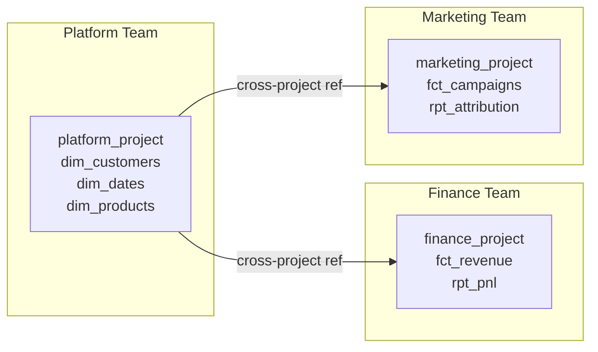

# dbt Fundamentals — Senior Deep Dive

## dbt Mesh (Multi-Project Architecture)

dbt Mesh enables splitting a monolithic dbt project into multiple federated projects that share models across team boundaries.



### Cross-Project References

```yaml
# dependencies.yml (in consuming project)
projects:
  - name: platform_project
    git: "https://github.com/org/platform-dbt.git"
```

```sql
-- Reference a model from another project
SELECT * FROM {{ ref('platform_project', 'dim_customers') }}
```

### Public vs Private Models

```yaml
# models/schema.yml
models:
  - name: dim_customers
    access: public      # Accessible cross-project
    config:
      contract:
        enforced: true  # Schema contract must be satisfied

  - name: int_customer_orders
    access: private     # Only within this project
```

## Model Contracts

Enforce column schemas at build time — prevents silent breaking changes:

```yaml
models:
  - name: fct_orders
    config:
      contract:
        enforced: true
    columns:
      - name: order_id
        data_type: bigint
        constraints:
          - type: not_null
          - type: primary_key
      - name: customer_id
        data_type: bigint
        constraints:
          - type: not_null
          - type: foreign_key
            to: ref('dim_customers')
            to_columns: [customer_id]
      - name: order_date
        data_type: date
      - name: total_amount
        data_type: numeric
```

If the model's SELECT doesn't produce these columns with these types, the build fails before writing any data.

## dbt Semantic Layer

Define business metrics once, query anywhere (BI tools, notebooks, APIs):

```yaml
# models/metrics/schema.yml
semantic_models:
  - name: orders
    model: ref('fct_orders')
    entities:
      - name: order
        type: primary
        expr: order_id
      - name: customer
        type: foreign
        expr: customer_id
    dimensions:
      - name: order_date
        type: time
        type_params:
          time_granularity: day
    measures:
      - name: revenue
        agg: sum
        expr: total_amount
      - name: order_count
        agg: count_distinct
        expr: order_id

metrics:
  - name: monthly_revenue
    type: simple
    type_params:
      measure: revenue
  - name: average_order_value
    type: ratio
    type_params:
      numerator: revenue
      denominator: order_count
```

Query via MetricFlow CLI:
```bash
mf query --metrics monthly_revenue --group-by metric_time__month
```

## Performance Optimization at Scale

### Partition Pruning with Incremental Models

```sql
{{ config(
    materialized='incremental',
    unique_key='order_id',
    partition_by={
        "field": "order_date",
        "data_type": "date",
        "granularity": "day"
    },
    cluster_by=['customer_id'],
    incremental_strategy='merge',
    on_schema_change='sync_all_columns'
) }}

SELECT * FROM {{ source('raw', 'orders') }}

    WHERE order_date >= DATE_SUB(CURRENT_DATE(), INTERVAL 3 DAY)

```

### Thread Optimization

```yaml
# profiles.yml — tune threads based on warehouse size
prod:
  threads: 32   # Run 32 models in parallel
  query_comment:
    comment: "dbt={{ dbt_version }}, model={{ node.name }}"
    append: true
```

### Reducing Full Table Scans

```sql
-- Bad: scans entire table every run
{{ config(materialized='table') }}
SELECT * FROM huge_source_table WHERE status = 'active'

-- Good: view for small models, incremental for large
{{ config(
    materialized='incremental',
    unique_key='id'
) }}
SELECT * FROM huge_source_table

WHERE updated_at > (SELECT MAX(updated_at) FROM {{ this }})

```

## Advanced Orchestration Patterns

### Model-Level Concurrency Control

```sql
-- Use post_hook to vacuum/analyze after large loads
{{ config(
    post_hook=[
        "ANALYZE {{ this }}",
        "VACUUM {{ this }}"
    ]
) }}
```

### Conditional Logic Based on Target

```sql

    -- Full production logic
    SELECT * FROM {{ source('raw', 'events') }}

    -- Dev: sample last 7 days only
    SELECT * FROM {{ source('raw', 'events') }}
    WHERE event_date >= CURRENT_DATE - 7

```

## Governance at Scale

### Meta Fields for Ownership

```yaml
models:
  - name: fct_orders
    meta:
      owner: "@finance-team"
      sla: "06:00 UTC daily"
      pii: false
      tier: gold
    config:
      tags: ['daily', 'finance', 'tier-gold']
```

### Automated Freshness Checks

```yaml
sources:
  - name: raw
    freshness:
      warn_after: {count: 6, period: hour}
      error_after: {count: 12, period: hour}
    loaded_at_field: _loaded_at
    tables:
      - name: orders
        freshness:
          warn_after: {count: 2, period: hour}
          error_after: {count: 4, period: hour}
```

## State-Based CI/CD

```bash
# Production state stored in artifact storage (S3, GCS)
# CI pipeline: only run/test changed models and their children

# 1. Download prod manifest
aws s3 cp s3://dbt-artifacts/manifest.json ./prod-manifest/

# 2. Run only changed models
dbt run \
  --select state:modified+ \
  --state ./prod-manifest \
  --target ci

# 3. Test only changed models
dbt test \
  --select state:modified+ \
  --state ./prod-manifest \
  --target ci
```

This reduces CI time from 2 hours to minutes on large projects.
