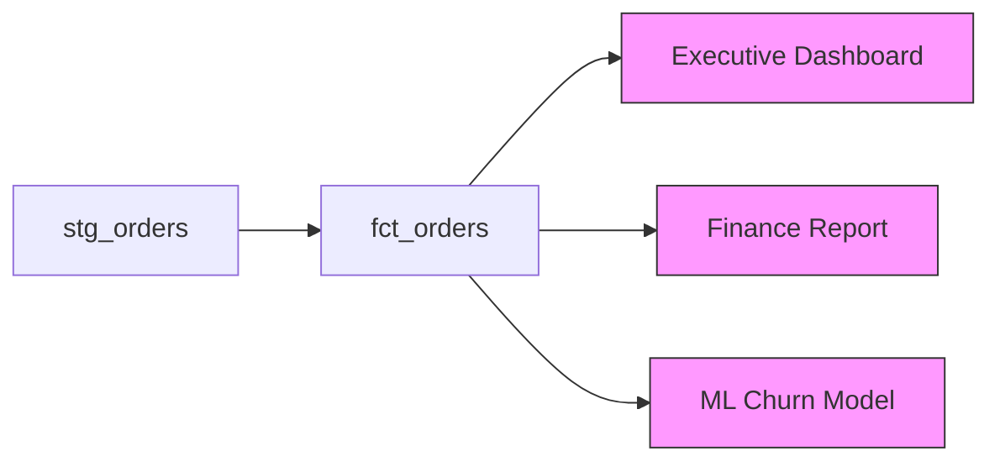

# dbt Exposures & Metrics

## Exposures — Document Downstream Consumers

Exposures tell dbt what uses your models — dashboards, APIs, ML models. They appear in the lineage graph.

```yaml
# models/exposures.yml
version: 2

exposures:
  - name: executive_revenue_dashboard
    type: dashboard
    maturity: high
    url: https://app.powerbi.com/groups/xxx/reports/yyy
    description: >
      Executive dashboard showing daily revenue, customer growth,
      and product performance. Refreshed daily at 6am ET.
    depends_on:
      - ref('fct_orders')
      - ref('dim_customers')
      - ref('dim_products')
    owner:
      name: Finance Analytics Team
      email: finance-analytics@company.com

  - name: order_prediction_model
    type: ml
    maturity: medium
    description: "ML model predicting order cancellations using 30-day features"
    depends_on:
      - ref('fct_orders')
      - ref('dim_customers')
    owner:
      name: Data Science Team
      email: data-science@company.com
```

## Exposure Types

| Type | Use Case |
|---|---|
| `dashboard` | Power BI, Tableau, Metabase, Looker |
| `notebook` | Jupyter, Databricks notebooks |
| `analysis` | Ad-hoc SQL queries, Hex notebooks |
| `ml` | Machine learning model training |
| `application` | Operational apps consuming data |

## Exposure Maturity Levels

| Maturity | Meaning |
|---|---|
| `low` | Experimental, may change |
| `medium` | In active use, stable |
| `high` | Business-critical, SLA-governed |

## Why Exposures Matter



When you see exposures in the lineage graph:
- Before refactoring `fct_orders`, you know 3 things depend on it
- Impact analysis: if `fct_orders` fails, which dashboards break?
- Ownership: who to notify when schema changes

## Metrics — The dbt Semantic Layer

Define business metrics once in YAML, query them anywhere:

```yaml
# models/metrics/schema.yml
semantic_models:
  - name: orders
    model: ref('fct_orders')
    entities:
      - name: order
        type: primary
        expr: order_id
      - name: customer
        type: foreign
        expr: customer_id
    dimensions:
      - name: order_date
        type: time
        type_params:
          time_granularity: day
      - name: status
        type: categorical
      - name: region
        type: categorical
    measures:
      - name: revenue
        agg: sum
        expr: total_amount
      - name: order_count
        agg: count_distinct
        expr: order_id
      - name: avg_order_value
        agg: average
        expr: total_amount
```

## Defining Metrics

```yaml
metrics:
  - name: total_revenue
    type: simple
    label: "Total Revenue"
    type_params:
      measure: revenue
    description: "Sum of all order revenue"

  - name: average_order_value
    type: ratio
    label: "Average Order Value"
    type_params:
      numerator: revenue
      denominator: order_count

  - name: monthly_active_customers
    type: count_distinct
    label: "Monthly Active Customers"
    type_params:
      measure:
        name: customer_count
        filter: "{{ TimeDimension('order__order_date', 'MONTH') }} = {{ now() | date_trunc('month') }}"
```

## Querying Metrics via MetricFlow CLI

```bash
# Install MetricFlow
pip install dbt-metricflow

# Query a metric
mf query --metrics total_revenue --group-by order__order_date__month

# Multiple metrics
mf query \
  --metrics total_revenue,order_count,average_order_value \
  --group-by order__order_date__week \
  --where "order__status = 'delivered'"

# Validate metrics
mf validate-configs
```

## Querying via dbt Cloud Semantic Layer

```python
# Python client
from dbt_sl_sdk import SemanticLayerClient

client = SemanticLayerClient(
    environment_id=12345,
    auth_token="your_token"
)

df = client.query(
    metrics=["total_revenue", "order_count"],
    group_by=["order__order_date__month"],
    where=["order__region = 'US'"]
)
```
