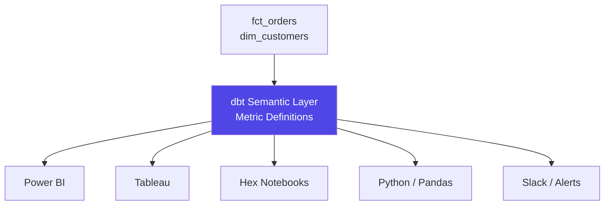

# dbt Exposures & Metrics — Senior Deep Dive

## Semantic Layer as Single Source of Truth

The key architectural benefit: metrics defined once, consistent everywhere.



Without semantic layer: `revenue` calculated differently in Power BI (excludes refunds), Tableau (includes refunds), and Python (unknown). Finance closes the books with different numbers every month.

With semantic layer: change the `revenue` metric definition once → all tools automatically use the new logic.

## Metric Governance at Scale

```yaml
metrics:
  - name: net_revenue
    type: derived
    label: "Net Revenue"
    meta:
      owner: "@finance-team"
      certified: true              # Official company metric
      certification_date: "2024-01-15"
      calculation_notes: >
        Gross revenue minus refunds and chargebacks.
        Excludes internal test orders (is_test=true).
        Aligned with GAAP revenue recognition policy.
      jira_ticket: "FIN-2341"
    type_params:
      expr: gross_revenue - refunds - chargebacks
      metrics:
        - gross_revenue
        - refunds
        - chargebacks
```

Badge system in dbt docs:
- `certified: true` → Finance-approved definition
- `certified: false` → Experimental, use with caution

## Dimension Hierarchies

Model roll-up hierarchies for drill-down analytics:

```yaml
semantic_models:
  - name: geography
    model: ref('dim_geography')
    entities:
      - name: location
        type: primary
        expr: location_id
    dimensions:
      - name: city
        type: categorical
      - name: state
        type: categorical
      - name: region
        type: categorical
      - name: country
        type: categorical
```

Enable drill-through in BI tools:
```bash
# Country → Region → State → City
mf query --metrics revenue --group-by location__country
mf query --metrics revenue --group-by location__region --where "location__country = 'US'"
mf query --metrics revenue --group-by location__state --where "location__region = 'West'"
```

## Custom Granularities

```yaml
semantic_models:
  - name: orders
    dimensions:
      - name: order_date
        type: time
        type_params:
          time_granularity: day
    primary_entity: order

# Define fiscal calendar custom granularity
metrics:
  - name: revenue
    type: simple
    type_params:
      measure: revenue
    filter: |
      {{ TimeDimension('order__order_date') }} >= '{{ var("fiscal_year_start") }}'
```

## Exports to Warehouse (dbt 1.7+)

Materialize metric results as warehouse tables:

```yaml
saved_queries:
  - name: executive_kpis
    query_params:
      metrics: [total_revenue, order_count, avg_order_value, net_new_customers]
      group_by: ["Dimension('order__order_date__month')"]
    exports:
      - name: executive_kpis_monthly
        config:
          export_as: table
          schema: reporting
          alias: executive_kpis_monthly
```

```bash
# Run and materialize
mf run-saved-query executive_kpis

# Schedule in Airflow
mf_task = BashOperator(
    task_id='materialize_kpis',
    bash_command='mf run-saved-query executive_kpis'
)
```

## Exposure Coverage Audit

Check which models have exposures (identify orphaned models):

```bash
# List all models
dbt ls --resource-type model --output json > all_models.json

# List all models referenced by exposures
dbt ls --select +exposure:* --resource-type model --output json > exposed_models.json

# Find models with no downstream exposure (potential zombies)
python3 << 'EOF'
import json

with open('all_models.json') as f:
    all_models = set(json.load(f))

with open('exposed_models.json') as f:
    exposed = set(json.load(f))

orphaned = all_models - exposed
print(f"Models with no downstream exposure: {len(orphaned)}")
for m in sorted(orphaned):
    if 'marts' in m:  # Only flag mart-layer orphans
        print(f"  ORPHAN: {m}")
EOF
```

Mart models with no exposure are candidates for deprecation — they may be unused.

## ⚡ Cheat Sheet

**Exposure YAML**
```yaml
exposures:
  - name: revenue_dashboard
    type: dashboard          # dashboard | notebook | analysis | ml | application
    maturity: high           # low | medium | high
    url: https://...
    description: "..."
    depends_on:
      - ref('fct_orders')
      - ref('dim_customers')
    owner:
      name: Revenue Team
      email: revenue@company.com
```

**Why exposures matter**
- `dbt ls --select +exposure:revenue_dashboard`: find ALL upstream models feeding a dashboard
- Impact analysis: change a model → check which exposures are affected before deploying
- `dbt docs generate`: exposures appear in lineage graph with downstream context

**MetricFlow (dbt 1.6+)**
```yaml
metrics:
  - name: revenue
    type: simple
    label: "Total Revenue"
    type_params:
      measure:
        name: order_amount
        fill_nulls_with: 0
    filter: "{{ Dimension('order__status') }} = 'completed'"
```

**Semantic layer query**
```python
# dbt Cloud semantic layer API
from dbt_sl_sdk import SemanticLayerClient
results = client.query(metrics=["revenue"], group_by=["metric_time__week"])
```

**Metric types**
| Type | Formula | Example |
|---|---|---|
| `simple` | Single measure | total revenue |
| `ratio` | numerator / denominator | conversion rate |
| `cumulative` | Running total | YTD revenue |
| `derived` | Expression over other metrics | gross margin % |

**Key governance value**
- Exposures: document the "last mile" so engineers know blast radius before changes
- MetricFlow: single metric definition → consistent numbers across all BI tools
- Combine: exposure → metric → dimension = full semantic contract from source to dashboard
