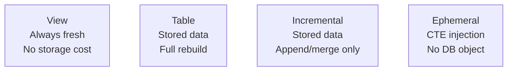

# dbt Models & Materializations

## What Is a dbt Model?

A dbt model is simply a **SQL SELECT statement** saved as a `.sql` file. dbt compiles it and executes it against your warehouse, materializing the result as a table, view, or other format.

```sql
-- models/staging/stg_orders.sql
SELECT
    order_id,
    customer_id,
    CAST(order_date AS DATE)        AS order_date,
    UPPER(status)                   AS status,
    ROUND(total_amount, 2)          AS total_amount
FROM {{ source('raw', 'orders') }}
WHERE order_id IS NOT NULL
```

## The Four Core Materializations

### 1. View (default)

```sql
{{ config(materialized='view') }}

SELECT * FROM {{ source('raw', 'customers') }}
```

- Creates a database view
- No data stored — query runs at read time
- Always fresh (reads from source on every access)
- Best for: staging models, simple transformations

### 2. Table

```sql
{{ config(materialized='table') }}

SELECT
    customer_id,
    SUM(total_amount) AS lifetime_value
FROM {{ ref('stg_orders') }}
GROUP BY customer_id
```

- Physically stores data as a table
- Full rebuild every `dbt run`
- Best for: aggregations, expensive queries, final mart models

### 3. Incremental

```sql
{{ config(
    materialized='incremental',
    unique_key='order_id'
) }}

SELECT order_id, customer_id, order_date, total_amount
FROM {{ source('raw', 'orders') }}


    WHERE order_date > (SELECT MAX(order_date) FROM {{ this }})

```

- Appends or merges only new/changed rows
- Uses `is_incremental()` to filter during incremental runs
- `{{ this }}` refers to the existing table
- Best for: large, append-heavy tables (events, transactions)

### 4. Ephemeral

```sql
{{ config(materialized='ephemeral') }}

SELECT order_id, customer_id, total_amount
FROM {{ source('raw', 'orders') }}
WHERE status = 'completed'
```

- Not materialized in the database at all
- Compiled as a CTE into models that reference it
- Best for: small, reusable logic you don't want to persist



## Choosing the Right Materialization

| Model Type | Rows | Rebuild Cost | Use |
|---|---|---|---|
| Staging | Any | Low | view |
| Simple aggregation | < 10M | Medium | table |
| Large aggregation | > 10M | High | incremental |
| Shared logic snippet | Any | N/A | ephemeral |
| Real-time dashboard | Any | N/A | view |
| Historical archive | Billions | Very High | incremental |

## Config Options

```sql
{{ config(
    materialized='table',
    schema='finance',              -- Override default schema
    alias='revenue_summary',       -- Override table name
    tags=['daily', 'finance'],
    enabled=true,
    pre_hook="DELETE FROM {{ this }} WHERE status = 'test'",
    post_hook="GRANT SELECT ON {{ this }} TO ROLE REPORTER"
) }}
```

## Column-Level Documentation

```yaml
# models/marts/schema.yml
version: 2

models:
  - name: fct_orders
    description: "One row per order. Grain: order_id."
    config:
      materialized: table
    columns:
      - name: order_id
        description: "Primary key"
        tests:
          - unique
          - not_null
      - name: total_amount
        description: "Order total in USD"
        tests:
          - not_null
          - dbt_utils.accepted_range:
              min_value: 0
              max_value: 100000
```

## File Naming Conventions

```
models/
├── staging/
│   └── stg_{source}_{entity}.sql      # e.g. stg_shopify_orders.sql
├── intermediate/
│   └── int_{entity}_{verb}.sql        # e.g. int_orders_pivoted.sql
└── marts/
    ├── dim_{entity}.sql               # e.g. dim_customers.sql
    └── fct_{event}.sql                # e.g. fct_orders.sql
```
