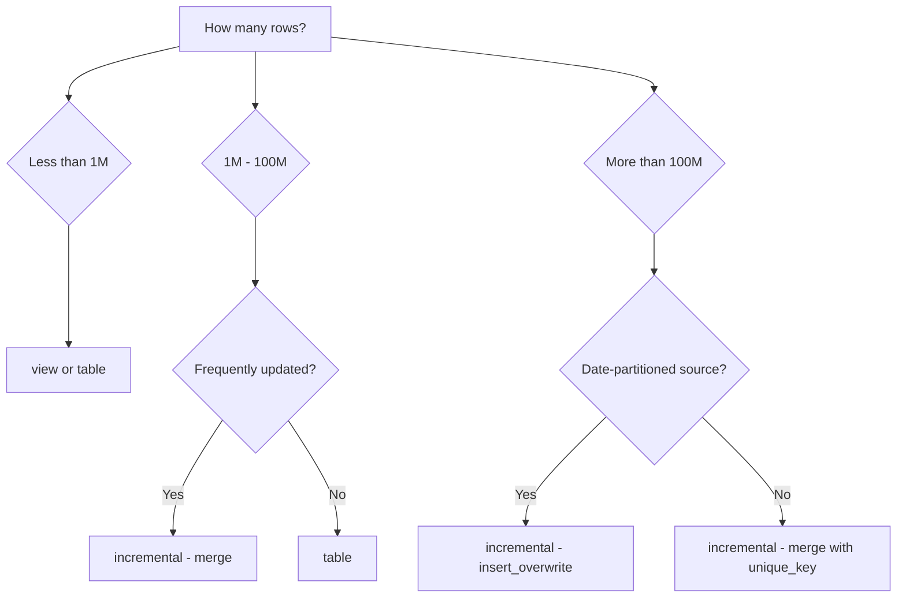

# dbt Models & Materializations — Real-World Examples

## Example 1: E-Commerce Fact Table (Incremental + Merge)

Production `fct_orders` handling 10M new rows/day:

```sql
{{ config(
    materialized='incremental',
    unique_key='order_id',
    incremental_strategy='merge',
    on_schema_change='sync_all_columns',
    partition_by={"field": "order_date", "data_type": "date"},
    cluster_by=['customer_id'],
    tags=['daily', 'core', 'tier-gold']
) }}

WITH orders AS (
    SELECT
        order_id,
        customer_id,
        order_date,
        status,
        total_amount,
        _loaded_at
    FROM {{ source('raw', 'orders') }}
    
    WHERE _loaded_at > (
        SELECT DATEADD('hour', -2, MAX(_loaded_at))
        FROM {{ this }}
    )
    
),

enriched AS (
    SELECT
        o.order_id,
        o.customer_id,
        c.customer_tier,
        o.order_date,
        o.status,
        o.total_amount,
        CASE WHEN o.total_amount > 500 THEN true ELSE false END AS is_high_value
    FROM orders o
    LEFT JOIN {{ ref('dim_customers') }} c
        ON o.customer_id = c.customer_id
)

SELECT * FROM enriched
```

## Example 2: Microbatch Backfill Strategy

When you need to reprocess 3 years of event data:

```sql
{{ config(
    materialized='incremental',
    incremental_strategy='microbatch',
    event_time='event_date',
    begin='2021-01-01',
    batch_size='day',
    concurrent_batches=4
) }}

SELECT
    event_id,
    user_id,
    event_type,
    event_date,
    properties
FROM {{ source('raw', 'events') }}
WHERE event_date = '{{ model.config.batch.id }}'
```

Run backfill:
```bash
# Process missing date range
dbt run --select fct_events \
  --event-time-start "2021-01-01" \
  --event-time-end "2024-01-01"
```

## Example 3: Materialized View for Real-Time Dashboard

Snowflake materialized view for a live sales dashboard:

```sql
-- models/reporting/mv_sales_today.sql
{{ config(
    materialized='materialized_view',
    snowflake_warehouse='REPORTING_WH',
    refresh_mode='AUTO',
    initialize='ON_CREATE'
) }}

SELECT
    CONVERT_TIMEZONE('UTC', 'America/New_York', order_ts) AS order_ts_et,
    product_category,
    region,
    SUM(revenue) AS total_revenue,
    COUNT(*) AS order_count
FROM {{ ref('fct_orders') }}
WHERE order_ts >= CURRENT_DATE
GROUP BY 1, 2, 3
```

The dashboard always reads the MV (pre-computed), auto-refreshed by Snowflake as new data arrives.

## Example 4: Zero-Copy Clone for Dev Environments

```sql
-- macros/clone_prod_for_dev.sql

    
        
            CREATE OR REPLACE TABLE
                {{ target.database }}.{{ target_schema }}.{{ model.name }}
            CLONE
                prod_db.analytics.{{ model.name }};
        
    

```

Creates instant dev environment via Snowflake zero-copy cloning — no data duplication, no storage cost.

## Materialization Decision Tree


