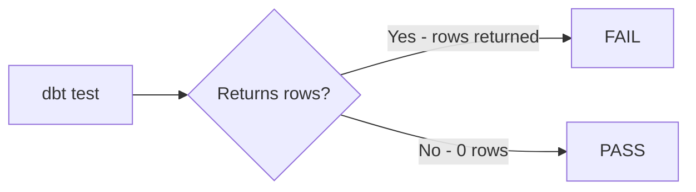

# dbt Testing

## Why Test in dbt?

dbt tests validate that your data meets expectations. They run as SQL queries — if a test returns rows, it fails; if it returns 0 rows, it passes.



## Generic Tests (Built-In)

Applied in `schema.yml` files:

```yaml
models:
  - name: fct_orders
    columns:
      - name: order_id
        tests:
          - unique           # No duplicate values
          - not_null         # No NULL values

      - name: status
        tests:
          - accepted_values:
              values: ['pending', 'shipped', 'delivered', 'cancelled']

      - name: customer_id
        tests:
          - relationships:
              to: ref('dim_customers')
              field: customer_id
```

### The 4 Built-In Generic Tests

| Test | What It Checks |
|---|---|
| `unique` | No duplicate values in the column |
| `not_null` | No NULL values in the column |
| `accepted_values` | All values are in the allowed list |
| `relationships` | Foreign key integrity — all values exist in another table |

## Singular Tests (Custom SQL)

One-off data quality rules written as SQL files in the `tests/` folder:

```sql
-- tests/assert_orders_have_positive_total.sql
-- Returns rows where this is violated (test fails if any rows returned)
SELECT
    order_id,
    total_amount
FROM {{ ref('fct_orders') }}
WHERE total_amount <= 0
```

```sql
-- tests/assert_no_future_orders.sql
SELECT order_id, order_date
FROM {{ ref('fct_orders') }}
WHERE order_date > CURRENT_DATE
```

## Running Tests

```bash
# Run all tests
dbt test

# Test specific model
dbt test --select fct_orders

# Run only generic tests
dbt test --select test_type:generic

# Run only singular tests
dbt test --select test_type:singular

# Run tests for a model + all upstream
dbt test --select +fct_orders

# Build model AND run its tests in one command
dbt build --select fct_orders
```

## Test Severity

Control whether failures block the pipeline:

```yaml
columns:
  - name: email
    tests:
      - unique:
          severity: error    # FAIL the run (default)
      - not_null:
          severity: warn     # WARN only, don't fail
```

## Test Config Options

```yaml
models:
  - name: fct_orders
    tests:
      # Table-level test
      - dbt_utils.expression_is_true:
          expression: "total_amount >= 0"
          severity: error

    columns:
      - name: order_id
        tests:
          - unique:
              config:
                severity: error
                where: "order_date >= '2020-01-01'"  # Filter scope
                limit: 10                            # Return max 10 failing rows
                store_failures: true                 # Save failures to a table
```

## store_failures

Store failing test results in the warehouse for debugging:

```yaml
# dbt_project.yml — enable for all tests
tests:
  +store_failures: true
  +store_failures_as: table   # or 'view'
  +schema: test_failures       # store in separate schema
```

Query failures:
```sql
-- Failed rows stored at: dbt_test__audit.not_null_fct_orders_order_id
SELECT * FROM dbt_test__audit.unique_fct_orders_order_id
LIMIT 100;
```

## dbt build vs dbt test

```bash
# dbt run then dbt test (two commands)
dbt run --select fct_orders && dbt test --select fct_orders

# dbt build does both atomically (preferred)
dbt build --select fct_orders
# Runs: seed → snapshot → model → test in correct order
```

## Test Coverage by Layer

| Layer | Essential Tests |
|---|---|
| Staging | `not_null`, `unique` on PK |
| Intermediate | `not_null` on join keys |
| Dimension | `unique` + `not_null` on PK, `accepted_values` on enums |
| Fact | `not_null` on PK, `relationships` on FKs, range checks on amounts |
| Source | `not_null` + `unique` on natural keys, freshness |
