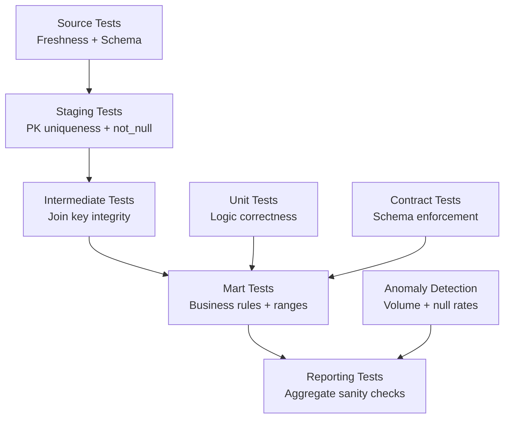

# dbt Testing — Senior Deep Dive

## Test Architecture at Scale

For large projects (100+ models), testing strategy needs to be intentional:



## Model Contracts as Tests

Contracts fail the build if the model's output doesn't match the declared schema:

```yaml
models:
  - name: fct_orders
    config:
      contract:
        enforced: true
    columns:
      - name: order_id
        data_type: bigint
        constraints:
          - type: not_null
          - type: primary_key
      - name: total_amount
        data_type: numeric
        constraints:
          - type: not_null
          - type: check
            expression: "total_amount >= 0"
      - name: customer_id
        data_type: bigint
        constraints:
          - type: foreign_key
            to: ref('dim_customers')
            to_columns: [customer_id]
```

This is pre-execution validation — model won't even run if SQL doesn't produce these columns.

## Advanced Unit Testing Patterns

### Testing Complex Window Functions

```yaml
unit_tests:
  - name: test_running_total_calculation
    model: fct_orders_running
    given:
      - input: ref('fct_orders')
        rows:
          - {order_id: 1, customer_id: 100, order_date: '2024-01-01', total_amount: 100}
          - {order_id: 2, customer_id: 100, order_date: '2024-01-15', total_amount: 200}
          - {order_id: 3, customer_id: 100, order_date: '2024-02-01', total_amount: 150}
    expect:
      rows:
        - {order_id: 1, running_total: 100}
        - {order_id: 2, running_total: 300}
        - {order_id: 3, running_total: 450}
```

### Mocking Multiple Inputs

```yaml
unit_tests:
  - name: test_customer_segment_join
    model: dim_customers_segmented
    given:
      - input: ref('stg_customers')
        rows:
          - {customer_id: 1, email: 'a@test.com', country: 'US'}
      - input: ref('stg_orders')
        rows:
          - {customer_id: 1, total_amount: 500}
          - {customer_id: 1, total_amount: 600}
    expect:
      rows:
        - {customer_id: 1, lifetime_spend: 1100, segment: 'Silver'}
```

## Macro-Level Testing

Test your macros with unit tests:

```yaml
unit_tests:
  - name: test_generate_surrogate_key_macro
    model: stg_orders   # model that uses the macro
    given:
      - input: source('raw', 'orders')
        rows:
          - {id: 1, source: 'web'}
          - {id: 1, source: 'mobile'}   # same id, different source
    expect:
      rows:
        - {sk: '3f2b...', order_id: 1}
        - {sk: 'a1c4...', order_id: 1}  # different surrogate keys
```

## Statistical Test Patterns

### Referential Integrity at Scale (Soft Delete Handling)

```sql
-- tests/assert_order_customers_exist.sql
-- Soft deletes in customers table (is_deleted=true) break standard relationships test
SELECT o.order_id, o.customer_id
FROM {{ ref('fct_orders') }} o
LEFT JOIN {{ ref('dim_customers') }} c
    ON o.customer_id = c.customer_id
    AND c.is_deleted = false   -- only check against active customers
WHERE c.customer_id IS NULL
    AND o.order_date >= '2020-01-01'  -- exclude legacy data
```

### Statistical Drift Detection

```sql
-- tests/assert_revenue_not_anomalous.sql
WITH daily_stats AS (
    SELECT
        order_date,
        SUM(total_amount) AS daily_revenue
    FROM {{ ref('fct_orders') }}
    WHERE order_date >= CURRENT_DATE - 90
    GROUP BY order_date
),

stats AS (
    SELECT
        AVG(daily_revenue) AS mean_revenue,
        STDDEV(daily_revenue) AS std_revenue
    FROM daily_stats
    WHERE order_date < CURRENT_DATE  -- exclude today
),

today AS (
    SELECT SUM(total_amount) AS today_revenue
    FROM {{ ref('fct_orders') }}
    WHERE order_date = CURRENT_DATE
)

-- Fail if today's revenue is more than 3 standard deviations from mean
SELECT today_revenue, mean_revenue, std_revenue
FROM today, stats
WHERE today_revenue > mean_revenue + 3 * std_revenue
   OR today_revenue < mean_revenue - 3 * std_revenue
```

## Test Pyramid Strategy

```
          /\
         /  \   E2E Tests (few)
        /    \  Integration: cross-model relationships
       /------\
      /        \ Unit Tests (many)
     /          \ Logic: per-model SQL correctness
    /------------\
   / Generic Tests \ (comprehensive)
  / PK, FK, nulls   \
 /--------------------\
```

**Recommended ratios for a 50-model project:**
- Generic tests: 150-200 (3-4 per model)
- Singular/custom tests: 20-30 (business rules)
- Unit tests: 15-25 (complex transformations)
- Source tests: 30-50 (1 per source column)

## Performance: Test Parallelism

```yaml
# profiles.yml
prod:
  threads: 16  # Tests run in parallel, same as models
```

```bash
# Run tests across 16 threads
dbt test --threads 16

# Profile slow tests
dbt test --record-timing-info timing.json
```

Tests that take > 30 seconds suggest missing indexes or poor query design — investigate and optimize.
