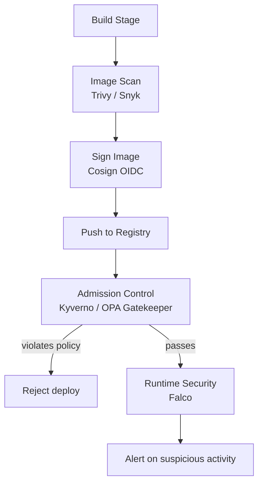

# Container Security — Senior Deep Dive

## Defense in Depth Architecture



## Kyverno Policy Enforcement

```yaml
# Require non-root user in all pods
apiVersion: kyverno.io/v1
kind: ClusterPolicy
metadata:
  name: require-non-root
spec:
  validationFailureAction: Enforce   # block, not just audit
  rules:
    - name: check-non-root
      match:
        any:
          - resources:
              kinds: [Pod]
      validate:
        message: "Containers must not run as root"
        pattern:
          spec:
            containers:
              - securityContext:
                  runAsNonRoot: true

---
# Only allow images from approved registry
apiVersion: kyverno.io/v1
kind: ClusterPolicy
metadata:
  name: approved-registry
spec:
  validationFailureAction: Enforce
  rules:
    - name: check-registry
      validate:
        message: "Images must come from registry.company.com"
        pattern:
          spec:
            containers:
              - image: "registry.company.com/*"
```

## Falco Runtime Security

```yaml
# Falco rule: alert if pipeline writes to /etc
- rule: Write to /etc in pipeline pod
  desc: Unexpected write to /etc in data pipeline container
  condition: >
    evt.type = write
    and container.label.app = "pipeline"
    and fd.name startswith /etc
  output: "Write to /etc in pipeline pod (user=%user.name cmd=%proc.cmdline)"
  priority: WARNING
```

## ⚡ Cheat Sheet

```bash
# Image scanning
trivy image image:tag
trivy image --exit-code 1 --severity CRITICAL,HIGH image:tag
docker scout cves image:tag

# Image signing
cosign sign --yes registry/image:tag@sha256:<digest>
cosign verify --certificate-identity <ci-url> registry/image:tag

# K8s security audit
kubectl auth can-i --list --as=system:serviceaccount:ns:sa
kubectl get clusterrolebindings -o json | jq '.items[] | select(.roleRef.name=="cluster-admin")'
kubectl get pods --all-namespaces -o json | jq '.items[] | select(.spec.securityContext.runAsRoot==true)'

# Network policy
kubectl get networkpolicies -A
kubectl describe networkpolicy default-deny -n data-platform

# Pod security standards
# Enforce restricted policy on namespace:
kubectl label namespace data-platform pod-security.kubernetes.io/enforce=restricted
```
