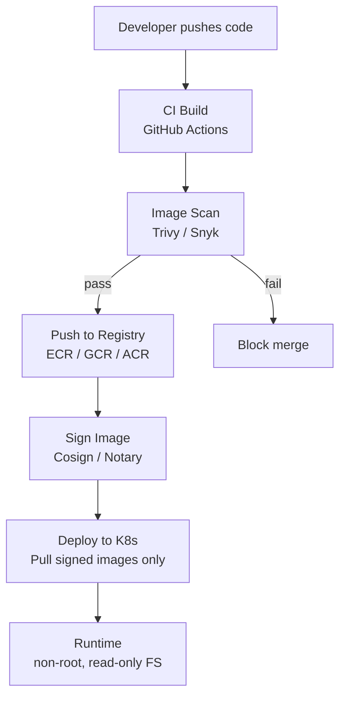

# Docker Fundamentals — Senior Deep Dive

## Production Container Architecture



---

## Registry Strategy

```bash
# AWS ECR lifecycle policy — keep only last 10 images per service
aws ecr put-lifecycle-policy \
  --repository-name my-pipeline \
  --lifecycle-policy-text '{
    "rules": [{
      "rulePriority": 1,
      "description": "Keep last 10 images",
      "selection": {
        "tagStatus": "any",
        "countType": "imageCountMoreThan",
        "countNumber": 10
      },
      "action": {"type": "expire"}
    }]
  }'

# Multi-architecture builds (arm64 + amd64)
docker buildx create --use
docker buildx build \
  --platform linux/amd64,linux/arm64 \
  --tag myregistry/pipeline:v1.0.0 \
  --push .
```

---

## Image Signing and Verification (Supply Chain Security)

```bash
# Sign with cosign (keyless via OIDC)
cosign sign --yes myregistry/pipeline:v1.0.0@sha256:abc123

# Verify before deploy
cosign verify \
  --certificate-identity "https://github.com/org/repo/.github/workflows/build.yml@refs/heads/main" \
  --certificate-oidc-issuer "https://token.actions.githubusercontent.com" \
  myregistry/pipeline:v1.0.0

# In Kubernetes: enforce signed images with Kyverno policy
# Only allow images signed by CI (policy as code)
```

---

## Distroless and Scratch Images

```dockerfile
# Distroless: no shell, no package manager — minimal attack surface
FROM python:3.11-slim AS builder
WORKDIR /app
COPY requirements.txt .
RUN pip install --user --no-cache-dir -r requirements.txt
COPY . .

FROM gcr.io/distroless/python3-debian12
COPY --from=builder /root/.local /root/.local
COPY --from=builder /app /app
WORKDIR /app
ENV PATH=/root/.local/bin:$PATH
USER nonroot:nonroot
CMD ["pipeline.py"]

# No shell = no RCE via shell injection
# No apt = no package confusion attacks
# No curl/wget = harder to exfiltrate data
```

---

## Docker BuildKit Advanced Features

```dockerfile
# BuildKit secret mount (never baked into image layer)
# syntax=docker/dockerfile:1
FROM python:3.11-slim
RUN --mount=type=secret,id=pip_conf,target=/root/.pip/pip.conf \
    pip install --no-cache-dir -r requirements.txt

# Build: 
# docker build --secret id=pip_conf,src=pip.conf .

# Cache mount (persist pip cache between builds)
RUN --mount=type=cache,target=/root/.cache/pip \
    pip install -r requirements.txt

# SSH mount (clone private repos during build)
RUN --mount=type=ssh \
    git clone git@github.com:org/private-lib.git
```

---

## Container Resource Accounting in Production

```python
# Monitor container resource usage programmatically
import docker

client = docker.from_env()

def get_container_metrics(container_name: str) -> dict:
    container = client.containers.get(container_name)
    stats = container.stats(stream=False)
    
    cpu_delta = stats["cpu_stats"]["cpu_usage"]["total_usage"] - \
                stats["precpu_stats"]["cpu_usage"]["total_usage"]
    system_delta = stats["cpu_stats"]["system_cpu_usage"] - \
                   stats["precpu_stats"]["system_cpu_usage"]
    num_cpus = stats["cpu_stats"]["online_cpus"]
    cpu_pct = (cpu_delta / system_delta) * num_cpus * 100
    
    mem_usage = stats["memory_stats"]["usage"]
    mem_limit = stats["memory_stats"]["limit"]
    mem_pct = mem_usage / mem_limit * 100
    
    return {"cpu_pct": cpu_pct, "mem_pct": mem_pct, "mem_mb": mem_usage / 1e6}
```

---

## ⚡ Cheat Sheet

```bash
# Build
docker build -t name:tag .
docker build --no-cache -t name:tag .               # bypass cache
docker buildx build --platform linux/amd64,linux/arm64 --push .

# Run
docker run --rm name:tag                             # auto-remove on exit
docker run -d --name myapp name:tag                  # detached
docker run -e KEY=value name:tag                     # env var
docker run -v /host/path:/container/path name:tag    # bind mount
docker run --memory 2g --cpus 2 name:tag             # limits

# Inspect
docker logs -f myapp                                  # follow logs
docker exec -it myapp sh                              # shell access
docker inspect myapp | jq '.[0].NetworkSettings'     # network info
docker stats --no-stream                              # resource snapshot

# Registry
docker tag myapp:latest registry.io/org/myapp:v1.0
docker push registry.io/org/myapp:v1.0
docker pull registry.io/org/myapp:v1.0

# Cleanup
docker system prune -af                               # remove everything unused
docker image prune -a --filter "until=24h"            # images older than 24h

# Security scan
trivy image myapp:latest
docker scout cves myapp:latest

# Signing
cosign sign --yes myregistry/myapp:v1@sha256:<digest>
cosign verify --certificate-identity <ci-url> myregistry/myapp:v1
```
