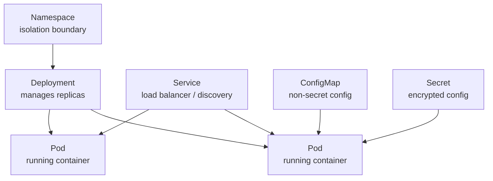

# Kubernetes Basics — Fundamentals

## The Airport Control Tower Analogy

Kubernetes is like an airport control tower. You have many planes (containers) that need to land, take off, refuel, and be routed to the right gates. Without a control tower, it's chaos. The control tower (K8s control plane) knows the state of every plane (pod), ensures the right number are in the air (replicas), reroutes when runways are closed (reschedules on node failure), and manages the gates (services/networking). You don't talk to each plane individually — you tell the control tower "I need 5 planes from airline X in the air" and it handles the rest.

---

## Core Objects



- **Pod**: Smallest deployable unit — one or more containers that share network/storage
- **Deployment**: Manages a set of identical pods (desired state = 3 replicas)
- **Service**: Stable network endpoint for a set of pods (pods restart with new IPs; Service stays stable)
- **ConfigMap**: Non-sensitive config passed to pods as env vars or files
- **Secret**: Sensitive config (passwords, API keys) — base64 encoded at rest
- **Namespace**: Logical isolation (dev/staging/prod can be separate namespaces)

---

## Essential kubectl Commands

```bash
# Context and cluster
kubectl config get-contexts          # list available clusters
kubectl config use-context my-cluster

# Pods
kubectl get pods                     # list pods
kubectl get pods -n data-platform    # in a specific namespace
kubectl describe pod my-pod          # details + events (debug here first)
kubectl logs my-pod                  # view output
kubectl logs my-pod -c container     # specific container in pod
kubectl logs my-pod --previous       # logs from crashed container
kubectl exec -it my-pod -- bash      # shell into running pod

# Deployments
kubectl get deployments
kubectl rollout status deployment/my-app
kubectl rollout history deployment/my-app
kubectl rollout undo deployment/my-app   # rollback!

# Scale
kubectl scale deployment/my-app --replicas=5

# Apply manifests
kubectl apply -f deployment.yaml
kubectl delete -f deployment.yaml

# Debug
kubectl get events --sort-by='.lastTimestamp'
kubectl top pods                     # CPU/memory usage (metrics-server required)
```

---

## Simple Deployment Manifest

```yaml
# deployment.yaml
apiVersion: apps/v1
kind: Deployment
metadata:
  name: revenue-pipeline
  namespace: data-platform
spec:
  replicas: 2
  selector:
    matchLabels:
      app: revenue-pipeline
  template:
    metadata:
      labels:
        app: revenue-pipeline
    spec:
      containers:
        - name: pipeline
          image: registry/revenue-pipeline:abc1234
          
          # Resource requests/limits (always set these!)
          resources:
            requests:
              memory: "512Mi"
              cpu: "250m"
            limits:
              memory: "2Gi"
              cpu: "1000m"
          
          # Config from ConfigMap and Secret
          env:
            - name: LOG_LEVEL
              valueFrom:
                configMapKeyRef:
                  name: pipeline-config
                  key: log_level
            - name: DB_PASSWORD
              valueFrom:
                secretKeyRef:
                  name: pipeline-secrets
                  key: db_password
          
          # Health checks
          livenessProbe:
            httpGet:
              path: /health
              port: 8080
            initialDelaySeconds: 30
            periodSeconds: 10
          
          readinessProbe:
            httpGet:
              path: /ready
              port: 8080
            initialDelaySeconds: 5
            periodSeconds: 5
```

---

## ConfigMap and Secret

```bash
# Create ConfigMap from file
kubectl create configmap pipeline-config \
  --from-literal=log_level=INFO \
  --from-literal=environment=production

# Create Secret (base64 encoded automatically)
kubectl create secret generic pipeline-secrets \
  --from-literal=db_password=mysecretpassword

# View
kubectl get configmap pipeline-config -o yaml
kubectl get secret pipeline-secrets -o yaml

# Decode secret value
kubectl get secret pipeline-secrets -o jsonpath='{.data.db_password}' | base64 -d
```
