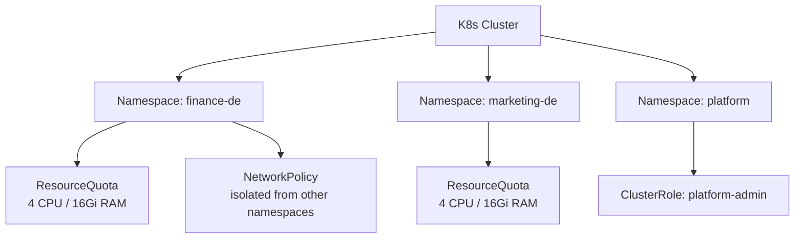

# Kubernetes Basics — Senior Deep Dive

## Multi-Tenancy for Data Platform



```yaml
# Resource quotas per namespace/team
apiVersion: v1
kind: ResourceQuota
metadata:
  name: finance-quota
  namespace: finance-de
spec:
  hard:
    requests.cpu: "4"
    requests.memory: 16Gi
    limits.cpu: "8"
    limits.memory: 32Gi
    count/pods: "50"
    count/jobs.batch: "10"
```

---

## GitOps with ArgoCD

```yaml
# argocd-application.yaml
apiVersion: argoproj.io/v1alpha1
kind: Application
metadata:
  name: revenue-pipeline
  namespace: argocd
spec:
  project: data-platform
  source:
    repoURL: https://github.com/org/k8s-manifests
    targetRevision: main
    path: apps/revenue-pipeline
  destination:
    server: https://kubernetes.default.svc
    namespace: data-platform
  syncPolicy:
    automated:
      prune: true      # delete resources removed from git
      selfHeal: true   # fix drift (manual changes)
    syncOptions:
      - CreateNamespace=true
```

Changes to K8s manifests in git automatically sync to cluster — no manual `kubectl apply`.

---

## Pod Disruption Budgets for Data Pipelines

```yaml
# Ensure at least 1 pipeline worker stays up during cluster maintenance
apiVersion: policy/v1
kind: PodDisruptionBudget
metadata:
  name: pipeline-pdb
spec:
  minAvailable: 1       # or maxUnavailable: 1
  selector:
    matchLabels:
      app: pipeline-worker
```

---

## Observability Stack

```yaml
# Prometheus ServiceMonitor for pipeline metrics
apiVersion: monitoring.coreos.com/v1
kind: ServiceMonitor
metadata:
  name: pipeline-metrics
spec:
  selector:
    matchLabels:
      app: revenue-pipeline
  endpoints:
    - port: metrics
      path: /metrics
      interval: 30s
```

```python
# Expose metrics from Python pipeline
from prometheus_client import Counter, Histogram, start_http_server

ROWS_PROCESSED = Counter('pipeline_rows_processed_total', 'Total rows processed', ['pipeline'])
PROCESSING_TIME = Histogram('pipeline_processing_seconds', 'Processing time', ['pipeline'])

start_http_server(9090)  # Prometheus scrapes :9090/metrics
```

---

## ⚡ Cheat Sheet

```bash
# Pod lifecycle
kubectl get pods -o wide               # show node placement
kubectl describe pod <pod>             # events + conditions
kubectl logs <pod> --previous          # crashed container logs
kubectl exec -it <pod> -- /bin/bash    # shell access

# Deployments
kubectl rollout status deployment/<name>
kubectl rollout history deployment/<name>
kubectl rollout undo deployment/<name>              # rollback
kubectl rollout undo deployment/<name> --to-revision=2  # specific revision

# Scaling
kubectl scale deployment/<name> --replicas=5
kubectl autoscale deployment/<name> --min=2 --max=10 --cpu-percent=70

# Resources
kubectl top pods -n data-platform                  # CPU/memory usage
kubectl describe node <node>                        # node capacity + allocations

# Jobs
kubectl get jobs
kubectl logs job/<job-name>
kubectl delete job/<job-name>

# Secrets
kubectl create secret generic my-secret --from-literal=key=value
kubectl get secret my-secret -o jsonpath='{.data.key}' | base64 -d

# Debugging
kubectl get events --sort-by='.lastTimestamp' -n data-platform
kubectl debug pod/<pod> -it --image=ubuntu          # ephemeral debug container
```
