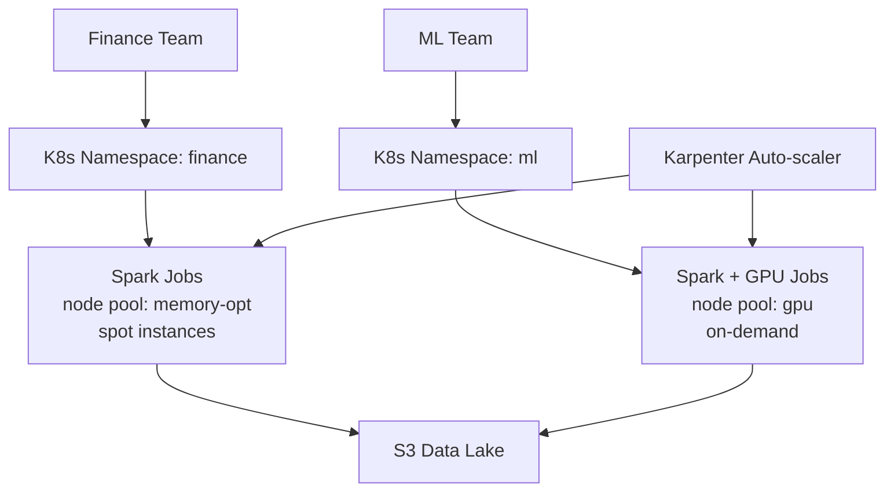

# Kubernetes for Data — Senior Deep Dive

## Multi-Tenant Spark Platform Architecture



## Karpenter for Just-in-Time Scaling

```yaml
# NodePool: Karpenter provisions nodes on-demand for Spark
apiVersion: karpenter.sh/v1beta1
kind: NodePool
metadata:
  name: spark-pool
spec:
  template:
    metadata:
      labels:
        workload: spark
    spec:
      taints:
        - key: workload
          value: spark
          effect: NoSchedule
      requirements:
        - key: karpenter.sh/capacity-type
          operator: In
          values: [spot, on-demand]
        - key: node.kubernetes.io/instance-type
          operator: In
          values: [r5.4xlarge, r5.8xlarge, r5a.4xlarge]
  disruption:
    consolidationPolicy: WhenEmpty   # scale to zero when no Spark jobs
    consolidateAfter: 30s
```

## Cost Tracking per Team

```python
# Label all pods with team + cost center for showback
pod_labels = {
    "team": "finance-de",
    "cost-center": "FIN-001",
    "pipeline": "revenue-daily",
}

# Kubecost or AWS Cost Explorer tags → per-team billing
# Query: sum(node_cost) by team label = team-level showback
```

## ⚡ Cheat Sheet

```bash
# Spark on K8s
spark-submit --master k8s://<api-endpoint>   --conf spark.kubernetes.container.image=<image>   --conf spark.kubernetes.namespace=<ns>   --conf spark.executor.instances=<n>   local:///app/job.py

# Monitor Spark
kubectl get pods -l spark-app-selector=<app-id>
kubectl logs <driver-pod> -f
kubectl port-forward <driver-pod> 4040:4040

# Airflow KubernetesExecutor
kubectl get pods -n airflow -l run=<dag-run-id>

# Resource usage
kubectl top pods -n data-platform
kubectl describe node <node> | grep -A10 "Allocated resources"
```
