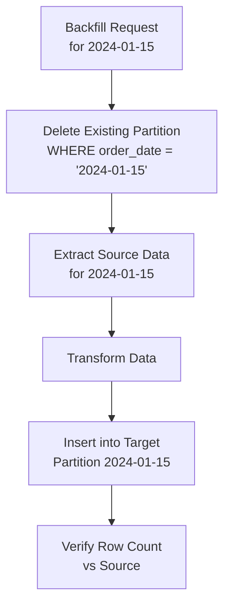

# Backfilling — Fundamentals


## 🎯 Analogy

Think of backfilling like catching up on missed lessons: if your pipeline was down for 5 days, you re-run it for each missed day in order, computing the same result as if it had run on time.

---
## What Is Backfilling?

**Backfilling** is the process of re-running a data pipeline for historical dates — either because the pipeline didn't exist yet (initial load) or because data needs to be corrected or recomputed.

Common reasons to backfill:
- Pipeline was built after data collection started (historical gaps)
- A bug in transformation logic was fixed (data correction)
- New columns or metrics need to be computed retroactively
- Source data was retroactively corrected
- A new downstream consumer needs historical data

---

## Full vs. Incremental Backfill

### Full Backfill

Re-process all data from the beginning of time to now.

```python
from datetime import date, timedelta

def full_backfill(start_date: date, end_date: date, pipeline_fn):
    """Run the pipeline for every date in the range."""
    current = start_date
    results = []
    while current <= end_date:
        print(f"Backfilling {current}...")
        result = pipeline_fn(str(current))
        results.append({"date": str(current), **result})
        current += timedelta(days=1)
    return results
```

### Incremental Backfill

Re-process only specific dates or partitions that are missing or incorrect.

```python
def incremental_backfill(engine, pipeline_fn, expected_dates: list[date]):
    """
    Backfill only dates where data is missing or flagged for reprocessing.
    More efficient than full backfill for large date ranges.
    """
    # Find dates that need backfilling
    existing_dates = set(pd.read_sql(
        "SELECT DISTINCT DATE(created_at) AS d FROM orders",
        engine
    )["d"].tolist())

    missing = [d for d in expected_dates if d not in existing_dates]
    print(f"Missing {len(missing)} dates; backfilling...")

    for d in sorted(missing):
        pipeline_fn(str(d))
```

---

## Airflow Backfill Mechanics

### `catchup` Parameter

```python
from airflow import DAG
from datetime import datetime

# catchup=True: Airflow creates DAG runs for all missed intervals
with DAG(
    "daily_orders",
    start_date=datetime(2024, 1, 1),
    schedule_interval="@daily",
    catchup=True,   # Creates runs for 2024-01-01 through today on first deploy
) as dag:
    pass

# catchup=False: Only runs for today (and future); no historical backfill
with DAG(
    "daily_orders_no_catchup",
    start_date=datetime(2024, 1, 1),
    schedule_interval="@daily",
    catchup=False,  # Only future runs; no backfill on deploy
) as dag:
    pass
```

### Manual Backfill via CLI

```bash
# Backfill a specific date range
airflow dags backfill \
    --start-date 2024-01-01 \
    --end-date   2024-03-31 \
    --reset-dagruns \        # Clear existing runs before re-running
    daily_orders

# Backfill with max concurrency (run up to 4 days in parallel)
airflow dags backfill \
    --start-date 2024-01-01 \
    --end-date   2024-03-31 \
    --max-active-runs 4 \
    daily_orders

# Dry run — see which dates would be backfilled without running
airflow dags backfill \
    --start-date 2024-01-01 \
    --end-date   2024-03-31 \
    --dry-run \
    daily_orders
```

### `depends_on_past`

```python
from airflow.operators.python import PythonOperator

# With depends_on_past=True:
# Run for 2024-01-03 only if 2024-01-02 succeeded.
# This makes backfill sequential (safer for cumulative/running total pipelines).
load_task = PythonOperator(
    task_id="load_orders",
    python_callable=load_orders,
    depends_on_past=True,  # Wait for previous date's success
)
```

When `depends_on_past=True`, backfill processes dates sequentially. Without it, Airflow may run multiple dates in parallel, which is faster but can cause issues for pipelines that maintain state across runs.

---

## Avoiding Double-Counting in Backfills

The biggest risk in backfilling is inserting duplicate data. All backfill operations must be **idempotent**.

```python
def backfill_orders_idempotent(run_date: str, engine):
    """
    Idempotent backfill: safe to run multiple times for the same date.
    DELETE + INSERT ensures no duplicates.
    """
    # Step 1: Extract
    df = extract_orders_for_date(run_date)

    # Step 2: Delete existing data for this date (idempotent)
    with engine.begin() as conn:
        deleted = conn.execute(sa.text(
            "DELETE FROM orders WHERE order_date = :d"
        ), {"d": run_date}).rowcount

    print(f"Cleared {deleted} existing rows for {run_date}")

    # Step 3: Re-insert
    df.to_sql("orders", engine, if_exists="append", index=False)
    print(f"Backfilled {len(df)} rows for {run_date}")
```



---

## Partition-Aware Backfilling

For date-partitioned data warehouses, partition replacement is the safest backfill strategy.

```sql
-- BigQuery: Replace a single date partition
CREATE OR REPLACE TABLE `project.dataset.orders$20240115`
AS
SELECT *
FROM `project.raw.orders_source`
WHERE DATE(created_at) = '2024-01-15';

-- Snowflake: Overwrite a partition
INSERT OVERWRITE INTO orders
    PARTITION (order_date = '2024-01-15')
SELECT *
FROM orders_source
WHERE order_date = '2024-01-15';
```

---

## Backfill Impact on Production

Backfills can overload source databases and slow down production pipelines. Mitigate this with:

```python
import time

def throttled_backfill(
    start_date: date,
    end_date: date,
    pipeline_fn,
    rows_per_second_limit: int = 10_000,
    sleep_between_dates: float = 2.0
):
    """
    Run backfill with throttling to avoid overloading source.
    """
    current = start_date
    while current <= end_date:
        start_time = time.time()

        result = pipeline_fn(str(current))
        rows_processed = result.get("rows", 0)

        elapsed = time.time() - start_time
        min_duration = rows_processed / rows_per_second_limit

        if elapsed < min_duration:
            # Throttle: wait if we processed too fast
            time.sleep(min_duration - elapsed)

        # Sleep between dates to give production a breather
        time.sleep(sleep_between_dates)

        current += timedelta(days=1)
        print(f"Backfilled {current}: {rows_processed} rows in {elapsed:.1f}s")
```

---


## ▶️ Try It Yourself

```python
from datetime import date, timedelta

def run_daily_pipeline(run_date: date) -> dict:
    """Idempotent: safe to run multiple times for same date."""
    print(f"Processing {run_date}...")
    # Simulates: read source, transform, overwrite partition
    return {"date": str(run_date), "rows": 1000}

def backfill(start_date: date, end_date: date):
    """Re-run pipeline for each date in range."""
    current = start_date
    results = []
    while current <= end_date:
        result = run_daily_pipeline(current)
        results.append(result)
        current += timedelta(days=1)
    return results

# Backfill 5 missed days
results = backfill(date(2024, 1, 1), date(2024, 1, 5))
for r in results:
    print(r)
```

> **Run it:** Copy the snippet into a REPL or file and run it — no external services needed for the basic example.

---
## Interview Tips

> **Tip 1:** Always verify that your pipeline is idempotent before running a backfill. A non-idempotent backfill multiplies data. The key question: "If I run this for 2024-01-15 twice, do I get double the rows?"

> **Tip 2:** Know the difference between `catchup=True` (Airflow auto-backfills missed intervals on deploy) and manual `airflow dags backfill` command (explicit range). Both have their place.

> **Tip 3:** `depends_on_past=True` makes backfill run sequentially per date. This is essential for pipelines that compute running totals or cumulative metrics — a day's computation depends on the previous day's result.

> **Tip 4:** Throttle backfills to avoid overloading the source system. A 6-month backfill running at full speed on a production OLTP database can degrade live user experience.

> **Tip 5:** After any backfill, run a reconciliation check: compare row counts or aggregate metrics between source and target for each backfilled date to confirm correctness.
