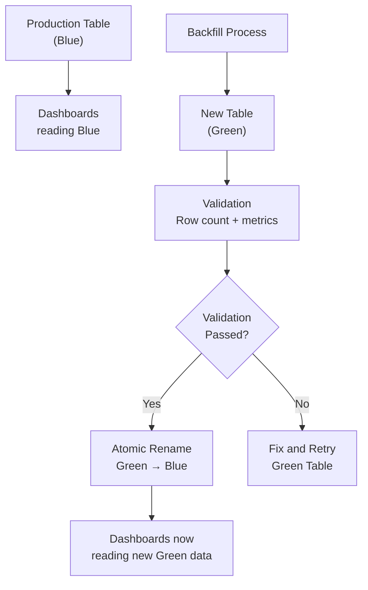
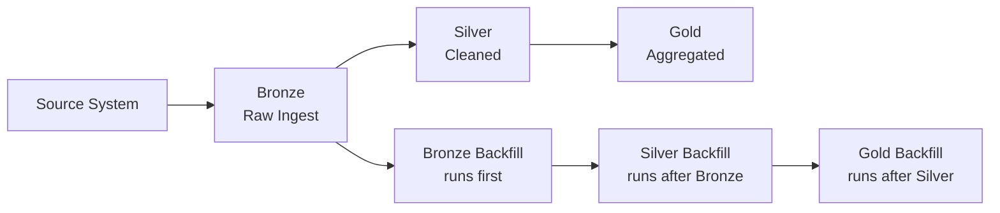

# Backfilling — Senior Deep Dive

## Blue-Green Backfill Pattern

For large-scale backfills where availability cannot be disrupted, use blue-green deployment:



```python
import sqlalchemy as sa
from datetime import datetime

def blue_green_backfill(
    source_engine,
    target_engine,
    pipeline_fn,
    table_name: str,
    start_date: str,
    end_date: str
) -> str:
    """
    Backfill into a new 'green' table, validate, then atomically swap.
    Zero downtime for read consumers during backfill.
    """
    green_table = f"{table_name}_green_{datetime.utcnow().strftime('%Y%m%d%H%M%S')}"
    blue_table  = table_name

    # Step 1: Create green table (copy structure from blue)
    with target_engine.begin() as conn:
        conn.execute(sa.text(f"""
            CREATE TABLE {green_table}
            (LIKE {blue_table} INCLUDING ALL)
        """))

    # Step 2: Backfill into green (doesn't affect blue)
    from datetime import date, timedelta
    current = date.fromisoformat(start_date)
    end     = date.fromisoformat(end_date)

    total_rows = 0
    while current <= end:
        rows = pipeline_fn(str(current), target_table=green_table)
        total_rows += rows
        current += timedelta(days=1)

    print(f"Backfilled {total_rows} rows into {green_table}")

    # Step 3: Validate green
    validation = validate_backfill(source_engine, target_engine, blue_table, green_table)
    if not validation["passed"]:
        print(f"Validation failed: {validation}. Dropping green table.")
        with target_engine.begin() as conn:
            conn.execute(sa.text(f"DROP TABLE {green_table}"))
        raise RuntimeError(f"Backfill validation failed: {validation}")

    # Step 4: Atomic swap (rename blue → backup, green → production)
    backup_table = f"{blue_table}_backup_{datetime.utcnow().strftime('%Y%m%d')}"
    with target_engine.begin() as conn:
        conn.execute(sa.text(f"ALTER TABLE {blue_table} RENAME TO {backup_table}"))
        conn.execute(sa.text(f"ALTER TABLE {green_table} RENAME TO {blue_table}"))

    print(f"Swap complete. Old table backed up as {backup_table}")
    return green_table

def validate_backfill(source_engine, target_engine, blue: str, green: str) -> dict:
    """Compare green against source to validate backfill correctness."""
    # Row count comparison (compare green to source, not blue — blue may be stale)
    src_count = pd.read_sql("SELECT COUNT(*) FROM source_orders", source_engine).iloc[0, 0]
    grn_count = pd.read_sql(f"SELECT COUNT(*) FROM {green}", target_engine).iloc[0, 0]
    count_ok  = abs(src_count - grn_count) / max(src_count, 1) < 0.01  # 1% tolerance

    # Metric check
    src_rev = pd.read_sql("SELECT SUM(amount_usd) FROM source_orders", source_engine).iloc[0, 0]
    grn_rev = pd.read_sql(f"SELECT SUM(amount_usd) FROM {green}", target_engine).iloc[0, 0]
    rev_ok  = abs(src_rev - grn_rev) / max(src_rev, 1) < 0.01

    return {
        "passed":      count_ok and rev_ok,
        "src_count":   src_count,
        "green_count": grn_count,
        "count_ok":    count_ok,
        "src_revenue": src_rev,
        "green_revenue": grn_rev,
        "revenue_ok":  rev_ok,
    }
```

---

## Backfill in Streaming Systems

### Flink Savepoint-Based Replay

Apache Flink allows replaying from a savepoint or specific timestamp:

```python
# Flink CLI for savepoint-based replay
"""
# Save state before stopping
flink savepoint <job_id> s3://checkpoints/savepoints/

# Stop the job
flink cancel <job_id>

# Fix the logic, rebuild the JAR

# Restore from savepoint (replays from the savepoint's position)
flink run --fromSavepoint s3://checkpoints/savepoints/<savepoint_dir> my-pipeline.jar

# For backfill to a specific past timestamp:
flink run --fromSavepoint s3://checkpoints/savepoints/<savepoint_dir> \
  --startingPos "2024-01-01T00:00:00Z" my-pipeline.jar
"""
```

### Kafka Offset-to-Timestamp Backfill

```python
from confluent_kafka import Consumer, TopicPartition
from confluent_kafka.admin import AdminClient
from datetime import datetime

class KafkaBackfiller:
    def __init__(self, bootstrap_servers: str, group_id: str):
        self.consumer = Consumer({
            "bootstrap.servers": bootstrap_servers,
            "group.id":          f"{group_id}-backfill",
            "enable.auto.commit": False,
            "auto.offset.reset": "earliest",
        })

    def get_partition_offsets_for_time(
        self, topic: str, target_datetime: datetime
    ) -> list[TopicPartition]:
        """Get Kafka offsets corresponding to a specific point in time."""
        ts_ms = int(target_datetime.timestamp() * 1000)

        metadata   = self.consumer.list_topics(topic)
        partitions = list(metadata.topics[topic].partitions.keys())

        tps = [TopicPartition(topic, p, ts_ms) for p in partitions]
        return self.consumer.offsets_for_times(tps)

    def backfill_window(
        self,
        topic: str,
        start_time: datetime,
        end_time: datetime,
        processor_fn,
        batch_size: int = 1000
    ) -> dict:
        """Replay all messages in a time window."""
        start_offsets = self.get_partition_offsets_for_time(topic, start_time)
        end_ts_ms     = int(end_time.timestamp() * 1000)

        # Seek to start position
        valid_offsets = [tp for tp in start_offsets if tp.offset >= 0]
        self.consumer.assign(valid_offsets)

        for tp in valid_offsets:
            self.consumer.seek(tp)

        processed = 0
        batch     = []
        done_partitions = set()

        while len(done_partitions) < len(valid_offsets):
            msg = self.consumer.poll(timeout=10.0)
            if msg is None:
                break

            if msg.timestamp()[1] > end_ts_ms:
                done_partitions.add(msg.partition())
                continue

            if msg.error():
                continue

            batch.append(json.loads(msg.value()))

            if len(batch) >= batch_size:
                processor_fn(batch)
                processed += len(batch)
                batch = []

        if batch:
            processor_fn(batch)
            processed += len(batch)

        self.consumer.close()
        return {"processed": processed, "topic": topic, "start": str(start_time), "end": str(end_time)}
```

---

## Coordinating Backfills Across Dependent Pipelines

When pipelines have upstream/downstream dependencies, backfill order matters.

```python
import networkx as nx

class BackfillCoordinator:
    """
    Coordinate backfill across a DAG of pipeline dependencies.
    Ensures upstream pipelines are backfilled before downstream ones.
    """
    def __init__(self, pipeline_graph: nx.DiGraph, backfill_manager: BackfillManager):
        self.graph   = pipeline_graph
        self.manager = backfill_manager

    def plan_backfill_order(self, pipelines: list[str]) -> list[str]:
        """
        Return pipelines in topological order (upstream first).
        """
        # Create subgraph of affected pipelines + their dependencies
        affected = set(pipelines)
        for p in pipelines:
            affected.update(nx.ancestors(self.graph, p))

        subgraph = self.graph.subgraph(affected)
        return list(nx.topological_sort(subgraph))

    def run_cascading_backfill(
        self,
        pipelines: list[str],
        start_date: date,
        end_date: date
    ) -> dict:
        """
        Backfill pipelines in dependency order.
        Only run downstream pipeline after upstream completes.
        """
        order = self.plan_backfill_order(pipelines)
        results = {}

        for pipeline in order:
            job_id = self.manager.create_job(pipeline, start_date, end_date)
            print(f"Backfilling {pipeline}...")

            result = self.manager.run_backfill(
                job_id=job_id,
                pipeline_fn=get_pipeline_fn(pipeline),
                continue_on_error=False
            )
            results[pipeline] = result

            if result["failed"] > 0:
                raise RuntimeError(
                    f"Backfill failed for {pipeline}. "
                    f"Aborting cascade — downstream pipelines not backfilled."
                )

        return results
```

---

## Backfill in the Medallion Architecture



```python
def medallion_backfill(start_date: str, end_date: str, full_refresh: bool = False):
    """
    Backfill all layers in order: Bronze → Silver → Gold.
    """
    import subprocess

    layers = [
        {
            "name":    "bronze",
            "command": f"python bronze_pipeline.py --date-range {start_date} {end_date}",
        },
        {
            "name":    "silver",
            "command": f"dbt run --select silver_* --vars '{{backfill_start: {start_date}}}'",
        },
        {
            "name":    "gold",
            "command": f"dbt run --select gold_* {'--full-refresh' if full_refresh else ''}",
        },
    ]

    for layer in layers:
        print(f"Running {layer['name']} layer backfill...")
        result = subprocess.run(layer["command"].split(), capture_output=True, text=True)

        if result.returncode != 0:
            raise RuntimeError(
                f"{layer['name']} backfill failed:\n{result.stderr}"
            )
        print(f"{layer['name']} complete.")
```

---

## Interview Tips

> **Tip 1:** The blue-green backfill pattern is the senior answer for "how do you backfill without disrupting running dashboards." Build in green, validate, swap atomically — zero downtime.

> **Tip 2:** For streaming backfill, Kafka's `offsets_for_times()` API is key. It returns the first offset at or after a given timestamp per partition, enabling time-window-scoped replay.

> **Tip 3:** Cascading backfills across dependent pipelines require topological ordering. If Bronze is wrong, Silver and Gold are wrong too — always backfill in dependency order (upstream first).

> **Tip 4:** State management is the hardest part of streaming backfill. Flink savepoints capture both processing position and state (e.g., aggregations, joins). Know when a savepoint-based restore is better than a from-scratch replay.

> **Tip 5:** Always have a post-backfill validation step. Large backfills can silently lose data (due to rate limiting, truncation, or edge cases). Compare aggregate metrics between source and target before decommissioning the old data.
