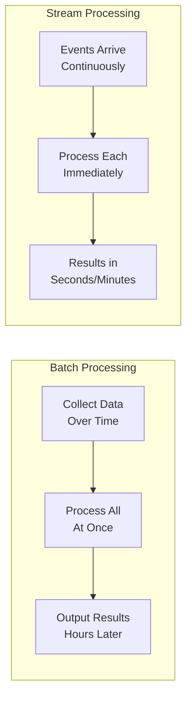
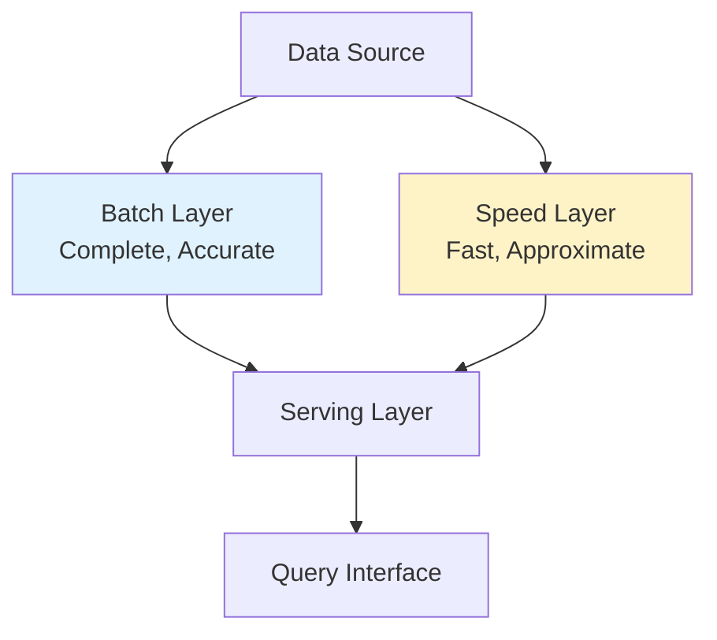
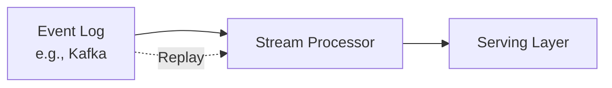
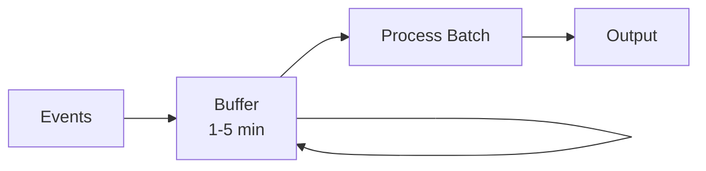

# Batch vs Streaming — Fundamentals

## The Core Difference

| Aspect | Batch | Streaming |
|--------|-------|-----------|
| **Timing** | Process accumulated data on schedule | Process data as it arrives |
| **Latency** | Minutes to hours | Milliseconds to seconds |
| **Data scope** | Bounded (known start and end) | Unbounded (never-ending) |
| **Complexity** | Lower — simpler logic | Higher — ordering, late data, state |
| **Throughput** | Very high (optimized for bulk) | Moderate (per-record overhead) |
| **Cost** | Lower (run during off-peak) | Higher (always-on resources) |
| **Example** | Daily sales report | Real-time fraud detection |

## When to Use Each

### Use Batch When:
- Results don't need to be fresh (hourly/daily is fine)
- Processing requires complete data (e.g., "top 10 products this month")
- Input is naturally bounded (daily file drops, database snapshots)
- Cost efficiency is a priority
- Transformations are complex (large joins, ML models)

**Examples:**
- Nightly data warehouse ETL
- Monthly billing calculations
- Training ML models
- Historical analytics and reporting
- Data migrations

### Use Streaming When:
- Freshness matters (alerts, dashboards, recommendations)
- Events need immediate reaction (fraud, anomaly detection)
- Source is naturally continuous (clickstream, IoT sensors, logs)
- Downstream systems expect continuous updates

**Examples:**
- Real-time fraud detection
- Live dashboards (ops monitoring)
- Recommendation engines (personalized in-session)
- IoT sensor alerting
- Log monitoring and alerting

## The Lambda Architecture

A common pattern combining both approaches:

- **Batch Layer:** Processes all historical data. Eventually consistent. Source of truth.
- **Speed Layer:** Processes recent data in real-time. Provides low-latency results.
- **Serving Layer:** Merges batch + speed results for queries.

**Drawback:** Dual code paths — same logic maintained in two systems (batch + stream).

## The Kappa Architecture

Simplification: use streaming for everything, replay history when needed.

- **Single code path** — one streaming job handles both real-time and reprocessing
- **Reprocessing:** Replay events from the beginning of the log
- **Tradeoff:** Requires a durable, replayable event log (Kafka with retention)

## Micro-Batch: The Middle Ground

Process data in small, frequent batches (every 1-5 minutes) rather than true event-at-a-time streaming.

**Examples:** Spark Structured Streaming (default mode), Apache Flink batch checkpoints

**Benefits:**
- Simpler than true streaming (no per-event state management)
- Lower latency than traditional batch (minutes vs hours)
- Exactly-once semantics easier to achieve
- Better throughput than true per-event processing

## Key Terminology

| Term | Definition |
|------|-----------|
| **Event time** | When the event actually happened (embedded in the data) |
| **Processing time** | When the system processes the event |
| **Ingestion time** | When the event enters the pipeline |
| **Watermark** | A threshold declaring "all events before this time have arrived" |
| **Windowing** | Grouping events into time-based buckets (tumbling, sliding, session) |
| **Late data** | Events arriving after their window has closed |
| **Backpressure** | Slowing down producers when consumers can't keep up |
| **Checkpoint** | Periodic snapshot of processing state for recovery |
| **Exactly-once** | Guarantee that each event is processed exactly one time |
| **At-least-once** | Events may be processed multiple times (duplicates possible) |

## Common Tools by Processing Type

| Batch | Streaming | Both |
|-------|-----------|------|
| Apache Spark (batch mode) | Apache Kafka Streams | Apache Spark (Structured Streaming) |
| Apache Hive | Apache Flink | Apache Beam |
| AWS Glue | Amazon Kinesis | Databricks |
| dbt | Apache Pulsar | Snowflake (Snowpipe + batch) |
| Airflow (orchestrator) | AWS Lambda | |

## Interview Tip 💡

> The most common interview question here is: "When would you choose streaming over batch?" The strong answer discusses **latency requirements** first (does the business need sub-minute freshness?), then **complexity and cost** (streaming is harder and more expensive — only use it when batch latency is insufficient). Bonus: mention that many "real-time" requirements are actually fine with micro-batch (5-minute delay).
