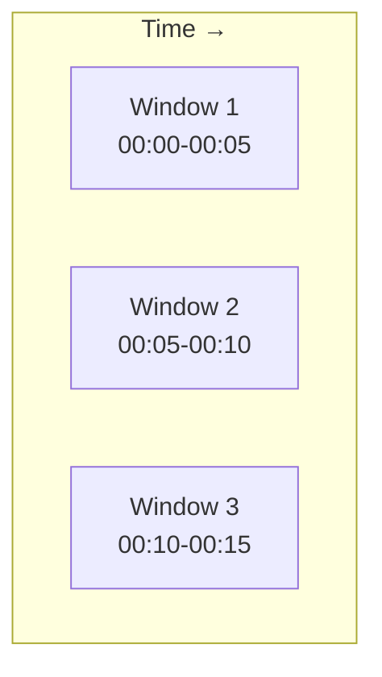
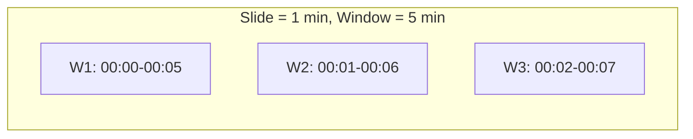
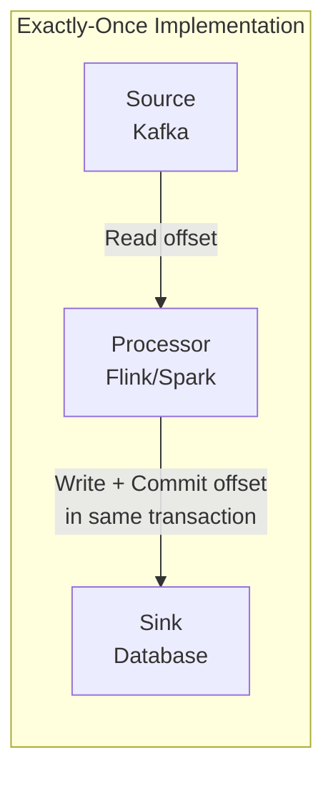
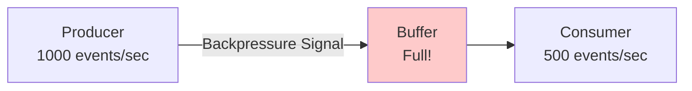
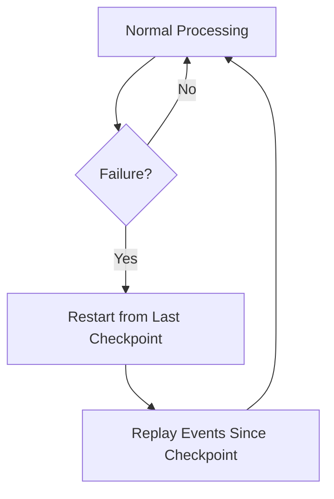

# Batch vs Streaming — Intermediate Concepts

## Windowing Strategies

Windows group unbounded streams into finite chunks for aggregation.

### Tumbling Windows (Fixed, Non-Overlapping)



- Fixed-size, no overlap
- Every event belongs to exactly one window
- **Use case:** "Count events per 5-minute interval"

```python
# Spark Structured Streaming
from pyspark.sql.functions import window

events.groupBy(
    window("event_timestamp", "5 minutes")  # Tumbling window
).agg(count("*").alias("event_count"))
```

### Sliding Windows (Fixed, Overlapping)



- Fixed-size windows that overlap
- Events appear in multiple windows
- **Use case:** "Rolling 5-minute average, computed every 1 minute"

```python
# Window of 5 minutes, sliding every 1 minute
events.groupBy(
    window("event_timestamp", "5 minutes", "1 minute")  # Sliding
).agg(avg("response_time").alias("rolling_avg"))
```

### Session Windows (Dynamic, Gap-Based)

- Window ends when there's inactivity exceeding a gap threshold
- Variable size per user/key
- **Use case:** "User sessions with 30-min timeout"

```python
# Spark 3.2+ session windows
events.groupBy(
    session_window("event_timestamp", "30 minutes"),
    "user_id"
).agg(
    count("*").alias("page_views"),
    min("event_timestamp").alias("session_start"),
    max("event_timestamp").alias("session_end")
)
```

## Handling Late Data

Events frequently arrive out of order. A purchase at 10:00:05 might not reach the system until 10:03:00.

### Watermarks — "How Late Is Too Late?"

A watermark declares: "I expect all events with timestamp ≤ W have already arrived."

```python
# Allow up to 10 minutes of lateness
events_with_watermark = events \
    .withWatermark("event_timestamp", "10 minutes") \
    .groupBy(
        window("event_timestamp", "5 minutes")
    ).agg(count("*").alias("event_count"))
```

**What happens with the watermark:**
- Events arriving within 10 minutes → included in their correct window
- Events arriving later than 10 minutes → **dropped** (or sent to a side output)
- State for old windows gets cleaned up after watermark passes

### Late Data Strategies

| Strategy | Behavior | Use Case |
|----------|----------|----------|
| Drop | Ignore events past watermark | Approximate metrics, dashboards |
| Reprocess | Recompute affected windows | Financial calculations |
| Side output | Route late events to separate stream | Audit trail, reconciliation |
| Allowances | Extend watermark generously | Critical data (no event should be lost) |

## Delivery Semantics

### At-Most-Once
- Fire and forget — fastest but lossy
- Acceptable for non-critical metrics (ad impressions)

### At-Least-Once
- Retry on failure — duplicates possible
- Requires downstream deduplication
- Most common default in distributed systems

### Exactly-Once
- Each event processed exactly one time
- Requires coordination between source, processor, and sink
- Achieved through: idempotent writes, transactional sinks, or checkpoint + replay



**Implementation approaches:**
1. **Transactional (Kafka + Flink):** Commit offset + output in same transaction
2. **Idempotent writes:** Use natural keys, upsert instead of insert
3. **Checkpoint + Replay:** On failure, replay from last checkpoint (Spark Structured Streaming)

## State Management

Streaming applications maintain state across events (counters, aggregations, session info).

### Stateless Operations
- No memory between events: `filter`, `map`, `flatMap`
- Infinitely scalable, no cleanup needed

### Stateful Operations
- Remember previous events: `groupBy`, `join`, window aggregations
- Challenges: state grows unbounded, checkpoint overhead, rebalancing cost

```python
# State grows with each unique key — needs TTL/cleanup!
# In Spark: watermarks help clean state for time-based windows
# In Flink: state TTL configuration

# Flink-style state TTL
state_descriptor.enableTimeToLive(
    StateTtlConfig.newBuilder(Time.hours(24)).build()
)
```

### State Backends

| Backend | Characteristics |
|---------|----------------|
| In-memory (Heap) | Fast, limited by RAM, lost on failure without checkpointing |
| RocksDB | Larger-than-memory state, slower, survives rebalancing |
| External (Redis) | Shared state, higher latency, not coordinated with checkpoints |

## Backpressure

When consumers can't keep up with producers:



**Strategies:**
1. **Buffer and batch** — Accumulate, process in larger chunks
2. **Drop/sample** — Skip non-critical events (metrics, logs)
3. **Scale consumers** — Auto-scale processing capacity
4. **Throttle producers** — Kafka consumer groups naturally handle this
5. **Spill to disk** — NiFi back-pressure mechanism

## Checkpointing and Recovery



**Checkpoint contents:**
- Current processing offsets (which events have been processed)
- Internal state (aggregation counters, window contents)
- Output offsets (what's been written to the sink)

**Checkpoint interval tradeoff:**
- Frequent (every 1 sec): Less data to replay on failure, more I/O overhead
- Infrequent (every 5 min): Less overhead, more replay on failure

## Interview Tip 💡

> When asked about stream processing, demonstrate awareness of the three hardest problems: (1) **Late data** — "I'd use watermarks with a 10-minute allowed lateness, dropping anything beyond that or routing to a dead-letter queue." (2) **Exactly-once** — "I'd use idempotent writes with natural dedup keys, or leverage Kafka transactions." (3) **State management** — "I'd use time-based watermarks to expire old state and prevent unbounded growth." Mentioning these unprompted shows real streaming experience.
