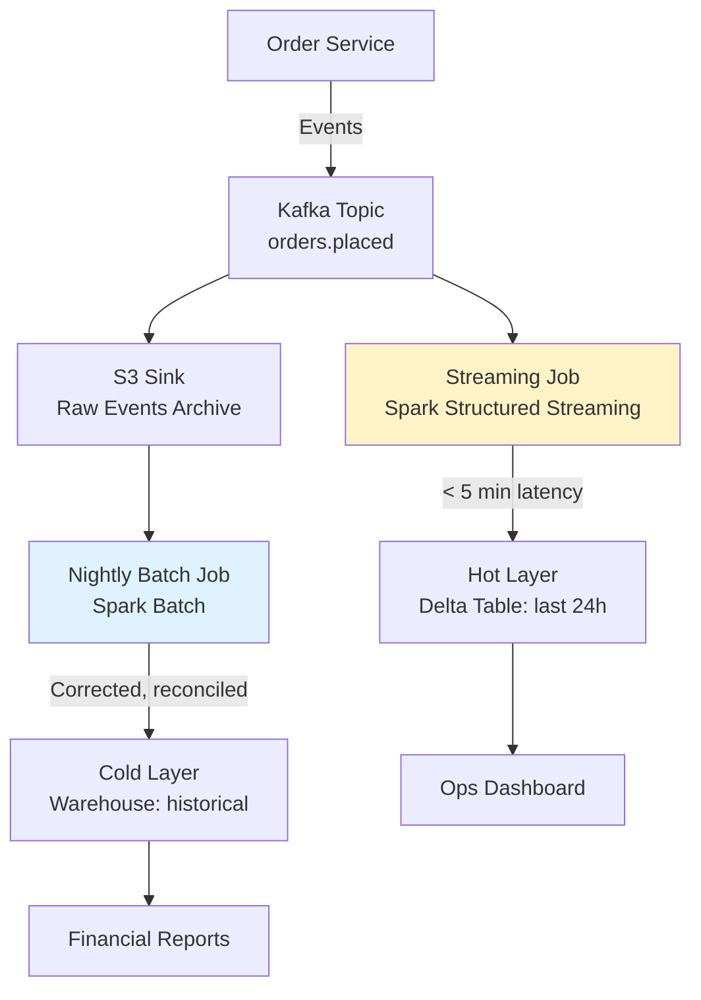
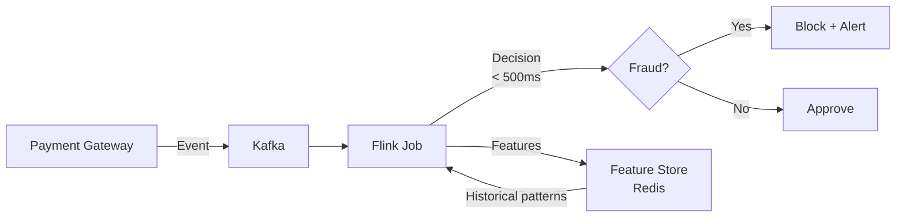
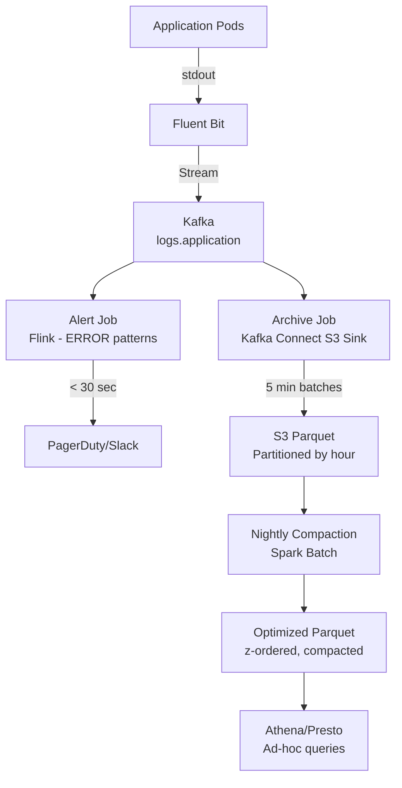

# Batch vs Streaming — Real-World Production Examples

## Case Study 1: E-Commerce Order Pipeline

**Requirements:** Orders must appear in the data warehouse within 5 minutes for the ops dashboard, but financial reporting needs exact daily totals.

### Architecture



### Streaming Job (Hot Path)

```python
# Micro-batch every 30 seconds for <5min end-to-end
orders_stream = spark.readStream \
    .format("kafka") \
    .option("subscribe", "orders.placed") \
    .option("kafka.bootstrap.servers", KAFKA_BROKERS) \
    .option("startingOffsets", "latest") \
    .load()

# Parse and validate
parsed = orders_stream \
    .select(from_json(col("value").cast("string"), ORDER_SCHEMA).alias("order")) \
    .select("order.*") \
    .withWatermark("order_timestamp", "10 minutes")

# Aggregate for dashboard (orders per minute by region)
dashboard_metrics = parsed \
    .groupBy(
        window("order_timestamp", "1 minute"),
        "region"
    ).agg(
        count("*").alias("order_count"),
        sum("total_amount").alias("revenue")
    )

# Write to Delta (merge for idempotency)
dashboard_metrics.writeStream \
    .format("delta") \
    .option("checkpointLocation", "s3://checkpoints/orders-hot/") \
    .trigger(processingTime="30 seconds") \
    .start("s3://warehouse/orders_hot/")
```

### Batch Job (Cold Path — Nightly Reconciliation)

```python
# Run at 02:00 UTC, process yesterday's data
from datetime import date, timedelta

yesterday = (date.today() - timedelta(days=1)).isoformat()

# Read all raw events for yesterday (includes late arrivals)
raw_orders = spark.read.parquet(f"s3://raw/orders/date={yesterday}/")

# Full reconciliation against payment gateway
payments = spark.read.jdbc(
    url=PAYMENT_DB_URL,
    table=f"(SELECT * FROM payments WHERE payment_date = '{yesterday}') t",
    properties=JDBC_PROPS
)

# Reconcile: match orders to payments
reconciled = raw_orders.join(payments, "order_id", "full_outer")
matched = reconciled.filter(col("order_id").isNotNull() & col("payment_id").isNotNull())
unmatched_orders = reconciled.filter(col("payment_id").isNull())

# Write corrected data (overwrites hot path data for that date)
matched.write \
    .mode("overwrite") \
    .option("replaceWhere", f"order_date = '{yesterday}'") \
    .format("delta") \
    .save("s3://warehouse/orders_fact/")
```

## Case Study 2: Real-Time Fraud Detection

**Requirements:** Detect suspicious transactions within 500ms. False positive rate must be <1%.

### Architecture



### Stream Processing Logic

```python
# Flink-style pseudocode for fraud scoring

class FraudDetector(KeyedProcessFunction):
    """
    Stateful stream processor that maintains per-user transaction history.
    Computes risk features in real-time.
    """
    
    def __init__(self):
        self.tx_history = ListState()  # Last 100 transactions
        self.velocity_counter = ValueState()  # Transactions in last hour
    
    def process_element(self, transaction, ctx):
        user_id = transaction.user_id
        
        # Feature 1: Transaction velocity (how many in last hour)
        velocity = self.velocity_counter.value() or 0
        
        # Feature 2: Amount deviation from user's average
        history = list(self.tx_history.get())
        avg_amount = sum(t.amount for t in history) / max(len(history), 1)
        amount_zscore = (transaction.amount - avg_amount) / max(std_dev(history), 1)
        
        # Feature 3: Geographic anomaly (distance from last transaction)
        if history:
            last_location = history[-1].location
            distance_km = haversine(last_location, transaction.location)
            time_diff_hours = (transaction.timestamp - history[-1].timestamp).total_seconds() / 3600
            speed_kmh = distance_km / max(time_diff_hours, 0.01)
        else:
            speed_kmh = 0
        
        # Score (simplified — production uses ML model)
        risk_score = (
            0.3 * min(velocity / 10, 1.0) +      # High velocity = risky
            0.4 * min(amount_zscore / 3, 1.0) +   # Unusual amount = risky
            0.3 * min(speed_kmh / 900, 1.0)       # Impossible travel = risky
        )
        
        # Decision
        if risk_score > 0.8:
            emit_alert(transaction, risk_score, "HIGH_RISK")
            return Decision.BLOCK
        elif risk_score > 0.5:
            emit_alert(transaction, risk_score, "REVIEW")
            return Decision.APPROVE_WITH_FLAG
        
        # Update state
        self.tx_history.add(transaction)
        self.velocity_counter.update(velocity + 1)
        
        # Register timer to decrement velocity after 1 hour
        ctx.timer_service().register_event_time_timer(
            transaction.timestamp + timedelta(hours=1)
        )
        
        return Decision.APPROVE
```

## Case Study 3: Hybrid Analytics Pipeline (Retail)

**Requirements:** Store inventory levels updated every 30 seconds, historical analytics on daily aggregates, cost-optimized for 10,000 stores × 100K SKUs.

### Tiered Processing Design

```
Layer 1 — STREAMING (30-sec freshness)
  └─ Current stock levels per store/SKU
  └─ Low-stock alerts
  └─ Tech: Kafka Streams → Redis (hot state)

Layer 2 — MICRO-BATCH (5-min freshness)  
  └─ Store-level aggregates for dashboards
  └─ Demand velocity calculations
  └─ Tech: Spark Structured Streaming → Delta Lake

Layer 3 — BATCH (hourly)
  └─ Cross-store analytics, replenishment triggers
  └─ Joins with supplier/logistics data
  └─ Tech: Spark Batch → Snowflake

Layer 4 — BATCH (daily)
  └─ Financial reconciliation
  └─ ML model retraining (demand forecasting)
  └─ Tech: Airflow → Spark → Data Warehouse
```

### Cost Analysis

```
                  | Streaming (24/7) | Micro-batch (24/7) | Hourly Batch | Daily Batch
Compute hours/day |       24         |         24         |      24      |      2
Cluster size      |     8 nodes      |       4 nodes      |   16 nodes   |  32 nodes
Monthly cost      |     $8,640       |       $4,320       |    $5,760    |    $960
Data freshness    |     30 sec       |       5 min        |    1 hour    |   24 hours
```

**Total monthly cost:** ~$19,680 for the complete pipeline
**vs. pure streaming:** Would require 32+ nodes 24/7 = ~$34,560/month

**Savings from tiered approach: ~43%** while meeting all freshness SLAs.

## Case Study 4: Log Processing at Scale

**Requirements:** 50GB/hour of application logs. Need real-time error alerting + searchable historical archive.



**Key design decisions:**
1. **Alerting is streaming** (30-sec SLA for error detection)
2. **Archival is micro-batch** (5-min S3 writes via Kafka Connect — cheaper than streaming Spark)
3. **Compaction is batch** (daily optimization of small files → query-friendly Parquet)
4. **Queries are batch** (ad-hoc Athena/Presto — no always-on compute)

## Production Decision Framework

When choosing batch vs. streaming for a new pipeline:

```
1. What's the freshness SLA?
   ├── < 1 second     → True streaming (Flink, Kafka Streams)
   ├── < 5 minutes    → Micro-batch (Spark Structured Streaming)
   ├── < 1 hour       → Frequent batch (triggered every N minutes)
   └── > 1 hour       → Traditional batch (Airflow-scheduled)

2. What's the data volume?
   ├── < 1 GB/day     → Batch is fine even for low-latency needs (small = fast)
   ├── 1-100 GB/day   → Either; choose by freshness need
   └── > 100 GB/day   → Streaming may be necessary to avoid massive batch bursts

3. What's the correctness requirement?
   ├── Approximate OK  → Streaming with aggressive watermarks
   ├── Eventually exact → Streaming + batch reconciliation (Lambda)
   └── Always exact    → Batch only (or exactly-once streaming + careful design)

4. What's the budget?
   ├── Limited         → Batch (turn off between runs)
   └── Flexible        → Match architecture to SLA
```

## Interview Tip 💡

> The strongest senior answer to "batch or streaming?" is: "It depends on the latency SLA, correctness requirement, and cost constraint. I'd start with batch because it's simpler and cheaper, and only introduce streaming for the specific data paths that genuinely need sub-minute freshness. In my experience, most 'we need real-time' requirements are actually fine with 5-minute micro-batch." This shows pragmatism over resume-driven architecture.
