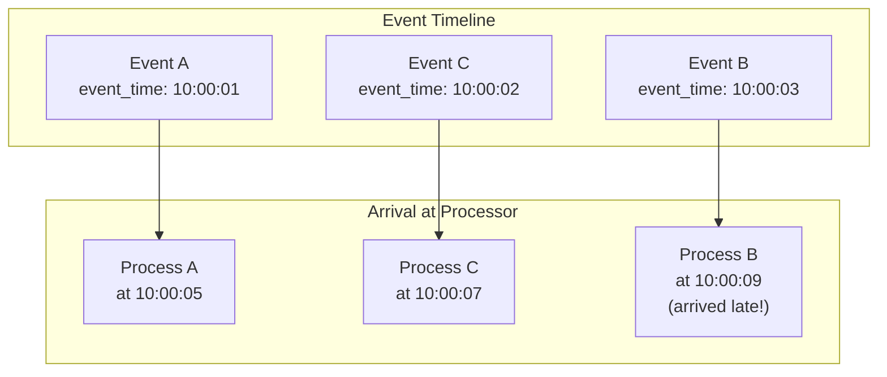
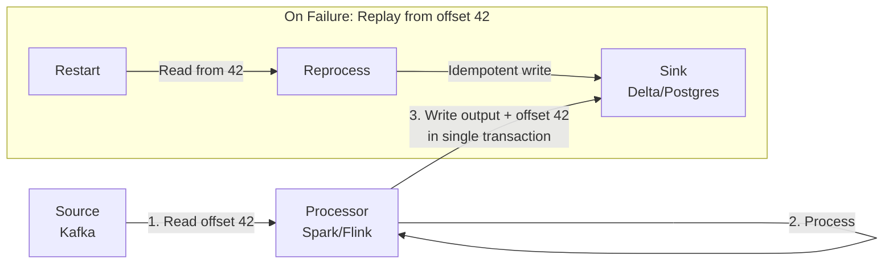
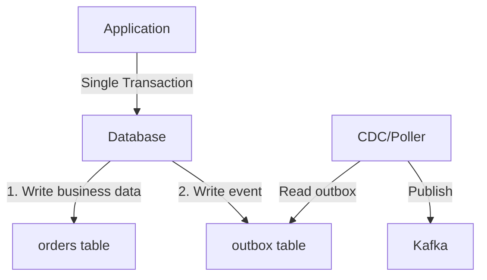
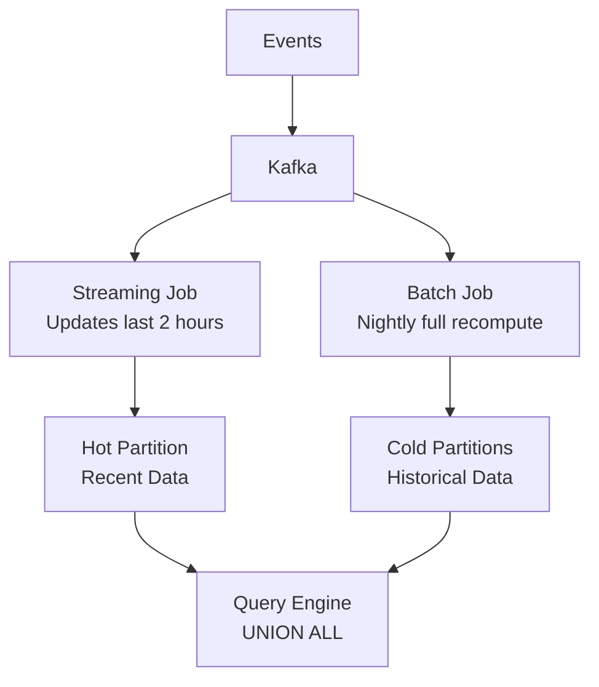

# Batch vs Streaming — Senior-Level Deep Dive

## Unified Batch + Streaming Architecture

Modern frameworks (Spark Structured Streaming, Apache Flink, Apache Beam) unify batch and streaming with the same API. The execution engine handles the complexity.

```python
# Same code, different execution mode (Spark)

# BATCH: process all historical data
spark.read.parquet("s3://events/") \
    .groupBy("user_id", window("ts", "1 hour")) \
    .agg(count("*")) \
    .write.parquet("s3://output/")

# STREAMING: process continuously from Kafka
spark.readStream.format("kafka") \
    .option("subscribe", "events") \
    .load() \
    .groupBy("user_id", window("ts", "1 hour")) \
    .agg(count("*")) \
    .writeStream.format("parquet") \
    .option("path", "s3://output/") \
    .option("checkpointLocation", "s3://checkpoints/") \
    .start()
```

### Choosing a Trigger Strategy (Spark)

| Trigger | Latency | Throughput | Use Case |
|---------|---------|------------|----------|
| `processingTime("10 seconds")` | ~10s | High | Dashboard updates |
| `processingTime("1 minute")` | ~1min | Very High | Near-real-time ETL |
| `once()` | N/A (batch) | Maximum | Scheduled incremental jobs |
| `availableNow()` | N/A (batch) | Maximum | Process all available, then stop |
| `continuous("1 second")` | ~1s | Lower | True low-latency (experimental) |

```python
# Trigger once: process all available data, then stop (incremental batch)
query = stream_df.writeStream \
    .trigger(availableNow=True) \  # Spark 3.3+
    .format("delta") \
    .start()

# This is the "Kappa-style batch" — streaming code, batch execution
```

## Event Time vs Processing Time Deep Dive



**Problem:** Event B happened at 10:00:03 but arrived at 10:00:09 (6 seconds late). If using processing time, it would be assigned to the wrong window.

**Rule:** Always use event time for correctness. Processing time is only acceptable for monitoring metrics where precision doesn't matter.

### Watermark Strategy Design

```python
# Conservative watermark (no data loss, higher state)
# Use when: financial transactions, compliance data
stream.withWatermark("event_time", "1 hour")

# Aggressive watermark (lower state, some data loss)
# Use when: clickstream analytics, dashboards
stream.withWatermark("event_time", "2 minutes")

# Dynamic watermark based on observed lateness
# Track the 99th percentile of lateness and set watermark accordingly
# (Custom implementation required — not built-in)
```

## Exactly-Once End-to-End Architecture

True exactly-once requires coordination across the entire pipeline:



### Pattern: Idempotent Sink with Dedup Table

```sql
-- Dedup table tracks processed message IDs
CREATE TABLE processed_messages (
    message_id VARCHAR PRIMARY KEY,
    processed_at TIMESTAMP DEFAULT NOW()
);

-- Upsert pattern (INSERT ... ON CONFLICT DO NOTHING)
INSERT INTO target_table (id, data, amount)
VALUES ($1, $2, $3)
ON CONFLICT (id) DO NOTHING;  -- Idempotent: retry-safe

-- Periodic cleanup of old dedup entries
DELETE FROM processed_messages WHERE processed_at < NOW() - INTERVAL '7 days';
```

### Pattern: Transactional Outbox



**Why:** Ensures that the business write and event publish are atomic — no lost events, no phantom events.

## Cost Optimization: Hybrid Architectures

### Pattern: Real-Time Preview + Batch Backfill



- **Streaming:** Handles last 2 hours (low state, fast)
- **Batch:** Recomputes full day overnight (catches late data, fixes errors)
- **Query time:** UNION ALL of hot + cold partitions

**Cost savings:** Streaming cluster sized for 2-hour window (small), not full historical reprocessing.

### Pattern: Tiered Freshness

```
Tier 1 (seconds):   Real-time alerting (fraud)        → Flink + Kafka
Tier 2 (minutes):   Operational dashboards             → Micro-batch (5 min)
Tier 3 (hours):     Analytics, reporting               → Hourly batch
Tier 4 (daily):     Data warehouse, ML training        → Nightly batch
```

**Principle:** Not all data needs the same freshness. Route to the cheapest tier that meets the SLA.

## Handling Reprocessing and Corrections

### Full Reprocessing (Kappa Style)

```python
# Reset consumer offset to beginning → reprocess everything
# Works when: event log is retained (Kafka with infinite retention / S3)

# Spark: change checkpoint location to force reprocess from scratch
query = spark.readStream.format("kafka") \
    .option("startingOffsets", "earliest") \  # Read from beginning
    .load() \
    .writeStream \
    .option("checkpointLocation", "s3://checkpoints/v2/") \  # New checkpoint
    .start()
```

### Partial Reprocessing (Targeted Correction)

```python
# Reprocess specific date partitions only
dates_to_fix = ["2024-01-10", "2024-01-11", "2024-01-12"]

for date in dates_to_fix:
    # Read raw events for that date
    raw = spark.read.parquet(f"s3://raw/events/date={date}/")
    
    # Apply corrected transformation
    corrected = apply_fixed_transform(raw)
    
    # Overwrite just that partition (idempotent)
    corrected.write \
        .mode("overwrite") \
        .option("replaceWhere", f"event_date = '{date}'") \
        .parquet("s3://curated/events/")
```

## Monitoring and Observability

### Key Metrics for Streaming Jobs

| Metric | Healthy | Concerning | Critical |
|--------|---------|------------|----------|
| Processing lag | < 1 min | 1-10 min | > 10 min |
| Records/second | Stable ±20% | Declining trend | Near zero |
| State size | Growing slowly | Rapid growth | OOM risk |
| Checkpoint duration | < trigger interval | Approaching trigger | Exceeds trigger |
| Error rate | < 0.01% | 0.01-1% | > 1% |

### Alerting Rules

```python
# Pseudo-code for streaming health monitor
def check_streaming_health(job_metrics):
    alerts = []
    
    # Lag alert: processing falling behind
    if job_metrics.lag_seconds > 600:
        alerts.append(Alert("CRITICAL", f"Processing lag: {job_metrics.lag_seconds}s"))
    
    # State growth: potential memory issue
    if job_metrics.state_size_mb > job_metrics.state_threshold_mb * 0.8:
        alerts.append(Alert("WARNING", f"State at {job_metrics.state_size_mb}MB"))
    
    # Throughput drop: possible upstream issue
    if job_metrics.records_per_second < job_metrics.baseline * 0.5:
        alerts.append(Alert("WARNING", "Throughput dropped 50% below baseline"))
    
    # No records at all: something is broken
    if job_metrics.records_per_second == 0 and job_metrics.last_record_age > 300:
        alerts.append(Alert("CRITICAL", "No records processed in 5 minutes"))
    
    return alerts
```

## Interview Tip 💡

> Senior-level questions often ask: "Design a pipeline that needs both real-time and historical views." The optimal answer describes a **tiered architecture**: streaming for the hot path (last N hours), batch for cold recomputation (correctness). Explain why: streaming is expensive and hard to debug, so minimize what runs in streaming mode. Mention that you'd use the same transformation logic (via Spark/Beam unification) to avoid maintaining dual code paths — that's the Lambda Architecture's biggest weakness.
