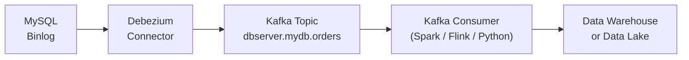
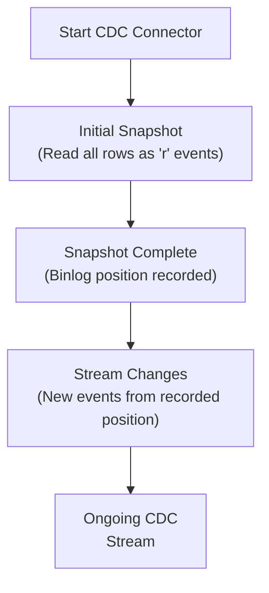

# Change Data Capture (CDC) — Fundamentals

## What Is CDC?

**Change Data Capture** is a pattern for identifying and delivering the changes made to a database (inserts, updates, deletes) to downstream consumers in near-real-time. Instead of periodically querying a source table for new data, CDC reads the database's own internal change log.

```
Traditional polling:  Source DB → Query entire table → Compare → Load
CDC:                  Source DB → Change log (binlog/WAL) → Stream of events → Load
```

CDC is sometimes called **database streaming** or **log-based replication**.

---

## Why CDC Over Polling?

| Aspect | Query-Based Polling | Log-Based CDC |
|---|---|---|
| Capture deletes | Only with soft deletes | Yes, natively |
| Latency | Minutes (batch interval) | Sub-second |
| Source load | High (full/indexed scan) | Minimal (reads log) |
| Schema dependency | Requires `updated_at` column | No special columns needed |
| Event ordering | Lost (only final state) | Preserved |
| Before/after images | No | Yes (before + after values) |

---

## Database Change Logs

Every major RDBMS maintains an internal log of all changes for crash recovery and replication:

| Database | Log Name | CDC Protocol |
|---|---|---|
| MySQL / MariaDB | Binary Log (binlog) | `SHOW BINARY LOGS`, ROW format |
| PostgreSQL | Write-Ahead Log (WAL) | Logical Replication Slots |
| SQL Server | Transaction Log | SQL Server CDC / CT feature |
| Oracle | Redo Log | LogMiner / GoldenGate |
| MongoDB | Oplog | Change Streams |

### MySQL Binary Log

```sql
-- Enable row-based binary logging in MySQL
-- my.cnf:
-- server-id=1
-- log_bin=mysql-bin
-- binlog_format=ROW
-- binlog_row_image=FULL

-- Check current binlog status
SHOW MASTER STATUS;
-- Output: File=mysql-bin.000003, Position=1234

-- View binlog events (for debugging)
SHOW BINLOG EVENTS IN 'mysql-bin.000003' LIMIT 20;
```

### PostgreSQL WAL Logical Replication

```sql
-- Enable logical replication in postgresql.conf:
-- wal_level = logical
-- max_replication_slots = 4

-- Create a replication slot
SELECT pg_create_logical_replication_slot('my_cdc_slot', 'pgoutput');

-- List replication slots
SELECT slot_name, plugin, active, confirmed_flush_lsn
FROM pg_replication_slots;

-- Peek at changes (without consuming them)
SELECT * FROM pg_logical_slot_peek_changes('my_cdc_slot', NULL, NULL);
```

---

## Debezium — The Standard CDC Tool

[Debezium](https://debezium.io) is the most widely used open-source CDC platform. It reads database change logs and publishes events to Apache Kafka.



### Debezium Connector Configuration

```json
{
  "name": "mysql-orders-connector",
  "config": {
    "connector.class": "io.debezium.connector.mysql.MySqlConnector",
    "database.hostname": "mysql-host",
    "database.port": "3306",
    "database.user": "debezium",
    "database.password": "password",
    "database.server.id": "184054",
    "database.server.name": "dbserver1",
    "database.include.list": "mydb",
    "table.include.list": "mydb.orders,mydb.customers",
    "database.history.kafka.bootstrap.servers": "kafka:9092",
    "database.history.kafka.topic": "schema-changes.mydb",
    "include.schema.changes": "true",
    "snapshot.mode": "initial"
  }
}
```

### Debezium Event Format

Every CDC event carries a rich envelope:

```json
{
  "before": {
    "order_id": 1001,
    "status": "pending",
    "total_usd": 99.99
  },
  "after": {
    "order_id": 1001,
    "status": "shipped",
    "total_usd": 99.99
  },
  "source": {
    "version": "2.3.0",
    "connector": "mysql",
    "name": "dbserver1",
    "ts_ms": 1704067200000,
    "db": "mydb",
    "table": "orders",
    "server_id": 184054,
    "gtid": null,
    "file": "mysql-bin.000003",
    "pos": 9472
  },
  "op": "u",
  "ts_ms": 1704067200123
}
```

Key fields:
- `op`: `c` = create, `u` = update, `d` = delete, `r` = read (snapshot)
- `before`: row state before the change (null for inserts)
- `after`: row state after the change (null for deletes)
- `source.ts_ms`: when the change happened in the source DB
- `ts_ms`: when Debezium processed it (ingestion time)

---

## Query-Based CDC (Polling)

When log-based CDC isn't available (e.g., managed cloud DBs without log access), query-based CDC uses a polling approach.

```python
import pandas as pd
import sqlalchemy as sa
from datetime import datetime

def query_based_cdc(engine, table: str, hwm_col: str, last_hwm: datetime) -> pd.DataFrame:
    """
    Query-based CDC: extract changed rows using a timestamp column.
    Limitations:
    - Cannot detect hard deletes (row is gone)
    - Requires an indexed timestamp column
    - Minimum latency = polling interval
    """
    sql = f"""
        SELECT *, 'upsert' AS op
        FROM {table}
        WHERE {hwm_col} > :hwm
        ORDER BY {hwm_col}
    """
    return pd.read_sql(sa.text(sql), engine, params={"hwm": last_hwm})
```

---

## Consuming CDC Events in Python

```python
from confluent_kafka import Consumer
import json

def consume_cdc_events(topic: str, bootstrap_servers: str, group_id: str):
    consumer = Consumer({
        "bootstrap.servers": bootstrap_servers,
        "group.id": group_id,
        "auto.offset.reset": "earliest",
        "enable.auto.commit": False,  # Manual commit for exactly-once
    })
    consumer.subscribe([topic])

    try:
        while True:
            msg = consumer.poll(timeout=1.0)
            if msg is None:
                continue
            if msg.error():
                print(f"Consumer error: {msg.error()}")
                continue

            event = json.loads(msg.value().decode("utf-8"))
            process_cdc_event(event)

            # Commit offset only after successful processing
            consumer.commit(message=msg, asynchronous=False)
    finally:
        consumer.close()

def process_cdc_event(event: dict):
    op     = event.get("op")
    before = event.get("before") or {}
    after  = event.get("after") or {}

    if op == "c":
        print(f"INSERT: {after}")
    elif op == "u":
        print(f"UPDATE: {before} -> {after}")
    elif op == "d":
        print(f"DELETE: {before}")
    elif op == "r":
        print(f"SNAPSHOT: {after}")
```

---

## CDC Snapshot: Initial Load

Before streaming changes, CDC tools perform an **initial snapshot** — a consistent full read of the source table. This is the baseline from which incremental changes are applied.



During snapshot, the source table is typically read with `REPEATABLE READ` isolation to ensure consistency. No locks are held on most databases.

---

## Interview Tips

> **Tip 1:** The core value of log-based CDC over polling is **capture of deletes and before/after images** without requiring any schema changes on the source. This is often the deciding factor when choosing CDC.

> **Tip 2:** Debezium event `op` codes are frequently asked about: `c`=create, `u`=update, `d`=delete, `r`=read (snapshot). Interviewers test whether you understand the full envelope format.

> **Tip 3:** Emphasize that the source database must have the right logging level configured — MySQL needs `binlog_format=ROW`, PostgreSQL needs `wal_level=logical`. This is a common operational concern.

> **Tip 4:** CDC introduces a **replication lag** that's typically sub-second but can grow under high write load. Know the difference between source commit time (`source.ts_ms`) and ingestion time (`ts_ms`).

> **Tip 5:** The initial snapshot phase is a critical operational risk. For large tables, snapshots can take hours and generate massive Kafka traffic. Ask about snapshot chunking strategies (Debezium 2.x supports incremental snapshots).
