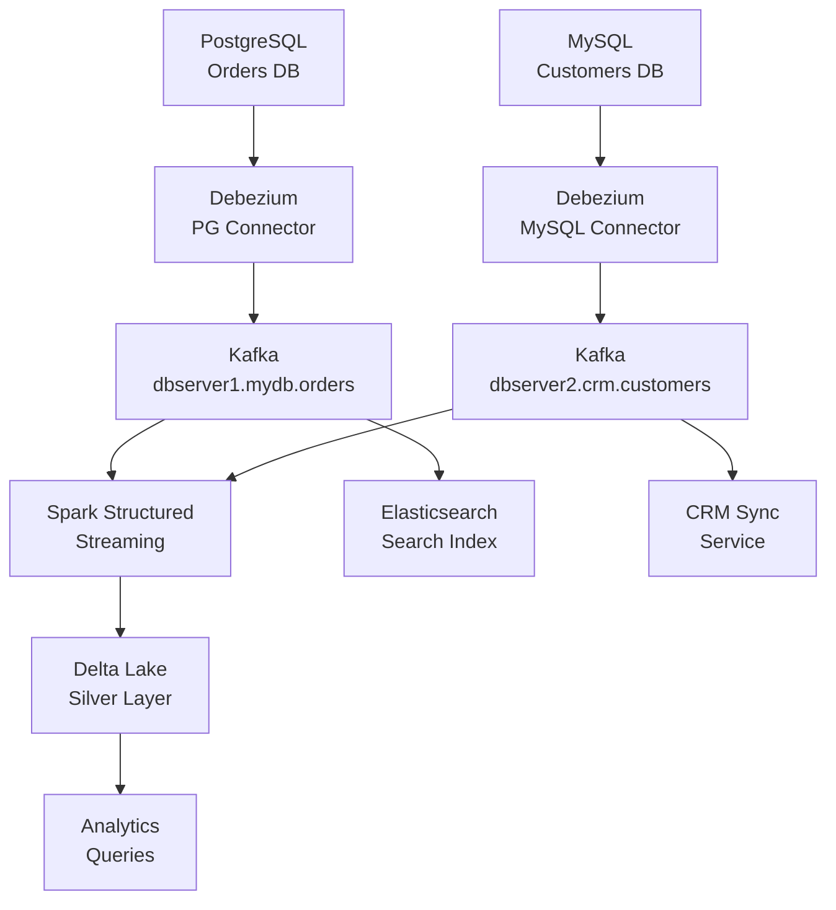

# Change Data Capture (CDC) — Intermediate

## Event Ordering Guarantees

CDC guarantees ordering **per partition** in Kafka. Events for the same row arrive in commit order as long as they go to the same partition.

### Ordering by Primary Key

Debezium uses the primary key as the Kafka message key. This ensures all events for the same row go to the same partition (ordered delivery).

```python
# When producing CDC events, always key by primary key
from confluent_kafka import Producer

producer = Producer({"bootstrap.servers": "kafka:9092"})

def publish_cdc_event(table: str, pk_value: str, event: dict):
    topic = f"cdc.mydb.{table}"
    key   = str(pk_value).encode("utf-8")   # Partition by PK
    value = json.dumps(event).encode("utf-8")
    producer.produce(topic, key=key, value=value)
    producer.flush()
```

### Out-of-Order Events Between Tables

Events across different tables can arrive out of order. For example, an `ORDER` update might be consumed before the corresponding `CUSTOMER` update, even if the customer changed first.

```python
def handle_foreign_key_ordering(order_event: dict, customer_cache: dict) -> bool:
    """
    When an order references a customer that hasn't been processed yet,
    buffer the order and retry after customer is available.
    Returns True if processed, False if buffered.
    """
    customer_id = order_event["after"]["customer_id"]

    if customer_id not in customer_cache:
        print(f"Customer {customer_id} not yet seen. Buffering order.")
        return False  # caller should retry

    # Process with full customer context
    return True
```

---

## Schema Evolution with Debezium

Schema changes are one of the hardest problems in CDC. Debezium handles them via the **schema history topic**.

### Types of Schema Changes

| Change | Impact | Debezium Handling |
|---|---|---|
| Add column (nullable) | Safe | Auto-added to events; NULL in old events |
| Add column (NOT NULL, no default) | Risky | Snapshot required for old rows |
| Drop column | Breaking | Field disappears from events |
| Rename column | Breaking | Old name gone; new name appears |
| Change type (compatible) | Usually safe | Cast at consumer |
| Change type (incompatible) | Breaking | Consumer deserialization fails |

### Schema Registry Integration

```python
from confluent_kafka.schema_registry import SchemaRegistryClient
from confluent_kafka.schema_registry.avro import AvroDeserializer

schema_registry_conf = {"url": "http://schema-registry:8081"}
schema_registry_client = SchemaRegistryClient(schema_registry_conf)

avro_deserializer = AvroDeserializer(schema_registry_client)

def consume_with_schema_registry(msg):
    """Deserialize CDC event using Avro schema from Schema Registry."""
    # Schema is fetched automatically by schema ID embedded in message
    decoded = avro_deserializer(msg.value(), None)
    return decoded
```

### Schema Evolution Strategy

```python
def safe_schema_migration(old_schema: dict, new_schema: dict) -> dict:
    """
    Classify schema changes and determine if migration is needed.
    """
    old_cols = {c["name"]: c for c in old_schema["fields"]}
    new_cols = {c["name"]: c for c in new_schema["fields"]}

    added   = set(new_cols) - set(old_cols)
    removed = set(old_cols) - set(new_cols)
    changed = {
        name for name in old_cols & new_cols
        if old_cols[name]["type"] != new_cols[name]["type"]
    }

    classification = {
        "added_columns":   list(added),
        "removed_columns": list(removed),
        "type_changes":    list(changed),
        "is_breaking":     bool(removed or changed),
        "requires_migration": bool(removed or changed),
    }

    if classification["is_breaking"]:
        raise RuntimeError(f"Breaking schema change detected: {classification}")

    return classification
```

---

## Exactly-Once CDC Delivery

Kafka's default guarantee is at-least-once. To achieve exactly-once with CDC:

### Idempotent Consumer Pattern

```python
class IdempotentCDCConsumer:
    def __init__(self, target_engine, processed_ids_table: str):
        self.target   = target_engine
        self.id_table = processed_ids_table

    def is_already_processed(self, event_id: str) -> bool:
        sql = f"SELECT 1 FROM {self.id_table} WHERE event_id = :id"
        with self.target.connect() as conn:
            row = conn.execute(sa.text(sql), {"id": event_id}).fetchone()
        return row is not None

    def mark_processed(self, conn, event_id: str):
        sql = f"INSERT INTO {self.id_table} (event_id, processed_at) VALUES (:id, NOW())"
        conn.execute(sa.text(sql), {"id": event_id})

    def process_event(self, event: dict):
        # Build stable event ID from source position
        event_id = f"{event['source']['file']}:{event['source']['pos']}"

        if self.is_already_processed(event_id):
            return  # Skip duplicate

        with self.target.begin() as conn:
            self._apply_change(conn, event)
            self.mark_processed(conn, event_id)

    def _apply_change(self, conn, event: dict):
        op    = event["op"]
        after = event.get("after") or {}
        before = event.get("before") or {}

        if op in ("c", "r"):
            # INSERT
            pass
        elif op == "u":
            # UPDATE
            pass
        elif op == "d":
            # DELETE
            pass
```

### Transactional Outbox Pattern Alternative

For services that can't use CDC directly, the **Outbox Pattern** simulates CDC:

```sql
-- Application inserts into both business table and outbox in one transaction
BEGIN;

INSERT INTO orders (order_id, customer_id, status)
VALUES ('ord-123', 'cust-456', 'pending');

INSERT INTO outbox_events (aggregate_id, aggregate_type, event_type, payload, created_at)
VALUES ('ord-123', 'Order', 'OrderCreated',
        '{"order_id":"ord-123","customer_id":"cust-456","status":"pending"}',
        NOW());

COMMIT;
```

```python
# A separate relay process polls the outbox and publishes to Kafka
def outbox_relay(engine, producer):
    sql = """
        SELECT id, aggregate_id, event_type, payload
        FROM outbox_events
        WHERE published_at IS NULL
        ORDER BY created_at
        LIMIT 100
        FOR UPDATE SKIP LOCKED
    """
    with engine.begin() as conn:
        rows = conn.execute(sa.text(sql)).fetchall()
        for row in rows:
            producer.produce(
                topic=f"events.{row.event_type}",
                key=row.aggregate_id.encode(),
                value=row.payload.encode()
            )
            conn.execute(sa.text(
                "UPDATE outbox_events SET published_at = NOW() WHERE id = :id"
            ), {"id": row.id})
        producer.flush()
```

---

## CDC as Kafka Backbone

### Topic Naming Conventions

Debezium follows a standard naming convention:
```
{server.name}.{database}.{table}
# Example: dbserver1.mydb.orders
```

### Kafka as CDC Backbone Architecture



### Consumer Group Management

```python
from confluent_kafka.admin import AdminClient, NewTopic

def setup_cdc_consumer_groups(bootstrap_servers: str, topics: list[str]):
    """Create topics with appropriate retention for CDC."""
    admin = AdminClient({"bootstrap.servers": bootstrap_servers})

    new_topics = []
    for topic in topics:
        new_topics.append(NewTopic(
            topic=topic,
            num_partitions=6,       # Match source table sharding
            replication_factor=3,
            config={
                "retention.ms": str(7 * 24 * 3600 * 1000),   # 7 days
                "cleanup.policy": "delete",
                "compression.type": "lz4",
            }
        ))

    result = admin.create_topics(new_topics)
    for topic, future in result.items():
        try:
            future.result()
            print(f"Topic {topic} created")
        except Exception as e:
            print(f"Failed to create {topic}: {e}")
```

---

## CDC Lag Monitoring

CDC lag (the delay between a source commit and downstream delivery) is a critical operational metric.

```python
import time
from dataclasses import dataclass

@dataclass
class CDCLagMetrics:
    topic: str
    source_lag_ms: float      # Time from DB commit to Kafka
    consumer_lag_ms: float    # Time from Kafka to consumer processing
    total_lag_ms: float       # End-to-end delay

def measure_cdc_lag(event: dict) -> CDCLagMetrics:
    """Measure end-to-end CDC lag from a single event."""
    now_ms          = int(time.time() * 1000)
    source_commit   = event["source"]["ts_ms"]
    debezium_ingest = event["ts_ms"]

    return CDCLagMetrics(
        topic            = event["source"]["table"],
        source_lag_ms    = debezium_ingest - source_commit,
        consumer_lag_ms  = now_ms - debezium_ingest,
        total_lag_ms     = now_ms - source_commit,
    )

def alert_on_lag(metrics: CDCLagMetrics, threshold_ms: int = 60_000):
    """Alert if total CDC lag exceeds threshold."""
    if metrics.total_lag_ms > threshold_ms:
        print(f"ALERT: CDC lag for {metrics.topic} = {metrics.total_lag_ms}ms > {threshold_ms}ms")
```

---

## CDC Performance Considerations

| Factor | Impact | Optimization |
|---|---|---|
| Binlog row image | `FULL` = large events | Use `MINIMAL` if before-images not needed |
| Large transactions | One huge batch in binlog | Split large writes; use chunked deletes |
| Many tables | Connector CPU/memory | Use `table.include.list` to filter |
| Tombstone messages | Accumulate for deletes | Set `delete.handling.mode=rewrite` |
| Snapshot on large table | Hours, massive Kafka traffic | Use incremental snapshot (Debezium 2.x) |

---

## Interview Tips

> **Tip 1:** Know the difference between `source.ts_ms` (when the DB committed the change) and `ts_ms` (when Debezium processed it). The gap between them is the **source lag** — the real measure of CDC freshness.

> **Tip 2:** Explain that Kafka ordering is guaranteed only **within a partition**, and CDC events for the same row go to the same partition (keyed by PK). Cross-table ordering requires application-level coordination.

> **Tip 3:** The Schema Registry + Avro combination is the production-grade approach for CDC in Kafka. Without it, schema changes silently break consumers.

> **Tip 4:** Describe the Outbox Pattern as an alternative to CDC when direct DB log access isn't available (e.g., serverless DBs, managed cloud instances). It provides similar guarantees using application-level transactions.

> **Tip 5:** Debezium's incremental snapshot feature (2.x) is critical for large tables — it allows re-snapshotting without stopping the connector or holding locks. Know this if you're asked about operational safety.
