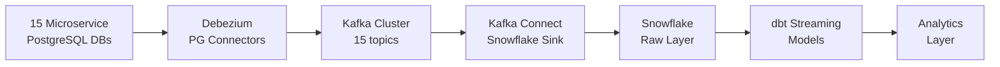
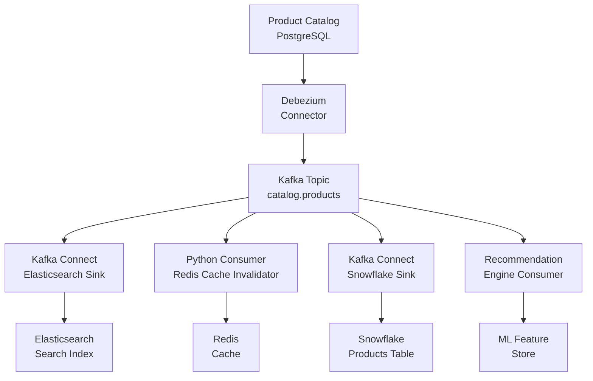

# Change Data Capture — Real World

## Case Study 1: Migrating from Nightly Batch to Real-Time CDC

### Problem

A SaaS company ran nightly ETL jobs pulling from 15 PostgreSQL microservice databases into Snowflake. Analysts could only see data from the previous day. Customer support couldn't look up current order status in the BI tool, leading to calls back to engineers.

### Before Architecture

```
Nightly at 2 AM:
  15 PostgreSQL DBs → Custom Python scripts → S3 staging files → Snowflake COPY INTO
  Latency: 6–20 hours depending on table size
```

### After Architecture with Debezium + Kafka



### Key Implementation Details

```python
# Debezium PG connector configuration for each microservice
def generate_connector_config(service_name: str, db_host: str, tables: list[str]) -> dict:
    return {
        "name": f"{service_name}-cdc-connector",
        "config": {
            "connector.class": "io.debezium.connector.postgresql.PostgresConnector",
            "database.hostname": db_host,
            "database.port": "5432",
            "database.user": "debezium_user",
            "database.password": "${file:/opt/kafka/config/secrets.properties:pg_password}",
            "database.dbname": service_name,
            "database.server.name": service_name,
            "plugin.name": "pgoutput",
            "publication.name": f"dbz_{service_name}_pub",
            "slot.name": f"dbz_{service_name}_slot",
            "table.include.list": ",".join(tables),
            "heartbeat.interval.ms": "30000",  # Prevent slot lag on idle tables
            "snapshot.mode": "initial",
            "decimal.handling.mode": "double",
            "transforms": "unwrap",
            "transforms.unwrap.type": "io.debezium.transforms.ExtractNewRecordState",
            "transforms.unwrap.drop.tombstones": "false",
            "transforms.unwrap.delete.handling.mode": "rewrite",
            "transforms.unwrap.add.fields": "op,source.ts_ms",
        }
    }
```

### Snowflake Sink Connector

```json
{
  "name": "snowflake-sink-orders",
  "config": {
    "connector.class": "com.snowflake.kafka.connector.SnowflakeSinkConnector",
    "tasks.max": "4",
    "topics": "orders-service.public.orders",
    "snowflake.url.name": "myaccount.snowflakecomputing.com:443",
    "snowflake.user.name": "kafka_user",
    "snowflake.private.key": "${file:/secrets/snowflake.properties:private_key}",
    "snowflake.database.name": "RAW_DB",
    "snowflake.schema.name": "ORDERS_SERVICE",
    "snowflake.topic2table.map": "orders-service.public.orders:ORDERS_CDC",
    "buffer.count.records": "10000",
    "buffer.flush.time": "60",
    "buffer.size.bytes": "5000000"
  }
}
```

### Results

| Metric | Before | After |
|---|---|---|
| Data latency | 6–20 hours | 5–30 seconds |
| Support tickets about stale data | 40/month | 2/month |
| ETL maintenance overhead | 15 hrs/week | 2 hrs/week |
| Delete propagation | Manual quarterly cleanup | Automatic |

---

## Case Study 2: Financial Audit Trail with CDC

### Problem

A financial services firm needed a tamper-proof audit log of every change to account balances. Regulatory requirements demanded the exact before/after state for every update, with millisecond timestamps.

### Solution: Append-Only CDC Log in S3/Iceberg

```python
from pyspark.sql import SparkSession
from pyspark.sql.functions import col, from_json, current_timestamp
from pyspark.sql.types import StructType, StringType, LongType, DecimalType

spark = SparkSession.builder \
    .config("spark.sql.extensions", "org.apache.iceberg.spark.extensions.IcebergSparkSessionExtensions") \
    .getOrCreate()

# Define Debezium event schema
cdc_schema = StructType() \
    .add("before", StructType()
         .add("account_id", LongType())
         .add("balance", DecimalType(18, 2))
         .add("updated_at", LongType())) \
    .add("after", StructType()
         .add("account_id", LongType())
         .add("balance", DecimalType(18, 2))
         .add("updated_at", LongType())) \
    .add("op", StringType()) \
    .add("ts_ms", LongType())

def stream_audit_log(kafka_bootstrap: str, topic: str, iceberg_table: str):
    """
    Stream CDC events into an append-only Iceberg audit log.
    Never update or delete from this table — full history preserved.
    """
    raw_stream = (
        spark.readStream
        .format("kafka")
        .option("kafka.bootstrap.servers", kafka_bootstrap)
        .option("subscribe", topic)
        .option("startingOffsets", "earliest")
        .load()
    )

    parsed = raw_stream.select(
        from_json(col("value").cast("string"), cdc_schema).alias("cdc"),
        col("timestamp").alias("kafka_timestamp")
    ).select(
        col("cdc.before.account_id").alias("account_id"),
        col("cdc.before.balance").alias("balance_before"),
        col("cdc.after.balance").alias("balance_after"),
        col("cdc.op").alias("operation"),
        (col("cdc.after.balance") - col("cdc.before.balance")).alias("balance_delta"),
        col("cdc.ts_ms").alias("change_timestamp_ms"),
        col("kafka_timestamp"),
        current_timestamp().alias("ingested_at"),
    )

    query = (
        parsed.writeStream
        .format("iceberg")
        .outputMode("append")
        .option("checkpointLocation", f"s3://audit-bucket/checkpoints/{topic}")
        .toTable(iceberg_table)
    )
    return query
```

### Regulatory Query Example

```sql
-- Reconstruct account balance history for audit
SELECT
    account_id,
    operation,
    balance_before,
    balance_after,
    balance_delta,
    TO_TIMESTAMP(change_timestamp_ms / 1000) AS changed_at,
    ingested_at
FROM audit.account_balance_cdc_log
WHERE account_id = 12345
  AND changed_at BETWEEN '2024-01-01' AND '2024-01-31'
ORDER BY change_timestamp_ms;
```

---

## Case Study 3: CDC-Driven Microservice Synchronization

### Problem

An e-commerce platform had a product catalog service (PostgreSQL) whose data needed to be replicated to:
1. Elasticsearch (for search)
2. Redis (for API caching)
3. An analytics Snowflake warehouse
4. A recommendation engine (Kafka consumer)

Maintaining 4 separate ETL jobs was brittle and caused sync lag between services.

### Solution: Fan-Out CDC Architecture



```python
# Redis cache invalidator consumer
from redis import Redis
from confluent_kafka import Consumer
import json

redis_client = Redis(host="redis-host", port=6379)

def invalidate_product_cache(event: dict):
    """Invalidate Redis cache entries when product changes in CDC."""
    op = event.get("op")
    after = event.get("after") or {}
    before = event.get("before") or {}

    product_id = (after or before).get("product_id")
    if not product_id:
        return

    # Invalidate all cache keys related to this product
    cache_keys = [
        f"product:{product_id}",
        f"product:{product_id}:details",
        f"category:{after.get('category_id')}:products",  # Category listing cache
    ]

    pipe = redis_client.pipeline()
    for key in cache_keys:
        pipe.delete(key)
    pipe.execute()
    print(f"Invalidated {len(cache_keys)} cache keys for product {product_id}")
```

---

## Operational Playbook: CDC Incident Response

### Scenario: Debezium Connector Falls Behind

```python
import requests

CONNECT_URL = "http://kafka-connect:8083"

def diagnose_connector(connector_name: str) -> dict:
    """Full diagnostic for a Debezium connector."""
    status   = requests.get(f"{CONNECT_URL}/connectors/{connector_name}/status").json()
    config   = requests.get(f"{CONNECT_URL}/connectors/{connector_name}/config").json()

    diagnosis = {
        "connector_state": status["connector"]["state"],
        "task_states":     [t["state"] for t in status.get("tasks", [])],
        "failed_tasks":    [t for t in status.get("tasks", []) if t["state"] == "FAILED"],
        "trace":           next((t.get("trace") for t in status.get("tasks", []) if t.get("trace")), None),
    }

    return diagnosis

def recover_connector(connector_name: str):
    """Step-by-step connector recovery."""
    # Step 1: Check status
    diag = diagnose_connector(connector_name)
    print(f"Diagnosis: {diag}")

    # Step 2: Restart failed tasks
    for task in diag["failed_tasks"]:
        task_id = task["id"]
        resp = requests.post(f"{CONNECT_URL}/connectors/{connector_name}/tasks/{task_id}/restart")
        print(f"Restarted task {task_id}: {resp.status_code}")

    # Step 3: If connector state is FAILED, restart the connector
    if diag["connector_state"] == "FAILED":
        resp = requests.post(f"{CONNECT_URL}/connectors/{connector_name}/restart")
        print(f"Restarted connector: {resp.status_code}")
```

### Key Operational Metrics Dashboard

| Metric | Source | Alert Threshold |
|---|---|---|
| Consumer group lag | Kafka | > 100K messages |
| Connector task failures | Kafka Connect API | Any FAILED task |
| PG replication slot lag | `pg_replication_slots` | > 1 GB |
| CDC event processing latency | Prometheus | P99 > 30s |
| DLQ message count | Kafka | > 0 (every DLQ message is an anomaly) |
| Binlog position advancement | Debezium metrics | No advancement in 5 min |

---

## Interview Tips

> **Tip 1:** Real-world CDC often requires the `ExtractNewRecordState` SMT (Single Message Transform) to "unwrap" Debezium's envelope and get a flat record. Know that without it, downstream consumers receive the full `{before, after, source}` structure.

> **Tip 2:** The fan-out CDC pattern (one topic, many consumers) is the key architectural benefit of using Kafka as a CDC backbone. Each new consumer only needs to be added to the Kafka consumer group — no changes to the connector or source DB.

> **Tip 3:** For audit trail use cases, emphasize **append-only** semantics. Never UPDATE or DELETE from the CDC audit log — the full history is the value. Use Iceberg for schema evolution without losing history.

> **Tip 4:** Heartbeat events (Debezium's `heartbeat.interval.ms`) are critical for low-write tables. Without heartbeats, the replication slot on PostgreSQL doesn't advance even when idle, causing slot lag to accumulate.

> **Tip 5:** When presenting a CDC migration case study, quantify the operational savings: "reduced 15 ETL jobs to 1 Debezium connector, cutting maintenance from 15 hrs/week to 2 hrs/week" is the kind of impact that resonates in interviews.
