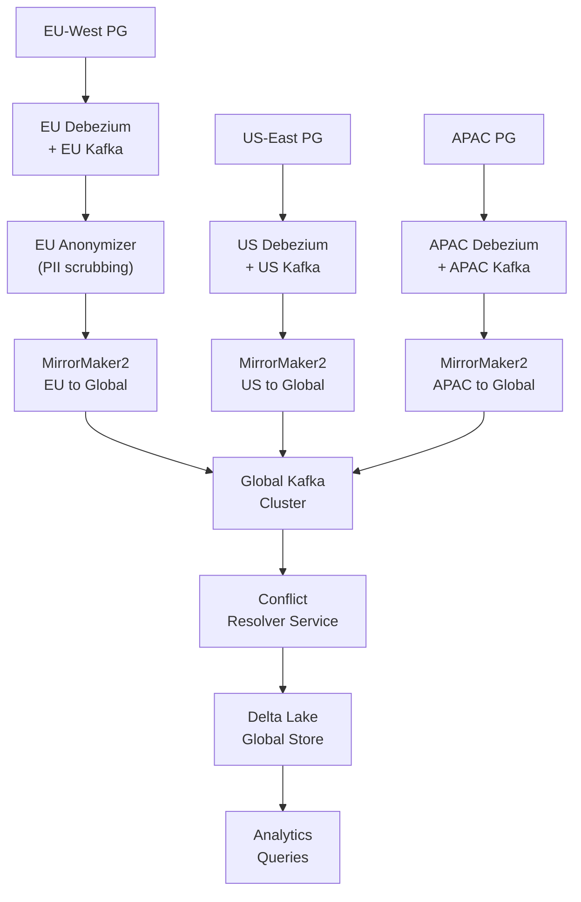

# Scenario Questions — Change Data Capture

<article data-difficulty="junior">

## 🟢 Junior: Choose Between Query-Based and Log-Based CDC

**Scenario:** Your team needs to sync customer profile changes from a MySQL database to a data warehouse every 5 minutes. A colleague suggests using a cron job that runs `SELECT * FROM customers WHERE updated_at > last_run_time`. A senior engineer mentions "log-based CDC with Debezium." You need to recommend one approach and explain the trade-offs.

<details>
<summary>💡 Hint</summary>
Think about what happens when a customer record is deleted. Can the query-based approach detect that? What about the `updated_at` column — what if it doesn't exist or isn't updated reliably?
</details>

<details>
<summary>✅ Solution</summary>

**Recommendation depends on constraints, but here's the full analysis:**

**Query-based polling (simpler):**

```python
from datetime import datetime
import pandas as pd
import sqlalchemy as sa

def poll_customer_changes(source_engine, last_hwm: datetime) -> pd.DataFrame:
    sql = """
        SELECT customer_id, email, phone, country, updated_at
        FROM customers
        WHERE updated_at > :hwm
        ORDER BY updated_at
    """
    return pd.read_sql(sa.text(sql), source_engine, params={"hwm": last_hwm})
```

**Limitations of query-based:**
- Cannot detect hard deletes (row is physically removed)
- Requires a reliable `updated_at` column — if the application doesn't update it consistently, changes are missed
- Higher source DB load (indexed scan every 5 minutes)
- Cannot capture before/after values

**Log-based CDC with Debezium (more capable):**

```json
{
  "connector.class": "io.debezium.connector.mysql.MySqlConnector",
  "database.hostname": "mysql-host",
  "database.include.list": "crm",
  "table.include.list": "crm.customers"
}
```

**Benefits of log-based:**
- Captures inserts, updates, AND deletes from the MySQL binlog
- No dependency on `updated_at` column
- Near-zero source DB load (reads the binlog, not the tables)
- Provides before/after values for every change
- Sub-second latency (vs. 5-minute polling)

**Decision matrix:**

| Factor | Choose Query-Based | Choose Log-Based |
|---|---|---|
| Hard deletes needed | No | Yes |
| Source has `updated_at` | Yes | Optional |
| Latency requirement | Minutes OK | Sub-second needed |
| Team Kafka experience | Low | Available |
| Source DB log access | Not available | Available |

**For this scenario:** If the MySQL DB has `binlog_format=ROW` (check with `SHOW VARIABLES LIKE 'binlog_format'`), log-based CDC is superior. If Kafka infrastructure isn't available, start with query-based and plan to migrate.

</details>

</article>

<article data-difficulty="mid-level">

## 🟡 Mid-Level: Handling CDC Schema Changes Without Downtime

**Scenario:** You have a Debezium connector streaming changes from a PostgreSQL `payments` table to Kafka. Downstream, a Python consumer reads these events and writes to Snowflake. The backend team informs you that next Tuesday they're:
1. Adding a new nullable column `processor_fee_usd DECIMAL(10,2)`
2. Renaming `amount` to `amount_usd`

How do you ensure zero downtime and no data loss during this migration?

<details>
<summary>💡 Hint</summary>
Column renames are breaking changes — old events use `amount`, new events use `amount_usd`. Think about consumer versioning and how to handle both formats simultaneously.
</details>

<details>
<summary>✅ Solution</summary>

**This requires a coordinated migration across three systems: the source DB, Debezium, and the consumer.**

**Step 1 — Negotiate the migration plan with the backend team:**

Column renames should be done in two phases to avoid breakage:
- Phase 1: Add `amount_usd` as a copy of `amount` (both columns exist)
- Phase 2: After consumers are updated, drop `amount`

This is the safest approach. If the rename is truly atomic (database migration in one step), proceed to Step 2.

**Step 2 — Update the consumer to handle both schemas:**

```python
def parse_payment_event(event: dict) -> dict:
    """
    Schema-tolerant parser that handles both old and new event formats.
    Handles: amount (old) vs amount_usd (new) rename.
    """
    after = event.get("after") or {}

    # Handle column rename: prefer new name, fall back to old
    amount_usd = after.get("amount_usd") or after.get("amount")

    return {
        "payment_id":      after.get("payment_id"),
        "amount_usd":      amount_usd,
        "processor_fee":   after.get("processor_fee_usd"),  # None for old events
        "status":          after.get("status"),
        "created_at":      after.get("created_at"),
    }
```

**Step 3 — Deploy consumer BEFORE the schema migration:**

```
Timeline:
  T-1 day: Deploy new consumer (handles both schemas)
  T=0:     Backend deploys DB migration (rename + add column)
  T+0:     Debezium auto-detects schema change; registers new schema version
  T+0:     Consumer processes new events with amount_usd; old events with amount (fallback)
  T+1 day: Confirm all consumers have processed past the migration point
  T+2 day: Clean up fallback logic (optional)
```

**Step 4 — Update Snowflake target table:**

```sql
-- Run before the DB migration
ALTER TABLE snowflake_payments
    ADD COLUMN amount_usd DECIMAL(10, 2),
    ADD COLUMN processor_fee_usd DECIMAL(10, 2);

-- Backfill amount_usd from amount
UPDATE snowflake_payments
SET amount_usd = amount
WHERE amount_usd IS NULL;
```

**Step 5 — Monitor schema change propagation:**

```python
def check_schema_version(topic: str, schema_registry_url: str) -> int:
    """Check how many schema versions exist for this topic."""
    import requests
    resp = requests.get(f"{schema_registry_url}/subjects/{topic}-value/versions")
    versions = resp.json()
    print(f"Topic {topic} has {len(versions)} schema versions: {versions}")
    return len(versions)
```

**Key principle:** Deploy the consumer that handles the new schema **before** the DB migration happens. This way, when the schema change arrives in Kafka, the consumer is already ready for it.

</details>

</article>

<article data-difficulty="senior">

## 🔴 Senior: Designing a CDC System for a Multi-Region Active-Active Database

**Scenario:** Your company runs an active-active multi-region setup with PostgreSQL clusters in US-East, EU-West, and APAC-Southeast. All three regions accept writes. Due to network partitions, the same logical entity (e.g., `user_id=12345`) can be modified in two regions simultaneously. You need to build a CDC pipeline that:
1. Consolidates all changes into a single global analytics store
2. Detects and resolves write conflicts (same row modified in two regions simultaneously)
3. Provides a globally consistent view with < 60 second lag
4. Supports regulatory requirements: EU data must not leave EU until anonymized

How do you architect this?

<details>
<summary>💡 Hint</summary>
Think about vector clocks or Lamport timestamps for conflict detection, regional Kafka clusters with MirrorMaker, and data residency requirements for EU data routing.
</details>

<details>
<summary>✅ Solution</summary>

**Architecture overview:**



**Step 1 — Region-stamped CDC events:**

Each Debezium connector adds region metadata via SMT (Single Message Transform):

```json
{
  "transforms": "addRegion",
  "transforms.addRegion.type": "org.apache.kafka.connect.transforms.InsertField$Value",
  "transforms.addRegion.static.field": "source_region",
  "transforms.addRegion.static.value": "us-east"
}
```

**Step 2 — Vector clock conflict detection:**

```python
from dataclasses import dataclass
from typing import Dict

@dataclass
class VectorClock:
    clocks: Dict[str, int]  # {region: logical_time}

    def happens_before(self, other: "VectorClock") -> bool:
        """Returns True if self is causally before other."""
        return (
            all(self.clocks.get(r, 0) <= other.clocks.get(r, 0) for r in set(self.clocks) | set(other.clocks))
            and any(self.clocks.get(r, 0) < other.clocks.get(r, 0) for r in set(self.clocks) | set(other.clocks))
        )

    def concurrent_with(self, other: "VectorClock") -> bool:
        """Returns True if neither happens before the other (conflict!)."""
        return not self.happens_before(other) and not other.happens_before(self)

def resolve_conflict(event_a: dict, event_b: dict, strategy: str = "last_write_wins") -> dict:
    """
    Resolve a write conflict between two concurrent events.
    """
    if strategy == "last_write_wins":
        # Use source DB timestamp (not Debezium ingestion time)
        ts_a = event_a["source"]["ts_ms"]
        ts_b = event_b["source"]["ts_ms"]
        return event_a if ts_a >= ts_b else event_b

    elif strategy == "region_priority":
        # Predetermined region priority (e.g., US-East is authoritative for pricing)
        priority = {"us-east": 1, "eu-west": 2, "apac-southeast": 3}
        region_a = event_a["after"]["source_region"]
        region_b = event_b["after"]["source_region"]
        return event_a if priority[region_a] <= priority[region_b] else event_b

    elif strategy == "merge":
        # Field-level merge: take each field from the event with higher timestamp for that field
        merged = event_a["after"].copy()
        for field, value in event_b["after"].items():
            if event_b["source"]["ts_ms"] > event_a["source"]["ts_ms"]:
                merged[field] = value
        return {**event_a, "after": merged}
```

**Step 3 — EU data residency (anonymization before leaving EU):**

```python
import hashlib

GDPR_PII_FIELDS = ["email", "phone", "ip_address", "full_name", "address"]

def anonymize_eu_event(event: dict) -> dict:
    """
    Replace PII fields with deterministic pseudonyms before routing outside EU.
    Pseudonymization (not anonymization) preserves join keys while hiding PII.
    """
    after = (event.get("after") or {}).copy()

    for field in GDPR_PII_FIELDS:
        if field in after and after[field] is not None:
            # Deterministic pseudonym: consistent across time, not reversible without key
            after[field] = hashlib.sha256(
                f"salt-{after[field]}".encode()
            ).hexdigest()[:16]

    return {**event, "after": after, "anonymized": True, "source_region": "eu-west"}
```

**Step 4 — Conflict-aware Delta Lake write:**

```python
from delta.tables import DeltaTable
from pyspark.sql.functions import col, lit, current_timestamp

def write_with_conflict_resolution(spark, batch_df, target_path: str):
    """
    Write a batch of multi-region CDC events to Delta Lake.
    On conflict (same entity from multiple regions), apply resolution strategy.
    """
    # Detect conflicts: same entity_id appearing multiple times in this batch
    from pyspark.sql.window import Window
    from pyspark.sql.functions import count, row_number

    w = Window.partitionBy("entity_id").orderBy(col("source_ts_ms").desc())

    deduped = (
        batch_df
        .withColumn("rn", row_number().over(w))
        .withColumn("region_count", count("entity_id").over(Window.partitionBy("entity_id")))
        .withColumn("has_conflict", col("region_count") > 1)
        .filter("rn = 1")  # Keep winner (highest source_ts_ms = last write wins)
    )

    # Log conflicts for audit
    conflicts = batch_df.filter("region_count > 1")
    conflicts.write.mode("append").parquet(f"{target_path}/_conflicts")

    # Write resolved records to main table
    target = DeltaTable.forPath(spark, target_path)
    target.alias("tgt").merge(
        deduped.alias("src"),
        "tgt.entity_id = src.entity_id"
    ).whenMatchedUpdate(
        condition="src.source_ts_ms > tgt.source_ts_ms",
        set={
            "data":           "src.data",
            "source_region":  "src.source_region",
            "source_ts_ms":   "src.source_ts_ms",
            "resolved_at":    current_timestamp(),
            "had_conflict":   "src.has_conflict",
        }
    ).whenNotMatchedInsertAll().execute()
```

**Step 5 — Monitoring the global consistency guarantee:**

```python
def check_global_lag(regional_kafka_clusters: dict, global_cluster: str) -> dict:
    """
    Measure lag from each regional DB commit to global store.
    SLA: < 60 seconds end-to-end.
    """
    from confluent_kafka.admin import AdminClient

    lags = {}
    for region, bootstrap in regional_kafka_clusters.items():
        # Measure lag via consumer group offset comparison
        # (simplified — real implementation uses consumer group offset APIs)
        lags[region] = {
            "kafka_lag_seconds": _measure_mirror_maker_lag(region, global_cluster),
            "db_to_kafka_lag_ms": _measure_debezium_lag(bootstrap, region),
        }

    # Breach detection
    for region, lag_info in lags.items():
        total_lag = lag_info["kafka_lag_seconds"] + lag_info["db_to_kafka_lag_ms"] / 1000
        if total_lag > 60:
            print(f"SLA BREACH: {region} total lag = {total_lag:.1f}s > 60s target")

    return lags
```

**Key architectural decisions:**
- **Per-region Debezium connectors + per-region Kafka**: Regional data stays in region until explicitly routed out
- **MirrorMaker 2**: Standard tool for cross-cluster Kafka replication (handles offset translation)
- **EU anonymizer**: Runs as a Kafka Streams application in EU before MirrorMaker routes data out
- **Last-write-wins with audit log**: Simple conflict resolution with full conflict history preserved
- **Vector clocks for conflict detection**: Identifies concurrent writes; resolution strategy is business-specific

</details>

</article>
