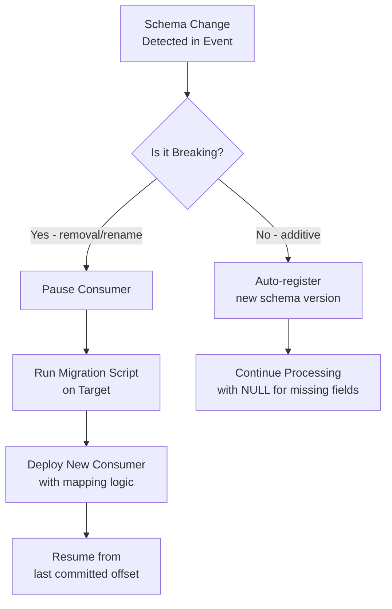

# Change Data Capture — Senior Deep Dive

## Exactly-Once CDC at Scale

True exactly-once delivery in distributed CDC requires coordination across three systems: the source DB, the message broker, and the target.

### Two-Phase Commit Approach

```python
from enum import Enum

class TxnPhase(Enum):
    PREPARE = "prepare"
    COMMIT  = "commit"
    ABORT   = "abort"

class ExactlyOnceCDCProcessor:
    """
    Implements 2PC for exactly-once CDC between Kafka and a target DB.
    Uses Kafka transactions + DB transactions for atomicity.
    """
    def __init__(self, kafka_producer, target_engine, txn_log_table: str):
        self.producer   = kafka_producer
        self.target     = target_engine
        self.txn_log    = txn_log_table

    def process_batch(self, events: list[dict]) -> int:
        # Begin Kafka transaction
        self.producer.begin_transaction()

        try:
            # Phase 1: Write to target DB
            with self.target.begin() as db_txn:
                rows_written = self._apply_events(db_txn, events)

                # Record Kafka offsets in the same DB transaction
                self._record_offsets(db_txn, events)

                # Phase 2: Commit both atomically
                db_txn.commit()  # DB commits first
                self.producer.commit_transaction()  # Then Kafka

            return rows_written

        except Exception as e:
            self.producer.abort_transaction()
            raise

    def _apply_events(self, conn, events: list[dict]) -> int:
        rows = 0
        for event in events:
            op = event["op"]
            if op in ("c", "r"):
                self._insert(conn, event["after"])
            elif op == "u":
                self._upsert(conn, event["after"])
            elif op == "d":
                self._soft_delete(conn, event["before"])
            rows += 1
        return rows

    def _record_offsets(self, conn, events: list[dict]):
        """Store consumed Kafka offsets in target DB to prevent re-processing."""
        for event in events:
            conn.execute(sa.text(f"""
                INSERT INTO {self.txn_log} (topic, partition, offset_val, processed_at)
                VALUES (:t, :p, :o, NOW())
                ON CONFLICT (topic, partition) DO UPDATE SET offset_val = EXCLUDED.offset_val
            """), {
                "t": event["_kafka_topic"],
                "p": event["_kafka_partition"],
                "o": event["_kafka_offset"]
            })
```

---

## Apache Flink CDC Integration

Flink provides the most powerful CDC processing engine, with native support for stateful stream processing and exactly-once semantics.

```python
# Using PyFlink for CDC processing
from pyflink.datastream import StreamExecutionEnvironment
from pyflink.table import StreamTableEnvironment, EnvironmentSettings

env     = StreamExecutionEnvironment.get_execution_environment()
env.set_parallelism(4)
env.enable_checkpointing(60_000)  # Checkpoint every 60 seconds

settings   = EnvironmentSettings.new_instance().in_streaming_mode().build()
table_env  = StreamTableEnvironment.create(env, environment_settings=settings)

# Define MySQL CDC source
table_env.execute_sql("""
    CREATE TABLE mysql_orders (
        order_id    BIGINT PRIMARY KEY NOT ENFORCED,
        customer_id BIGINT,
        status      STRING,
        total_usd   DECIMAL(10, 2),
        updated_at  TIMESTAMP(3),
        -- CDC metadata
        db_name     STRING METADATA FROM 'database_name' VIRTUAL,
        op_type     STRING METADATA FROM 'op_type' VIRTUAL
    ) WITH (
        'connector'     = 'mysql-cdc',
        'hostname'      = 'mysql-host',
        'port'          = '3306',
        'username'      = 'flink_cdc',
        'password'      = 'password',
        'database-name' = 'mydb',
        'table-name'    = 'orders'
    )
""")

# Define target (Iceberg for ACID upserts)
table_env.execute_sql("""
    CREATE TABLE iceberg_orders (
        order_id    BIGINT PRIMARY KEY NOT ENFORCED,
        customer_id BIGINT,
        status      STRING,
        total_usd   DECIMAL(10, 2),
        updated_at  TIMESTAMP(3)
    ) WITH (
        'connector'         = 'iceberg',
        'catalog-name'      = 'hive_catalog',
        'catalog-type'      = 'hive',
        'warehouse'         = 's3://my-bucket/warehouse',
        'write.upsert.enabled' = 'true'
    )
""")

# Stream from MySQL to Iceberg with upsert semantics
table_env.execute_sql("""
    INSERT INTO iceberg_orders
    SELECT order_id, customer_id, status, total_usd, updated_at
    FROM mysql_orders
""")
```

---

## GTID-Based Replication and Failover

Global Transaction Identifiers (GTIDs) enable reliable MySQL CDC during failover events.

```python
class GTIDTracker:
    """
    Track GTID sets for reliable MySQL CDC position tracking.
    GTIDs survive failover to replica, unlike file+offset positions.
    """
    def __init__(self):
        self.executed_gtids: set[str] = set()

    def parse_gtid_set(self, gtid_set_str: str) -> set[str]:
        """Parse MySQL GTID set format: uuid:1-100,uuid:200-300"""
        gtids = set()
        for entry in gtid_set_str.split(","):
            entry = entry.strip()
            if ":" not in entry:
                continue
            server_uuid, ranges = entry.split(":", 1)
            for r in ranges.split(":"):
                if "-" in r:
                    start, end = map(int, r.split("-"))
                    for n in range(start, end + 1):
                        gtids.add(f"{server_uuid}:{n}")
                else:
                    gtids.add(f"{server_uuid}:{r}")
        return gtids

    def is_duplicate(self, gtid: str) -> bool:
        if gtid in self.executed_gtids:
            return True
        self.executed_gtids.add(gtid)
        return False
```

---

## CDC with PostgreSQL Logical Replication

```python
import psycopg2
import psycopg2.extras

def create_pg_cdc_reader(
    dsn: str,
    slot_name: str,
    publication: str
):
    """
    Read PostgreSQL WAL via logical replication protocol.
    pgoutput plugin gives structured change events.
    """
    conn = psycopg2.connect(dsn, connection_factory=psycopg2.extras.LogicalReplicationConnection)
    cur  = conn.cursor()

    # Create replication slot if not exists
    try:
        cur.create_replication_slot(slot_name, output_plugin="pgoutput")
    except psycopg2.errors.DuplicateObject:
        pass  # Slot already exists; resume from last LSN

    # Start streaming
    cur.start_replication(
        slot_name  = slot_name,
        decode     = True,
        options    = {"publication_names": publication, "proto_version": "1"}
    )

    def process_message(msg):
        payload = msg.payload
        # Parse pgoutput protocol...
        print(f"LSN: {msg.data_start}, Payload: {payload[:100]}")
        msg.cursor.send_feedback(flush_lsn=msg.data_start)

    cur.consume_stream(process_message)
```

---

## Schema Evolution: The Full Story



### Dead Letter Queue for Schema Failures

```python
from confluent_kafka import Producer

class SchemaSafeConsumer:
    def __init__(self, main_consumer, dlq_producer, dlq_topic: str):
        self.consumer    = main_consumer
        self.dlq         = dlq_producer
        self.dlq_topic   = dlq_topic

    def process_with_dlq(self, msg):
        try:
            event = self._deserialize(msg)
            self._apply(event)
        except Exception as e:
            # Send to DLQ with error metadata
            self.dlq.produce(
                topic=self.dlq_topic,
                key=msg.key(),
                value=msg.value(),
                headers={
                    "error_type":    str(type(e).__name__).encode(),
                    "error_message": str(e).encode(),
                    "source_topic":  msg.topic().encode(),
                    "source_offset": str(msg.offset()).encode(),
                    "failed_at":     str(int(time.time())).encode(),
                }
            )
            self.dlq.flush()
            # Don't re-raise — commit offset to avoid infinite loop
            print(f"Event sent to DLQ: {e}")
```

---

## Multi-Table CDC Joins (Flink)

One of CDC's most powerful capabilities is joining streams from multiple tables to produce enriched events.

```sql
-- Flink SQL: Join CDC streams for real-time order enrichment
SELECT
    o.order_id,
    o.status,
    o.total_usd,
    c.email        AS customer_email,
    c.country      AS customer_country,
    p.product_name,
    p.category
FROM mysql_orders o
JOIN mysql_customers FOR SYSTEM_TIME AS OF o.proc_time AS c
    ON o.customer_id = c.customer_id
JOIN mysql_products FOR SYSTEM_TIME AS OF o.proc_time AS p
    ON o.product_id = p.product_id
```

This uses Flink's **temporal join** (also called "lookup join") to enrich the order stream with the latest customer and product data at processing time.

---

## Operational Concerns

### Replication Slot Lag (PostgreSQL)

Unconsumed replication slots hold WAL files on disk, which can fill up the PG server.

```python
def monitor_pg_replication_slots(engine):
    """Alert if any replication slot is falling behind."""
    sql = """
        SELECT
            slot_name,
            active,
            pg_wal_lsn_diff(pg_current_wal_lsn(), confirmed_flush_lsn) AS lag_bytes,
            ROUND(pg_wal_lsn_diff(pg_current_wal_lsn(), confirmed_flush_lsn) / 1024 / 1024.0, 2) AS lag_mb
        FROM pg_replication_slots
        ORDER BY lag_bytes DESC
    """
    with engine.connect() as conn:
        rows = conn.execute(sa.text(sql)).fetchall()
    for row in rows:
        if row.lag_mb > 500:
            print(f"CRITICAL: Slot {row.slot_name} is {row.lag_mb}MB behind! PG disk fill risk.")
```

### Connector Restart Recovery

```python
def get_connector_status(connect_url: str, connector_name: str) -> dict:
    import requests
    resp = requests.get(f"{connect_url}/connectors/{connector_name}/status")
    return resp.json()

def restart_failed_tasks(connect_url: str, connector_name: str):
    status = get_connector_status(connect_url, connector_name)
    for task in status.get("tasks", []):
        if task["state"] == "FAILED":
            task_id = task["id"]
            import requests
            requests.post(f"{connect_url}/connectors/{connector_name}/tasks/{task_id}/restart")
            print(f"Restarted task {task_id} for {connector_name}")
```

---

## Interview Tips

> **Tip 1:** When asked about exactly-once CDC, explain that it requires writing Kafka offsets and business data in the **same DB transaction**. Neither Kafka transactions alone nor DB transactions alone are sufficient.

> **Tip 2:** PostgreSQL replication slot lag is a production safety concern — an unconsumed slot holds WAL files and can fill the disk. Always monitor `pg_replication_slots.confirmed_flush_lsn` lag.

> **Tip 3:** Flink's temporal join pattern for multi-table CDC enrichment is a sophisticated feature worth mentioning. It solves the cross-table ordering problem by using processing-time lookup rather than event-time correlation.

> **Tip 4:** GTIDs (MySQL) are superior to file+offset for CDC position tracking during failover. If the primary fails and a replica is promoted, the GTID set allows seamless resumption without position recalculation.

> **Tip 5:** Dead Letter Queues for CDC consumers prevent one bad message from halting the entire pipeline. Always commit the offset after DLQ routing and have a reprocessing workflow for DLQ messages post-fix.
