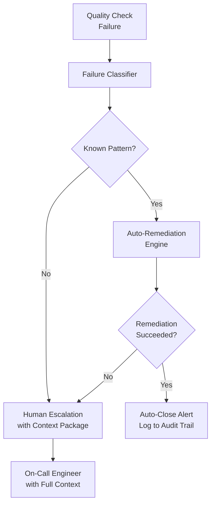

# Scenario Questions — Data Quality

<article data-difficulty="junior">

## 🟢 Junior: Add Quality Checks to an Existing Pipeline

**Scenario:** You've inherited a Python ETL pipeline that loads customer data from a CSV file into PostgreSQL every night. The pipeline has no quality checks — it just reads the CSV and inserts all rows. Last week, 10,000 rows with NULL `customer_id` were loaded, breaking a downstream report. Your task is to add basic quality checks before the insert step.

<details>
<summary>💡 Hint</summary>
Think about the most critical columns for the downstream report. What must be non-null? What should be unique? Are there any value ranges or allowed values to check?
</details>

<details>
<summary>✅ Solution</summary>

Add a quality gate function that validates the DataFrame before loading:

```python
import pandas as pd
from dataclasses import dataclass
from typing import Callable

@dataclass
class QualityCheck:
    name: str
    check: Callable[[pd.DataFrame], bool]
    error_message: str
    severity: str = "error"  # "error" halts; "warn" logs and continues

def run_quality_gate(df: pd.DataFrame, checks: list[QualityCheck]) -> bool:
    """Returns True if pipeline should proceed, False if it should halt."""
    pipeline_ok = True

    for qc in checks:
        passed = qc.check(df)
        status = "PASS" if passed else "FAIL"
        print(f"[{status}] {qc.name}")

        if not passed:
            print(f"  Error: {qc.error_message}")
            if qc.severity == "error":
                pipeline_ok = False

    return pipeline_ok

# Define checks for customer data
customer_checks = [
    QualityCheck(
        name="customer_id_not_null",
        check=lambda df: df["customer_id"].notna().all(),
        error_message=f"NULL customer_id found in {df['customer_id'].isna().sum()} rows",
        severity="error"
    ),
    QualityCheck(
        name="customer_id_unique",
        check=lambda df: not df["customer_id"].duplicated().any(),
        error_message="Duplicate customer_ids detected",
        severity="error"
    ),
    QualityCheck(
        name="email_format",
        check=lambda df: df["email"].str.contains(r"^[^@]+@[^@]+\.[^@]+$", na=False).all(),
        error_message="Invalid email format detected",
        severity="warn"
    ),
    QualityCheck(
        name="row_count_minimum",
        check=lambda df: len(df) >= 100,
        error_message=f"Only {len(df)} rows — expected at least 100",
        severity="error"
    ),
    QualityCheck(
        name="no_future_signup_dates",
        check=lambda df: (pd.to_datetime(df["signup_date"]) <= pd.Timestamp.today()).all(),
        error_message="Future signup dates detected",
        severity="warn"
    ),
]

# In your pipeline:
def etl_pipeline(csv_path: str, engine):
    df = pd.read_csv(csv_path)

    # Quality gate — stop before loading if checks fail
    if not run_quality_gate(df, customer_checks):
        raise RuntimeError("Quality gate failed. Pipeline halted. Fix data before re-running.")

    # Load
    df.to_sql("customers", engine, if_exists="append", index=False)
    print(f"Loaded {len(df)} rows successfully.")
```

**Key principles:**
- Never load data that fails critical (error-severity) checks
- Log warnings for non-critical issues but continue
- Make error messages actionable (include the count of bad rows)
- Always check row count minimums — a file with 0 rows from a misconfigured export is a silent failure

</details>

</article>

<article data-difficulty="mid-level">

## 🟡 Mid-Level: Design a Data Contract Validation System

**Scenario:** Your team has 5 upstream teams producing data your pipelines depend on. Twice a month, upstream teams change schemas without notice — adding columns, renaming fields, or changing types — causing your pipelines to fail. You've been asked to design a data contract system that: catches breaking changes before they reach production, gives upstream teams clear feedback, and maintains a history of contract violations.

<details>
<summary>💡 Hint</summary>
Think about what a "contract" needs to define (schema, types, nullability, value ranges) and where validation should run (upstream before publish, or downstream on ingest). Consider versioning.
</details>

<details>
<summary>✅ Solution</summary>

**Three-layer contract validation system:**

```python
# 1. Define contracts in YAML (version controlled)
import yaml, re
import pandas as pd
from dataclasses import dataclass

CONTRACT = """
id: urn:contract:orders:v2
version: 2.1.0
producer: orders-service-team
consumer: data-platform-team

schema:
  order_id:
    type: string
    required: true
    unique: true
    pattern: "^ORD-[0-9]+"
  customer_id:
    type: string
    required: true
  total_usd:
    type: float
    required: true
    min: 0
    max: 1000000
  status:
    type: string
    required: true
    enum: [pending, processing, shipped, delivered, cancelled]
  created_at:
    type: datetime
    required: true

quality:
  min_row_count: 1000
  max_null_rate:
    customer_id: 0.0
    total_usd: 0.0
    status: 0.0
"""

@dataclass
class ContractViolation:
    field: str
    rule: str
    details: str
    severity: str

class ContractValidator:
    def __init__(self, contract_yaml: str):
        self.contract = yaml.safe_load(contract_yaml)

    def validate(self, df: pd.DataFrame) -> list[ContractViolation]:
        violations = []
        schema = self.contract.get("schema", {})
        quality = self.contract.get("quality", {})

        # Schema validation
        for field, rules in schema.items():
            if field not in df.columns:
                violations.append(ContractViolation(
                    field=field, rule="required_column",
                    details=f"Column '{field}' missing from data",
                    severity="error"
                ))
                continue

            series = df[field]

            if rules.get("required") and series.isna().any():
                null_n = series.isna().sum()
                violations.append(ContractViolation(
                    field=field, rule="not_null",
                    details=f"{null_n} null values in required field",
                    severity="error"
                ))

            if "enum" in rules:
                invalid = series.dropna()[~series.dropna().isin(rules["enum"])]
                if not invalid.empty:
                    violations.append(ContractViolation(
                        field=field, rule="enum_values",
                        details=f"Invalid values: {invalid.unique()[:5].tolist()}",
                        severity="error"
                    ))

            if "min" in rules:
                below = series.dropna()[series.dropna() < rules["min"]]
                if not below.empty:
                    violations.append(ContractViolation(
                        field=field, rule="min_value",
                        details=f"{len(below)} values below minimum {rules['min']}",
                        severity="error"
                    ))

            if "pattern" in rules:
                non_null = series.dropna().astype(str)
                invalid = non_null[~non_null.str.match(rules["pattern"])]
                if not invalid.empty:
                    violations.append(ContractViolation(
                        field=field, rule="pattern",
                        details=f"{len(invalid)} values don't match {rules['pattern']}",
                        severity="warn"
                    ))

        # Quality checks
        if len(df) < quality.get("min_row_count", 0):
            violations.append(ContractViolation(
                field="*", rule="min_row_count",
                details=f"Only {len(df)} rows; contract requires {quality['min_row_count']}",
                severity="error"
            ))

        return violations

# 2. Run validation on ingest and store results
def validate_and_ingest(df: pd.DataFrame, contract_yaml: str, engine, table: str):
    validator  = ContractValidator(contract_yaml)
    violations = validator.validate(df)

    errors = [v for v in violations if v.severity == "error"]
    warns  = [v for v in violations if v.severity == "warn"]

    # Store violation history
    if violations:
        violation_df = pd.DataFrame([v.__dict__ for v in violations])
        violation_df["checked_at"] = pd.Timestamp.now()
        violation_df["table"]      = table
        violation_df.to_sql("contract_violations", engine, if_exists="append", index=False)

    if errors:
        error_summary = "; ".join(f"{v.field}:{v.rule}" for v in errors)
        raise RuntimeError(f"Contract violations (errors) detected: {error_summary}")

    if warns:
        print(f"WARNING: {len(warns)} contract warnings. See contract_violations table.")

    df.to_sql(table, engine, if_exists="append", index=False)
```

**3. Contract violation dashboard query:**

```sql
-- Top violators by upstream producer, last 30 days
SELECT
    c.producer,
    v.rule,
    v.field,
    COUNT(*) AS violation_count,
    MAX(v.checked_at) AS last_seen
FROM contract_violations v
JOIN contracts c ON v.table = c.table_name
WHERE v.checked_at >= CURRENT_DATE - 30
GROUP BY 1, 2, 3
ORDER BY 4 DESC;
```

**Upstream integration:** Share the contract YAML with upstream teams in a shared Git repo. Add a CI check that runs `validate_contract_yaml.py` on PRs, preventing invalid contract changes from being merged.

</details>

</article>

<article data-difficulty="senior">

## 🔴 Senior: Building a Self-Healing Data Quality System

**Scenario:** You're the principal data engineer at a company with 500+ data pipelines. Quality failures happen daily. The current process is: quality check fails → PagerDuty alert → on-call engineer manually investigates → decides whether to retry, backfill, or escalate → manually clears the alert. This takes 30–90 minutes per incident and is burning out the on-call team. Design a self-healing quality system that auto-remediates common failures, escalates only genuinely novel issues, and maintains full auditability.

<details>
<summary>💡 Hint</summary>
Think about classifying failures by type and implementing automated remediation for well-understood failure patterns. Consider what information is needed to auto-remediate vs. what requires human judgment.
</details>

<details>
<summary>✅ Solution</summary>

**System architecture:**



**Step 1 — Failure classifier:**

```python
from enum import Enum

class FailurePattern(Enum):
    TRANSIENT_SOURCE_UNAVAILABLE = "transient_source"
    EMPTY_FILE_FROM_UPSTREAM     = "empty_file"
    SCHEMA_DRIFT_ADDITIVE        = "schema_additive"
    ROW_COUNT_ANOMALY_LOW        = "row_count_low"
    ROW_COUNT_ZERO               = "row_count_zero"
    STALE_DATA                   = "stale_data"
    NOVEL_FAILURE                = "novel"

class FailureClassifier:
    def classify(self, failure: dict, history: list[dict]) -> FailurePattern:
        """Classify a quality failure based on failure details and history."""
        check  = failure["check_name"]
        detail = failure.get("detail", {})

        # Zero rows — likely upstream extraction failure
        if check == "row_count_minimum" and detail.get("actual_count") == 0:
            return FailurePattern.ROW_COUNT_ZERO

        # Row count within 50% of historical avg — transient source delay
        if check == "row_count_minimum":
            hist_avg = sum(h["row_count"] for h in history[-30:]) / len(history[-30:]) if history else 0
            if detail.get("actual_count", 0) > hist_avg * 0.5:
                return FailurePattern.ROW_COUNT_ANOMALY_LOW

        # New columns added (not breaking)
        if check == "schema_matches_contract" and detail.get("violation_type") == "new_column_added":
            return FailurePattern.SCHEMA_DRIFT_ADDITIVE

        # Freshness failure — possible upstream delay
        if check == "freshness_within_sla":
            if failure.get("consecutive_failures", 1) == 1:
                return FailurePattern.STALE_DATA

        return FailurePattern.NOVEL_FAILURE
```

**Step 2 — Auto-remediation engine:**

```python
class AutoRemediationEngine:
    def __init__(self, airflow_client, alert_store, audit_log):
        self.airflow    = airflow_client
        self.alerts     = alert_store
        self.audit      = audit_log

    def remediate(self, failure: dict, pattern: FailurePattern) -> bool:
        """
        Attempt automated remediation. Returns True if successful.
        All actions are logged to audit trail.
        """
        pipeline = failure["pipeline_name"]
        run_id   = failure["run_id"]

        if pattern == FailurePattern.ROW_COUNT_ZERO:
            return self._retry_extraction(pipeline, run_id, max_retries=3)

        elif pattern == FailurePattern.STALE_DATA:
            return self._wait_and_retry(pipeline, run_id, wait_minutes=15)

        elif pattern == FailurePattern.SCHEMA_DRIFT_ADDITIVE:
            return self._auto_register_new_schema(failure)

        elif pattern == FailurePattern.ROW_COUNT_ANOMALY_LOW:
            # Wait for potential late data, then re-validate
            return self._wait_and_revalidate(pipeline, wait_minutes=30)

        return False  # Novel failure requires human

    def _retry_extraction(self, pipeline: str, run_id: str, max_retries: int) -> bool:
        for attempt in range(1, max_retries + 1):
            self.audit.log(f"Auto-retry {attempt}/{max_retries} for {pipeline}")
            try:
                result = self.airflow.trigger_dag(pipeline, run_id=f"{run_id}_retry_{attempt}")
                if result["state"] == "success":
                    self.audit.log(f"Auto-remediation successful on attempt {attempt}")
                    return True
            except Exception as e:
                self.audit.log(f"Retry {attempt} failed: {e}")
        return False

    def _auto_register_new_schema(self, failure: dict) -> bool:
        """For additive schema changes, auto-update contract and re-run."""
        new_columns = failure["detail"].get("new_columns", [])
        self.audit.log(f"Auto-registering new columns: {new_columns}")
        # Migrate target table schema, then re-run validation
        # ...
        return True
```

**Step 3 — Context package for human escalation:**

```python
def build_escalation_context(failure: dict, lineage_graph, history: list) -> dict:
    """
    Build a rich context package for the on-call engineer.
    Goal: enable resolution in < 10 minutes with zero additional investigation.
    """
    table    = failure["table"]
    impact   = lineage_graph.impact_analysis(table)
    trend    = analyze_trend(history[-30:])

    return {
        "summary": f"{failure['check_name']} failed on {table}",
        "impact": {
            "downstream_tables":   impact["affected_tables"],
            "critical_dashboards": impact["critical_affected"],
            "sla_at_risk":         impact["sla_deadline"],
        },
        "diagnosis": {
            "failure_detail":        failure["detail"],
            "first_seen":            failure["first_seen"],
            "similar_past_failures": find_similar_incidents(failure, history),
            "trend":                 trend,
        },
        "recommended_actions": [
            "Check upstream source: /link/to/source-monitoring",
            "Review pipeline logs: /airflow/dag-run/{{ run_id }}",
            "Runbook: /wiki/runbooks/{{ check_name }}",
        ],
        "auto_remediation_attempted": failure.get("remediation_attempts", []),
    }
```

**Results (expected from such a system):**
- Auto-remediation handles ~65% of incidents (transient failures, schema additive changes, empty file retries)
- Mean time to resolution drops from 60 min to 8 min for escalated incidents (rich context package)
- On-call fatigue drops significantly; engineers handle only genuinely novel issues
- Full audit trail of every automated action for compliance

</details>

</article>

---

## ⚡ Quick-fire Q&A

**Q: What are the core dimensions of data quality?**
A: The key dimensions are completeness (no missing values), accuracy (correct values), consistency (no contradictions across systems), timeliness (data is available when needed), uniqueness (no duplicates), and validity (values conform to expected formats and ranges).

**Q: How would you implement data quality checks in an ETL pipeline?**
A: Add validation steps at ingestion (schema checks, null checks), transformation (range checks, referential integrity), and before loading (row count reconciliation, statistical profiling). Use frameworks like Great Expectations or dbt tests to codify and automate these checks.

**Q: What is a data contract and how does it enforce quality?**
A: A data contract is a formal agreement between data producers and consumers defining the schema, semantics, SLAs, and quality expectations of a dataset. Producers validate against the contract before publishing, preventing breaking changes from reaching consumers.

**Q: How do you handle data quality failures in a production pipeline?**
A: Depending on severity: block the load and alert on critical failures (e.g., primary key duplicates), quarantine suspect rows to a dead-letter table for review on warnings, and log metrics for monitoring on informational issues. Never silently drop bad data.

**Q: What is Great Expectations and how does it work?**
A: Great Expectations is a Python framework for defining, documenting, and validating data quality rules called "expectations." You define an expectation suite against a dataset, run validation, and get detailed HTML reports showing pass/fail results and data profiling.

**Q: How do you detect data drift in production?**
A: Monitor statistical properties over time — null rates, value distributions, min/max ranges, cardinality — and alert when they deviate beyond a threshold from historical baselines. Tools like Monte Carlo, Soda, and custom dbt tests automate this.

**Q: What is the difference between data validation and data profiling?**
A: Profiling is exploratory — it describes the current state of data (distributions, patterns, anomalies) without pass/fail verdicts. Validation is assertive — it checks specific rules and fails the pipeline if expectations are violated.

**Q: How do dbt tests support data quality?**
A: dbt provides built-in generic tests (not_null, unique, accepted_values, relationships) and supports custom singular SQL tests. Tests run after transformations and block downstream models from materializing if upstream data violates quality rules.

---

## 💼 Interview Tips

- Frame data quality as a pipeline-first concern, not an afterthought — mention where checks live in the pipeline (ingestion, transform, load) rather than describing them as a post-hoc audit.
- Interviewers want to hear about alerting and escalation paths, not just detection — explain what happens operationally when a quality check fails.
- Mention the cost of bad data reaching consumers (wrong business decisions, SLA breaches, trust erosion) to show business impact awareness.
- Avoid the trap of saying "we just add not_null checks" — senior engineers discuss statistical drift detection, schema evolution handling, and SLA monitoring.
- Be ready to describe how you'd prioritize which checks to implement first — junior candidates add checks everywhere; seniors triage by business criticality and failure impact.
- Know the difference between hard failures (pipeline stops) and soft failures (quarantine + alert) and when each is appropriate — this shows production operations experience.
