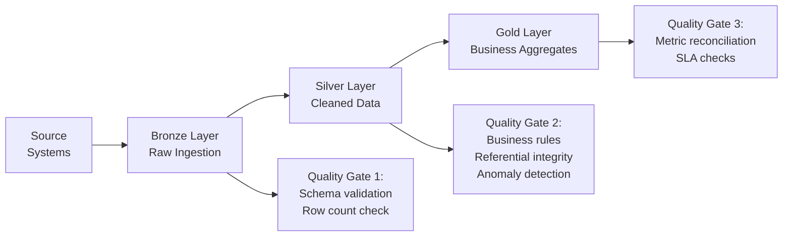

# Data Quality — Senior Deep Dive

## Data Observability Platforms

At scale, ad-hoc data quality checks aren't sufficient. **Data observability** provides continuous, automated monitoring of the entire data stack.

### The Five Pillars of Data Observability

| Pillar | What It Monitors | Example Metric |
|---|---|---|
| **Freshness** | Is data arriving on time? | `MAX(updated_at) < NOW() - 4h` |
| **Volume** | Is data volume within expected range? | Row count deviates > 20% from 30-day average |
| **Distribution** | Are column value distributions stable? | `status='cancelled'` spikes from 5% to 40% |
| **Schema** | Have columns changed? | Column dropped, type changed |
| **Lineage** | Which upstream changes affect which downstream tables? | orders table changed → 23 downstream reports affected |

### Building an Observability Layer

```python
from dataclasses import dataclass, field
from datetime import datetime
from typing import Optional
import pandas as pd
import numpy as np

@dataclass
class ObservabilityMetrics:
    table: str
    run_date: str
    row_count: int
    null_rates: dict[str, float]
    value_distributions: dict[str, dict]
    schema_fingerprint: str
    freshness_hours: float
    recorded_at: datetime = field(default_factory=datetime.utcnow)

class TableObserver:
    def __init__(self, engine, metrics_store):
        self.engine  = engine
        self.store   = metrics_store

    def observe(self, table: str, date_col: str) -> ObservabilityMetrics:
        """Compute full observability snapshot for a table."""
        df = pd.read_sql(
            f"SELECT * FROM {table} WHERE {date_col} = CURRENT_DATE - 1",
            self.engine
        )

        # Row count
        row_count = len(df)

        # Null rates per column
        null_rates = {col: df[col].isna().mean() for col in df.columns}

        # Value distributions for categorical columns
        distributions = {}
        for col in df.select_dtypes(include="object").columns:
            vc = df[col].value_counts(normalize=True).head(10)
            distributions[col] = vc.to_dict()

        # Schema fingerprint (column names + types)
        schema_fp = str(sorted([(c, str(t)) for c, t in df.dtypes.items()]))

        # Freshness
        if date_col in df.columns:
            max_ts = pd.to_datetime(df[date_col]).max()
            freshness_h = (datetime.utcnow() - max_ts.replace(tzinfo=None)).total_seconds() / 3600
        else:
            freshness_h = -1

        metrics = ObservabilityMetrics(
            table=table,
            run_date=str(datetime.utcnow().date()),
            row_count=row_count,
            null_rates=null_rates,
            value_distributions=distributions,
            schema_fingerprint=schema_fp,
            freshness_hours=freshness_h,
        )
        self.store.save(metrics)
        return metrics
```

---

## Automated Anomaly Detection at Scale

### Multi-Metric Anomaly Engine

```python
class AnomalyEngine:
    """
    Detects anomalies across multiple quality metrics using
    adaptive thresholds based on rolling statistics.
    """
    def __init__(self, metrics_store, lookback_days: int = 30):
        self.store       = metrics_store
        self.lookback    = lookback_days

    def detect_all_anomalies(self, table: str, today_metrics: ObservabilityMetrics) -> list[dict]:
        history  = self.store.get_history(table, days=self.lookback)
        anomalies = []

        # Row count anomaly
        rc_history = [m.row_count for m in history]
        if rc_history:
            rc_anomaly = self._z_score_check(
                history=rc_history,
                current=today_metrics.row_count,
                metric_name="row_count",
                z_threshold=3.0
            )
            if rc_anomaly:
                anomalies.append(rc_anomaly)

        # Null rate anomaly per column
        for col, null_rate in today_metrics.null_rates.items():
            col_history = [
                m.null_rates.get(col, 0) for m in history
                if col in m.null_rates
            ]
            if col_history:
                anomaly = self._z_score_check(
                    history=col_history,
                    current=null_rate,
                    metric_name=f"null_rate.{col}",
                    z_threshold=4.0
                )
                if anomaly:
                    anomalies.append(anomaly)

        # Schema change detection
        schema_history = [m.schema_fingerprint for m in history]
        if schema_history and today_metrics.schema_fingerprint not in schema_history:
            anomalies.append({
                "type": "schema_change",
                "table": table,
                "message": "Schema fingerprint changed",
                "severity": "high"
            })

        return anomalies

    def _z_score_check(
        self, history: list, current: float,
        metric_name: str, z_threshold: float
    ) -> Optional[dict]:
        mean    = np.mean(history)
        std     = np.std(history)
        z_score = (current - mean) / std if std > 0 else 0

        if abs(z_score) > z_threshold:
            return {
                "metric":    metric_name,
                "current":   current,
                "mean":      mean,
                "std":       std,
                "z_score":   z_score,
                "direction": "high" if z_score > 0 else "low",
                "severity":  "critical" if abs(z_score) > 5 else "high",
            }
        return None
```

---

## Data Lineage for Impact Analysis

Lineage tracks how data flows from source to downstream consumers, enabling impact analysis when quality issues are found.

```python
import networkx as nx

class DataLineageGraph:
    """
    Directed graph representing data flow between tables/models.
    Used for impact analysis when a quality issue is detected upstream.
    """
    def __init__(self):
        self.graph = nx.DiGraph()

    def add_dependency(self, source: str, target: str, transform: str = ""):
        self.graph.add_edge(source, target, transform=transform)

    def get_downstream_tables(self, table: str) -> list[str]:
        """All tables that depend on `table` (directly or transitively)."""
        return list(nx.descendants(self.graph, table))

    def get_upstream_tables(self, table: str) -> list[str]:
        """All tables that `table` depends on."""
        return list(nx.ancestors(self.graph, table))

    def impact_analysis(self, failed_table: str) -> dict:
        downstream = self.get_downstream_tables(failed_table)
        critical   = [t for t in downstream if "gold" in t or "mart" in t]

        return {
            "failed_table":      failed_table,
            "affected_tables":   len(downstream),
            "critical_affected": critical,
            "impact_severity":   "high" if critical else "medium",
            "downstream_tables": downstream,
        }

# Build lineage
lineage = DataLineageGraph()
lineage.add_dependency("raw.orders", "silver.orders_cleaned", "dbt:clean_orders")
lineage.add_dependency("silver.orders_cleaned", "gold.daily_revenue", "dbt:revenue_agg")
lineage.add_dependency("silver.orders_cleaned", "gold.order_funnel", "dbt:funnel")
lineage.add_dependency("gold.daily_revenue", "mart.executive_dashboard", "BI tool")

# When a quality failure is detected in raw.orders:
impact = lineage.impact_analysis("raw.orders")
print(f"Quality failure in raw.orders affects {impact['affected_tables']} downstream tables")
print(f"Critical affected: {impact['critical_affected']}")
```

---

## Quality SLAs and Error Budgets

Apply SRE concepts to data quality:

```python
@dataclass
class DataQualitySLA:
    table: str
    freshness_sla_hours: float   = 2.0
    completeness_sla_pct: float  = 99.9   # 99.9% non-null on critical cols
    accuracy_sla_pct: float      = 99.5   # 99.5% pass business rule checks
    error_budget_per_month: int  = 43     # Minutes of allowed SLA violation (99.9% uptime)

class ErrorBudgetTracker:
    def __init__(self, engine):
        self.engine = engine

    def get_remaining_budget(self, table: str, month: str) -> dict:
        sql = """
            SELECT
                SUM(CASE WHEN violated THEN violation_minutes ELSE 0 END) AS minutes_violated,
                :budget - SUM(CASE WHEN violated THEN violation_minutes ELSE 0 END) AS minutes_remaining
            FROM quality_sla_events
            WHERE table_name = :table
              AND TO_CHAR(event_time, 'YYYY-MM') = :month
        """
        with self.engine.connect() as conn:
            row = conn.execute(sa.text(sql), {
                "table": table, "budget": 43, "month": month
            }).fetchone()
        return {
            "minutes_violated":  row[0] or 0,
            "minutes_remaining": row[1] or 43,
            "budget_exhausted":  (row[1] or 43) <= 0,
        }
```

---

## Quality in the Medallion Architecture



```python
QUALITY_GATES = {
    "bronze": [
        {"check": "schema_matches_contract",  "severity": "error"},
        {"check": "row_count_not_zero",       "severity": "error"},
        {"check": "primary_key_not_null",     "severity": "error"},
        {"check": "no_future_timestamps",     "severity": "warn"},
    ],
    "silver": [
        {"check": "referential_integrity",    "severity": "error"},
        {"check": "business_rules_pass",      "severity": "error"},
        {"check": "null_rate_within_sla",     "severity": "error"},
        {"check": "row_count_anomaly",        "severity": "warn"},
        {"check": "value_distribution_stable","severity": "warn"},
    ],
    "gold": [
        {"check": "metric_reconciles_with_source", "severity": "error"},
        {"check": "totals_match_yesterday_plus_delta", "severity": "warn"},
        {"check": "freshness_within_sla",     "severity": "error"},
    ]
}
```

---

## Interview Tips

> **Tip 1:** Data observability is the evolution from point-in-time quality checks to continuous monitoring. Mention the five pillars (freshness, volume, distribution, schema, lineage) and explain that commercial tools like Monte Carlo or Acceldata implement all five.

> **Tip 2:** Impact analysis via lineage is a force-multiplier. When a quality failure is detected, lineage tells you which downstream reports and dashboards are at risk — enabling proactive stakeholder communication before they notice.

> **Tip 3:** Applying error budgets (from SRE) to data quality is a senior concept that impresses interviewers. It reframes quality as a continuous engineering concern with quantifiable budget, not a binary pass/fail.

> **Tip 4:** In the medallion architecture, each layer boundary is a quality gate opportunity. Bronze enforces schema; silver enforces business rules; gold enforces metric consistency. This layered approach catches issues closest to their source.

> **Tip 5:** Statistical anomaly detection (Z-score, Prophet) is more robust than static thresholds for metrics with natural variance. A 10% row count drop on a Monday (lower traffic day) is normal; the same drop on a Wednesday is anomalous.
