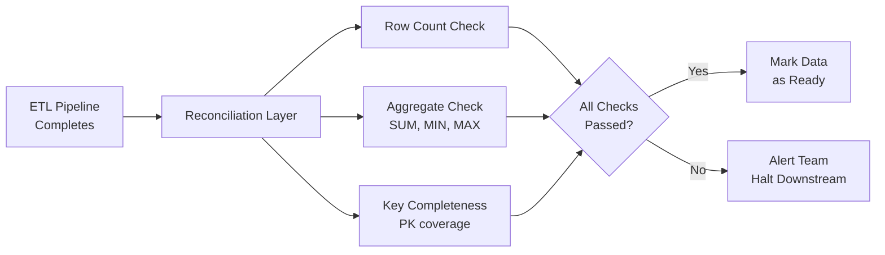

# Data Reconciliation — Fundamentals


## 🎯 Analogy

Think of data reconciliation like a bank balancing its books: you compare what the source says (account balances) with what your system says, and investigate any gap before closing the books.

---
## What Is Data Reconciliation?

**Data reconciliation** is the process of comparing data between two or more systems to verify that they agree. In ETL, it verifies that what was extracted from the source arrived correctly in the target.

Common reconciliation checks:
- Row count: source count == target count?
- Aggregate totals: source SUM(revenue) == target SUM(revenue)?
- Checksum: hash of all rows in source == hash in target?
- Key completeness: all source primary keys present in target?

Reconciliation is the **final quality gate** before data is considered trustworthy for reporting.

---

## Why Reconciliation Matters

Without reconciliation:
- Silent data loss goes undetected (pipeline extracted 1M rows, loaded 999,500 — nobody knows)
- Transformation errors corrupt totals (off-by-one, type conversion loss)
- Partial loads report incorrect metrics (revenue dashboard shows 95% of actual revenue)

---

## Row Count Reconciliation

The simplest and most effective first check:

```python
import pandas as pd
import sqlalchemy as sa

def reconcile_row_counts(
    source_engine,
    target_engine,
    source_table: str,
    target_table: str,
    date_col: str,
    check_date: str,
    tolerance_pct: float = 0.0  # 0% tolerance by default
) -> dict:
    """Compare row counts between source and target for a date partition."""

    src_count = pd.read_sql(
        sa.text(f"SELECT COUNT(*) FROM {source_table} WHERE DATE({date_col}) = :d"),
        source_engine, params={"d": check_date}
    ).iloc[0, 0]

    tgt_count = pd.read_sql(
        sa.text(f"SELECT COUNT(*) FROM {target_table} WHERE DATE({date_col}) = :d"),
        target_engine, params={"d": check_date}
    ).iloc[0, 0]

    diff     = src_count - tgt_count
    diff_pct = abs(diff) / max(src_count, 1) * 100

    result = {
        "date":         check_date,
        "source_count": src_count,
        "target_count": tgt_count,
        "difference":   diff,
        "diff_pct":     diff_pct,
        "passed":       diff_pct <= tolerance_pct,
        "status":       "OK" if diff_pct <= tolerance_pct else "MISMATCH",
    }
    return result

# Example usage
result = reconcile_row_counts(
    src_engine, tgt_engine,
    "orders", "warehouse.orders",
    date_col="created_at",
    check_date="2024-01-15",
    tolerance_pct=0.01   # Accept 0.01% discrepancy (late arrivals)
)

if not result["passed"]:
    raise RuntimeError(f"Row count mismatch: {result}")
```

---

## Aggregate Reconciliation

Row counts alone don't catch all errors. Aggregate checks verify that the data values are consistent.

```sql
-- Source aggregate
SELECT
    DATE(created_at)    AS order_date,
    COUNT(*)            AS row_count,
    SUM(total_usd)      AS total_revenue,
    AVG(total_usd)      AS avg_order_value,
    MIN(total_usd)      AS min_order,
    MAX(total_usd)      AS max_order
FROM orders
WHERE created_at::date = '2024-01-15'
GROUP BY 1;

-- Target aggregate
SELECT
    order_date,
    COUNT(*)            AS row_count,
    SUM(total_usd)      AS total_revenue,
    AVG(total_usd)      AS avg_order_value,
    MIN(total_usd)      AS min_order,
    MAX(total_usd)      AS max_order
FROM warehouse.orders
WHERE order_date = '2024-01-15'
GROUP BY 1;
```

```python
def reconcile_aggregates(
    source_engine,
    target_engine,
    source_table: str,
    target_table: str,
    check_date: str,
    numeric_cols: list[str],
    tolerance_pct: float = 0.001   # 0.1% tolerance for float imprecision
) -> dict:
    """Reconcile numeric aggregates between source and target."""

    results = {}
    for col in numeric_cols:
        src = pd.read_sql(
            sa.text(f"SELECT SUM({col}) FROM {source_table} WHERE created_at::date = :d"),
            source_engine, params={"d": check_date}
        ).iloc[0, 0] or 0

        tgt = pd.read_sql(
            sa.text(f"SELECT SUM({col}) FROM {target_table} WHERE order_date = :d"),
            target_engine, params={"d": check_date}
        ).iloc[0, 0] or 0

        diff_pct = abs(src - tgt) / max(abs(src), 1) * 100

        results[col] = {
            "source_sum": src,
            "target_sum": tgt,
            "diff_pct":   diff_pct,
            "passed":     diff_pct <= tolerance_pct * 100,
        }

    return results
```

---

## Checksum Reconciliation

A row-level checksum detects individual record corruption:

```sql
-- Source: compute checksum of all records
SELECT MD5(STRING_AGG(
    CONCAT(order_id, '|', status, '|', total_usd::text),
    ',' ORDER BY order_id
)) AS source_checksum
FROM orders
WHERE created_at::date = '2024-01-15';

-- Target: same computation
SELECT MD5(STRING_AGG(
    CONCAT(order_id, '|', status, '|', total_usd::text),
    ',' ORDER BY order_id
)) AS target_checksum
FROM warehouse.orders
WHERE order_date = '2024-01-15';
```

For large tables, compute checksums in batches:

```python
import hashlib

def batch_checksum(engine, table: str, key_col: str, value_cols: list, batch_size: int = 10_000) -> str:
    """Compute a checksum over a large table in batches."""
    offset     = 0
    all_hashes = []

    while True:
        df = pd.read_sql(
            sa.text(f"""
                SELECT {key_col}, {', '.join(value_cols)}
                FROM {table}
                ORDER BY {key_col}
                LIMIT {batch_size} OFFSET {offset}
            """),
            engine
        )
        if df.empty:
            break

        batch_str = df.to_csv(index=False)
        all_hashes.append(hashlib.md5(batch_str.encode()).hexdigest())
        offset += batch_size

    # Combine batch hashes into one
    combined = hashlib.md5("|".join(all_hashes).encode()).hexdigest()
    return combined
```

---

## Reconciliation Pipeline Structure



---

## Business Metric Reconciliation

Beyond technical checks, reconcile derived business metrics:

```sql
-- Verify that computed DAU matches raw session counts
SELECT
    recon.check_date,
    recon.source_dau,
    recon.target_dau,
    ABS(recon.source_dau - recon.target_dau) AS difference,
    ROUND(100.0 * ABS(recon.source_dau - recon.target_dau) / NULLIF(recon.source_dau, 0), 3) AS diff_pct
FROM (
    SELECT
        '2024-01-15' AS check_date,
        (SELECT COUNT(DISTINCT user_id) FROM raw.sessions WHERE DATE(session_start) = '2024-01-15') AS source_dau,
        (SELECT dau FROM metrics.daily_active_users WHERE metric_date = '2024-01-15') AS target_dau
) recon;
```

---


## ▶️ Try It Yourself

```python
import pandas as pd

def reconcile(source_df: pd.DataFrame, target_df: pd.DataFrame,
              key: str = "order_id", value_col: str = "amount") -> dict:
    merged = source_df[[key, value_col]].merge(
        target_df[[key, value_col]], on=key, how="outer",
        suffixes=("_src", "_tgt")
    )
    missing_in_target = merged[merged[f"{value_col}_tgt"].isna()]
    missing_in_source = merged[merged[f"{value_col}_src"].isna()]
    mismatched = merged.dropna().query(f"{value_col}_src != {value_col}_tgt")

    return {
        "missing_in_target": len(missing_in_target),
        "missing_in_source": len(missing_in_source),
        "mismatched_values": len(mismatched),
        "passed": len(missing_in_target) == 0 and len(mismatched) == 0,
    }

source = pd.DataFrame({"order_id":[1,2,3], "amount":[100,200,300]})
target = pd.DataFrame({"order_id":[1,2],   "amount":[100,250]})  # 3 missing, 2 mismatched
print(reconcile(source, target))
```

> **Run it:** Copy the snippet into a REPL or file and run it — no external services needed for the basic example.

---
## Interview Tips

> **Tip 1:** Row count reconciliation is the minimum viable reconciliation check. Mention it first — it catches the majority of data loss scenarios instantly and cheaply.

> **Tip 2:** Aggregate reconciliation catches transformation errors that row count misses. "100K rows loaded but SUM(revenue) is 0" — the count is right but the data is wrong. Both checks are needed.

> **Tip 3:** Set tolerance thresholds based on business context. Financial data: 0% tolerance (zero errors acceptable). Clickstream data: 0.1% tolerance (some events dropped in transit is acceptable). Know the difference.

> **Tip 4:** Checksums are expensive for large tables. Use them for small reference tables or as a final validation after a major backfill, not as a routine check on billion-row fact tables.

> **Tip 5:** Reconciliation should run as a separate pipeline step AFTER the ETL, with its own alerting. A failed reconciliation should halt downstream pipelines (dashboards, ML training) to prevent downstream corruption.
