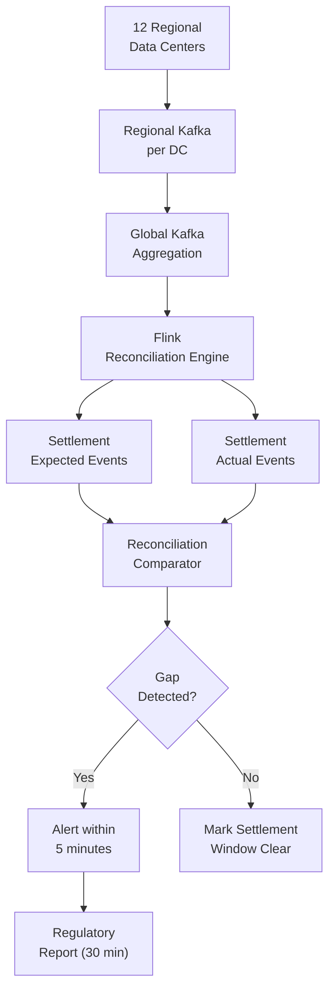

# Scenario Questions — Data Reconciliation

<article data-difficulty="junior">

## 🟢 Junior: Add Reconciliation to a Pipeline

**Scenario:** You have a pipeline that extracts orders from MySQL and loads them into PostgreSQL daily. You recently had an incident where the MySQL source returned 95,000 rows but only 87,000 made it to the target (8,000 rows were silently dropped due to a Unicode encoding error). Nobody noticed for 3 days. Add a reconciliation check that would have caught this immediately.

<details>
<summary>💡 Hint</summary>
Think about what the simplest check is that would detect "fewer rows in target than source." When should the check run — before or after the load? What should happen if it fails?
</details>

<details>
<summary>✅ Solution</summary>

```python
import pandas as pd
import sqlalchemy as sa

def reconcile_order_load(
    source_engine,
    target_engine,
    load_date: str,
    tolerance_pct: float = 0.0   # Zero tolerance — every order must arrive
) -> dict:
    """
    Reconcile order counts between MySQL source and PostgreSQL target.
    Run AFTER the load completes; raise an error if counts don't match.
    """
    # Source count
    src_count = pd.read_sql(
        sa.text("SELECT COUNT(*) FROM orders WHERE DATE(created_at) = :d"),
        source_engine, params={"d": load_date}
    ).iloc[0, 0]

    # Target count
    tgt_count = pd.read_sql(
        sa.text("SELECT COUNT(*) FROM orders WHERE DATE(created_at) = :d"),
        target_engine, params={"d": load_date}
    ).iloc[0, 0]

    diff     = src_count - tgt_count
    diff_pct = abs(diff) / max(src_count, 1) * 100

    result = {
        "date":         load_date,
        "source_count": int(src_count),
        "target_count": int(tgt_count),
        "difference":   int(diff),
        "diff_pct":     diff_pct,
        "passed":       diff_pct <= tolerance_pct,
    }

    if not result["passed"]:
        raise RuntimeError(
            f"Reconciliation FAILED for {load_date}: "
            f"source={src_count}, target={tgt_count}, "
            f"missing={diff} rows ({diff_pct:.2f}%)"
        )

    print(f"Reconciliation PASSED for {load_date}: {src_count} rows in both systems")
    return result

# Also add a revenue reconciliation (row count can pass while values are wrong)
def reconcile_revenue(source_engine, target_engine, load_date: str) -> dict:
    src_rev = pd.read_sql(
        sa.text("SELECT SUM(total_usd) FROM orders WHERE DATE(created_at) = :d"),
        source_engine, params={"d": load_date}
    ).iloc[0, 0] or 0

    tgt_rev = pd.read_sql(
        sa.text("SELECT SUM(total_usd) FROM orders WHERE DATE(created_at) = :d"),
        target_engine, params={"d": load_date}
    ).iloc[0, 0] or 0

    diff_pct = abs(src_rev - tgt_rev) / max(abs(src_rev), 1) * 100

    if diff_pct > 0.001:  # 0.001% tolerance for float precision
        raise RuntimeError(
            f"Revenue mismatch for {load_date}: "
            f"source=${src_rev:.2f}, target=${tgt_rev:.2f}, diff={diff_pct:.4f}%"
        )

    return {"date": load_date, "source_revenue": src_rev, "target_revenue": tgt_rev, "passed": True}

# In your Airflow DAG, add reconciliation as the final task
def pipeline_with_reconciliation(ds: str, **context):
    # Step 1: Extract + Load
    run_etl(ds)

    # Step 2: Reconcile (stops pipeline if counts don't match)
    reconcile_order_load(src_engine, tgt_engine, load_date=ds)
    reconcile_revenue(src_engine, tgt_engine, load_date=ds)

    print(f"Pipeline for {ds} complete and reconciled.")
```

**The Unicode encoding issue** would have been caught because:
- `src_count = 95,000`
- `tgt_count = 87,000`
- `diff = 8,000` → `diff_pct = 8.4%` → `8.4% > 0%` → raises RuntimeError

The pipeline would have failed immediately with a clear error message, instead of silently serving stale data for 3 days.

</details>

</article>

<article data-difficulty="mid-level">

## 🟡 Mid-Level: Cross-System Business Metric Reconciliation

**Scenario:** Your company has daily revenue data in three places: (A) Stripe payment processor API/export, (B) your data warehouse (Snowflake), and (C) the finance team's QuickBooks. Once a month, a finance analyst manually compares the three and finds discrepancies that take 2-3 days to investigate. Design an automated daily reconciliation that catches discrepancies the day they occur and provides enough context to diagnose the root cause quickly.

<details>
<summary>💡 Hint</summary>
Think about what information beyond "the numbers don't match" would help diagnose the issue quickly. Consider transaction-level diff queries, not just aggregates.
</details>

<details>
<summary>✅ Solution</summary>

**Three-layer reconciliation with diagnostic context:**

```python
from decimal import Decimal
from datetime import date, timedelta
import pandas as pd
import sqlalchemy as sa

class DailyRevenueReconciler:
    def __init__(self, stripe_engine, snowflake_engine, qb_engine, results_engine, slack_client):
        self.stripe    = stripe_engine
        self.snowflake = snowflake_engine
        self.qb        = qb_engine
        self.results   = results_engine
        self.slack     = slack_client

    def reconcile(self, check_date: str) -> dict:
        # Pull totals from all three systems
        stripe_total = self._get_stripe_total(check_date)
        sf_total     = self._get_snowflake_total(check_date)
        qb_total     = self._get_qb_total(check_date)

        discrepancies = []

        # Check 1: Stripe vs Snowflake (pipeline correctness)
        s_sf_diff = abs(stripe_total - sf_total)
        if s_sf_diff > Decimal("0.01"):
            discrepancies.append({
                "comparison": "Stripe vs Snowflake",
                "stripe":     float(stripe_total),
                "snowflake":  float(sf_total),
                "diff_usd":   float(s_sf_diff),
                "likely_cause": self._diagnose_stripe_sf_gap(check_date, s_sf_diff),
            })

        # Check 2: Snowflake vs QuickBooks (business correctness)
        sf_qb_diff = abs(sf_total - qb_total)
        if sf_qb_diff > Decimal("0.01"):
            discrepancies.append({
                "comparison": "Snowflake vs QuickBooks",
                "snowflake":  float(sf_total),
                "quickbooks": float(qb_total),
                "diff_usd":   float(sf_qb_diff),
                "likely_cause": self._diagnose_sf_qb_gap(check_date, sf_qb_diff),
            })

        result = {
            "check_date":    check_date,
            "stripe_total":  float(stripe_total),
            "sf_total":      float(sf_total),
            "qb_total":      float(qb_total),
            "discrepancies": discrepancies,
            "passed":        len(discrepancies) == 0,
        }

        self._persist(result)
        if discrepancies:
            self._alert(result)

        return result

    def _diagnose_stripe_sf_gap(self, check_date: str, diff: Decimal) -> str:
        """Provide diagnostic context for Stripe vs Snowflake gap."""

        # Check 1: Are there any ETL pipeline failures in the logs?
        failed_rows = pd.read_sql(sa.text("""
            SELECT COUNT(*) FROM etl_error_log
            WHERE pipeline = 'stripe_to_snowflake'
              AND DATE(error_time) = :d
        """), self.results, params={"d": check_date}).iloc[0, 0]

        if failed_rows > 0:
            return f"ETL pipeline had {failed_rows} errors on {check_date}. Check etl_error_log."

        # Check 2: Find missing Stripe payment IDs in Snowflake
        stripe_ids = pd.read_sql(sa.text("""
            SELECT payment_id FROM stripe.charges WHERE DATE(created_at) = :d
        """), self.stripe, params={"d": check_date})["payment_id"].tolist()

        sf_ids = pd.read_sql(sa.text("""
            SELECT stripe_payment_id FROM snowflake.payments WHERE payment_date = :d
        """), self.snowflake, params={"d": check_date})["stripe_payment_id"].tolist()

        missing = set(stripe_ids) - set(sf_ids)
        extra   = set(sf_ids) - set(stripe_ids)

        if missing:
            return f"{len(missing)} Stripe payments missing from Snowflake. First: {list(missing)[:3]}"
        if extra:
            return f"{len(extra)} extra payments in Snowflake not in Stripe. Possible duplicates."

        return "Unknown cause — values differ but IDs match. Possible currency conversion issue."

    def _alert(self, result: dict):
        """Send structured Slack alert with diagnostic context."""
        for disc in result["discrepancies"]:
            message = f"""
:red_circle: *Revenue Reconciliation Alert* — {result['check_date']}

*Comparison:* {disc['comparison']}
*Discrepancy:* ${disc['diff_usd']:,.2f}
*Likely Cause:* {disc['likely_cause']}

*All Totals:*
• Stripe: ${result['stripe_total']:,.2f}
• Snowflake: ${result['sf_total']:,.2f}
• QuickBooks: ${result['qb_total']:,.2f}

*Next Steps:* Check /wiki/recon-runbook for investigation steps.
            """.strip()
            self.slack.post_message("#data-finance-alerts", message)
```

**SQL for manual drill-down when alerted:**

```sql
-- Find the specific payments causing the gap
SELECT
    s.payment_id,
    s.amount_usd AS stripe_amount,
    sf.amount_usd AS snowflake_amount,
    s.amount_usd - COALESCE(sf.amount_usd, 0) AS diff
FROM stripe.charges s
FULL OUTER JOIN snowflake.payments sf
    ON s.payment_id = sf.stripe_payment_id
WHERE DATE(COALESCE(s.created_at, sf.payment_date)) = '2024-01-15'
  AND ABS(s.amount_usd - COALESCE(sf.amount_usd, 0)) > 0.01
ORDER BY ABS(s.amount_usd - COALESCE(sf.amount_usd, 0)) DESC;
```

</details>

</article>

<article data-difficulty="senior">

## 🔴 Senior: Designing Reconciliation for a Real-Time Financial Settlement System

**Scenario:** You're building the data platform for a payment network that processes 50,000 transactions per second across 12 regional data centers. Transactions are settled in batches every 15 minutes. Regulatory requirement: any discrepancy between what was processed and what was settled must be detected within 5 minutes and reported to the regulator within 30 minutes. The system must handle: partial batch failures (some transactions settle, some don't), network partitions between regions, and clock skew of up to 3 seconds between data centers. Design the reconciliation system.

<details>
<summary>💡 Hint</summary>
Think about event sourcing with sequence numbers (not timestamps) for ordering, regional reconciliation before global reconciliation, and a streaming reconciliation approach (not batch). Consider how to handle the 3-second clock skew when defining "within a 15-minute settlement window."
</details>

<details>
<summary>✅ Solution</summary>

**Architecture: Streaming reconciliation with event sequence numbers**



**Step 1 — Use sequence numbers, not timestamps:**

```python
from dataclasses import dataclass

@dataclass
class TransactionEvent:
    txn_id:          str
    region:          str
    sequence_number: int       # Monotonic per region — not timestamp-based
    amount_usd:      float
    settlement_batch: str      # "2024-01-15T14:00:00" = the 14:00 batch
    event_type:      str       # "processed" or "settled"
```

Sequence numbers within each region avoid clock skew entirely. A transaction is "in batch X" based on its `settlement_batch` assignment at processing time, not its timestamp.

**Step 2 — Regional reconciliation first:**

```python
class RegionalReconciler:
    """
    Per-region: verify all processed transactions appear in settlement.
    Runs in parallel across all 12 regions.
    """
    def reconcile_batch(self, region: str, batch_id: str) -> dict:
        # Get all transaction IDs processed in this batch for this region
        processed_ids = self._get_processed_ids(region, batch_id)

        # Get all transaction IDs in the settlement file for this region
        settled_ids = self._get_settled_ids(region, batch_id)

        unsettled   = processed_ids - settled_ids
        extra       = settled_ids - processed_ids

        return {
            "region":          region,
            "batch_id":        batch_id,
            "processed_count": len(processed_ids),
            "settled_count":   len(settled_ids),
            "unsettled_ids":   list(unsettled)[:100],  # Sample for alert
            "extra_ids":       list(extra)[:100],
            "passed":          len(unsettled) == 0 and len(extra) == 0,
        }
```

**Step 3 — Streaming reconciliation with Flink (< 5 minute detection):**

```python
# Flink SQL for real-time reconciliation
FLINK_RECONCILIATION_SQL = """
-- Join processed and settled streams within a 20-minute window
-- (15-minute batch + 5-minute tolerance for settlement lag + 3s clock skew buffer)
SELECT
    p.txn_id,
    p.region,
    p.amount_usd,
    p.batch_id,
    CASE WHEN s.txn_id IS NULL THEN 'UNSETTLED' ELSE 'SETTLED' END AS status,
    CURRENT_TIMESTAMP AS detected_at
FROM (
    SELECT txn_id, region, amount_usd, batch_id
    FROM processed_transactions_stream
) p
LEFT JOIN (
    SELECT txn_id, settled_at
    FROM settlement_events_stream
) s ON p.txn_id = s.txn_id
    AND s.settled_at BETWEEN p.processed_at
                         AND p.processed_at + INTERVAL '20' MINUTE

-- MATCH_RECOGNIZE to detect transactions that are unsettled after 10 minutes
-- (Alert window = 5 minutes before regulatory 30-minute deadline)
HAVING status = 'UNSETTLED'
    AND TIMESTAMPDIFF(MINUTE, p.processed_at, CURRENT_TIMESTAMP) >= 10
"""
```

**Step 4 — Partial batch failure handling:**

```python
class PartialBatchReconciler:
    def reconcile_partial_failure(
        self,
        batch_id: str,
        failed_region: str,
        failed_txn_ids: list[str]
    ) -> dict:
        """
        When a region partially fails settlement,
        determine which transactions need re-settlement vs. already settled.
        """
        # Check external clearing house for actual settlement status
        clearing_house_status = self._query_clearing_house(failed_txn_ids)

        settled_externally   = {tid for tid, s in clearing_house_status.items() if s == "settled"}
        unsettled_externally = {tid for tid, s in clearing_house_status.items() if s != "settled"}

        return {
            "batch_id":             batch_id,
            "failed_region":        failed_region,
            "total_failed":         len(failed_txn_ids),
            "confirmed_settled":    len(settled_externally),
            "needs_re_settlement":  list(unsettled_externally),
            "action_required":      len(unsettled_externally) > 0,
        }
```

**Step 5 — Regulatory report generation (within 30 minutes):**

```python
def generate_regulatory_report(
    gap_events: list[dict],
    detected_at: datetime,
    report_deadline_minutes: int = 30
) -> str:
    """
    Generate structured regulatory report for settlement discrepancies.
    Must be generated within 30 minutes of detection.
    """
    report = {
        "report_type":        "SETTLEMENT_DISCREPANCY",
        "report_id":          str(uuid.uuid4()),
        "detection_time":     detected_at.isoformat(),
        "report_time":        datetime.utcnow().isoformat(),
        "minutes_to_report":  (datetime.utcnow() - detected_at).total_seconds() / 60,
        "total_discrepancies": len(gap_events),
        "total_amount_at_risk": sum(e["amount_usd"] for e in gap_events),
        "events":             gap_events[:1000],  # First 1000 for the report
        "status":             "INVESTIGATING",
    }

    # Assert SLA compliance
    assert report["minutes_to_report"] <= report_deadline_minutes, \
        f"Regulatory SLA BREACHED: {report['minutes_to_report']:.1f}min > {report_deadline_minutes}min"

    return json.dumps(report, indent=2)
```

**Key design decisions:**
1. **Sequence numbers over timestamps**: Eliminates clock skew from reconciliation logic
2. **Regional-first reconciliation**: Catches regional failures before aggregating globally
3. **20-minute join window**: Covers 15-min batch + 5-min settlement lag + 3s skew buffer
4. **Streaming with Flink**: Detects gaps within 5 minutes (not batch detection at window close)
5. **Clearing house as external truth**: For partial failures, the clearing house is the authoritative record of what actually settled
6. **Automated regulatory reporting**: Pre-built report template ensures 30-minute SLA can be met even at 3 AM

</details>

</article>

---

## ⚡ Quick-fire Q&A

**Q: What is data reconciliation in ETL?**
A: Data reconciliation is the process of comparing data between source and target systems to verify that the ETL pipeline transferred records completely and accurately. It detects missing rows, duplicate records, value mismatches, and aggregation discrepancies.

**Q: What are common reconciliation checks you run after a load?**
A: Row count comparison between source and target, SUM/COUNT aggregates on key numeric fields, hash-based row comparison for exact equality, and null/distinct value counts on critical columns.

**Q: How do you reconcile data between systems that have different timezones?**
A: Normalize all timestamps to UTC before comparison, and account for DST transitions. Ensure both source and target use the same timezone interpretation in their aggregation windows to avoid phantom discrepancies.

**Q: What is hash-based reconciliation?**
A: For each row, compute a deterministic hash of all column values, then compare hash sets between source and target. Matching row counts with identical hashes confirms exact equality without comparing every field individually, making it efficient for large tables.

**Q: How do you handle reconciliation in incremental pipelines vs. full loads?**
A: For full loads, compare total row counts and aggregate metrics. For incremental pipelines, reconcile only the affected partition (e.g., today's records), comparing source extract counts against target partition row counts for the same time window.

**Q: What causes reconciliation failures and how do you debug them?**
A: Common causes include timezone mismatches, type casting differences (e.g., FLOAT precision), deduplication logic applied inconsistently, filtering conditions, and late-arriving source records. Debug by bisecting — narrow the failing partition, then inspect individual row differences.

**Q: How do you automate reconciliation at scale?**
A: Build reconciliation jobs that run automatically after each ETL load, write results to a reconciliation log table, and trigger alerts when discrepancies exceed a configurable threshold. Tools like dbt tests, Great Expectations, or custom SQL scripts can power this.

**Q: When is it acceptable to have a small reconciliation discrepancy?**
A: Only when the business has explicitly agreed on a tolerance threshold (e.g., 0.01% variance for approximate aggregations) and the source of discrepancy is understood and documented (e.g., in-flight transactions, eventual consistency). Never accept unexplained discrepancies silently.

---

## 💼 Interview Tips

- Distinguish reconciliation from data quality checks — reconciliation compares systems to each other, while quality checks validate data against business rules. Interviewers notice when candidates conflate these.
- Always mention what happens when reconciliation fails: automated alerts, pipeline blocking, and an escalation runbook — operational maturity matters for senior roles.
- Bring up the tolerance threshold discussion proactively — it shows you understand that perfect reconciliation isn't always achievable and that stakeholder alignment is part of the engineer's job.
- For system design questions, place reconciliation as a post-load step in your pipeline diagram — candidates who omit it reveal gaps in their production pipeline thinking.
- Be prepared to discuss reconciliation lag: in near-real-time pipelines, sources may not have fully committed when reconciliation runs — explain how you handle this with retry windows.
- Mentioning specific tooling (dbt tests, custom SQL reconciliation tables, Monte Carlo anomaly detection) demonstrates hands-on production experience rather than theoretical knowledge.
