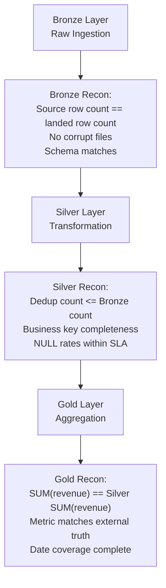

# Data Reconciliation — Senior Deep Dive

## Financial-Grade Reconciliation

In financial systems, reconciliation is a regulatory requirement with zero tolerance for errors.

### Triple-Entry Reconciliation

```python
from decimal import Decimal, ROUND_HALF_EVEN

class FinancialReconciler:
    """
    Financial-grade reconciliation using exact decimal arithmetic.
    Never use float for financial amounts — use Decimal.
    """
    def __init__(self, source_engine, target_engine, ledger_engine):
        self.src    = source_engine
        self.tgt    = target_engine
        self.ledger = ledger_engine

    def reconcile_daily_settlements(self, settlement_date: str) -> dict:
        """
        Three-way reconciliation: source ↔ target ↔ external ledger.
        All three must agree to zero tolerance.
        """
        # Source: payment processor total
        src_total = Decimal(str(pd.read_sql(
            sa.text("SELECT SUM(amount_usd) FROM raw.payments WHERE settlement_date = :d"),
            self.src, params={"d": settlement_date}
        ).iloc[0, 0] or 0))

        # Target: data warehouse total
        tgt_total = Decimal(str(pd.read_sql(
            sa.text("SELECT SUM(amount_usd) FROM warehouse.settlements WHERE settlement_date = :d"),
            self.tgt, params={"d": settlement_date}
        ).iloc[0, 0] or 0))

        # Ledger: accounting system total (external truth)
        ledger_total = Decimal(str(pd.read_sql(
            sa.text("SELECT SUM(credit_amount) FROM gl_entries WHERE entry_date = :d AND account_type = 'revenue'"),
            self.ledger, params={"d": settlement_date}
        ).iloc[0, 0] or 0))

        discrepancies = {}

        # Source vs Target (data pipeline check)
        src_tgt_diff = (src_total - tgt_total).quantize(Decimal("0.01"), rounding=ROUND_HALF_EVEN)
        if src_tgt_diff != Decimal("0"):
            discrepancies["source_vs_target"] = {
                "source": str(src_total),
                "target": str(tgt_total),
                "difference": str(src_tgt_diff),
                "severity": "critical"
            }

        # Target vs Ledger (business correctness check)
        tgt_ledger_diff = (tgt_total - ledger_total).quantize(Decimal("0.01"), rounding=ROUND_HALF_EVEN)
        if tgt_ledger_diff != Decimal("0"):
            discrepancies["target_vs_ledger"] = {
                "target": str(tgt_total),
                "ledger": str(ledger_total),
                "difference": str(tgt_ledger_diff),
                "severity": "critical"
            }

        return {
            "settlement_date": settlement_date,
            "source_total":    str(src_total),
            "target_total":    str(tgt_total),
            "ledger_total":    str(ledger_total),
            "discrepancies":   discrepancies,
            "passed":          len(discrepancies) == 0,
        }
```

---

## Large-Scale Reconciliation Strategies

For billion-row tables, full row-by-row comparison is impractical. Use stratified sampling and statistical approaches.

### Stratified Sampling Reconciliation

```python
import numpy as np
from scipy import stats

def stratified_reconciliation(
    source_engine,
    target_engine,
    table: str,
    key_col: str,
    value_col: str,
    date_col: str,
    check_date: str,
    sample_rate: float = 0.01,  # 1% sample
    confidence_level: float = 0.99
) -> dict:
    """
    Statistical reconciliation for large tables.
    Takes a 1% sample and uses statistical inference to estimate the population error rate.
    """
    # Get total count
    total_src = pd.read_sql(
        sa.text(f"SELECT COUNT(*) FROM {table} WHERE DATE({date_col}) = :d"),
        source_engine, params={"d": check_date}
    ).iloc[0, 0]

    sample_size = max(int(total_src * sample_rate), 1000)

    # Random sample from source
    sample_sql = f"""
        SELECT {key_col}, {value_col}
        FROM {table}
        WHERE DATE({date_col}) = :d
        ORDER BY RANDOM()
        LIMIT {sample_size}
    """
    sample_df = pd.read_sql(sa.text(sample_sql), source_engine, params={"d": check_date})
    sample_ids = tuple(sample_df[key_col].tolist())

    # Find the same records in target
    target_sql = f"""
        SELECT {key_col}, {value_col}
        FROM target.{table}
        WHERE {key_col} IN {sample_ids}
          AND DATE({date_col}) = :d
    """
    target_df = pd.read_sql(sa.text(target_sql), target_engine, params={"d": check_date})

    # Reconcile the sample
    merged = sample_df.merge(target_df, on=key_col, suffixes=("_src", "_tgt"), how="left")
    merged["missing"]   = merged[f"{value_col}_tgt"].isna()
    merged["value_diff"] = abs(merged[f"{value_col}_src"] - merged[f"{value_col}_tgt"].fillna(0))

    missing_rate  = merged["missing"].mean()
    value_error_rate = (merged["value_diff"] > 0.01).mean()

    # Extrapolate to population
    estimated_missing = int(missing_rate * total_src)

    # Wilson score interval for confidence bounds
    n = len(merged)
    z = stats.norm.ppf((1 + confidence_level) / 2)
    margin = z * np.sqrt(missing_rate * (1 - missing_rate) / n)

    return {
        "sample_size":           sample_size,
        "total_source_rows":     total_src,
        "sample_missing_rate":   missing_rate,
        "estimated_missing":     estimated_missing,
        "confidence_interval":   (missing_rate - margin, missing_rate + margin),
        "confidence_level":      confidence_level,
        "value_error_rate":      value_error_rate,
        "passed":                missing_rate < 0.0001 and value_error_rate < 0.001,
    }
```

---

## Automated vs. Manual Reconciliation

| Scenario | Approach | Frequency | Tolerance |
|---|---|---|---|
| Daily ETL row count | Automated post-load check | Every run | 0–0.01% |
| Monthly financial close | Manual + automated | Monthly | 0% |
| Real-time CDC lag | Automated monitoring | Continuous | < 1000 rows lag |
| Annual audit | Third-party manual + spot-check | Annual | 0% |
| Backfill completion | Automated comparison | Once after backfill | 0.01% |
| Cross-system business metrics | Automated daily | Daily | Business-defined |

---

## Reconciliation at Different Pipeline Layers



```python
LAYER_RECONCILIATION_CHECKS = {
    "bronze": [
        {"name": "row_count_matches_source",       "tolerance": 0.0},
        {"name": "no_corrupt_or_empty_partitions", "tolerance": 0.0},
        {"name": "schema_fingerprint_unchanged",   "tolerance": 0.0},
    ],
    "silver": [
        {"name": "dedup_count_lte_bronze_count",   "tolerance": 0.0},
        {"name": "primary_key_completeness",       "tolerance": 0.0},
        {"name": "referential_integrity",          "tolerance": 0.0},
        {"name": "null_rate_critical_cols",        "tolerance": 0.001},
    ],
    "gold": [
        {"name": "revenue_sum_matches_silver",     "tolerance": 0.001},
        {"name": "metric_within_historical_range", "tolerance": 0.05},
        {"name": "all_date_partitions_present",    "tolerance": 0.0},
        {"name": "matches_external_kpi_report",    "tolerance": 0.001},
    ]
}
```

---

## Interview Tips

> **Tip 1:** Financial reconciliation requires Decimal arithmetic (not float). Float arithmetic introduces rounding errors that can cause a $0.01 discrepancy to appear as $0.0099999... which may or may not be caught by simple equality checks. Always use Decimal for financial amounts.

> **Tip 2:** For billion-row tables, describe stratified sampling with statistical confidence intervals. "We can't compare all 5 billion rows, so we take a 1% stratified random sample and extrapolate with 99% confidence" is a senior-level answer.

> **Tip 3:** The three-layer reconciliation (Bronze → Silver → Gold) catches errors at the source. A revenue mismatch at Gold tells you there's an issue; checking at each layer tells you WHERE the error was introduced.

> **Tip 4:** Automated reconciliation should run as a pipeline step, not a separate cron job. A pipeline that succeeds without reconciling is incomplete. The reconciliation result determines whether downstream consumers are unblocked.

> **Tip 5:** Know the difference between automated reconciliation (catches technical pipeline issues) and manual reconciliation (required for regulatory audits). Both exist in production financial systems — they serve complementary purposes.

## ⚡ Cheat Sheet

**ETL vs ELT**
```
ETL: transform before loading → good for strict schema targets (DW)
ELT: load raw then transform → good for data lakes (Spark/dbt on raw data)
Modern default: ELT (storage cheap; compute on demand; raw data preserved)
```

**Idempotency patterns**
```python
# Write-if-not-exists (partition-level)
if not partition_exists(output_path, date=run_date):
    write_partition(data, output_path, date=run_date)

# Overwrite idempotent partition (Delta)
df.write.format("delta").mode("overwrite") \
    .option("replaceWhere", f"dt = '{run_date}'").save(path)

# Watermark-based incremental load
SELECT * FROM source WHERE updated_at > (SELECT MAX(updated_at) FROM target)
```

**CDC (Change Data Capture) patterns**
```
Log-based CDC: reads DB transaction log (Debezium → Kafka → Lakehouse)
  + Low impact on source DB
  + Captures deletes + updates
Query-based:   polls source table for new/changed rows (watermark)
  - Misses deletes; higher DB load
  
Debezium event fields: op (c=create, u=update, d=delete, r=read/snapshot)
                        before, after, source metadata
```

**Backfill strategy**
```python
# Generate backfill date range
from datetime import date, timedelta
backfill_dates = [start + timedelta(days=i) for i in range((end - start).days + 1)]

# Run in parallel (limit concurrency to avoid source DB overload)
from concurrent.futures import ThreadPoolExecutor
with ThreadPoolExecutor(max_workers=4) as pool:
    pool.map(run_etl_for_date, backfill_dates)
```

**SCD2 (dbt snapshot)**
```yaml
# snapshots/customer_snapshot.sql

{{
    config(
        target_schema='snapshots',
        unique_key='customer_id',
        strategy='check',
        check_cols=['name', 'city', 'email'],
        invalidate_hard_deletes=True,
    )
}}
SELECT * FROM {{ source('raw', 'customers') }}

```

**Batch vs Streaming**
| Dimension | Batch | Streaming |
|---|---|---|
| Latency | Minutes to hours | Sub-second to minutes |
| Throughput | High (bulk) | Lower per event |
| Complexity | Lower | Higher |
| Use case | Daily reports, DW loads | Fraud detection, live dashboards |

**Pipeline design patterns**
```
Fan-out:    one source → multiple downstream consumers
Fan-in:     multiple sources → one joined output
Watermark:  track max processed timestamp; resume from watermark
Dead letter: failed records → separate queue for inspection/retry
Circuit breaker: stop pipeline on DQ failure; alert + wait for fix
```

**Error handling**
```python
try:
    process(record)
except ValidationError as e:
    dead_letter_queue.append({"record": record, "error": str(e), "ts": now()})
    metrics.increment("dead_letter_count")
except RetryableError as e:
    retry_queue.append({"record": record, "retry_count": retry_count + 1})
except Exception as e:
    alert_oncall(f"Unexpected error: {e}"); raise
```

**Data reconciliation**
```sql
-- Row count comparison
SELECT 'source' AS src, COUNT(*) FROM source.orders WHERE date = '2024-01-15'
UNION ALL
SELECT 'target', COUNT(*) FROM gold.orders WHERE dt = '2024-01-15';

-- Sum comparison
SELECT ABS(s.total - t.total) AS discrepancy
FROM (SELECT SUM(amount) AS total FROM source.orders WHERE date = '2024-01-15') s
CROSS JOIN (SELECT SUM(amount) AS total FROM gold.orders WHERE dt = '2024-01-15') t;
```
