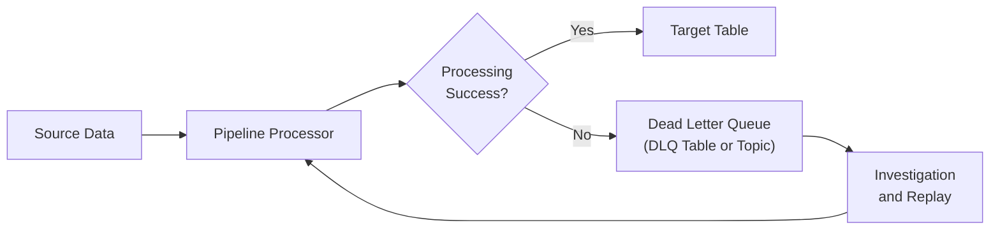

# Error Handling — Fundamentals

## Why Error Handling Is Critical in Data Pipelines

Data pipelines operate against unreliable infrastructure: networks drop, databases become overloaded, upstream APIs return unexpected formats. Without explicit error handling:

- Pipelines fail silently, leaving stale data downstream
- Bad records corrupt good data
- Engineers spend hours debugging partial failures
- Data consumers trust reports built on incomplete data

Good error handling means failures are **visible, recoverable, and non-corrupting**.

---

## Categories of Pipeline Errors

| Category | Examples | Handling Strategy |
|---|---|---|
| **Transient errors** | Network timeout, DB lock, rate limit | Retry with backoff |
| **Permanent errors** | Invalid data format, schema mismatch, bad record | Route to DLQ; skip row |
| **Infrastructure errors** | Out of memory, disk full, worker crash | Alert; escalate |
| **Logic errors** | Business rule violation, NULL in required field | DLQ with context; alert |
| **Partial failures** | 99,000 rows succeeded, 1,000 failed | Capture failures; continue |

---

## Retry Strategies

### Simple Retry with Exponential Backoff

```python
import time
import functools
from typing import Callable, Type

def retry_with_backoff(
    max_retries: int = 3,
    base_delay: float = 1.0,
    backoff_factor: float = 2.0,
    exceptions: tuple = (Exception,)
):
    """
    Decorator: retry a function on specified exceptions with exponential backoff.
    """
    def decorator(func: Callable) -> Callable:
        @functools.wraps(func)
        def wrapper(*args, **kwargs):
            last_exception = None
            for attempt in range(max_retries + 1):
                try:
                    return func(*args, **kwargs)
                except exceptions as e:
                    last_exception = e
                    if attempt == max_retries:
                        raise
                    delay = base_delay * (backoff_factor ** attempt)
                    print(f"Attempt {attempt + 1} failed: {e}. Retrying in {delay:.1f}s...")
                    time.sleep(delay)
            raise last_exception
        return wrapper
    return decorator

# Usage
@retry_with_backoff(max_retries=3, base_delay=2.0, backoff_factor=2.0)
def extract_from_api(endpoint: str) -> dict:
    """Retry on network errors: delays 2s, 4s, 8s before giving up."""
    import requests
    response = requests.get(endpoint, timeout=10)
    response.raise_for_status()
    return response.json()
```

### Backoff with Jitter

Jitter prevents the "thundering herd" problem when many workers retry simultaneously:

```python
import random

def exponential_backoff_with_jitter(
    attempt: int,
    base_delay: float = 1.0,
    max_delay: float = 60.0,
    jitter: bool = True
) -> float:
    """
    Calculate delay with optional jitter.
    Jitter prevents all retry workers from hitting the source at the same time.
    """
    delay = min(base_delay * (2 ** attempt), max_delay)
    if jitter:
        delay *= random.uniform(0.5, 1.5)  # Randomize ± 50%
    return delay
```

---

## Dead Letter Queues (DLQ)

A **Dead Letter Queue** captures records that fail processing, allowing:
1. The main pipeline to continue processing good records
2. Failed records to be investigated and replayed when the issue is fixed



### DLQ Table Pattern

```python
import json
import traceback
from datetime import datetime
import sqlalchemy as sa

def write_to_dlq(
    engine,
    dlq_table: str,
    failed_record: dict,
    error: Exception,
    pipeline_name: str,
    run_id: str = None
):
    """Route a failed record to the dead letter queue with full context."""
    sql = f"""
        INSERT INTO {dlq_table} (
            pipeline_name, run_id, failed_at,
            original_payload, error_type, error_message, stack_trace, retry_count
        )
        VALUES (
            :pipeline, :run_id, NOW(),
            :payload, :error_type, :error_msg, :trace, 0
        )
    """
    with engine.begin() as conn:
        conn.execute(sa.text(sql), {
            "pipeline":    pipeline_name,
            "run_id":      run_id,
            "payload":     json.dumps(failed_record),
            "error_type":  type(error).__name__,
            "error_msg":   str(error),
            "trace":       traceback.format_exc(),
        })

def process_batch_with_dlq(
    records: list[dict],
    processor_fn,
    engine,
    dlq_table: str,
    pipeline: str
) -> dict:
    """
    Process records one by one; route failures to DLQ.
    Continues processing good records even when some fail.
    """
    results = {"success": 0, "failed": 0, "failed_records": []}

    for record in records:
        try:
            processor_fn(record, engine)
            results["success"] += 1
        except Exception as e:
            print(f"Failed to process record {record.get('id')}: {e}")
            write_to_dlq(engine, dlq_table, record, e, pipeline)
            results["failed"] += 1
            results["failed_records"].append(record.get("id"))

    return results
```

---

## Airflow Retry Configuration

```python
from airflow import DAG
from airflow.operators.python import PythonOperator
from datetime import datetime, timedelta

DEFAULT_ARGS = {
    "retries":                  3,
    "retry_delay":              timedelta(minutes=5),
    "retry_exponential_backoff": True,   # 5min, 10min, 20min
    "max_retry_delay":          timedelta(hours=1),
    "on_failure_callback":      send_slack_alert,
    "on_retry_callback":        log_retry_attempt,
}

def send_slack_alert(context):
    """Called by Airflow on task failure."""
    task_instance = context["task_instance"]
    message = f"""
    :red_circle: Pipeline Failure
    DAG: {task_instance.dag_id}
    Task: {task_instance.task_id}
    Execution Date: {context['ds']}
    Log URL: {task_instance.log_url}
    """
    # send to Slack webhook
    print(message)

with DAG(
    "orders_pipeline",
    default_args=DEFAULT_ARGS,
    schedule_interval="@daily",
    start_date=datetime(2024, 1, 1),
) as dag:
    pass
```

---

## Graceful Degradation

Not all failures should halt the entire pipeline. Graceful degradation continues with partial results when non-critical components fail.

```python
def enrich_orders_with_customer_data(
    orders_df: pd.DataFrame,
    customer_api_url: str
) -> pd.DataFrame:
    """
    Enrich orders with customer details.
    If the customer API is unavailable, return orders without enrichment
    (graceful degradation) rather than failing the entire pipeline.
    """
    try:
        import requests
        customer_data = requests.get(
            f"{customer_api_url}/batch",
            json={"ids": orders_df["customer_id"].tolist()},
            timeout=30
        ).json()
        customer_df = pd.DataFrame(customer_data)
        return orders_df.merge(customer_df, on="customer_id", how="left")

    except Exception as e:
        print(f"WARNING: Customer API unavailable: {e}. Proceeding without enrichment.")
        # Return orders without enrichment — pipeline continues
        orders_df["customer_name"]    = None
        orders_df["customer_country"] = None
        return orders_df
```

---

## Partial Failure Handling

```python
from dataclasses import dataclass, field

@dataclass
class BatchResult:
    total:    int = 0
    success:  int = 0
    failed:   int = 0
    warnings: list[str] = field(default_factory=list)
    errors:   list[dict] = field(default_factory=list)

    @property
    def success_rate(self) -> float:
        return self.success / self.total * 100 if self.total > 0 else 0

    @property
    def should_fail_pipeline(self) -> bool:
        """Fail the pipeline if more than 5% of records failed."""
        return self.success_rate < 95.0

def process_with_error_tolerance(
    records: list[dict],
    max_error_pct: float = 5.0
) -> BatchResult:
    result = BatchResult(total=len(records))

    for record in records:
        try:
            process_record(record)
            result.success += 1
        except ValueError as e:
            # Data error — log and skip
            result.failed += 1
            result.errors.append({"record": record, "error": str(e)})
        except Exception as e:
            # Unexpected error — more serious
            result.failed += 1
            result.errors.append({"record": record, "error": str(e), "type": "unexpected"})

    if result.failed / result.total * 100 > max_error_pct:
        raise RuntimeError(
            f"Error rate {result.failed/result.total*100:.1f}% exceeds threshold {max_error_pct}%"
        )

    return result
```

---

## Interview Tips

> **Tip 1:** Always distinguish transient from permanent errors. Transient errors (network blips) warrant retry; permanent errors (bad record format) warrant DLQ routing. Retrying a bad record forever is an anti-pattern (poison pill).

> **Tip 2:** Exponential backoff with jitter is the production-standard retry strategy. Pure exponential backoff without jitter can cause thundering herd; jitter spreads the load.

> **Tip 3:** The Dead Letter Queue pattern is crucial for pipelines that process heterogeneous data. "Skip bad records and route to DLQ" keeps good records flowing while preserving bad records for investigation.

> **Tip 4:** Graceful degradation means the pipeline produces partial results rather than failing entirely when a non-critical dependency is unavailable. Know when to degrade vs. when to fail-fast.

> **Tip 5:** Error rate thresholds ("fail if > 5% of records fail") are more meaningful than absolute counts. A pipeline processing 1M rows that fails 1,000 (0.1%) is different from one processing 1,000 rows that fails 1,000 (100%).
