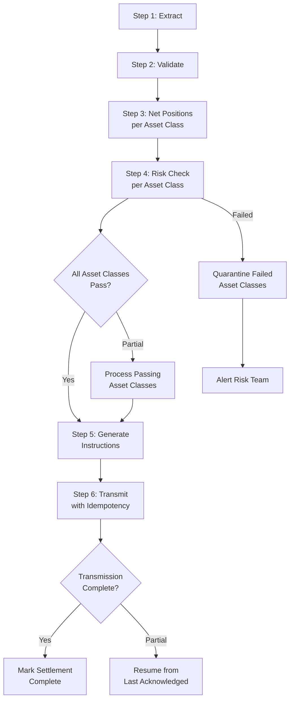

# Scenario Questions — Error Handling

<article data-difficulty="junior">

## 🟢 Junior: Add Retry Logic to a Flaky API Extraction

**Scenario:** You have a pipeline that extracts data from a third-party REST API. The API is unreliable and frequently returns 429 (rate limit) or 503 (service unavailable) errors. Currently, any error causes the entire pipeline to fail. Add retry logic so that transient errors are handled gracefully.

<details>
<summary>💡 Hint</summary>
Think about which HTTP status codes are transient (worth retrying) vs permanent (400, 404 — no point retrying). Use exponential backoff so retries don't hammer the API.
</details>

<details>
<summary>✅ Solution</summary>

```python
import time
import requests
import random
from typing import Optional

class APIClientWithRetry:
    """Resilient API client with exponential backoff and jitter."""

    RETRYABLE_STATUS_CODES = {429, 500, 502, 503, 504}
    PERMANENT_ERROR_CODES  = {400, 401, 403, 404, 422}

    def __init__(
        self,
        base_url: str,
        api_key: str,
        max_retries: int = 4,
        base_delay: float = 1.0,
        max_delay: float = 60.0
    ):
        self.base_url    = base_url
        self.session     = requests.Session()
        self.session.headers.update({"Authorization": f"Bearer {api_key}"})
        self.max_retries = max_retries
        self.base_delay  = base_delay
        self.max_delay   = max_delay

    def get(self, path: str, params: dict = None) -> dict:
        """GET request with automatic retry on transient errors."""
        url = f"{self.base_url}{path}"

        for attempt in range(self.max_retries + 1):
            try:
                resp = self.session.get(url, params=params, timeout=30)

                # Permanent error — don't retry
                if resp.status_code in self.PERMANENT_ERROR_CODES:
                    raise ValueError(
                        f"Permanent error {resp.status_code}: {resp.text[:200]}"
                    )

                # Transient error — retry
                if resp.status_code in self.RETRYABLE_STATUS_CODES:
                    if attempt == self.max_retries:
                        raise RuntimeError(
                            f"Max retries exceeded. Last status: {resp.status_code}"
                        )

                    # Respect Retry-After header if provided (429 rate limit)
                    retry_after = resp.headers.get("Retry-After")
                    if retry_after:
                        delay = float(retry_after)
                    else:
                        delay = self._calculate_delay(attempt)

                    print(f"Attempt {attempt + 1} failed ({resp.status_code}). "
                          f"Retrying in {delay:.1f}s...")
                    time.sleep(delay)
                    continue

                # Success
                resp.raise_for_status()
                return resp.json()

            except requests.exceptions.ConnectionError as e:
                if attempt == self.max_retries:
                    raise RuntimeError(f"Connection failed after {self.max_retries} retries") from e
                delay = self._calculate_delay(attempt)
                print(f"Connection error (attempt {attempt + 1}). Retrying in {delay:.1f}s: {e}")
                time.sleep(delay)

            except requests.exceptions.Timeout:
                if attempt == self.max_retries:
                    raise RuntimeError("Request timed out after max retries")
                delay = self._calculate_delay(attempt)
                print(f"Timeout (attempt {attempt + 1}). Retrying in {delay:.1f}s")
                time.sleep(delay)

    def _calculate_delay(self, attempt: int) -> float:
        """Exponential backoff with jitter."""
        base = min(self.base_delay * (2 ** attempt), self.max_delay)
        return base * random.uniform(0.5, 1.5)  # ±50% jitter

# Usage
client = APIClientWithRetry(
    base_url="https://api.example.com",
    api_key="secret-key",
    max_retries=4,
    base_delay=2.0
)

def extract_orders(date: str) -> list[dict]:
    """Retries automatically on transient errors."""
    response = client.get("/v1/orders", params={"date": date})
    return response.get("orders", [])
```

**Retry timeline for `base_delay=2.0` with jitter:**
- Attempt 1 fails → wait ~2s
- Attempt 2 fails → wait ~4s
- Attempt 3 fails → wait ~8s
- Attempt 4 fails → wait ~16s
- Attempt 5 fails → raise exception

**Key decisions:**
- Respect `Retry-After` header for 429 responses (the API tells you how long to wait)
- Never retry 400/401/403/404 — these are caller errors that won't fix themselves
- Use jitter to avoid thundering herd if many workers retry simultaneously

</details>

</article>

<article data-difficulty="mid-level">

## 🟡 Mid-Level: Design DLQ System for a Streaming Pipeline

**Scenario:** You have a Kafka consumer that processes customer transactions and writes to PostgreSQL. Occasionally, a transaction payload has invalid data (negative amounts, missing required fields, malformed JSON). Currently, when any of these errors occur, the consumer crashes and restarts, causing all subsequent transactions to be delayed. Design a DLQ system that: keeps good transactions flowing, captures bad ones for investigation, and supports replaying fixed messages.

<details>
<summary>💡 Hint</summary>
Think about error classification (permanent vs transient), when to route to DLQ vs retry, and how to make the DLQ replayable after the issue is fixed.
</details>

<details>
<summary>✅ Solution</summary>

**DLQ system design:**

```python
from confluent_kafka import Consumer, Producer
import json, time, traceback
import sqlalchemy as sa

# Step 1: Create DLQ infrastructure
DLQ_SCHEMA = """
    CREATE TABLE IF NOT EXISTS transaction_dlq (
        id              BIGSERIAL PRIMARY KEY,
        event_id        TEXT,
        original_topic  TEXT NOT NULL,
        payload         JSONB,
        raw_value       BYTEA,
        error_type      TEXT NOT NULL,
        error_message   TEXT NOT NULL,
        stack_trace     TEXT,
        is_permanent    BOOLEAN NOT NULL,
        attempts        INT DEFAULT 1,
        failed_at       TIMESTAMPTZ DEFAULT NOW(),
        resolved_at     TIMESTAMPTZ,
        replayed_at     TIMESTAMPTZ,
        resolution_note TEXT
    );
    CREATE INDEX IF NOT EXISTS idx_dlq_failed_at  ON transaction_dlq (failed_at);
    CREATE INDEX IF NOT EXISTS idx_dlq_error_type ON transaction_dlq (error_type);
    CREATE INDEX IF NOT EXISTS idx_dlq_replayed   ON transaction_dlq (replayed_at) WHERE replayed_at IS NULL;
"""

class TransactionDLQConsumer:
    def __init__(self, kafka_config: dict, db_engine, max_retries: int = 3):
        self.consumer    = Consumer({**kafka_config, "enable.auto.commit": False})
        self.engine      = db_engine
        self.max_retries = max_retries
        self.retry_map   = {}  # {msg_key: attempt_count}

    def _classify_error(self, error: Exception) -> bool:
        """Return True if error is permanent (should go to DLQ immediately)."""
        permanent_types = (json.JSONDecodeError, ValueError, TypeError)
        return isinstance(error, permanent_types)

    def _msg_key(self, msg) -> str:
        return f"{msg.topic()}:{msg.partition()}:{msg.offset()}"

    def process_message(self, msg):
        key = self._msg_key(msg)

        try:
            # Parse
            payload = json.loads(msg.value().decode("utf-8"))

            # Validate
            if payload.get("amount_usd", 0) < 0:
                raise ValueError(f"Negative amount: {payload['amount_usd']}")
            if not payload.get("customer_id"):
                raise ValueError("Missing customer_id")
            if not payload.get("transaction_id"):
                raise ValueError("Missing transaction_id")

            # Write (idempotent)
            with self.engine.begin() as conn:
                conn.execute(sa.text("""
                    INSERT INTO transactions (txn_id, customer_id, amount_usd, created_at)
                    VALUES (:tid, :cid, :amount, NOW())
                    ON CONFLICT (txn_id) DO NOTHING
                """), {
                    "tid":    payload["transaction_id"],
                    "cid":    payload["customer_id"],
                    "amount": payload["amount_usd"],
                })

            # Commit offset on success
            self.consumer.commit(message=msg, asynchronous=False)
            self.retry_map.pop(key, None)

        except Exception as e:
            is_permanent = self._classify_error(e)
            attempt      = self.retry_map.get(key, 0) + 1
            self.retry_map[key] = attempt

            if is_permanent or attempt >= self.max_retries:
                # Route to DLQ
                self._write_to_dlq(msg, e, is_permanent, attempt)
                self.consumer.commit(message=msg, asynchronous=False)
                self.retry_map.pop(key, None)
                print(f"Routed to DLQ: {type(e).__name__}: {e}")
            else:
                # Transient error — retry (don't commit offset)
                delay = 2 ** attempt
                print(f"Transient error attempt {attempt}/{self.max_retries}: {e}. Retrying in {delay}s")
                time.sleep(delay)

    def _write_to_dlq(self, msg, error: Exception, permanent: bool, attempts: int):
        try:
            payload_json = json.loads(msg.value())
        except Exception:
            payload_json = None

        with self.engine.begin() as conn:
            conn.execute(sa.text("""
                INSERT INTO transaction_dlq (
                    original_topic, payload, raw_value,
                    error_type, error_message, stack_trace,
                    is_permanent, attempts
                )
                VALUES (:topic, :payload, :raw, :etype, :emsg, :trace, :perm, :attempts)
            """), {
                "topic":    msg.topic(),
                "payload":  json.dumps(payload_json) if payload_json else None,
                "raw":      msg.value(),
                "etype":    type(error).__name__,
                "emsg":     str(error)[:2000],
                "trace":    traceback.format_exc()[:5000],
                "perm":     permanent,
                "attempts": attempts,
            })

# Step 2: DLQ monitoring queries
DLQ_MONITOR_SQL = """
    SELECT
        error_type,
        is_permanent,
        COUNT(*) AS count,
        MIN(failed_at) AS oldest,
        MAX(failed_at) AS newest
    FROM transaction_dlq
    WHERE replayed_at IS NULL
    GROUP BY error_type, is_permanent
    ORDER BY count DESC;
"""

# Step 3: Replay after fix
def replay_dlq_messages(
    engine,
    kafka_producer,
    error_type: str = None,
    limit: int = 1000
) -> int:
    """
    After fixing the root cause, replay DLQ messages.
    """
    where = "WHERE replayed_at IS NULL"
    params = {"limit": limit}
    if error_type:
        where += " AND error_type = :et"
        params["et"] = error_type

    with engine.connect() as conn:
        rows = conn.execute(sa.text(f"""
            SELECT id, original_topic, raw_value
            FROM transaction_dlq
            {where}
            ORDER BY failed_at
            LIMIT :limit
        """), params).fetchall()

    replayed = 0
    for row in rows:
        kafka_producer.produce(
            topic=row.original_topic,
            value=row.raw_value
        )
        with engine.begin() as conn:
            conn.execute(sa.text("""
                UPDATE transaction_dlq
                SET replayed_at = NOW()
                WHERE id = :id
            """), {"id": row.id})
        replayed += 1

    kafka_producer.flush()
    print(f"Replayed {replayed} DLQ messages")
    return replayed
```

**Monitoring alert:**

```python
def alert_on_dlq_depth(engine, threshold: int = 100):
    with engine.connect() as conn:
        count = conn.execute(sa.text("""
            SELECT COUNT(*) FROM transaction_dlq WHERE replayed_at IS NULL
        """)).scalar()
    if count > threshold:
        print(f"ALERT: DLQ has {count} unresolved messages (threshold: {threshold})")
```

</details>

</article>

<article data-difficulty="senior">

## 🔴 Senior: Error Handling for a Multi-Step Distributed Financial Pipeline

**Scenario:** You're designing a daily financial settlement pipeline at a bank. The pipeline has 6 steps: (1) Extract trades from 3 regional systems, (2) Validate trade data, (3) Compute net positions, (4) Apply regulatory risk checks, (5) Generate settlement instructions, (6) Transmit to clearing house. If step 6 fails mid-transmission (5,000 of 10,000 instructions sent), you must not re-send the 5,000 already delivered (double-payment risk) and must deliver the remaining 5,000. Additionally, if step 4 fails for a specific asset class, you must complete settlement for unaffected asset classes while quarantining the affected ones. How do you design error handling?

<details>
<summary>💡 Hint</summary>
Think about idempotency keys for the clearing house transmission, partial success tracking at the asset class level, and a Saga-like compensation model for rollback.
</details>

<details>
<summary>✅ Solution</summary>

**Core architecture:**



**Step 1 — Asset class isolation:**

```python
from dataclasses import dataclass
from enum import Enum

class AssetClass(Enum):
    EQUITY  = "equity"
    FIXED_INCOME = "fixed_income"
    DERIVATIVES  = "derivatives"
    FX      = "fx"

@dataclass
class SettlementBatch:
    run_date:     str
    asset_class:  AssetClass
    status:       str = "pending"    # pending, running, completed, quarantined
    error:        str = None
    instruction_count: int = 0
    transmitted:  int = 0

class SettlementOrchestrator:
    def __init__(self, engine):
        self.engine = engine

    def run_settlement(self, run_date: str) -> dict:
        """
        Run settlement per asset class independently.
        Failure in one asset class doesn't block others.
        """
        batches = [
            SettlementBatch(run_date, ac)
            for ac in AssetClass
        ]

        results = {}
        for batch in batches:
            try:
                self._run_asset_class_settlement(batch)
                results[batch.asset_class.value] = "completed"
            except RiskCheckFailure as e:
                # Quarantine this asset class; continue with others
                batch.status = "quarantined"
                batch.error  = str(e)
                self._quarantine_asset_class(batch)
                self._alert_risk_team(batch)
                results[batch.asset_class.value] = f"quarantined: {e}"
            except Exception as e:
                batch.status = "failed"
                batch.error  = str(e)
                self._record_failure(batch)
                results[batch.asset_class.value] = f"failed: {e}"

        return results
```

**Step 2 — Idempotent clearing house transmission:**

```python
import hashlib

class ClearingHouseTransmitter:
    def __init__(self, clearing_house_client, engine):
        self.ch     = clearing_house_client
        self.engine = engine

    def _get_idempotency_key(self, run_date: str, instruction_id: str) -> str:
        """Stable key for re-transmission safety."""
        return hashlib.sha256(f"{run_date}:{instruction_id}".encode()).hexdigest()

    def transmit_instructions(
        self,
        run_date: str,
        instructions: list[dict],
        batch_size: int = 100
    ) -> dict:
        """
        Transmit settlement instructions with exactly-once guarantee.
        Resumes from last acknowledged instruction if interrupted mid-batch.
        """
        results = {"transmitted": 0, "already_sent": 0, "failed": []}

        for i in range(0, len(instructions), batch_size):
            batch = instructions[i:i + batch_size]

            for instruction in batch:
                idem_key = self._get_idempotency_key(run_date, instruction["id"])

                # Check if already transmitted (for safe resume)
                if self._is_already_transmitted(idem_key):
                    results["already_sent"] += 1
                    continue

                try:
                    # Transmit with idempotency key
                    response = self.ch.submit_instruction(
                        instruction=instruction,
                        idempotency_key=idem_key
                    )

                    # Record transmission atomically
                    self._record_transmission(idem_key, instruction["id"], response)
                    results["transmitted"] += 1

                except Exception as e:
                    results["failed"].append({
                        "instruction_id": instruction["id"],
                        "error": str(e)
                    })
                    # Continue with remaining instructions

        return results

    def _is_already_transmitted(self, idem_key: str) -> bool:
        with self.engine.connect() as conn:
            row = conn.execute(sa.text("""
                SELECT 1 FROM clearing_transmissions
                WHERE idempotency_key = :key AND status = 'ack'
            """), {"key": idem_key}).fetchone()
        return row is not None

    def _record_transmission(self, idem_key: str, instruction_id: str, response: dict):
        with self.engine.begin() as conn:
            conn.execute(sa.text("""
                INSERT INTO clearing_transmissions
                    (idempotency_key, instruction_id, ack_ref, status, transmitted_at)
                VALUES (:key, :iid, :ack, 'ack', NOW())
                ON CONFLICT (idempotency_key) DO NOTHING
            """), {
                "key": idem_key,
                "iid": instruction_id,
                "ack": response.get("ack_reference"),
            })
```

**Step 3 — Audit trail for regulators:**

```sql
-- Full audit query: what happened in each settlement run
SELECT
    r.run_date,
    r.asset_class,
    r.status,
    r.instruction_count,
    r.transmitted,
    r.error,
    t.instruction_id,
    t.ack_ref,
    t.transmitted_at
FROM settlement_runs r
LEFT JOIN clearing_transmissions t
    ON r.run_date     = t.run_date
   AND r.asset_class  = t.asset_class
WHERE r.run_date = '2024-01-15'
ORDER BY r.asset_class, t.transmitted_at;
```

**Key design principles:**
1. **Asset class isolation**: Each asset class settles independently. Failure in one doesn't block others.
2. **Idempotency key**: Stable SHA256 hash of `(run_date, instruction_id)` prevents double-transmission on resume.
3. **Is-already-transmitted check**: Before each transmission, check the ack table — safe for mid-batch restarts.
4. **Quarantine, not halt**: Risk failures quarantine the affected asset class and alert the risk team; the pipeline continues for healthy asset classes.
5. **Full audit trail**: Every transmission is recorded with the clearing house's ack reference for regulatory traceability.

</details>

</article>

---

## ⚡ Quick-fire Q&A

**Q: What are the main categories of errors in ETL pipelines?**
A: Transient errors (network timeouts, API rate limits) that warrant retry, data errors (malformed records, schema mismatches) that require quarantine, and infrastructure errors (disk full, OOM) that require escalation and human intervention.

**Q: How do you implement retry logic in an ETL pipeline?**
A: Use exponential backoff with jitter to avoid thundering herd — start with a short delay, double it on each retry up to a maximum, and add random jitter. Set a max retry count; after exhaustion, move the record to a dead-letter queue and alert.

**Q: What is a dead-letter queue and why is it important?**
A: A dead-letter queue (DLQ) is a holding area for records that failed processing after all retries are exhausted. It preserves the original record for manual review, reprocessing, or root cause analysis without blocking the main pipeline.

**Q: How do you handle schema validation errors in ETL?**
A: Validate schema at ingestion before any transformation. On mismatch, route the record to a quarantine table with error metadata (timestamp, error type, raw payload), alert the data owner, and continue processing valid records so schema errors don't halt the entire pipeline.

**Q: What is the difference between fail-fast and fail-safe error handling strategies?**
A: Fail-fast stops the pipeline immediately on the first error, preventing potentially corrupt data from propagating — ideal for critical financial pipelines. Fail-safe logs the error, skips the bad record, and continues processing — suitable when partial results are better than no results.

**Q: How do you ensure errors in one pipeline run don't corrupt data from a previous successful run?**
A: Write output transactionally — use atomic partition overwrites or staging tables with swap, never appending directly to production tables. This ensures a failed run leaves the last successful state intact.

**Q: How do you monitor and alert on ETL errors in production?**
A: Emit structured error metrics (error count, error type, affected records) to a monitoring system (CloudWatch, Datadog, Prometheus). Set threshold-based alerts and create dashboards for error rate trends. Include correlation IDs in logs for traceability.

**Q: What is circuit breaker pattern and when would you use it in ETL?**
A: A circuit breaker stops calling a failing downstream system after a threshold of consecutive failures, preventing resource exhaustion and cascading failures. In ETL, it's useful when writing to a flaky API sink — after N failures, open the circuit and route to DLQ instead.

---

## 💼 Interview Tips

- Always differentiate error types (transient vs. data vs. infrastructure) before describing handling strategy — a single "retry everything" answer signals junior thinking.
- Mention dead-letter queues unprompted — it's a litmus test for production experience; engineers who haven't operated real pipelines rarely think of it.
- Discuss the operational loop: error captured → alert fired → runbook executed → reprocessing triggered. Interviewers want to see you think about on-call workflows, not just code.
- Avoid atomic overwrites as an afterthought — frame data integrity guarantees as a first-class design requirement from the start.
- Be ready to explain how you'd reprocess records from a DLQ without duplicating successfully processed records — this tests your understanding of idempotency under error recovery.
- Senior interviewers ask about error budgets and SLOs — knowing that "99.9% records processed within 5 minutes" is a measurable goal, not just "errors should be rare," sets you apart.
