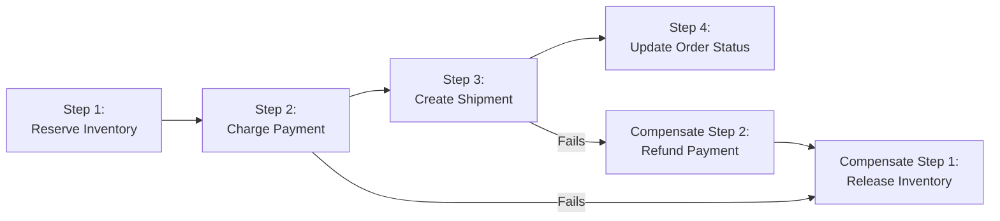

# Error Handling — Senior Deep Dive

## Distributed Error Handling: The Saga Pattern

When a pipeline involves multiple services that each need to make changes, a failure partway through leaves data in an inconsistent state. The **Saga pattern** coordinates distributed transactions using compensating transactions.



```python
from dataclasses import dataclass, field
from typing import Callable, Optional
from enum import Enum

@dataclass
class SagaStep:
    name:        str
    action:      Callable       # Forward action
    compensate:  Callable       # Rollback action
    result:      Optional[dict] = None

class SagaOrchestrator:
    """
    Orchestrates a sequence of distributed steps.
    On failure, automatically executes compensating transactions in reverse order.
    """
    def __init__(self, steps: list[SagaStep]):
        self.steps    = steps
        self.executed = []  # Steps that completed successfully

    def run(self, context: dict) -> dict:
        for step in self.steps:
            try:
                print(f"Executing: {step.name}")
                result = step.action(context)
                step.result = result
                context.update(result or {})
                self.executed.append(step)
                print(f"Completed: {step.name}")
            except Exception as e:
                print(f"Failed at: {step.name} — {e}")
                self._compensate(context)
                raise RuntimeError(f"Saga failed at {step.name}: {e}") from e

        return context

    def _compensate(self, context: dict):
        """Execute compensating transactions in reverse order."""
        for step in reversed(self.executed):
            try:
                print(f"Compensating: {step.name}")
                step.compensate(context)
            except Exception as e:
                print(f"WARNING: Compensation failed for {step.name}: {e}")
                # Log and continue — compensation failures need manual intervention

# Example: Order pipeline saga
def reserve_inventory(ctx):
    # Reserve stock in inventory service
    return {"reservation_id": "RES-001", "reserved": True}

def release_inventory(ctx):
    # Release the reservation if pipeline fails
    print(f"Releasing reservation {ctx['reservation_id']}")

def charge_payment(ctx):
    return {"payment_id": "PAY-001", "charged": True}

def refund_payment(ctx):
    print(f"Refunding payment {ctx['payment_id']}")

saga = SagaOrchestrator([
    SagaStep("inventory", reserve_inventory, release_inventory),
    SagaStep("payment",   charge_payment,    refund_payment),
])

try:
    result = saga.run({"order_id": "ORD-001"})
except RuntimeError as e:
    print(f"Order pipeline rolled back: {e}")
```

---

## Error Budget and SLO-Based Error Handling

Apply SRE principles to data pipelines:

```python
@dataclass
class PipelineSLO:
    name:                  str
    availability_target:   float  = 99.9      # 99.9% runs succeed
    error_budget_per_month: float = 43.8      # Minutes of allowed downtime
    latency_p99_target:    float  = 300.0     # 5 minutes p99

class ErrorBudgetMonitor:
    def __init__(self, engine, slo: PipelineSLO):
        self.engine = engine
        self.slo    = slo

    def get_current_budget(self, month: str) -> dict:
        sql = """
            SELECT
                COUNT(*) AS total_runs,
                SUM(CASE WHEN status = 'failed' THEN 1 ELSE 0 END) AS failed_runs,
                SUM(CASE WHEN status = 'failed' THEN duration_minutes ELSE 0 END) AS downtime_minutes
            FROM pipeline_runs
            WHERE pipeline_name = :name
              AND DATE_TRUNC('month', run_date) = :month
        """
        with self.engine.connect() as conn:
            row = conn.execute(sa.text(sql), {
                "name": self.slo.name, "month": month
            }).fetchone()

        actual_availability = (row.total_runs - row.failed_runs) / row.total_runs * 100
        budget_consumed     = row.downtime_minutes
        budget_remaining    = self.slo.error_budget_per_month - budget_consumed

        return {
            "availability_actual":     actual_availability,
            "availability_target":     self.slo.availability_target,
            "budget_total_minutes":    self.slo.error_budget_per_month,
            "budget_consumed_minutes": budget_consumed,
            "budget_remaining_minutes": budget_remaining,
            "budget_exhausted":        budget_remaining <= 0,
            "slo_breached":            actual_availability < self.slo.availability_target,
        }

    def should_freeze_deployments(self, month: str) -> bool:
        """If error budget is < 10% remaining, freeze non-critical changes."""
        budget = self.get_current_budget(month)
        pct_remaining = budget["budget_remaining_minutes"] / self.slo.error_budget_per_month
        return pct_remaining < 0.1
```

---

## Chaos Engineering for Pipelines

Testing error handling in production requires deliberately injecting failures.

```python
import random
from functools import wraps

class ChaosMonkey:
    """
    Inject random failures into pipeline functions for resilience testing.
    Use ONLY in test/staging environments.
    """
    def __init__(self, enabled: bool = False, failure_rate: float = 0.1):
        self.enabled      = enabled
        self.failure_rate = failure_rate

    def __call__(self, func):
        @wraps(func)
        def wrapper(*args, **kwargs):
            if self.enabled and random.random() < self.failure_rate:
                raise RuntimeError(
                    f"ChaosMonkey: injected failure in {func.__name__}"
                )
            return func(*args, **kwargs)
        return wrapper

chaos = ChaosMonkey(enabled=True, failure_rate=0.1)

@chaos
def extract_orders(date: str):
    """10% chance of failure in chaos mode."""
    return pd.read_sql(f"SELECT * FROM orders WHERE order_date = '{date}'", engine)
```

### Chaos Scenarios to Test

```python
CHAOS_SCENARIOS = [
    {
        "name":    "database_connection_drop",
        "action":  lambda: engine.dispose(),  # Kill all DB connections
        "expected_behavior": "Retry with backoff; recover within 3 attempts"
    },
    {
        "name":    "network_partition",
        "action":  lambda: set_network_latency(1000),  # 1 second per call
        "expected_behavior": "Timeout triggers circuit breaker after 5 failures"
    },
    {
        "name":    "poison_pill_injection",
        "action":  lambda: inject_malformed_message(kafka_topic),
        "expected_behavior": "DLQ receives message after max_retries; pipeline continues"
    },
    {
        "name":    "worker_crash",
        "action":  lambda: os.kill(os.getpid(), 9),
        "expected_behavior": "Airflow detects failure; task retried from last checkpoint"
    },
]
```

---

## Advanced DLQ Architecture

### DLQ with Replay Capability

```python
class DLQManager:
    """
    Manages dead letter queue operations: routing failures, monitoring depth,
    and replaying resolved messages.
    """
    def __init__(self, kafka_admin, engine):
        self.kafka = kafka_admin
        self.engine = engine

    def get_dlq_summary(self) -> list[dict]:
        """Get DLQ depth and oldest message age per topic."""
        sql = """
            SELECT
                pipeline_name,
                COUNT(*) AS message_count,
                MIN(failed_at) AS oldest_failure,
                MAX(failed_at) AS newest_failure,
                COUNT(DISTINCT error_type) AS distinct_error_types,
                MODE() WITHIN GROUP (ORDER BY error_type) AS most_common_error
            FROM dlq_messages
            WHERE replayed_at IS NULL
            GROUP BY pipeline_name
            ORDER BY message_count DESC
        """
        with self.engine.connect() as conn:
            return conn.execute(sa.text(sql)).fetchall()

    def replay_dlq(
        self,
        pipeline: str,
        error_type: str = None,
        limit: int = 1000,
        dry_run: bool = True
    ) -> int:
        """
        Replay DLQ messages back to the source topic.
        Always test with dry_run=True first.
        """
        filter_clause = "WHERE pipeline_name = :p AND replayed_at IS NULL"
        params = {"p": pipeline}

        if error_type:
            filter_clause += " AND error_type = :et"
            params["et"] = error_type

        sql = f"""
            SELECT id, original_payload, original_topic
            FROM dlq_messages
            {filter_clause}
            ORDER BY failed_at
            LIMIT :limit
        """
        params["limit"] = limit

        with self.engine.connect() as conn:
            messages = conn.execute(sa.text(sql), params).fetchall()

        print(f"{'[DRY RUN] Would replay' if dry_run else 'Replaying'} {len(messages)} messages")

        if dry_run:
            return len(messages)

        replayed = 0
        for msg in messages:
            # Re-publish to original topic
            producer.produce(
                topic=msg.original_topic,
                value=msg.original_payload.encode()
            )
            # Mark as replayed
            with self.engine.begin() as conn:
                conn.execute(sa.text("""
                    UPDATE dlq_messages
                    SET replayed_at = NOW()
                    WHERE id = :id
                """), {"id": msg.id})
            replayed += 1

        producer.flush()
        return replayed
```

---

## Error Handling Maturity Model

| Level | Characteristics |
|---|---|
| **Level 0 (No handling)** | Pipelines fail silently; no retries; no alerts |
| **Level 1 (Basic alerts)** | Airflow failure alerts; manual investigation |
| **Level 2 (Retry + DLQ)** | Automatic retries with backoff; bad records to DLQ |
| **Level 3 (Circuit breaker)** | Circuit breaker on dependencies; graceful degradation |
| **Level 4 (SLO-driven)** | Error budgets; automated freeze on budget exhaustion |
| **Level 5 (Chaos-tested)** | Regular chaos engineering; automatic saga-based rollback |

---

## Interview Tips

> **Tip 1:** The Saga pattern demonstrates senior-level systems thinking. Explain that in a distributed pipeline, you can't use a single database transaction across services — the Saga pattern coordinates rollback through compensating actions.

> **Tip 2:** Error budgets tie data quality to SRE thinking. "We have 43 minutes of allowed pipeline downtime per month. At 30 minutes consumed, we freeze non-critical deployments" shows you think about reliability as an engineering constraint, not just a hope.

> **Tip 3:** Chaos engineering for data pipelines is rarely practiced but highly impressive. Mention that you've tested failure scenarios (DB connection drops, network partitions, poison pills) to verify that error handling works before failures happen in production.

> **Tip 4:** DLQ replay capability is often overlooked. When you fix the bug that caused messages to fail, you need a way to reprocess them. A DLQ without a replay mechanism just accumulates lost data.

> **Tip 5:** The maturity model framing helps you assess a team's current state and articulate a roadmap. In interviews, positioning yourself at Level 4-5 and describing how you'd move a team from Level 1-2 shows leadership thinking.

## ⚡ Cheat Sheet

**ETL vs ELT**
```
ETL: transform before loading → good for strict schema targets (DW)
ELT: load raw then transform → good for data lakes (Spark/dbt on raw data)
Modern default: ELT (storage cheap; compute on demand; raw data preserved)
```

**Idempotency patterns**
```python
# Write-if-not-exists (partition-level)
if not partition_exists(output_path, date=run_date):
    write_partition(data, output_path, date=run_date)

# Overwrite idempotent partition (Delta)
df.write.format("delta").mode("overwrite") \
    .option("replaceWhere", f"dt = '{run_date}'").save(path)

# Watermark-based incremental load
SELECT * FROM source WHERE updated_at > (SELECT MAX(updated_at) FROM target)
```

**CDC (Change Data Capture) patterns**
```
Log-based CDC: reads DB transaction log (Debezium → Kafka → Lakehouse)
  + Low impact on source DB
  + Captures deletes + updates
Query-based:   polls source table for new/changed rows (watermark)
  - Misses deletes; higher DB load
  
Debezium event fields: op (c=create, u=update, d=delete, r=read/snapshot)
                        before, after, source metadata
```

**Backfill strategy**
```python
# Generate backfill date range
from datetime import date, timedelta
backfill_dates = [start + timedelta(days=i) for i in range((end - start).days + 1)]

# Run in parallel (limit concurrency to avoid source DB overload)
from concurrent.futures import ThreadPoolExecutor
with ThreadPoolExecutor(max_workers=4) as pool:
    pool.map(run_etl_for_date, backfill_dates)
```

**SCD2 (dbt snapshot)**
```yaml
# snapshots/customer_snapshot.sql

{{
    config(
        target_schema='snapshots',
        unique_key='customer_id',
        strategy='check',
        check_cols=['name', 'city', 'email'],
        invalidate_hard_deletes=True,
    )
}}
SELECT * FROM {{ source('raw', 'customers') }}

```

**Batch vs Streaming**
| Dimension | Batch | Streaming |
|---|---|---|
| Latency | Minutes to hours | Sub-second to minutes |
| Throughput | High (bulk) | Lower per event |
| Complexity | Lower | Higher |
| Use case | Daily reports, DW loads | Fraud detection, live dashboards |

**Pipeline design patterns**
```
Fan-out:    one source → multiple downstream consumers
Fan-in:     multiple sources → one joined output
Watermark:  track max processed timestamp; resume from watermark
Dead letter: failed records → separate queue for inspection/retry
Circuit breaker: stop pipeline on DQ failure; alert + wait for fix
```

**Error handling**
```python
try:
    process(record)
except ValidationError as e:
    dead_letter_queue.append({"record": record, "error": str(e), "ts": now()})
    metrics.increment("dead_letter_count")
except RetryableError as e:
    retry_queue.append({"record": record, "retry_count": retry_count + 1})
except Exception as e:
    alert_oncall(f"Unexpected error: {e}"); raise
```

**Data reconciliation**
```sql
-- Row count comparison
SELECT 'source' AS src, COUNT(*) FROM source.orders WHERE date = '2024-01-15'
UNION ALL
SELECT 'target', COUNT(*) FROM gold.orders WHERE dt = '2024-01-15';

-- Sum comparison
SELECT ABS(s.total - t.total) AS discrepancy
FROM (SELECT SUM(amount) AS total FROM source.orders WHERE date = '2024-01-15') s
CROSS JOIN (SELECT SUM(amount) AS total FROM gold.orders WHERE dt = '2024-01-15') t;
```
