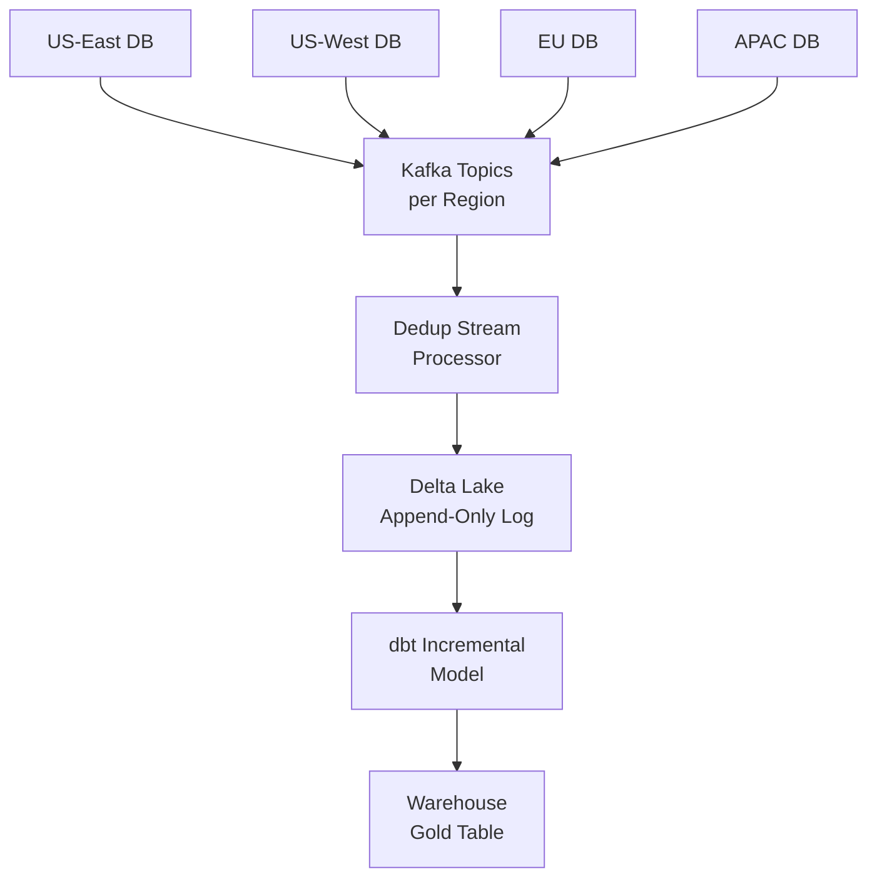

# Scenario Questions — Incremental Loading

<article data-difficulty="junior">

## 🟢 Junior: Design a Basic Incremental Load for a Orders Table

**Scenario:** You're given a MySQL `orders` table with 50 million rows. The table has an `updated_at` timestamp column. Your task is to load new and updated orders into a data warehouse every hour. A full reload takes 45 minutes — clearly too slow for hourly runs.

<details>
<summary>💡 Hint</summary>
Think about what information you need to store between runs to know where the last run left off. What column tells you when a row was last changed?
</details>

<details>
<summary>✅ Solution</summary>

Use a **high-water mark (HWM)** pattern based on the `updated_at` column:

**Step 1 — Store the HWM after each successful run:**

```python
import sqlalchemy as sa
from datetime import datetime
import pandas as pd

def get_hwm(engine, pipeline_name: str) -> datetime:
    sql = "SELECT hwm_value FROM pipeline_hwm WHERE pipeline_name = :p"
    with engine.connect() as conn:
        row = conn.execute(sa.text(sql), {"p": pipeline_name}).fetchone()
    return row[0] if row else datetime(2000, 1, 1)

def save_hwm(engine, pipeline_name: str, hwm: datetime):
    sql = """
        INSERT INTO pipeline_hwm (pipeline_name, hwm_value)
        VALUES (:p, :hwm)
        ON CONFLICT (pipeline_name)
        DO UPDATE SET hwm_value = EXCLUDED.hwm_value
    """
    with engine.begin() as conn:
        conn.execute(sa.text(sql), {"p": pipeline_name, "hwm": hwm})
```

**Step 2 — Extract only new/changed rows:**

```python
def extract_new_orders(source_engine, hwm: datetime) -> pd.DataFrame:
    sql = """
        SELECT order_id, customer_id, status, total_usd, updated_at
        FROM orders
        WHERE updated_at > :hwm
        ORDER BY updated_at
    """
    return pd.read_sql(sa.text(sql), source_engine, params={"hwm": hwm})
```

**Step 3 — Upsert into the warehouse:**

```sql
INSERT INTO warehouse.orders (order_id, customer_id, status, total_usd, updated_at)
SELECT order_id, customer_id, status, total_usd, updated_at
FROM staging.orders_incremental
ON CONFLICT (order_id)
DO UPDATE SET
    status     = EXCLUDED.status,
    total_usd  = EXCLUDED.total_usd,
    updated_at = EXCLUDED.updated_at;
```

**Step 4 — Advance HWM only on success:**

```python
pipeline = "orders_hourly"
hwm = get_hwm(wh_engine, pipeline)
df  = extract_new_orders(src_engine, hwm)

if not df.empty:
    new_hwm = df["updated_at"].max()
    # ... load df to warehouse ...
    save_hwm(wh_engine, pipeline, new_hwm)  # Only on success!
```

**Key points:**
- Never advance the HWM before confirming the load succeeded
- Add an index on `orders.updated_at` in MySQL to avoid full table scans
- Use `ON CONFLICT ... DO UPDATE` (upsert) since orders can be updated

</details>

</article>

<article data-difficulty="mid-level">

## 🟡 Mid-Level: Late-Arriving Data Causing Reporting Gaps

**Scenario:** Your e-commerce company's incremental pipeline runs every hour and uses `updated_at > last_hwm` to extract orders. Your analytics team reports that sales figures for completed hours keep changing — orders placed via the mobile app with poor connectivity sometimes sync hours later with an `updated_at` timestamp from when they were actually placed, not when they synced. The current pipeline misses these orders entirely.

<details>
<summary>💡 Hint</summary>
Consider adding a lookback window to your HWM query. Think about what "late-arriving" means in terms of the `updated_at` timestamp and when the pipeline sees the record.
</details>

<details>
<summary>✅ Solution</summary>

**Root cause:** Mobile orders sync late but carry old `updated_at` timestamps. By the time they appear in the source DB, the pipeline's HWM has already passed that point.

**Solution: Rolling lookback window + partition replacement**

```python
from datetime import timedelta

LOOKBACK_HOURS = 6  # Reprocess last 6 hours every run

def get_effective_hwm(stored_hwm: datetime) -> datetime:
    """Apply lookback to catch late arrivals."""
    return stored_hwm - timedelta(hours=LOOKBACK_HOURS)

def extract_with_lookback(source_engine, stored_hwm: datetime) -> pd.DataFrame:
    effective_hwm = get_effective_hwm(stored_hwm)
    sql = """
        SELECT order_id, customer_id, status, total_usd, updated_at, created_at
        FROM orders
        WHERE updated_at > :effective_hwm
        ORDER BY updated_at
    """
    return pd.read_sql(sa.text(sql), source_engine, params={"effective_hwm": effective_hwm})
```

**For partition-based targets, replace partitions instead of merging:**

```python
from datetime import date

def replace_affected_partitions(df: pd.DataFrame, target_table: str, engine):
    """
    For each date partition touched by late-arriving data,
    replace the entire partition atomically.
    """
    affected_dates = df["created_at"].dt.date.unique()

    for partition_date in affected_dates:
        partition_data = df[df["created_at"].dt.date == partition_date]

        with engine.begin() as conn:
            # Delete old partition
            conn.execute(sa.text(f"""
                DELETE FROM {target_table}
                WHERE DATE(created_at) = :d
            """), {"d": partition_date})

            # Re-insert with latest data
            partition_data.to_sql(target_table, conn, if_exists="append", index=False)
```

**Alternative: Use `created_at` for partitioning, `updated_at` for HWM:**
- Partition the warehouse table by `created_at` (stable, never changes)
- Use `updated_at` as the HWM column
- Re-run the last N partitions on every run

**Trade-off:** Reprocessing 6 hours of data on every hourly run means ~6x more data processed. That's acceptable if the data volume per hour is small. For high-volume tables, use a smarter trigger (e.g., only re-run partitions flagged as "dirty" by monitoring).

</details>

</article>

<article data-difficulty="senior">

## 🔴 Senior: Designing a Multi-Source Incremental System with Consistency Guarantees

**Scenario:** You're the lead data engineer at a global fintech company. You have 8 regional transaction-processing databases (PostgreSQL) spread across US, EU, and APAC. Each processes transactions independently. You need to build a consolidated data warehouse view of all transactions that:
1. Is refreshed every 15 minutes
2. Has zero duplicates across regions (the same transaction can be created in multiple regional DBs during failover)
3. Handles clock skew between regions (up to 5 minutes)
4. Provides a correctness guarantee: any transaction committed to any regional DB before T-10min must appear in the warehouse by T
5. Supports full audit trail (no overwrites, only appends)

How do you design this system?

<details>
<summary>💡 Hint</summary>
Think about per-region HWMs, deterministic deduplication keys, and how to define a "safe" global completeness boundary given clock skew.
</details>

<details>
<summary>✅ Solution</summary>

**Architecture overview:**



**Step 1 — Per-region HWM with clock-skew buffer:**

```python
CLOCK_SKEW_BUFFER = timedelta(minutes=5)
SAFETY_LAG        = timedelta(minutes=10)  # Guarantee: T-10min completeness

class RegionHWMManager:
    def get_safe_extract_window(self, region: str) -> tuple[datetime, datetime]:
        """
        Returns (from_time, to_time) for safe extraction.
        to_time is now - SAFETY_LAG to ensure all in-flight transactions
        have committed before we read them.
        """
        from_time = self.get_hwm(region) - CLOCK_SKEW_BUFFER
        to_time   = datetime.utcnow() - SAFETY_LAG
        return from_time, to_time
```

**Step 2 — Deterministic dedup key:**

```python
import hashlib

def generate_global_txn_id(region: str, local_txn_id: str, amount: float, account_id: str) -> str:
    """
    Business-key-based dedup ID that's stable across regions.
    Two regional DBs recording the same failover transaction will produce the same ID.
    """
    # Use business keys, NOT auto-increment IDs (those differ per region)
    canonical = f"{account_id}|{amount:.2f}|{local_txn_id[:8]}"  # normalized form
    return hashlib.sha256(f"{canonical}".encode()).hexdigest()
```

**Step 3 — Append-only audit log in Delta Lake:**

```python
from delta.tables import DeltaTable

def append_to_audit_log(spark, batch_df, audit_log_path: str, region: str):
    """
    Never overwrite. Add all incoming records with metadata.
    Deduplication happens at query time via QUALIFY or in a downstream model.
    """
    enriched = batch_df \
        .withColumn("ingested_at", current_timestamp()) \
        .withColumn("source_region", lit(region)) \
        .withColumn("global_txn_id", udf_generate_id("account_id", "amount", "local_txn_id"))

    enriched.write \
        .format("delta") \
        .mode("append") \
        .partitionBy("transaction_date") \
        .save(audit_log_path)
```

**Step 4 — dbt model for deduplicated view:**

```sql
-- models/gold/transactions_deduplicated.sql
{{
    config(
        materialized='incremental',
        unique_key='global_txn_id',
        incremental_strategy='merge'
    )
}}

WITH ranked AS (
    SELECT *,
        ROW_NUMBER() OVER (
            PARTITION BY global_txn_id
            ORDER BY ingested_at ASC  -- Keep first seen (audit)
        ) AS rn
    FROM {{ ref('silver_transactions_all_regions') }}

    
    WHERE ingested_at > (SELECT MAX(ingested_at) FROM {{ this }}) - INTERVAL '10 minutes'
    
)

SELECT * EXCEPT (rn) FROM ranked WHERE rn = 1
```

**Step 5 — Global completeness guarantee:**

```python
def get_global_completeness_boundary(hwm_manager, regions: list[str]) -> datetime:
    """
    The warehouse is complete up to this timestamp.
    = min(per-region HWM) - SAFETY_LAG
    """
    per_region_hwms = [hwm_manager.get_hwm(r) for r in regions]
    return min(per_region_hwms) - SAFETY_LAG

# Expose this to downstream consumers so they know the freshness boundary
completeness_ts = get_global_completeness_boundary(hwm_mgr, REGIONS)
```

**Key design decisions:**
- **Append-only log** in Delta ensures full audit trail with no data loss
- **Global txn ID** based on business keys (not DB auto-increment) enables cross-region dedup
- **Per-region HWM** ensures slow regions don't block fast ones
- **Safety lag (T-10min)** ensures all in-flight transactions have committed before extraction
- **Clock skew buffer (5min lookback)** handles regional clock drift

</details>

</article>
