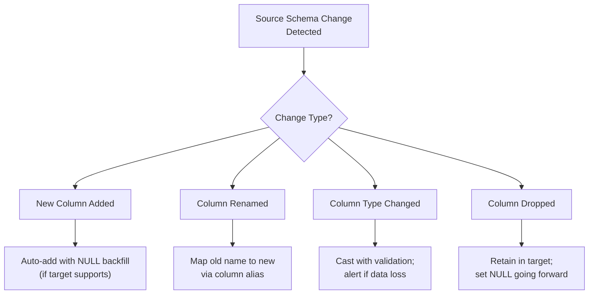

# Incremental Loading — Senior Deep Dive

## Exactly-Once Incremental Semantics

At-least-once delivery is easy; exactly-once requires careful design across the entire pipeline.

### The Three Guarantees

| Guarantee | Definition | Achievability |
|---|---|---|
| At-most-once | Row loaded 0 or 1 times; data loss possible | Easy |
| At-least-once | Row loaded 1+ times; duplicates possible | Moderate |
| Exactly-once | Row loaded exactly once | Hard; usually approximated via idempotency |

In practice, **exactly-once is achieved by combining idempotent writes with reliable HWM tracking** in the same atomic operation.

```python
from contextlib import contextmanager
import sqlalchemy as sa

@contextmanager
def atomic_incremental_load(target_engine, pipeline_name: str):
    """
    Wrap the load + HWM update in a single DB transaction.
    If either fails, both roll back — no data gap, no HWM advance.
    """
    with target_engine.begin() as conn:
        # Yield the connection; caller performs load + HWM update
        yield conn
        # Commit happens automatically when context exits cleanly
        # Rollback happens automatically on exception
```

Usage:

```python
def run_pipeline(df, new_hwm, pipeline_name):
    with atomic_incremental_load(target_engine, pipeline_name) as conn:
        # Write data
        df.to_sql("orders", conn, if_exists="append", index=False, method="multi")

        # Update HWM in the same transaction
        conn.execute(sa.text("""
            INSERT INTO pipeline_hwm (pipeline_name, hwm_value)
            VALUES (:p, :hwm)
            ON CONFLICT (pipeline_name)
            DO UPDATE SET hwm_value = EXCLUDED.hwm_value
        """), {"p": pipeline_name, "hwm": new_hwm})
```

---

## Distributed HWM Challenges

In a distributed pipeline (multiple workers reading the same source), naively advancing the HWM can cause problems.

### Race Condition Example

```
Worker A processes shard 1: records up to 14:00
Worker B processes shard 2: records up to 13:55

Worker B finishes first → sets HWM to 13:55
Worker A finishes second → sets HWM to 14:00
Next run: extracts from 14:00 → misses records from 13:55–14:00 on shard 2
```

### Solution: Per-Shard HWMs

```python
from dataclasses import dataclass
from typing import Dict

@dataclass
class ShardHWM:
    shard_id: str
    hwm_value: datetime

class ShardedHWMStore:
    def get_all(self, pipeline: str) -> Dict[str, datetime]:
        """Return {shard_id: hwm} for all shards of a pipeline."""
        sql = """
            SELECT shard_id, hwm_value
            FROM pipeline_shard_hwm
            WHERE pipeline_name = :p
        """
        with self.engine.connect() as conn:
            rows = conn.execute(sa.text(sql), {"p": pipeline}).fetchall()
        return {r.shard_id: r.hwm_value for r in rows}

    def get_global_hwm(self, pipeline: str) -> datetime:
        """
        The global HWM is the MINIMUM across all shards —
        the point before which we're guaranteed completeness.
        """
        per_shard = self.get_all(pipeline)
        return min(per_shard.values()) if per_shard else datetime(2000, 1, 1)
```

---

## Delta Lake Incremental Load Patterns

Delta Lake provides ACID transactions and Change Data Feed (CDF) for sophisticated incremental loading.

### Delta Change Data Feed

```python
from delta import DeltaTable
from pyspark.sql import SparkSession

spark = SparkSession.builder \
    .config("spark.sql.extensions", "io.delta.sql.DeltaSparkSessionExtension") \
    .config("spark.sql.catalog.spark_catalog", "org.apache.spark.sql.delta.catalog.DeltaCatalog") \
    .getOrCreate()

# Enable CDF on the source table
spark.sql("""
    ALTER TABLE delta.`/data/source/orders`
    SET TBLPROPERTIES (delta.enableChangeDataFeed = true)
""")

def read_cdf_incremental(table_path: str, start_version: int):
    """
    Read only changed rows since a given table version.
    Returns inserts, updates, and deletes with _change_type column.
    """
    return (
        spark.read.format("delta")
        .option("readChangeFeed", "true")
        .option("startingVersion", start_version)
        .load(table_path)
    )

# Process each change type
changes = read_cdf_incremental("/data/source/orders", start_version=42)

inserts = changes.filter("_change_type = 'insert'").drop("_change_type", "_commit_version", "_commit_timestamp")
updates = changes.filter("_change_type = 'update_postimage'")
deletes = changes.filter("_change_type = 'delete'")

print(f"Inserts: {inserts.count()}, Updates: {updates.count()}, Deletes: {deletes.count()}")
```

### Delta MERGE for Incremental Upsert

```python
from delta.tables import DeltaTable

def delta_incremental_merge(spark, source_df, target_path: str, merge_key: str):
    """
    Efficient incremental upsert using Delta MERGE.
    Only rewrites affected files, not the entire table.
    """
    target = DeltaTable.forPath(spark, target_path)

    target.alias("tgt").merge(
        source_df.alias("src"),
        f"tgt.{merge_key} = src.{merge_key}"
    ).whenMatchedUpdateAll(
    ).whenNotMatchedInsertAll(
    ).execute()

    # Get the latest version for HWM tracking
    return target.history(1).select("version").collect()[0][0]
```

---

## Streaming Incremental Load (Structured Streaming)

For near-real-time incremental loading, Spark Structured Streaming with Delta provides micro-batch semantics.

```python
def streaming_incremental_load(
    source_kafka_topic: str,
    target_delta_path: str,
    checkpoint_path: str
):
    """
    Streaming incremental load with exactly-once guarantees via
    Delta Lake + Kafka offset checkpointing.
    """
    raw_stream = (
        spark.readStream
        .format("kafka")
        .option("kafka.bootstrap.servers", "broker:9092")
        .option("subscribe", source_kafka_topic)
        .option("startingOffsets", "latest")
        .load()
    )

    from pyspark.sql.functions import from_json, col
    from pyspark.sql.types import StructType, StringType, TimestampType

    schema = StructType() \
        .add("order_id", StringType()) \
        .add("status", StringType()) \
        .add("updated_at", TimestampType())

    parsed = raw_stream.select(
        from_json(col("value").cast("string"), schema).alias("data")
    ).select("data.*")

    query = (
        parsed.writeStream
        .format("delta")
        .option("checkpointLocation", checkpoint_path)
        .outputMode("append")
        .trigger(processingTime="1 minute")
        .start(target_delta_path)
    )
    return query
```

---

## Schema Evolution in Incremental Loads

Schema changes are one of the most disruptive events for incremental pipelines.



```python
import pandas as pd

def schema_evolution_safe_load(
    new_df: pd.DataFrame,
    target_schema: list[str],
    allow_new_columns: bool = True
) -> pd.DataFrame:
    """
    Align incoming DataFrame with target schema.
    - Drops columns not in target (or adds them if allow_new_columns=True)
    - Fills missing columns with NULL
    """
    new_cols = set(new_df.columns)
    target_cols = set(target_schema)

    added   = new_cols - target_cols
    dropped = target_cols - new_cols

    if added and not allow_new_columns:
        raise ValueError(f"New columns detected: {added}. Schema migration required.")

    # Add missing target columns as NaN
    for col in dropped:
        new_df[col] = None

    # Only keep target columns (plus any newly allowed ones)
    if allow_new_columns:
        return new_df
    return new_df[target_schema]
```

---

## Monitoring Incremental Pipelines

### Key Metrics

```python
from dataclasses import dataclass
from datetime import datetime

@dataclass
class LoadMetrics:
    pipeline_name: str
    run_start: datetime
    run_end: datetime
    rows_extracted: int
    rows_loaded: int
    rows_rejected: int
    hwm_before: datetime
    hwm_after: datetime

    @property
    def duration_seconds(self) -> float:
        return (self.run_end - self.run_start).total_seconds()

    @property
    def throughput_rps(self) -> float:
        return self.rows_loaded / max(self.duration_seconds, 1)

    @property
    def hwm_advance_hours(self) -> float:
        delta = self.hwm_after - self.hwm_before
        return delta.total_seconds() / 3600

    def to_dict(self) -> dict:
        return {
            "pipeline": self.pipeline_name,
            "rows_loaded": self.rows_loaded,
            "rows_rejected": self.rows_rejected,
            "duration_s": self.duration_seconds,
            "throughput_rps": self.throughput_rps,
            "hwm_advance_hours": self.hwm_advance_hours,
        }
```

### Alerting Rules

| Metric | Alert Condition | Severity |
|---|---|---|
| `hwm_advance_hours` < 0.5 | HWM barely moved → likely data gap | High |
| `rows_loaded` == 0 for N consecutive runs | Possible source issue | Medium |
| `rows_rejected` / `rows_extracted` > 5% | Data quality regression | High |
| `duration_seconds` > 3× baseline | Performance degradation | Medium |
| `hwm_after` < `NOW() - 4h` | Pipeline falling behind | High |

---

## Interview Tips

> **Tip 1:** Senior interviewers often probe distributed HWM correctness. Explain that in sharded or multi-worker pipelines, the global HWM must be the **minimum across all shards** — not the maximum — to guarantee completeness before that point.

> **Tip 2:** Delta Lake's Change Data Feed (CDF) is the cleanest solution for capturing updates and deletes without CDC infrastructure. Know how to enable it, read it by version, and checkpoint versions alongside your HWM.

> **Tip 3:** For streaming incremental loads, emphasize that exactly-once semantics come from the combination of idempotent writes (Delta MERGE) + Kafka offset checkpointing. Neither alone is sufficient.

> **Tip 4:** Schema evolution is the most common production failure in incremental pipelines. Describe a strategy: detect drift early, categorize changes (additive vs. breaking), and gate breaking changes with a migration step.

> **Tip 5:** Always instrument your incremental pipeline with HWM advancement rate and row rejection rate. A pipeline that silently processes 0 rows is far worse than one that fails loudly.
