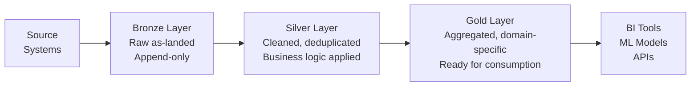
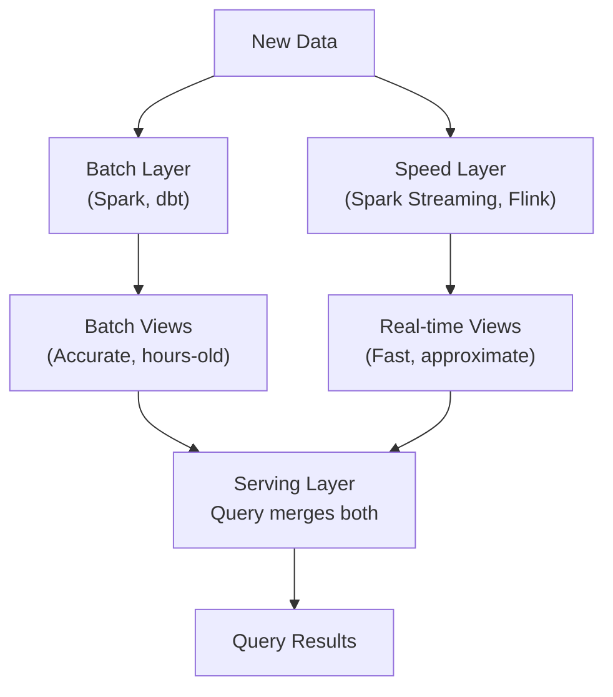
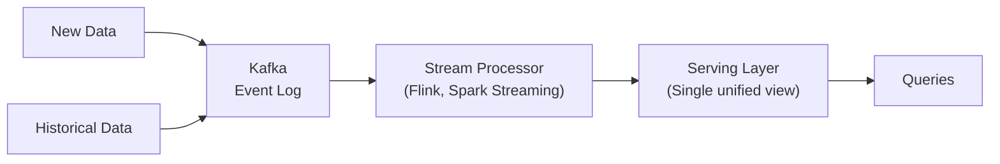

# Pipeline Design Patterns — Fundamentals


## 🎯 Analogy

Think of pipeline design patterns like architectural blueprints: the fan-out pattern is a star (one source, many consumers), the funnel pattern is many sources into one clean store, and the medallion pattern is a quality ladder (bronze → silver → gold).

---
## Why Design Patterns Matter

Pipeline design patterns are proven solutions to common data engineering problems. Using the right pattern for your use case avoids re-inventing solutions, communicates intent to other engineers, and prevents common mistakes.

---

## Medallion Architecture (Bronze / Silver / Gold)

The most widely adopted data lakehouse architecture pattern. Data is progressively refined through three layers:



| Layer | Also Called | Purpose | Quality Level |
|---|---|---|---|
| Bronze | Raw, Landing | Store data exactly as received from source | Low — raw, may have duplicates |
| Silver | Cleansed, Refined | Apply business rules, dedup, join enrichments | Medium — business-valid |
| Gold | Curated, Mart | Aggregate for specific use cases | High — report-ready |

### Example: E-commerce Medallion

```python
# Bronze: Raw events as-landed
raw_events = spark.read.json("s3://raw-bucket/events/2024-01-15/")
raw_events.write.mode("append").parquet("s3://bronze/events/")

# Silver: Deduplicated, parsed, enriched
from pyspark.sql.functions import col, from_json, explode

silver_events = (
    spark.read.parquet("s3://bronze/events/")
    .filter(col("event_type").isNotNull())
    .dropDuplicates(["event_id"])
    .withColumn("user_id", col("payload.user_id"))
    .withColumn("product_id", col("payload.product_id"))
)
silver_events.write.mode("overwrite").partitionBy("event_date").parquet("s3://silver/events/")

# Gold: Daily product view counts (BI-ready aggregate)
gold = (
    silver_events
    .groupBy("event_date", "product_id")
    .agg({"event_id": "count", "user_id": "count_distinct"})
    .withColumnRenamed("count(event_id)", "view_count")
)
gold.write.mode("overwrite").parquet("s3://gold/product_views_daily/")
```

---

## Lambda Architecture

Lambda architecture processes data through two separate paths:
- **Batch layer**: Complete, accurate processing of all historical data
- **Speed layer**: Low-latency processing of recent data
- **Serving layer**: Merges batch and speed results for queries



### Lambda Implementation

```python
# Batch layer: recomputes exact daily metrics every night
def compute_batch_revenue(date: str) -> pd.DataFrame:
    return pd.read_sql(f"""
        SELECT
            DATE(created_at) AS revenue_date,
            SUM(total_usd)   AS revenue_usd
        FROM orders
        WHERE DATE(created_at) = '{date}'
        GROUP BY 1
    """, warehouse_engine)

# Speed layer: updates running total in real-time
def update_speed_layer(event: dict):
    redis.incrbyfloat(
        f"revenue:{event['date']}",
        event["amount_usd"]
    )

# Serving layer: combine batch (accurate) + speed (delta since last batch)
def get_revenue(date: str) -> float:
    batch_rev = get_batch_revenue(date)          # From warehouse
    speed_delta = float(redis.get(f"revenue:{date}") or 0)  # Since last batch
    return batch_rev + speed_delta
```

**Pros:** Handles both historical and real-time.
**Cons:** Complex — two codepaths must produce consistent results. The "lambda tax" of maintaining two separate systems.

---

## Kappa Architecture

Kappa simplifies Lambda by eliminating the batch layer. Everything runs through the streaming layer. Historical data is replayed through the same stream processor.



```python
# Kappa: One streaming job handles both real-time and historical replay
from pyspark.sql import SparkSession

spark = SparkSession.builder.getOrCreate()

def build_revenue_stream(source: str, is_backfill: bool = False):
    """
    Same logic for real-time and historical replay.
    Backfill = replay from beginning of Kafka topic.
    """
    stream = (
        spark.readStream
        .format("kafka")
        .option("kafka.bootstrap.servers", "kafka:9092")
        .option("subscribe", "orders")
        .option("startingOffsets", "earliest" if is_backfill else "latest")
        .load()
    )

    from pyspark.sql.functions import from_json, window, sum as spark_sum
    orders = stream.select(
        from_json(stream.value.cast("string"), ORDER_SCHEMA).alias("order")
    ).select("order.*")

    revenue_by_day = (
        orders
        .withWatermark("order_time", "1 hour")
        .groupBy(window("order_time", "1 day"))
        .agg(spark_sum("total_usd").alias("revenue_usd"))
    )

    return revenue_by_day
```

**Pros:** Simpler — one codebase; stream processing handles everything.
**Cons:** Replay can be slow for large history; stream processors may have limited SQL support.

---

## Fan-Out and Fan-In Patterns

### Fan-Out: One Source, Multiple Destinations

```python
from airflow import DAG
from airflow.operators.python import PythonOperator

with DAG("orders_fan_out", schedule_interval="@daily") as dag:
    extract = PythonOperator(task_id="extract_orders", ...)

    # Fan-out: process in parallel after extract
    load_warehouse  = PythonOperator(task_id="load_warehouse", ...)
    load_search     = PythonOperator(task_id="load_elasticsearch", ...)
    load_cache      = PythonOperator(task_id="invalidate_redis_cache", ...)
    notify          = PythonOperator(task_id="notify_downstream_services", ...)

    # All four run in parallel after extract
    extract >> [load_warehouse, load_search, load_cache, notify]
```

### Fan-In: Multiple Sources, One Destination

```python
with DAG("revenue_fan_in", schedule_interval="@daily") as dag:
    # Sources in parallel
    load_us   = PythonOperator(task_id="load_us_orders", ...)
    load_eu   = PythonOperator(task_id="load_eu_orders", ...)
    load_apac = PythonOperator(task_id="load_apac_orders", ...)

    # Fan-in: aggregate only after all sources are ready
    aggregate = PythonOperator(task_id="aggregate_global_revenue", ...)

    [load_us, load_eu, load_apac] >> aggregate
```

---

## Pipeline as Code

Treating pipeline definitions as code (version-controlled, testable, reproducible):

```python
# Declarative pipeline definition
PIPELINE_CONFIG = {
    "name": "daily_orders",
    "schedule": "0 6 * * *",   # 6 AM daily
    "source": {
        "type": "postgres",
        "table": "orders",
        "filter": "order_date = '{{ ds }}'",
        "watermark_col": "updated_at"
    },
    "transforms": [
        {"type": "deduplicate",    "key": "order_id"},
        {"type": "validate",       "schema": "schemas/orders.json"},
        {"type": "enrich",         "lookup": "dim_customer"},
    ],
    "destinations": [
        {"type": "snowflake",  "table": "warehouse.orders",    "mode": "upsert"},
        {"type": "s3_parquet", "path": "s3://datalake/orders", "mode": "partition"},
    ],
    "quality_checks": [
        {"type": "row_count_match", "tolerance_pct": 0},
        {"type": "not_null",        "columns": ["order_id", "customer_id"]},
    ]
}
```

---


## ▶️ Try It Yourself

```python
# Medallion architecture (Bronze → Silver → Gold)
import pandas as pd

# Bronze: raw, unmodified (exact copy of source)
def ingest_bronze(source_data: list[dict]) -> pd.DataFrame:
    df = pd.DataFrame(source_data)
    df["_ingested_at"] = pd.Timestamp.now()
    return df

# Silver: cleaned, typed, deduplicated
def transform_silver(bronze: pd.DataFrame) -> pd.DataFrame:
    df = bronze.copy()
    df = df.dropna(subset=["order_id"])
    df = df.drop_duplicates("order_id")
    df["amount"] = pd.to_numeric(df["amount"], errors="coerce")
    return df

# Gold: aggregated, business-ready
def aggregate_gold(silver: pd.DataFrame) -> pd.DataFrame:
    return silver.groupby("region")["amount"].sum().reset_index()

raw = [{"order_id": 1, "amount": "100", "region": "US"},
       {"order_id": 1, "amount": "100", "region": "US"},  # duplicate
       {"order_id": 2, "amount": "200", "region": "EU"}]

bronze = ingest_bronze(raw)
silver = transform_silver(bronze)
gold = aggregate_gold(silver)
print(gold)
```

> **Run it:** Copy the snippet into a REPL or file and run it — no external services needed for the basic example.

---
## Interview Tips

> **Tip 1:** The medallion architecture (Bronze/Silver/Gold) is the most common architecture pattern in modern data lake/lakehouse setups. Know all three layers, what quality level each represents, and what transformations happen at each boundary.

> **Tip 2:** Lambda vs. Kappa is a classic architecture comparison question. Lambda's strength is accuracy (batch for history); Kappa's strength is simplicity (one codebase). The "lambda tax" (maintaining two systems) is the key weakness of Lambda.

> **Tip 3:** Fan-out and Fan-in are DAG patterns that enable parallelism. Know that Airflow's `>>` operator handles both, and that `trigger_rule="all_done"` or `"all_success"` controls fan-in behavior.

> **Tip 4:** Pipeline as code is a principle, not a pattern. It means defining pipeline logic in version-controlled code (not GUI-configured workflows) so changes are reviewable, testable, and reproducible.

> **Tip 5:** Most modern data platforms combine patterns: medallion architecture for data organization + Kappa for streaming ingestion + fan-out for serving multiple consumers. Don't present them as mutually exclusive.
