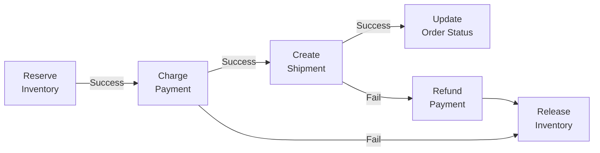

# Pipeline Design Patterns — Intermediate

## Outbox Pattern

The Outbox Pattern ensures reliable event publishing from a service without distributed transactions.

### Problem

```
Without Outbox:
  BEGIN;
    UPDATE orders SET status = 'shipped';
    COMMIT;
  // Then try to publish to Kafka...
  // But what if Kafka is down? The DB committed but the event was never sent!
```

### Solution: Transactional Outbox

```sql
-- Create outbox table in the same DB as business tables
CREATE TABLE outbox_events (
    id            BIGSERIAL PRIMARY KEY,
    aggregate_id  TEXT NOT NULL,
    aggregate_type TEXT NOT NULL,
    event_type    TEXT NOT NULL,
    payload       JSONB NOT NULL,
    created_at    TIMESTAMPTZ DEFAULT NOW(),
    published_at  TIMESTAMPTZ,
    retry_count   INT DEFAULT 0
);

-- Application writes business data + outbox event in ONE transaction
BEGIN;
    UPDATE orders SET status = 'shipped' WHERE order_id = 'ORD-001';

    INSERT INTO outbox_events (aggregate_id, aggregate_type, event_type, payload)
    VALUES ('ORD-001', 'Order', 'OrderShipped',
            '{"order_id":"ORD-001","shipped_at":"2024-01-15T10:00:00Z"}');
COMMIT;
-- If the transaction fails, both the order update AND the outbox event are rolled back
```

```python
# Outbox relay: separate process publishes outbox events to Kafka
from confluent_kafka import Producer

def relay_outbox_events(engine, producer: Producer, batch_size: int = 100):
    """Continuously relay unpublished outbox events to Kafka."""
    while True:
        with engine.begin() as conn:
            # Lock rows to prevent concurrent relay workers from double-publishing
            rows = conn.execute(sa.text("""
                SELECT id, aggregate_id, event_type, payload
                FROM outbox_events
                WHERE published_at IS NULL
                  AND retry_count < 5
                ORDER BY created_at
                LIMIT :limit
                FOR UPDATE SKIP LOCKED
            """), {"limit": batch_size}).fetchall()

            for row in rows:
                try:
                    producer.produce(
                        topic=f"events.{row.event_type}",
                        key=row.aggregate_id.encode(),
                        value=json.dumps(row.payload).encode()
                    )
                    # Mark as published within the same transaction
                    conn.execute(sa.text("""
                        UPDATE outbox_events
                        SET published_at = NOW()
                        WHERE id = :id
                    """), {"id": row.id})
                except Exception as e:
                    conn.execute(sa.text("""
                        UPDATE outbox_events
                        SET retry_count = retry_count + 1
                        WHERE id = :id
                    """), {"id": row.id})

        producer.flush()
        time.sleep(1)  # Poll every second
```

---

## Saga Pattern for Distributed Pipelines

The Saga pattern coordinates multi-step distributed operations with compensating rollbacks.



```python
from dataclasses import dataclass
from typing import Callable

@dataclass
class SagaStep:
    name:       str
    execute:    Callable
    compensate: Callable

class Saga:
    def __init__(self, steps: list[SagaStep]):
        self.steps    = steps
        self.completed = []

    def run(self, context: dict) -> dict:
        for step in self.steps:
            try:
                result = step.execute(context)
                context.update(result or {})
                self.completed.append(step)
            except Exception as e:
                print(f"Step {step.name} failed: {e}. Compensating...")
                self._rollback(context)
                raise RuntimeError(f"Saga failed at {step.name}") from e
        return context

    def _rollback(self, context: dict):
        for step in reversed(self.completed):
            try:
                step.compensate(context)
            except Exception as e:
                print(f"Compensation for {step.name} failed: {e}")

# Usage
order_saga = Saga([
    SagaStep("inventory",
             execute=lambda ctx: reserve_inventory(ctx["order_id"]),
             compensate=lambda ctx: release_inventory(ctx["reservation_id"])),
    SagaStep("payment",
             execute=lambda ctx: charge_payment(ctx["customer_id"], ctx["amount"]),
             compensate=lambda ctx: refund_payment(ctx["payment_id"])),
])

try:
    order_saga.run({"order_id": "ORD-001", "customer_id": "CUST-100", "amount": 99.99})
except RuntimeError as e:
    print(f"Order pipeline rolled back: {e}")
```

---

## Pipeline Circuit Breaker

Circuit breakers prevent cascade failures when a dependency becomes unavailable.

```python
from enum import Enum
from datetime import datetime, timedelta
import threading

class CircuitState(Enum):
    CLOSED    = "closed"
    OPEN      = "open"
    HALF_OPEN = "half_open"

class PipelineCircuitBreaker:
    def __init__(self, name: str, failure_threshold=5, timeout_seconds=60):
        self.name              = name
        self.failure_threshold = failure_threshold
        self.timeout           = timeout_seconds
        self.state             = CircuitState.CLOSED
        self.failure_count     = 0
        self.last_failure_time = None
        self._lock             = threading.Lock()

    def __call__(self, fn):
        """Use as a decorator."""
        def wrapper(*args, **kwargs):
            return self.call(lambda: fn(*args, **kwargs))
        return wrapper

    def call(self, fn):
        with self._lock:
            if self.state == CircuitState.OPEN:
                if datetime.utcnow() - self.last_failure_time > timedelta(seconds=self.timeout):
                    self.state = CircuitState.HALF_OPEN
                else:
                    raise RuntimeError(f"Circuit OPEN: {self.name} unavailable")

        try:
            result = fn()
            self._on_success()
            return result
        except Exception as e:
            self._on_failure()
            raise

    def _on_success(self):
        with self._lock:
            self.failure_count = 0
            if self.state == CircuitState.HALF_OPEN:
                self.state = CircuitState.CLOSED
                print(f"Circuit {self.name}: HALF_OPEN → CLOSED (recovered)")

    def _on_failure(self):
        with self._lock:
            self.failure_count    += 1
            self.last_failure_time = datetime.utcnow()
            if self.failure_count >= self.failure_threshold:
                self.state = CircuitState.OPEN
                print(f"Circuit {self.name}: OPEN after {self.failure_count} failures")

# Usage
db_circuit = PipelineCircuitBreaker("oltp-db", failure_threshold=5, timeout_seconds=60)

@db_circuit
def extract_orders(date: str) -> pd.DataFrame:
    return pd.read_sql(..., source_engine)
```

---

## Event-Driven Pipeline Pattern

Pipelines triggered by events rather than schedules:

```python
from confluent_kafka import Consumer
import json

class EventDrivenPipeline:
    """
    Pipeline triggered by upstream completion events.
    Replaces cron-based scheduling for event-coupled pipelines.
    """
    def __init__(self, trigger_topic: str, pipeline_fn, kafka_config: dict):
        self.consumer = Consumer({**kafka_config, "enable.auto.commit": False})
        self.consumer.subscribe([trigger_topic])
        self.pipeline = pipeline_fn

    def run(self):
        print("Event-driven pipeline listening...")
        while True:
            msg = self.consumer.poll(timeout=5.0)
            if msg is None:
                continue
            if msg.error():
                continue

            event = json.loads(msg.value())
            print(f"Triggered by event: {event['type']} for {event['date']}")

            try:
                self.pipeline(event["date"])
                self.consumer.commit(message=msg, asynchronous=False)
            except Exception as e:
                print(f"Pipeline failed: {e}. Will retry on re-delivery.")

# Example: Silver pipeline runs when Bronze upload completes
bronze_complete_topic = "pipeline.events.bronze.complete"
silver_pipeline = EventDrivenPipeline(
    trigger_topic=bronze_complete_topic,
    pipeline_fn=run_silver_transformation,
    kafka_config={"bootstrap.servers": "kafka:9092", "group.id": "silver-pipeline"}
)
```

---

## Comparison: Scheduling vs. Event-Driven

| Factor | Cron Scheduling | Event-Driven |
|---|---|---|
| Trigger | Fixed time | Upstream completion event |
| Latency | Fixed delay (wait for next cron) | Near-immediate (seconds after trigger) |
| Coupling | Loose (no dependency) | Tight (must handle trigger failures) |
| Debugging | Easy (check logs at fixed times) | Complex (trace event propagation) |
| Missed triggers | Catchup (Airflow) or gap | Re-delivery from Kafka |
| Best for | Independent pipelines | Tightly coupled stage-to-stage |

---

## Interview Tips

> **Tip 1:** The Outbox Pattern solves the "dual write" problem — you can't atomically write to a DB and publish to Kafka. The Outbox makes the Kafka publish a consequence of the DB transaction, not a separate operation.

> **Tip 2:** The Saga pattern is the distributed systems replacement for a database transaction across multiple services. When asked "how do you handle a multi-step pipeline where step 3 fails?", the Saga (with compensating transactions) is the answer.

> **Tip 3:** Event-driven pipelines have lower latency than cron-based pipelines but require Kafka reliability and consumer group management. Know the trade-off: simpler scheduling vs. faster data availability.

> **Tip 4:** The circuit breaker is a pipeline-level pattern, not just a service pattern. When 5 pipeline workers all retry against a down database simultaneously, the circuit breaker prevents them from amplifying the outage.

> **Tip 5:** Interviewers often ask "how does Silver know when Bronze is done?" This is the scheduling vs. event-driven question. Event-driven (trigger topic) is the clean answer; cron with a 15-minute overlap is the pragmatic fallback.
