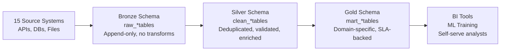

# Pipeline Design Patterns — Real World

## Case Study 1: Migrating from Lambda to Kappa Architecture

### Problem

A media streaming company ran a Lambda architecture: Spark batch jobs computed accurate daily metrics overnight, while a Kafka Streams app computed real-time approximate metrics. Two separate codebases drifted apart over 18 months — the batch job used a different session definition than the real-time job, causing dashboards to show different numbers depending on whether you looked at "today" (real-time) vs. "yesterday" (batch).

### Before: Lambda Architecture

```
Batch path:  Raw S3 → Spark batch → Accurate daily metrics (6 AM refresh)
Speed path:  Kafka → Kafka Streams → Approximate real-time metrics (seconds lag)
Problem:     Two codebases → drift → inconsistent numbers
```

### After: Kappa Architecture with Flink

```python
from pyflink.datastream import StreamExecutionEnvironment
from pyflink.table import StreamTableEnvironment

env       = StreamExecutionEnvironment.get_execution_environment()
env.enable_checkpointing(60_000)   # Checkpoint every minute

table_env = StreamTableEnvironment.create(env)

# ONE definition of a "session" — used for both real-time and replay
table_env.execute_sql("""
    CREATE TABLE raw_events (
        user_id         BIGINT,
        content_id      BIGINT,
        event_type      STRING,
        duration_ms     BIGINT,
        event_time      TIMESTAMP(3),
        WATERMARK FOR event_time AS event_time - INTERVAL '5' SECOND
    ) WITH (
        'connector' = 'kafka',
        'topic' = 'streaming-events',
        'properties.bootstrap.servers' = 'kafka:9092',
        'format' = 'json'
    )
""")

table_env.execute_sql("""
    CREATE TABLE user_sessions_sink (
        session_date   DATE,
        user_id        BIGINT,
        session_count  BIGINT,
        total_watch_ms BIGINT
    ) WITH (
        'connector' = 'iceberg',
        'catalog-name' = 'hive_catalog',
        'warehouse' = 's3://lakehouse/warehouse',
        'write.upsert.enabled' = 'true'
    )
""")

# Tumbling 30-minute windows define a "session" — consistently in one place
table_env.execute_sql("""
    INSERT INTO user_sessions_sink
    SELECT
        CAST(TUMBLE_START(event_time, INTERVAL '30' MINUTE) AS DATE) AS session_date,
        user_id,
        COUNT(DISTINCT TUMBLE_START(event_time, INTERVAL '30' MINUTE)) AS session_count,
        SUM(duration_ms) AS total_watch_ms
    FROM raw_events
    WHERE event_type = 'play'
    GROUP BY
        user_id,
        TUMBLE(event_time, INTERVAL '30' MINUTE)
""")
```

### Results

| Metric | Before (Lambda) | After (Kappa) |
|---|---|---|
| Codebases | 2 (batch + streaming) | 1 |
| Metric consistency | Diverged 3-5% | Identical |
| Oncall incidents (metric discrepancy) | 4/month | 0/month |
| Backfill method | Separate Spark batch job | Replay Kafka from offset |

---

## Case Study 2: Medallion Architecture Migration

### Problem

A logistics company had a flat "data swamp": all data was loaded into a single Snowflake schema with no quality tiers. Data scientists spent 60% of their time cleaning data before analysis. Teams had no way to know which tables were "trusted."

### Solution: Three-Layer Medallion



### Bronze Layer Contract

```python
# bronze_loader.py
def load_to_bronze(source_name: str, df: pd.DataFrame, run_date: str, engine):
    """
    Bronze loading rules:
    1. No transformations — land exactly as received
    2. Append only — never update or delete
    3. Always add metadata columns
    """
    df["_ingested_at"]  = datetime.utcnow()
    df["_source"]       = source_name
    df["_run_date"]     = run_date
    df["_row_id"]       = [str(uuid.uuid4()) for _ in range(len(df))]  # Stable dedup key

    # Always append; never truncate
    df.to_sql(
        f"raw_{source_name}",
        engine,
        schema="bronze",
        if_exists="append",
        index=False
    )
```

### Silver dbt Models

```sql
-- models/silver/clean_shipments.sql
{{
    config(
        materialized='incremental',
        unique_key='shipment_id',
        incremental_strategy='merge',
        schema='silver'
    )
}}

WITH deduped AS (
    SELECT *,
        ROW_NUMBER() OVER (
            PARTITION BY shipment_id
            ORDER BY _ingested_at DESC
        ) AS rn
    FROM {{ source('bronze', 'raw_shipments') }}
    
    WHERE _ingested_at > (SELECT MAX(_ingested_at) FROM {{ this }})
    
),

validated AS (
    SELECT *
    FROM deduped
    WHERE rn = 1
      AND shipment_id IS NOT NULL
      AND origin_zip  IS NOT NULL
      AND dest_zip    IS NOT NULL
      AND weight_kg   > 0
)

SELECT
    shipment_id,
    origin_zip,
    dest_zip,
    UPPER(TRIM(carrier_code)) AS carrier_code,
    weight_kg,
    CASE
        WHEN status = 'dlvrd'   THEN 'delivered'
        WHEN status = 'in-tran' THEN 'in_transit'
        ELSE status
    END AS status_normalized,
    scheduled_delivery_date,
    actual_delivery_date,
    _ingested_at
FROM validated
```

### Gold Metrics (SLA-Backed)

```sql
-- models/gold/mart_on_time_delivery.sql
-- SLA: Updated by 7 AM daily; freshness < 2 hours
{{
    config(
        materialized='table',
        schema='gold',
        post_hook=[
            "GRANT SELECT ON {{ this }} TO ROLE analytics_role"
        ]
    )
}}

SELECT
    DATE_TRUNC('week', scheduled_delivery_date) AS delivery_week,
    carrier_code,
    COUNT(*) AS total_shipments,
    SUM(CASE WHEN actual_delivery_date <= scheduled_delivery_date THEN 1 ELSE 0 END) AS on_time_count,
    ROUND(100.0 * SUM(CASE WHEN actual_delivery_date <= scheduled_delivery_date THEN 1 ELSE 0 END) / COUNT(*), 2) AS on_time_pct
FROM {{ ref('clean_shipments') }}
WHERE status_normalized = 'delivered'
  AND scheduled_delivery_date >= CURRENT_DATE - 90
GROUP BY 1, 2
ORDER BY 1 DESC, 3 DESC
```

### Results

| Metric | Before | After |
|---|---|---|
| Data prep time for analysts | 60% of analysis time | 10% |
| "Trusted" tables identified | 0 (everything mixed) | Gold schema (clear tier) |
| Duplicate records in reports | Common | Eliminated (Silver dedup) |
| Data quality incidents | 8/month | 1/month |

---

## Case Study 3: Self-Serve Pipeline Platform

### Problem

Every new data source required a data engineer to write a custom pipeline. With 50+ sources requested and 3 data engineers, the backlog was 6 months long.

### Solution: Declarative Pipeline Configuration

```yaml
# pipelines/crm_contacts.yml
name: crm_contacts
source:
  type: postgres
  host: crm-db.company.com
  table: contacts
  incremental_column: updated_at
  lookback_hours: 2

destination:
  type: snowflake
  schema: bronze
  table: crm_contacts
  write_mode: upsert
  merge_key: contact_id

schedule: "0 * * * *"   # Hourly

quality:
  required_columns: [contact_id, email, created_at]
  max_null_pct:
    contact_id: 0
    email: 0.05

notifications:
  failure: "#data-alerts"
  success: null   # Don't alert on success
```

```python
# pipeline_runner.py — reads YAML, executes pipeline
import yaml

def run_pipeline_from_config(config_path: str, run_date: str):
    """Execute a pipeline defined in YAML — no custom code needed."""
    with open(config_path) as f:
        config = yaml.safe_load(f)

    source      = build_source(config["source"])
    destination = build_destination(config["destination"])
    checks      = build_quality_checks(config.get("quality", {}))

    df = source.extract(run_date)

    for check in checks:
        check.validate(df)

    destination.load(df, run_date)
    print(f"Pipeline {config['name']} completed: {len(df)} rows")
```

### Results

| Metric | Before | After |
|---|---|---|
| Time to onboard new source | 2-3 weeks | 1-2 hours (YAML config) |
| Pipeline backlog | 6 months | 2 weeks |
| Data engineer time on boilerplate | 70% | 20% |
| Sources on self-serve platform | 0 | 47 |

---

## Interview Tips

> **Tip 1:** The Lambda → Kappa migration story demonstrates that simplicity is a feature. The "lambda tax" (two codebases that drift apart) is a concrete technical debt cost. Eliminating it by unifying to Kappa improved both consistency and developer velocity.

> **Tip 2:** Medallion architecture's value is the separation of concerns: Bronze is a faithful record of what we received; Silver is what we believe to be true; Gold is what we publish to stakeholders. These are different trust levels, not just storage tiers.

> **Tip 3:** The self-serve platform pattern is a force multiplier for small data engineering teams. "YAML-defined pipelines reduced onboarding from 3 weeks to 2 hours" is a 10-20x productivity improvement that resonates with engineering managers.

> **Tip 4:** Always frame pattern choices in terms of team structure. Medallion works well for centralized teams. Data Mesh is for organizations where multiple domain teams need autonomous control. The right pattern depends on organizational context, not just technical requirements.

> **Tip 5:** Quantify before/after outcomes in every case study. "Data prep time dropped from 60% to 10% of analysis time" is the kind of concrete impact that makes architectural decisions memorable in interviews.
