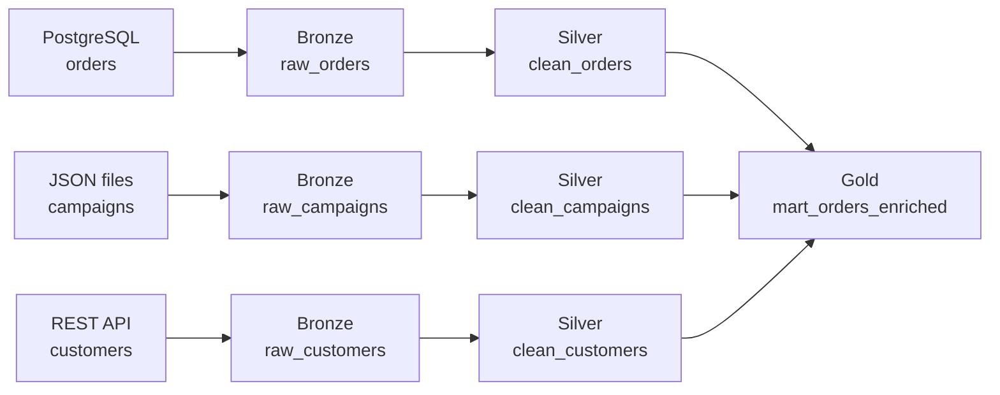
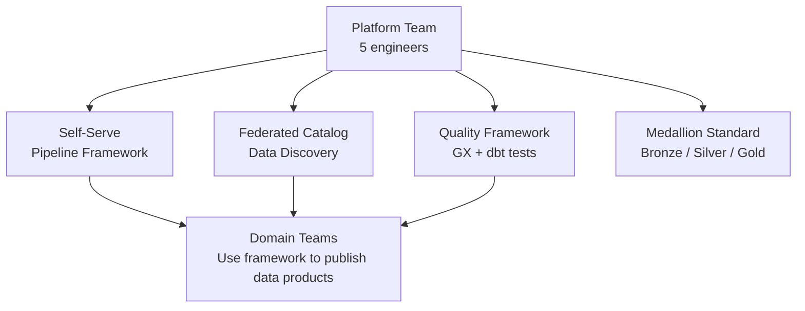

# Scenario Questions — Pipeline Design Patterns

<article data-difficulty="junior">

## 🟢 Junior: Design a Three-Layer Medallion Pipeline

**Scenario:** A startup is building their first data platform. They have three raw data sources: (1) a PostgreSQL OLTP database with orders, (2) a JSON file drop from a marketing automation tool with campaigns, and (3) a REST API for customer data. The analytics team needs a clean, reliable view of "orders with customer and campaign info" for their dashboards. Design a simple medallion architecture for this.

<details>
<summary>💡 Hint</summary>
Think about what belongs in each layer. Bronze = exactly as received. Silver = cleaned and joined. Gold = aggregated for analytics. What transformations are appropriate at each layer?
</details>

<details>
<summary>✅ Solution</summary>

**Layer design:**



**Bronze: Land exactly as received**

```python
def load_bronze_orders(run_date: str, engine):
    """Land raw PostgreSQL data with no transforms."""
    df = pd.read_sql(
        f"SELECT * FROM orders WHERE DATE(created_at) = '{run_date}'",
        source_engine
    )
    df["_ingested_at"] = datetime.utcnow()
    df["_source"]      = "postgres_orders"
    df["_run_date"]    = run_date
    # Append-only: no transforms, no dedup
    df.to_sql("raw_orders", engine, schema="bronze", if_exists="append", index=False)

def load_bronze_campaigns(json_path: str, run_date: str, engine):
    """Land raw JSON exactly as received — don't fix anything here."""
    df = pd.read_json(json_path)
    df["_ingested_at"] = datetime.utcnow()
    df["_source"]      = "marketing_json"
    df["_run_date"]    = run_date
    df.to_sql("raw_campaigns", engine, schema="bronze", if_exists="append", index=False)
```

**Silver: Clean, validate, standardize**

```sql
-- dbt model: silver/clean_orders.sql
{{
    config(materialized='incremental', unique_key='order_id', schema='silver')
}}

SELECT
    order_id,
    customer_id,
    campaign_id,
    UPPER(TRIM(status))   AS status,          -- Standardize
    ROUND(total_usd, 2)   AS total_usd,       -- Fix precision
    DATE(created_at)      AS order_date,
    created_at
FROM {{ source('bronze', 'raw_orders') }}
WHERE order_id IS NOT NULL          -- Validate
  AND total_usd >= 0                -- Validate
  
  AND _ingested_at > (SELECT MAX(created_at) FROM {{ this }})
  
```

**Gold: Aggregate for analytics use case**

```sql
-- dbt model: gold/mart_orders_enriched.sql
{{
    config(materialized='table', schema='gold')
}}

SELECT
    o.order_id,
    o.order_date,
    o.status,
    o.total_usd,
    c.customer_name,
    c.email,
    c.country,
    camp.campaign_name,
    camp.channel          AS marketing_channel
FROM {{ ref('clean_orders') }} o
LEFT JOIN {{ ref('clean_customers') }} c    ON o.customer_id = c.customer_id
LEFT JOIN {{ ref('clean_campaigns') }} camp ON o.campaign_id = camp.campaign_id
WHERE o.order_date >= CURRENT_DATE - 90
```

**Key principles demonstrated:**
- Bronze: Append-only, no transforms, adds metadata columns
- Silver: Deduplication, validation, standardization, no aggregation
- Gold: Joins, aggregations, business-logic, optimized for consumption

**Airflow DAG structure:**

```python
with DAG("medallion_pipeline", schedule_interval="@daily") as dag:
    bronze_orders   = PythonOperator(task_id="bronze_orders",   ...)
    bronze_campaigns = PythonOperator(task_id="bronze_campaigns", ...)
    bronze_customers = PythonOperator(task_id="bronze_customers", ...)

    silver = BashOperator(task_id="silver_dbt", bash_command="dbt run --select silver.*")
    gold   = BashOperator(task_id="gold_dbt",   bash_command="dbt run --select gold.*")

    [bronze_orders, bronze_campaigns, bronze_customers] >> silver >> gold
```

</details>

</article>

<article data-difficulty="mid-level">

## 🟡 Mid-Level: Choosing Between Lambda and Kappa

**Scenario:** A real-time analytics startup needs to show "current page views per product" on the dashboard, updated every 30 seconds, as well as accurate "daily total views" for the previous day's report. The tech lead suggests Lambda architecture (separate batch + streaming paths). A senior engineer argues for Kappa (streaming only). You need to recommend one and justify it.

<details>
<summary>💡 Hint</summary>
Think about the complexity costs of each. Lambda requires two codebases — what happens when they drift? Kappa requires streaming to be accurate for historical reporting — is that realistic here? Consider the team size and maintenance burden.
</details>

<details>
<summary>✅ Solution</summary>

**Recommendation: Kappa Architecture**

Here's the structured analysis:

**Option A: Lambda Architecture**

```
Batch layer:  Spark batch job → accurate daily views (6 AM refresh)
Speed layer:  Kafka Streams → real-time approximate views (30-second lag)
Serving:      Query merges both layers for complete picture
```

Problems:
- Two codebases that must be kept in sync
- Different window definitions will eventually drift
- If the batch job has a bug, real-time and historical differ
- Double the infrastructure to maintain

**Option B: Kappa Architecture (Recommended)**

```
Single stream: Kafka → Flink → Delta Lake (append + MERGE)
Real-time:     Flink outputs every 30 seconds to Redis (serving cache)
Historical:    Same Flink output accumulated in Delta Lake (query-able)
Backfill:      Replay Kafka topic from beginning
```

```python
from pyflink.table import StreamTableEnvironment

env = StreamTableEnvironment.create(...)

# ONE definition: tumbling 30-second windows for real-time
# Same logic accumulated over a day gives accurate daily total
env.execute_sql("""
    CREATE TABLE product_views_sink (
        window_start  TIMESTAMP(3),
        product_id    BIGINT,
        view_count    BIGINT
    ) WITH (
        'connector'  = 'delta',
        'path'       = 's3://lakehouse/product_views'
    )
""")

env.execute_sql("""
    INSERT INTO product_views_sink
    SELECT
        TUMBLE_START(event_time, INTERVAL '30' SECOND) AS window_start,
        product_id,
        COUNT(*) AS view_count
    FROM page_view_events
    GROUP BY
        product_id,
        TUMBLE(event_time, INTERVAL '30' SECOND)
""")
```

```python
# Serving layer: Redis for real-time dashboard (30-second cache)
def serve_current_views(product_id: int) -> int:
    """Fast path: Redis cache of last 30-second window."""
    return int(redis.get(f"views:current:{product_id}") or 0)

def serve_daily_views(product_id: int, date: str) -> int:
    """Batch path: Delta Lake aggregate for historical accuracy."""
    return int(spark.sql(f"""
        SELECT SUM(view_count) FROM product_views
        WHERE product_id = {product_id}
          AND DATE(window_start) = '{date}'
    """).collect()[0][0] or 0)
```

**Decision matrix:**

| Factor | Lambda | Kappa |
|---|---|---|
| Codebases | 2 (risk of drift) | 1 |
| Consistency | Risk of divergence | Guaranteed same logic |
| Backfill | Complex (rebuild batch) | Simple (Kafka replay) |
| Operational complexity | High | Medium |
| Latency for real-time | Very low | Low (30s window) |
| Historical accuracy | High (dedicated batch) | High (same stream, accumulated) |

**Final recommendation:** Kappa, because:
1. A 30-second streaming window accumulated over 24 hours gives exactly the same daily total as a batch job — no separate batch logic needed
2. One codebase eliminates drift
3. Kafka-based backfill is simpler than maintaining a separate Spark batch pipeline

Lambda would be appropriate if the real-time views needed to be truly sub-second AND required 100% accuracy — a combination that's difficult to achieve. In this case, 30-second latency + accumulated accuracy is achievable with Kappa alone.

</details>

</article>

<article data-difficulty="senior">

## 🔴 Senior: Design a Data Platform for a 50-Team Enterprise

**Scenario:** You're the new Head of Data Engineering at a 5,000-person company with 50 product teams. Current state: a monolithic data warehouse managed by a 5-person central team. There are 200 unsupported data source requests in the backlog. Data quality issues are reported daily — but nobody knows which team is responsible for fixing them. Engineers spend 80% of their time on data requests instead of platform work. Design a scalable data platform architecture for the next 3 years.

<details>
<summary>💡 Hint</summary>
This is fundamentally an organizational problem with technical solutions. Think about Data Mesh's ownership model, a self-serve platform to reduce bottlenecks, and federated governance for quality and security. Consider what the central team should and shouldn't own.
</details>

<details>
<summary>✅ Solution</summary>

**Phase 1 (Months 1-6): Foundation**



**Central platform team owns (infrastructure, not data):**

```python
# Platform-provided abstractions
class DomainDataProduct:
    """
    Framework that domain teams use to publish data products.
    Platform team maintains the framework; domain teams configure instances.
    """
    def __init__(self, config: dict):
        self.config = config
        self._validate_config()

    def publish(self, run_date: str):
        """Standardized pipeline: extract → validate → publish → register in catalog."""
        df = self._extract(run_date)
        self._validate(df)
        self._load_to_silver(df, run_date)
        self._register_in_catalog()
        self._emit_completion_event()

    def _validate(self, df: pd.DataFrame):
        """Run quality checks defined in the product contract."""
        checks = self.config.get("quality_checks", [])
        # Platform-provided validation framework
        run_contract_validation(df, checks)

    def _register_in_catalog(self):
        """Register metadata in the data catalog for discoverability."""
        catalog_client.upsert(
            name=self.config["name"],
            owner=self.config["owner_team"],
            schema=infer_schema(self.target_table),
            sla=self.config["sla"],
        )
```

**Phase 2 (Months 7-18): Domain Ownership**

```yaml
# Each domain team owns a domain data product registry
# orders-team/data_products/orders_fact.yml

name: orders_fact
version: 2.0.0
owner_team: orders-engineering
domain: commerce

sources:
  - type: postgres
    connection: orders-db
    tables: [orders, order_items]
    incremental_col: updated_at

transforms:
  - type: dbt_model
    ref: silver.clean_orders

quality_contract:
  freshness_sla_hours: 2
  completeness:
    order_id: 100%
    total_usd: 100%
  row_count:
    min_daily: 50000

access:
  public_to: [analytics, finance, ml-platform]
  restricted_to: [fraud-team]

sla_contact: "#orders-data-oncall"
```

**Phase 3 (Months 19-36): Self-Serve Scale**

```python
# Automated domain onboarding: 1-2 hours instead of weeks
class DomainOnboardingWizard:
    def onboard_new_domain(self, domain_config: dict):
        # 1. Create domain namespace (Snowflake schema + S3 prefix)
        self._provision_infrastructure(domain_config["domain_name"])

        # 2. Set up IAM/RBAC for the domain team
        self._configure_access(domain_config["team_members"])

        # 3. Deploy starter templates (bronze loader, silver dbt model)
        self._deploy_templates(domain_config)

        # 4. Register in data catalog
        self._register_domain(domain_config)

        print(f"Domain {domain_config['domain_name']} onboarded in {self._elapsed_minutes()} minutes")
```

**Federated governance: centralized policies, distributed enforcement**

```python
PLATFORM_POLICIES = {
    "data_classification": {
        "PII_columns": ["email", "phone", "ssn", "ip_address"],
        "must_be_masked_in": ["gold", "mart"],
        "retention_days": {"PII": 365, "non_PII": 2555}
    },
    "quality_minimums": {
        "bronze": {"row_count_gt_0": True},
        "silver": {"no_pk_nulls": True, "referential_integrity": True},
        "gold":   {"freshness_hours_max": 4, "sla_documented": True}
    },
    "access_control": {
        "default": "deny",
        "analytics_role": "read_gold_only",
        "data_science_role": "read_silver_plus",
        "platform_role": "full_access"
    }
}

def enforce_platform_policies(data_product: DomainDataProduct, layer: str):
    """
    Platform-wide policy enforcement runs on every data product publication.
    Domain teams can't opt out of these checks.
    """
    policies = PLATFORM_POLICIES["quality_minimums"].get(layer, {})
    # ... enforce each policy ...
```

**Organizational outcomes (3-year targets):**

| Metric | Current | Year 1 | Year 3 |
|---|---|---|---|
| Time to onboard new source | Weeks | Days | Hours (self-serve) |
| Backlog size | 200 requests | 50 | Near-zero (self-serve) |
| Data quality incidents | Daily | Weekly | Monthly |
| % time on platform work | 20% | 50% | 70% |
| Data products published | ~20 (owned by platform) | 80 | 300 (domain-owned) |
| Mean time to data | Days | Hours | Minutes |

**Key architectural decisions:**
1. **Platform team owns the framework, not the data** — domain teams own their data products
2. **Self-serve first** — every new capability is designed for domain team use, not central team use
3. **Federated governance** — platform enforces non-negotiable policies (PII, retention); domains decide the rest
4. **Data catalog as the contract** — discoverability, ownership, and SLAs are first-class platform features
5. **Event-driven integration** — completion events enable downstream pipelines without coupling to schedules

</details>

</article>
