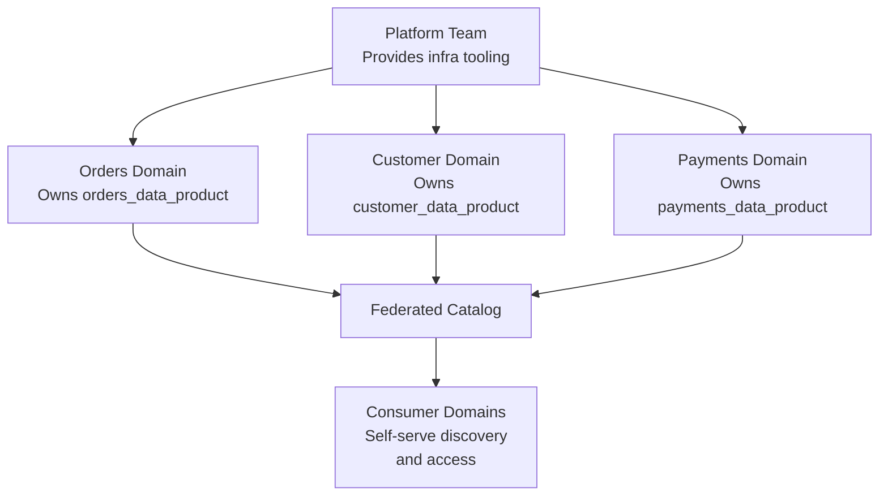
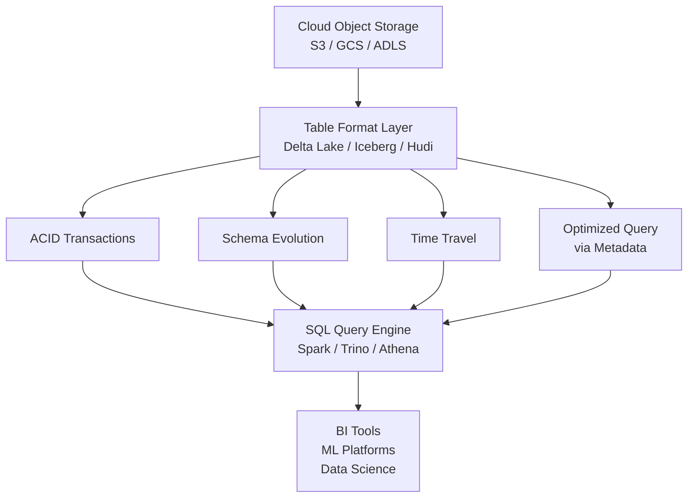

# Pipeline Design Patterns — Senior Deep Dive

## Data Mesh Architecture

Data Mesh is an organizational and technical pattern for scaling data platforms across large enterprises. It decentralizes data ownership to domain teams.

### Four Principles of Data Mesh

1. **Domain-oriented ownership**: Domains own their data products (not a central platform team)
2. **Data as a product**: Data is published with SLAs, documentation, and quality guarantees
3. **Self-serve infrastructure**: Platform team provides tooling; domains use it autonomously
4. **Federated computational governance**: Centralized policies (security, quality) enforced locally



### Data Product Contract

```yaml
# orders_data_product/contract.yaml
name: orders_fact
version: 3.1.0
owner: orders-engineering-team
domain: commerce

schema:
  location: schema_registry/orders_fact/v3
  evolution_policy: backward_compatible

quality:
  freshness_sla_hours: 2
  completeness_sla_pct: 99.9
  row_count_range: [500000, 2000000]  # Expected daily range

access:
  default_policy: restricted
  approved_consumers:
    - analytics-team
    - finance-team
  requires_approval_for: [ml-team]

ports:
  primary: "snowflake://warehouse.orders.orders_fact"
  streaming: "kafka://orders-topic"
  api: "https://data-api.company.com/orders/v3"
```

---

## Lakehouse Architecture

Lakehouse combines the cost-effectiveness of data lakes with the ACID guarantees and SQL capabilities of data warehouses.



### Choosing the Right Table Format

| Feature | Delta Lake | Apache Iceberg | Apache Hudi |
|---|---|---|---|
| ACID Transactions | Yes | Yes | Yes |
| Schema Evolution | Yes (auto) | Yes (explicit) | Yes |
| Time Travel | Yes | Yes | Yes (limited) |
| Primary Use | Databricks, Spark | Multi-engine, AWS | Streaming upserts |
| Streaming Upsert | Good | Good | Excellent |
| Multi-engine reads | Improving | Excellent | Good |
| Metadata catalog | Delta Log | Iceberg Catalog | Timeline |

---

## The Unified Batch-Streaming Pattern

Modern pipelines unify batch and streaming in one framework:

```python
from pyspark.sql import SparkSession
from delta.tables import DeltaTable

spark = SparkSession.builder \
    .config("spark.sql.extensions", "io.delta.sql.DeltaSparkSessionExtension") \
    .getOrCreate()

def build_pipeline(mode: str = "streaming"):
    """
    Same transformation logic runs in batch or streaming mode.
    Eliminates the 'lambda tax' of separate codebases.
    """
    if mode == "streaming":
        raw = (
            spark.readStream
            .format("kafka")
            .option("kafka.bootstrap.servers", "kafka:9092")
            .option("subscribe", "orders")
            .option("startingOffsets", "latest")
            .load()
        )
    else:  # batch (for backfill or reprocessing)
        raw = spark.read.format("kafka") \
            .option("kafka.bootstrap.servers", "kafka:9092") \
            .option("subscribe", "orders") \
            .option("startingOffsets", f'{{"orders":{{"0":0}}}}') \
            .option("endingOffsets", "latest") \
            .load()

    # SAME transformation logic for both modes
    from pyspark.sql.functions import from_json, col, current_timestamp
    orders = raw.select(
        from_json(col("value").cast("string"), ORDER_SCHEMA).alias("order")
    ).select("order.*") \
     .withColumn("ingested_at", current_timestamp())

    if mode == "streaming":
        query = (
            orders.writeStream
            .format("delta")
            .option("checkpointLocation", "s3://checkpoints/orders")
            .outputMode("append")
            .trigger(processingTime="1 minute")
            .toTable("silver.orders")
        )
        return query
    else:
        orders.write.format("delta").mode("append").saveAsTable("silver.orders")
        return None
```

---

## Pipeline Governance Patterns

### Data Lineage Capture

```python
import networkx as nx
from dataclasses import dataclass

@dataclass
class LineageEdge:
    source:    str   # "bronze.orders"
    target:    str   # "silver.orders_clean"
    transform: str   # "dbt:clean_orders"
    run_date:  str

class LineageTracker:
    def __init__(self):
        self.graph = nx.DiGraph()

    def record_lineage(self, edge: LineageEdge):
        self.graph.add_edge(
            edge.source, edge.target,
            transform=edge.transform,
            run_date=edge.run_date
        )

    def impact_analysis(self, table: str) -> list[str]:
        """What downstream tables are affected if this table changes?"""
        return list(nx.descendants(self.graph, table))

    def root_cause_analysis(self, table: str) -> list[str]:
        """What upstream tables does this table depend on?"""
        return list(nx.ancestors(self.graph, table))

    def to_catalog_format(self) -> list[dict]:
        return [
            {"source": u, "target": v, **self.graph.edges[u, v]}
            for u, v in self.graph.edges()
        ]
```

### Cost-Aware Pipeline Design

```python
@dataclass
class PipelineCostProfile:
    compute_cost_per_hour: float
    storage_cost_per_gb:   float
    network_cost_per_gb:   float

def estimate_pipeline_cost(
    rows: int,
    compute_hours: float,
    storage_gb: float,
    profile: PipelineCostProfile
) -> dict:
    return {
        "compute_usd": compute_hours * profile.compute_cost_per_hour,
        "storage_usd": storage_gb * profile.storage_cost_per_gb,
        "total_usd":   (compute_hours * profile.compute_cost_per_hour +
                        storage_gb   * profile.storage_cost_per_gb),
        "cost_per_row": (compute_hours * profile.compute_cost_per_hour) / max(rows, 1),
    }

# Design decision: Full refresh vs incremental
FULL_REFRESH_COST   = estimate_pipeline_cost(1_000_000_000, 8.0, 500.0, snowflake_profile)
INCREMENTAL_COST    = estimate_pipeline_cost(10_000, 0.05, 0.01, snowflake_profile)
print(f"Full refresh: ${FULL_REFRESH_COST['total_usd']:.2f}")
print(f"Incremental:  ${INCREMENTAL_COST['total_usd']:.4f}")
# Full refresh: $40.00 | Incremental: $0.0025 → 16,000x cost difference
```

---

## Senior Architecture Decision Framework

When designing a pipeline architecture, evaluate:

```markdown
1. LATENCY REQUIREMENT
   - Minutes to hours → Batch (Airflow + dbt)
   - Seconds → Micro-batch (Spark Structured Streaming)
   - Sub-second → True streaming (Flink, Kafka Streams)

2. DATA VOLUME
   - < 100 GB/day → Single-node Pandas/SQL
   - 100 GB - 10 TB/day → Spark or warehouse SQL
   - > 10 TB/day → Distributed Spark + partitioned storage

3. CHANGE FREQUENCY
   - Append-only → Simple HWM-based incremental
   - Mutable rows → CDC or SCD Type 2
   - High-frequency mutations → CDC + stream processing

4. HISTORY REQUIREMENT
   - Current state only → SCD Type 1
   - Point-in-time accuracy → SCD Type 2 or Iceberg time travel
   - Audit trail → Append-only + bi-temporal

5. TEAM STRUCTURE
   - Centralized team → Monolithic pipeline platform
   - Federated domain teams → Data Mesh
   - Mixed → Medallion with domain-owned gold layers

6. COST SENSITIVITY
   - Low budget → Cloud-native (Athena, BigQuery on-demand)
   - High throughput + cost-sensitive → Spark on spot instances + S3
   - Enterprise → Databricks / Snowflake with commitments
```

---

## Interview Tips

> **Tip 1:** Data Mesh is an organizational pattern as much as a technical one. The key insight is that data quality problems are ultimately ownership problems — teams that produce data are most qualified to ensure its quality. Central platform teams can't scale to own all data.

> **Tip 2:** Lakehouse (Delta/Iceberg/Hudi) is the modern answer to "batch lake vs. real-time warehouse." It provides ACID transactions and time travel on cheap object storage, collapsing the two-tier architecture into one.

> **Tip 3:** The unified batch-streaming pattern (same code, different trigger) is the practical answer to the "lambda tax." Flink and Spark Structured Streaming both support this; it's how modern teams eliminate dual codebases.

> **Tip 4:** Cost-aware design separates senior engineers from mid-level. "A full refresh costs $40; incremental costs $0.003; we run 365 times/year — the decision saves $14,600/year" is a compelling architectural argument.

> **Tip 5:** The decision framework (latency → volume → change frequency → history → team → cost) shows systematic thinking. Walk through it for any architecture question to demonstrate you evaluate trade-offs, not just default to one pattern.
