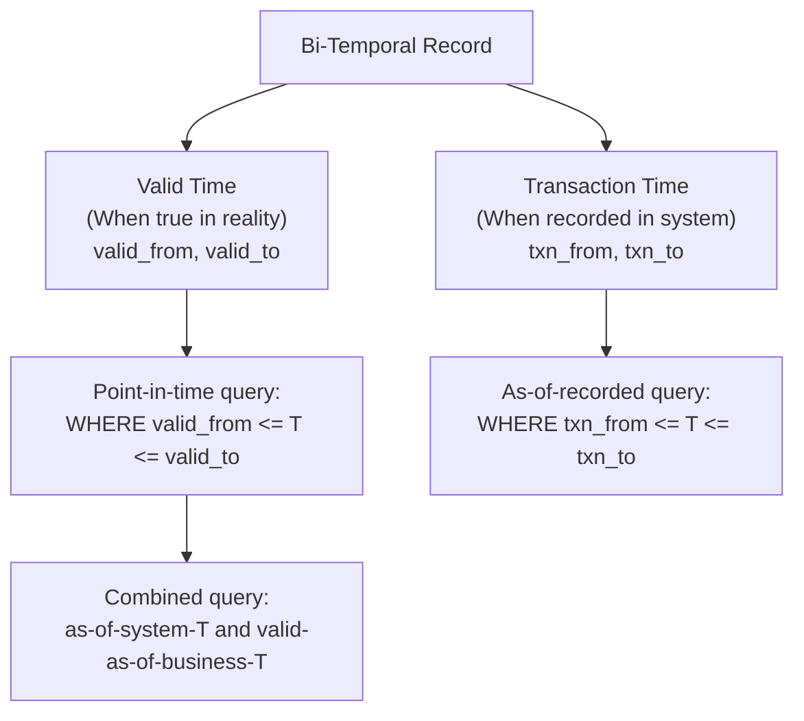

# SCD Implementation — Senior Deep Dive

## Bi-Temporal Data Modeling

Standard SCD Type 2 tracks **valid time** (when the data was true in reality). **Bi-temporal** models also track **transaction time** (when the data was recorded in the system) — enabling retroactive corrections without losing the original record.



```sql
CREATE TABLE dim_customer_bitemporal (
    customer_sk   UUID PRIMARY KEY DEFAULT gen_random_uuid(),
    customer_id   TEXT NOT NULL,
    email         TEXT,
    city          TEXT,

    -- Valid time: when was this true in the real world?
    valid_from    TIMESTAMPTZ NOT NULL,
    valid_to      TIMESTAMPTZ,           -- NULL = currently valid

    -- Transaction time: when was this recorded in our system?
    txn_from      TIMESTAMPTZ NOT NULL DEFAULT NOW(),
    txn_to        TIMESTAMPTZ,           -- NULL = currently recorded
);

-- Query: "What did we believe the customer's email was on Jan 15,
--         using data as we understood it on Jan 10?"
SELECT email, city
FROM dim_customer_bitemporal
WHERE customer_id = 'CUST-001'
  AND valid_from  <= '2024-01-15' AND (valid_to IS NULL OR valid_to > '2024-01-15')
  AND txn_from    <= '2024-01-10' AND (txn_to  IS NULL OR txn_to  > '2024-01-10');
```

### Retroactive Correction with Bi-Temporal Model

```sql
-- Scenario: We discover on Feb 1 that the customer's city was wrong
-- since Nov 1 (it should have been "London", not "Manchester").
-- We want to correct this retroactively while preserving the audit trail.

BEGIN;

-- Close the currently-recorded version (transaction time ends)
UPDATE dim_customer_bitemporal
SET txn_to = NOW()
WHERE customer_id = 'CUST-001'
  AND txn_to IS NULL;  -- Close all currently-open transaction records

-- Re-insert the corrected record with the correct valid time
INSERT INTO dim_customer_bitemporal
    (customer_id, email, city, valid_from, valid_to, txn_from, txn_to)
VALUES
    ('CUST-001', 'alice@example.com', 'London', '2023-11-01', NULL, NOW(), NULL);

-- The old (wrong) record is preserved with txn_to = NOW()
-- The new (correct) record has txn_from = NOW()
-- Historical queries using txn_from <= Jan 31 still see the old (wrong) data
-- Historical queries using txn_from <= Feb 1 see the corrected data

COMMIT;
```

---

## SCD Type 2 on Delta Lake

Delta Lake provides ACID transactions and the MERGE command for efficient SCD Type 2:

```python
from delta.tables import DeltaTable
from pyspark.sql import SparkSession
from pyspark.sql.functions import current_timestamp, lit, md5, concat_ws, col, when

spark = SparkSession.builder.getOrCreate()

def apply_scd2_delta(
    source_df,          # New/changed records from source
    target_path: str,
    natural_key: str,
    tracked_columns: list[str]
):
    """
    Apply SCD Type 2 to a Delta Lake table using MERGE.
    """
    # Add hash for change detection
    source_with_hash = source_df.withColumn(
        "row_hash",
        md5(concat_ws("|", *[col(c) for c in tracked_columns]))
    ).withColumn("effective_at", current_timestamp()) \
     .withColumn("is_current", lit(True))

    target = DeltaTable.forPath(spark, target_path)

    # Stage 1: Close existing records that have changed
    target.alias("tgt").merge(
        source_with_hash.alias("src"),
        f"tgt.{natural_key} = src.{natural_key} AND tgt.is_current = true"
    ).whenMatchedUpdate(
        condition="tgt.row_hash != src.row_hash",  # Only update if changed
        set={
            "is_current": "false",
            "expired_at": "src.effective_at"
        }
    ).execute()

    # Stage 2: Insert new versions for changed records
    changed = source_with_hash.alias("src").join(
        spark.read.format("delta").load(target_path).filter("is_current = false").alias("tgt"),
        (col(f"src.{natural_key}") == col(f"tgt.{natural_key}")) &
        (col("tgt.expired_at") == col("src.effective_at")),
        "inner"
    ).select("src.*")

    # Insert completely new records
    new_records = source_with_hash.alias("src").join(
        spark.read.format("delta").load(target_path).select(natural_key).distinct().alias("tgt"),
        natural_key,
        "left_anti"
    )

    inserts = changed.unionByName(new_records)

    inserts.write \
        .format("delta") \
        .mode("append") \
        .save(target_path)
```

---

## Apache Iceberg Time Travel for SCD

Iceberg tables support time-travel queries natively, providing SCD-like capabilities without explicit Type 2 management:

```sql
-- Iceberg: query the table as it was at a specific snapshot
SELECT customer_id, email, city
FROM iceberg_catalog.default.customers
FOR SYSTEM_TIME AS OF '2024-01-15 10:00:00';

-- Equivalent: query by snapshot ID
SELECT customer_id, email, city
FROM iceberg_catalog.default.customers
FOR VERSION AS OF 1234567890;
```

```python
from pyiceberg.catalog import load_catalog

catalog  = load_catalog("glue", **{"type": "glue", "region_name": "us-east-1"})
table    = catalog.load_table("default.customers")

# Read historical snapshot
snapshot_id = table.history()[5].snapshot_id   # 6th oldest snapshot
arrow_table = table.scan(snapshot_id=snapshot_id).to_arrow()

# Read as-of timestamp
from datetime import datetime
historical_df = table.scan(
    as_of_timestamp=int(datetime(2024, 1, 15).timestamp() * 1000)
).to_arrow()
```

**When to use Iceberg time travel vs. explicit SCD Type 2:**

| Factor | Iceberg Time Travel | SCD Type 2 |
|---|---|---|
| Retention period | Snapshot retention (days) | Infinite |
| Query pattern | Full snapshot at time T | Point-in-time per entity |
| Storage cost | Incremental (only changed files) | Multiplicative (rows per change) |
| SQL compatibility | Non-standard syntax | Standard SQL joins |
| Backfill ease | Simple: data existed | Complex: must reconstruct history |

---

## High-Performance SCD Type 2 at Scale

For tables with hundreds of millions of rows, standard UPDATE patterns are too slow.

### Partition-Based SCD2 Update

```python
from pyspark.sql.window import Window
from pyspark.sql.functions import row_number, desc

def fast_scd2_spark(
    source_df,
    target_path: str,
    natural_key: str,
    change_col: str,
    partition_col: str = "effective_month"
):
    """
    Fast SCD Type 2 using Spark partition replacement instead of MERGE.
    Much faster for large dimensions (millions of rows).
    """
    existing = spark.read.parquet(target_path)

    # Find affected natural keys
    changed_ids = source_df.select(natural_key).distinct()

    # Keep only unaffected records from target
    unaffected = existing.join(changed_ids, on=natural_key, how="left_anti")

    # For affected records: close old versions
    affected_existing = existing.join(changed_ids, on=natural_key, how="inner")
    affected_existing = affected_existing.withColumn(
        "is_current", lit(False)
    ).withColumn(
        "expired_at", current_timestamp()
    )

    # New versions from source
    new_versions = source_df.withColumn("is_current", lit(True)) \
                             .withColumn("effective_at", current_timestamp()) \
                             .withColumn("expired_at", lit(None))

    # Combine all records
    result = unaffected.unionByName(affected_existing).unionByName(new_versions)

    # Write back (full overwrite — but partitioned so only changed partitions are re-written)
    result.write.mode("overwrite") \
          .partitionBy(partition_col) \
          .parquet(target_path)
```

---

## Interview Tips

> **Tip 1:** Bi-temporal modeling is the response to "what if source data is retroactively corrected?" Transaction time lets you ask "what did our system believe to be true on date X?" — even after a correction. Standard SCD2 can't answer this.

> **Tip 2:** Delta Lake MERGE is the modern replacement for the two-step (UPDATE old, INSERT new) SCD2 pattern. It's more concise and ACID-safe. Know that Delta MERGE can update AND insert in a single operation.

> **Tip 3:** Iceberg time travel is an elegant alternative to explicit SCD management for recent history (days to weeks). For long-term historical analysis (years), explicit SCD2 is more reliable because you control the retention.

> **Tip 4:** For very large dimensions (100M+ rows), full table MERGE becomes a bottleneck. The partition-replacement approach (update only affected partitions) can be 10-100x faster.

> **Tip 5:** When asked "how do you handle late-arriving dimension changes?", describe the bi-temporal or backdated effective_at approach. A product reclassification effective Nov 1 that we learn about on Nov 10 should be backdated to Nov 1, not Nov 10.
